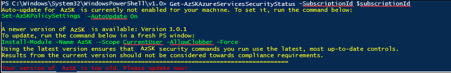
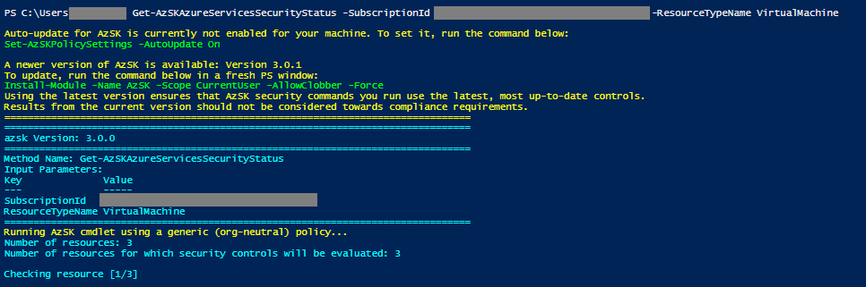
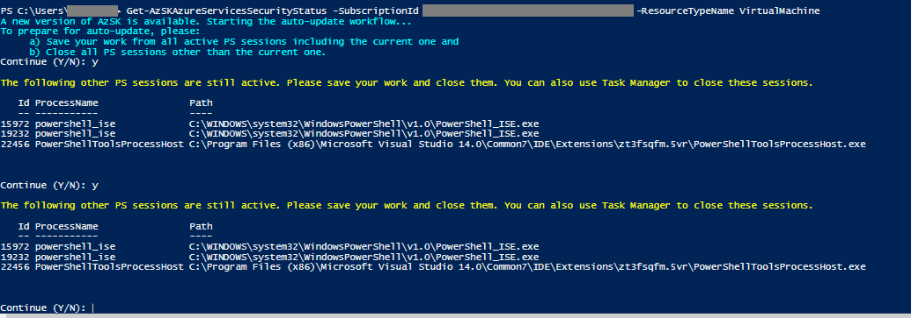

## [IMPORTANT: DevOps Kit (AzSK) is being sunset by end of FY21.](https://github.com/azsk/DevOpsKit-docs/blob/users/v-himkam/SunsetNotice/ReleaseNotes/AzSKSunsetNotice.md)
------------------------------------------------

> The Secure DevOps Kit for Azure (AzSK) was created by the Core Services Engineering & Operations (CSEO) division at Microsoft, to help accelerate Microsoft IT's adoption of Azure. We have shared AzSK and its documentation with the community to provide guidance for rapidly scanning, deploying and operationalizing cloud resources, across the different stages of DevOps, while maintaining controls on security and governance.
<br>AzSK is not an official Microsoft product – rather an attempt to share Microsoft CSEO's best practices with the community..

# Installation Guide
> <h4><font color="blue">IMPORTANT:</font></h4> If you are from CSE, please install the AzSK via instructions at https://aka.ms/devopskit/onboarding so that CSE-specific policies are configured for your installation. <u>Do not</u> use the installation instructions on this page.


 <!-- **Release Version: AzSDK 2.11.xx <=> AzSK 3.0.x ** -->
>**Pre-requisites**:
> - PowerShell 5.0 or higher. 
> - Windows OS
	
1. First verify that prerequisites are already installed:  
    Ensure that you are using Windows OS and have PowerShell version 5.0 or higher by typing **$PSVersionTable** in the PowerShell ISE console window and looking at the PSVersion in the output as shown below.) 
 If the PSVersion is older than 5.0, update PowerShell from [here](https://www.microsoft.com/en-us/download/details.aspx?id=54616).  
      

2. Install the Secure DevOps Kit for Azure (AzSK) PS module:  
	  
```PowerShell
  Install-Module AzSK -Scope CurrentUser
```

Note: 

You may need to use `-AllowClobber` and `-Force` options with the Install-Module command 
above if you have a different version of Az modules installed on your machine. 
AzSK depends on specific version of different Az service modules and installs that during the installation above.
Run command 'Find-Module AzSK -includedependencies' to see all dependencies. 

In version 3.6.x, if you are facing issue during scan, you may have to register "Microsoft.Security" and "Microsoft.PolicyInsights" providers on subscriptions. Refer [link](https://docs.microsoft.com/en-us/azure/azure-resource-manager/resource-manager-supported-services#portal) for provider registration.


------------------------------------------------
### Backward compatibility
As Azure features evolve and add more security controls, "Secure DevOps Kit for Azure" also evolves every month respecting the latest security features.
It is always recommended to run on the latest DevOps kit module to scan your subscription with the latest rules. 

Users who are still using older modules of DevOps kit continue to work only until N-2 version w.r.t production version e.g. If the current production version is 3.11.x, 
then teams can continue to use 3.9.x and 3.10.x. As the version 3.12.x becomes available, automatically 3.9.x would stop working. 

More details on how it impacts each stage of DevOps kit are shared below:

**Adhoc Scans:**
Users running the DevOps kit scan using N-3 version from their local machine, will start getting an error asking to upgrade as shown below:
 
> **Note:** This restriction has been put in place from AzSDK version 2.8.x and applicable for all future releases.

**Continuous Assurance(CA) Scans:**
No impact to CA as it would automatically upgrade to latest version. 
Before every scan it checks whether there has been a latest release of the DevOps kit and upgrade itself.
All the further scans would happen using the latest version.

**AzSK CICD Extension:**
No impact to default behavior of CICD. It always runs the scan with the latest version available in the PS Gallery. 
If teams have overridden the default behavior by specifying a version number during the build, then the same restriction of N-2 applies here as well.

### Auto Update
It is always recommended to scan your subscription with the latest DevOps kit module, thus ensuring to evaluate latest security controls that are available through the module.
"Secure DevOps Kit for Azure" module provides different auto update capabilities w.r.t different stages of devops. More details are below:

**Adhoc Scans:**
Users running the older version of AzSK scan from their local machine will get a warning as shown in the image below.
It would also provide the user with required instructions to upgrade the module.
 

In a scenario where an organization has setup its own instance of "Secure DevOps Kit for Azure", the users can leverage 
the auto update feature which has been introduced from the AzSDK version 2.8.x.
As shown in the image above, user can either sign up for Autoupdate or go with manual update by running the command below:

```PowerShell
  Set-AzSKPolicySettings -AutoUpdate On|Off
```

User needs to close and reopen a fresh session once the command is run.
Going forward, if the latest version of DevOps kit is released, then during execution of any DevOps kit command it would start the auto update workflow automatically 
as shown in the image below:



Step 1: It would take user consent before it starts the auto update workflow. (1 in the image above) <br/>
Step 2: Users need to close all the displayed PS sessions. Typically open PS sessions would lock the module and fail the installation. (2 in the image above) <br/>
Step 3: Even the current session must be closed. It would again take the user consent before it starts the auto update flow to avoid the loss of any unsaved work. (3 in the image above) 


**Continuous Assurance(CA) Scans:**
The DevOps kit module running the scans through CA, auto updates itself. Every scan would initially check if any new version has been released and auto-upgrade the installed module to the latest version.
No action is required from the user.

Users can also run the command below to confirm the same:

```PowerShell
  Get-AzSKContinuousAssurance -SubscriptionId '<subscriptionId>'
```

**AzSK CICD Extension**
AzSK CICD extension will always run the scan using latest module of AzSK from the gallery. This is the default behavior in the case of both hosted and non-hosted agents. 

You could find more details about CICD [here](../03-Security-In-CICD/Readme.md).
 
------------------------------------------------
### FAQs

#### Getting exception: Package 'Az.Accounts' failed to be installed because End of Central Directory record could not be found.

Recently we have seen some users are facing issue during installation of latest AzSK module from PSGallery. AzSK is mainly dependant on Az module versions and its failing to install specific versions. We are investigating more on issue. You can use below method to install module from AzSK repository.

```PowerShell
$AzSKModuleRepoPath = "https://azsdkossep.azureedge.net/3.7.0/AzSK.zip"

#Copy module zip to temp location
$CopyFolderPath = $env:temp + "\AzSKTemp\"
if(-not (Test-Path -Path $CopyFolderPath))
{
  mkdir -Path $CopyFolderPath -Force | Out-Null
}
$ModuleFilePath = $CopyFolderPath + "AzSK.zip"           
Invoke-WebRequest -Uri $AzSKModuleRepoPath -OutFile $ModuleFilePath

#Extract zip file to module location
Expand-Archive -Path $ModuleFilePath -DestinationPath "$Env:USERPROFILE\documents\WindowsPowerShell\modules" -Force

#Clean up temp location
Remove-Item –path $CopyFolderPath –recurse
```

#### Should I run PowerShell ISE as administrator or regular user?
Please run PowerShell ISE as a regular user. The AzSK has been thoroughly tested to run in normal user (non-elevated) mode. As much as possible, please do not launch your PS sessions in "Administrator" mode. There is nothing that the AzSK does that needs elevated privileges on the local system. Even the installation command itself uses a '-Scope CurrentUser' parameter internally.  

#### Error message: "Running scripts is disabled on this system..."
This is an indication that PowerShell script loading and execution is disabled on your machine. You will need to enable it before the AzSK installation script (which itself is a PowerShell script) can run. 
```PowerShell
Get-ExecutionPolicy -Scope CurrentUser
```
If you run above command in the PS console, you will likely see that the policy level is either 'Restricted' or 'Undefined'. For AzSK cmdlets to run, it needs to be set to 'RemoteSigned'.
To resolve this issue run the following command in your PS console:
```PowerShell
Set-ExecutionPolicy -ExecutionPolicy RemoteSigned -Scope CurrentUser
```
The execution policy setting will be remembered and all future PS consoles opened in non-Admin (CurrentUser) mode will apply the 'RemoteSigned' execution policy.

#### Error message: "PackageManagement\Install-Package: cannot process argument transformation on parameter 'InstalledModuleInfo'..."


If you have installed Az PowerShell using Azure SDK in your machine, it typically gets installed in Program Files. You could run the below command to confirm
```PowerShell
 Get-Module -Name Az.* -ListAvailable 
```
If this is the case, then you need to remove the Azure PowerShell modules installed through Azure SDK completely from the Program Files. You could also take back up in case if you need. 
AzSK also needs Az modules. But it would download from PSGallery instead of from Azure SDK. This downloading of Az modules from PS Gallery would conflict with Az modules installed through Azure SDK. 
After cleanup, If you again the run the below command, it would fetch Az version 1.1.0 by default into the current user scope instead of in Program Files. 
```PowerShell
Install-Module AzSK -Scope CurrentUser -AllowClobber 
```
In case you still need to use the other version of Az (that you removed), you can install it from PS Gallery using the command below: 
```PowerShell
Install-Module Az -Scope CurrentUser -AllowClobber -RequiredVersion <versionNumber e.g. “0.7.0” >
```
> Note: If *"-AllowClobber"* option is not available in your version of PS, then replace that with *"-Force"*

If you happen to have multiple versions of Az, then it depends on which version of the module loads first in the PS session. In that case, to avoid confusion, close the installer PS session and in a new PS session run the following first:
```PowerShell
Import-Module AzSK
```
Then you can run one or more AzSK commands or other Az commands. The *"Import-Module"* ensures that the right version of Az gets loaded into the current session.

#### Error message: "WARNING: The version '1.x.y' of module 'Az.Accounts' is currently in use. Retry the operation after closing..."
If you see multiple warning such as the above during setup, it is likely that one or more PowerShell instances are running and have Az modules loaded which are conflicting with the AzSK installation. In such as case, it is best to ensure that all PS sessions (including the current one) are closed and start the installer in a fresh PS ISE session.
In dire circumstances, you may need to close/kill all instances of PowerShell sessions running on your system (including VS if you have PS plugin installed). In that case, make sure you have saved any work in those sessions and then run the following in a Windows Cmd console:
```PowerShell
taskkill /im PowerShell_ise.exe & taskkill /im PowerShell.exe & taskkill /im PowerShellToolsProcessHost.exe
```  
#### Error message: "The property 'Id' cannot be found on this object. Verify that the property exists..."
This is typically caused by a version mis-match for underlying Az PowerShell modules that are used by AzSK! The AzSK installation process will typically install Az modules corresponding to the version that it depends on. However, it is possible that you also have a previous version of Az on your machine.  

PowerShell works with the concept of 'sessions'. Each PowerShell ISE or command prompt window is its own independent session. By default, when any cmdlet is run, PS will load the corresponding module (code) in the memory for that session. After that, subsequent references to cmdlets in that module will use the loaded module. Usually, the module loading follows a particular heuristic (based on version number, PS module path order, admin v. non-admin PS launch mode, etc.)  

The above error message is an indication that an AzSK cmdlet is being run in a PowerShell session that already had an older version of Az loaded in memory (which may be due to something as simple as doing a Connect-AzAccount and *then* installing AzSK in that session). In most circumstances, one of the following remedies should work:
- Close the PS session and open a new one. In the new session, do an "*Import-Module Az -RequiredVersion 1.1.0*" before running anything else (e.g., Connect-AzAccount)
- Close the PS session and open a new one. In the new session, do an "*Import-Module AzSK*" before running anything else. (This will force-load the correct version of Az that AzSK needs.). 
  - If you suspect that you may have multiple versions of AzSK itself installed, then use "*Import-Module AzSK -RequiredVersion 3.11.0*" (March 2019 release).  

#### Message: "Warning : Microsoft Azure PowerShell collects data about how users use PowerShell cmdlets..."
The AzSK depends upon Az PowerShell modules. Az modules are created/maintained by the Azure product team and provide the core PowerShell libraries to interact with different Azure services. For example, you'd use the Az Storage module to create/work with a storage account, etc.  

The AzSK setup installs the required version of Az. It is possible that this is the first time your system is being setup for Az. In such a situation, you will get a 'data collection' related notice/warning from Az. You can choose to 'accept' or 'decline' permission to collect data. The AzSK functionality will not be affected by that.  

#### When will AzSK support the newest Az dependencies? Can I run both side by side? In the meantime, what if I need to run both AzSK and the new version of Az modules (for different tasks)?
At any time, AzSK is bound to a specific version of Az service modules. We have found that it keeps our dependencies in check and limits randomizations from minor version updates of one of the many modules that ship under the "Az umbrella".

However, after each major update to Az, we wait for a dot-release and migrate AzSK to the latest version. This usually happens within a couple of months after the major Az release.

In the interim, if you need to use AzSK as well as the latest Az (for other tasks), this is how you can do it. (We assume that you already have the latest AzSK installed which, in turn, will ensure that you have the version of Az modules that AzSK requires). 
Install the newest Az from a fresh PS console if you haven't done so.
Use separate PS consoles for AzSK and (newer) Az modules work.
For the AzSK console, always start with the following command:
```PowerShell
Import-Module AzSK
```
This will automatically cause AzSK to load the version of Az modules it requires as opposed to the newest one. Run AzSK commands as needed in this session.
For the (new) Az console, just run whatever Az commands you need to there. The latest installed version of Az will automatically get loaded and used for those. (Do not run AzSK commands in this console.) 

Just note that this assumes that both AzSK and Az were installed with '-Scope CurrentUser'. If a newer Az is installed without an explicit 'CurrentUser' scope, it is possible that by default different versions of Az modules may get loaded. In such a situation, it is better to explicitly load the version needed with a '-RequiredVersion' flag (or full path to module). Basically, remember that PS will search for a module in the order folders are listed in $Env:PSModulePath and load the first module that exports the function being used.

#### How often should I upgrade my installation of AzSK? How long will it take?
The AzSK team releases a new version of AzSK at the end of each monthly sprint. You should aim to use the latest release always. So, as a regular user, you should upgrade AzSK each month. 

Being on the latest release ensures that you have the latest features, most up to date control evaluation code, coverage for latest Security Verification Tests (SVTs), etc. Note that, when you run any AzSK command, if there is a newer version of AzSK available, the command will tell you about it (at the very top). 

Note that, the first time you installed AzSK, it perhaps took a few extra minutes because of the dependencies that had to be installed (especially Az). In most subsequent installations, it will just need to fetch the latest AzSK modules. This will hardly take a couple of minutes.


### Message: "WARNING: AzureRM.Profile already loaded. Az and AzureRM modules cannot be imported in the same session or used in the same script or runbook."

This warning pops up because both Az and AzureRM modules are loaded in the same PowerShell session. This must be occurring because you might have tried executing an Az-based command with AzureRM module already loaded (or vice versa). 

> **Note:** The big change in the latest AzSK release (v3.11.0) is the migration of the DevOps Kit from AzureRM to the new Az-* PowerShell libraries. 

Steps to remediate:

- Run 'Import-Module' AzSK in a fresh PowerShell session as the first command.

- Use 'Connect-AzAccount' to login to your subscription (if using AzSK v3.11.0). 
