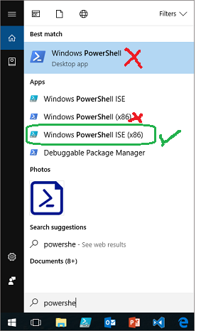
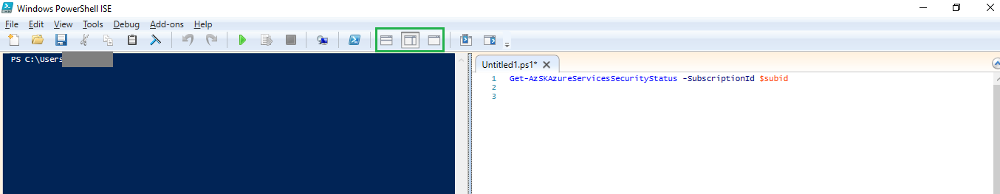

# PowerShell tips for new AzSK Users

<!--	
-   Use PS ISE
-   Use 'CurrentUser' mode
-	F8/play-selected
-	Save your work (in script, not TXT files)
-	Use auto-complete
-   Use backtick for long command lines
-	Search for commands…
-	Look for loaded modules…
-	Variables..
-	Strings, “ “ v ‘ ‘ 
-	List Subscriptions
-	Switch context
-	Find resources/resource groups
-	Loops, where, match v. like 
---------------------------
Get-AzureRegion | FW
(Get-History)[32].CommandLine
ConvertTo-Json -Depth
ConvertTo-Csv -NoTypeInformation 
Profile pre-set vars
-->
If you are just getting started with AzSK and are also new to PowerShell, this set of tips can get you jump-started by helping you get past 
the initial hurdles relatively smoothly. It will also give you some useful tricks to save time by reusing your work and incrementally 
building your PowerShell expertise. Before you know, you will start feeling the true *power* of PowerShell at your fingertips and, after that, 
using AzSK or any other Azure PowerShell modules will become a breeze.

### List of Tips
- [Use the PowerShell ISE](GettingStarted_PowerShellTipsAzSK.md#use-the-powershell-ise)  
- ['Run Selection' is your friend](GettingStarted_PowerShellTipsAzSK.md#run-selection-is-your-friend)
- [Save your scripts!](GettingStarted_PowerShellTipsAzSK.md#save-your-scripts)
- [Use 'Auto Complete'](GettingStarted_PowerShellTipsAzSK.md#use-auto-complete)
- [Use backtick for long command lines](GettingStarted_PowerShellTipsAzSK.md#use-backtick-for-long-commands)
- [Explore available commands](GettingStarted_PowerShellTipsAzSK.md#explore-available-commands)
- [Use Get-Help](GettingStarted_PowerShellTipsAzSK.md#use-get-help)
- [Avoid module version conflicts](GettingStarted_PowerShellTipsAzSK.md#avoid-module-version-conflicts)
- [Use variables effectively](GettingStarted_PowerShellTipsAzSK.md#use-variables-effectively)  
- [Strings - single or double quote?](GettingStarted_PowerShellTipsAzSK.md#strings---single-or-double-quote)  
- [Listing your subscriptions](GettingStarted_PowerShellTipsAzSK.md#listing-your-subscriptions)  
- [Switching to another subscription](GettingStarted_PowerShellTipsAzSK.md#switching-to-another-subscription) 
- [Comparison operators are different!](GettingStarted_PowerShellTipsAzSK.md#comparison-operators-are-different) 
- [A few handy loops](GettingStarted_PowerShellTipsAzSK.md#a-few-handy-loops)  
- [To match or to like?](GettingStarted_PowerShellTipsAzSK.md#to--match-or-to--like) 

----------------------------------------------------------------

### Use the PowerShell ISE
When launching PowerShell, you will note that there are 2 prominent options presented. The PowerShell console or PowerShell ISE.
(The image below shows what appears when you do a Windows-S and type 'PowerShell'). Of these, while either option works for AzSK
from a functionality standpoint, there are some distinct advantages of using the ISE. 

  
 
 Here are some key benefits of the ISE:
 - You get a part-GUI, part-Console experience. If you have not used the command prompt for a while, this is a friendlier in-between.
 - You get the ability to load, edit, save script files. This is immensely useful when running a bunch of new PS commands for the first time.
 You don't have to save them in some text file and copy from there to run in the console. 
 - You get the benefit of the powerful 'Run Selection' command (see next tip) which can help you get past the learning curve rapidly.
 - You get an embedded console as well. So if you feel like it, you can just type a command in the console as needed. 
 You can even hide the script pane if, for some time, you want to work just within the console. (In a way, the ISE is a GUI-friendly superset of the console.)
 - You can debug scripts, set breakpoints, examine variables, etc. 

 > Note: When using the ISE, you can choose how you want the 'Script Pane' to appear. Usually a side-by-side view is handy because it lets
 you run commands from the script pane and see the outcomes in the PS console on the left. 
 See the image below:
  


[Back to top...](GettingStarted_PowerShellTipsAzSK.md#list-of-tips)
<!-------------------------------------------------------------------------------------------------->

### Use 'CurrentUser' mode
When you launch PowerShell ISE, you have the choice of running it as 'Administrator' or 'CurrentUser' (default if you just click on the icon). Over the years most 
of us have got habituated to run as 'Administrator'. However, AzSK does not require this. Unless you are running some scripts 
targeted to perform administrative activities on the local system, you should run as 'CurrentUser'. 

By and large you would not even notice any issues while running PS as 'CurrentUser'. Occasionally, if you do some activity that 
attempts to change something in the local PS setup (e.g., installing a new PS module), it might complain that you do not have admin
privilege. However, even in those situations, you can specify the "-Scope CurrentUser" parameter to tell PS that you intend to make
that change only for the current user. Note that the AzSK "iwr" install script uses "-Scope CurrentUser" by default.

[Back to top...](GettingStarted_PowerShellTipsAzSK.md#list-of-tips)
<!-------------------------------------------------------------------------------------------------->

### 'Run Selection' is your friend!
One of the most handy features in the ISE is the 'Run Selection' option. It helps you learn and work past the initial
challenges of PS in an incremental way. You can continue to save your work as you progress and get closer to achieving 
the objective of a script you are working on.

The whole idea with 'Run Selection' (F8) is to let you run just the lines of code you have selected (which can be one or more lines).

This can be done simply by selecting one or more lines from the 'Script Pane' and clicking 'Run Selection' in the toolbar 
(or F8 on the keyboard). The icon is right next to the 'Run Script (F5)' icon. So you have to be careful not to click the former.
'Run Script' runs your entire script pane and that is often not what you want when you are experimenting and improving your
script one or two lines at a time.
 
    

If the normal 'Play' button is clicked in the ISE above, then the entire script file will be run from top to bottom. However, if
the 'Run Selection' button is clicked (or F8 is pressed), then only the two script lines (line 21 and line 24) will run leveraging
all the other settings, variables, etc. that have been established in the current context.

Using 'Run Script' has many advantages. For instance:
- you can start with an old script that you have (by opening a saved file) and run just that one line that you need (for example to 
initialize some large object or to output a JSON object to a CSV file)
- for single line situations, you don't even have to select the entire line. Just keep the cursor *anywhere* on the line and press 'F8'
- you can have many related small snippets of script in a single large script file with the comfort that you can run a subset of those as you please
- you can literally 'control the flow' of your script. You can run some selection and then choose to run another selection which 
is several lines of code above or below the current selection (or even in another script file altogether). This can be very handy when debugging. 

[Back to top...](GettingStarted_PowerShellTipsAzSK.md#list-of-tips)
<!-------------------------------------------------------------------------------------------------->

### Save your scripts!
It is invaluable to save scripts that you have spent some time on to get them to work...even if it is only a few lines of code. When you 
need to rerun those same lines a few days later, you will not have to go looking for that email or that website link again. It will be
right there in the script file you saved (and most likely also in your recently used file list in the "File" menu of the ISE). 
Also, over each working session you can add a few more useful/valuable lines to your saved scripts and, 
before you know, you will be sitting on a mini treasure of *your own* PowerShell nuggets.

This is why, when you use the ISE, always  use the script pane for most of your work. Each time you make net progress, hit 'Save'. Make sure
you organize scripts in an easy to find folder (e.g., \Desktop\PSScripts) and name script files aptly (e.g., AzSKCmds.ps1, MyAzureRmCmds.ps1, etc.).

[Back to top...](GettingStarted_PowerShellTipsAzSK.md#list-of-tips)
<!-------------------------------------------------------------------------------------------------->

### Use 'Auto Complete'
Whether you are typing a command in the ISE Script Pane or in the console window, all PS commands can be 'auto-completed'.

Auto-complete is activated simply by hitting the 'TAB' key after partially typing something and can be used both for command names and parameters. 

Here are some common ways 'Auto-Complete' can help you learn and use AzSK faster:

- You don't have to spend time tying complete commands. After you have typed the enough characters from the start, you can just 'TAB-complete' 
to get the whole command. E.g., 'Set-AzSKSu' + TAB gives you 'Set-AzSKSubscriptionSecurity'.
- If you are having trouble recollecting the command (but know enough of the starting part), you can just type that and use 'TAB' key multiple times. 
PS will cycle through all commands that have that prefix and let you stop at whichever you actually want to run. E.g., 'Get-AzSKSu' + TAB will
start with 'Get-AzSKSubscriptionSecurityStatus' and then, on further TABs, give you other commands which have the same prefix.
- After the name of the command, you can type just "-" (dash or minus) and TAB one or more times to cycle through the various parameters supported by the command.
You can pause at the parameter you want to use and provides it's value then move on to the next parameter, etc. E.g., 'Get-AzSKSubscriptionSecurityStatus -' 
(not the '-') followed by one or more TABs will give you the parameter choices for the Get-AzSKSubscriptionSecurityStatus command. This saves time and 
eliminates syntax errors from mis-typed parameter names. Usually, commands are designed so that 'auto complete'suggests the most often used (and mandatory) parameters first. 

Additionally, using the auto-complete functionality helps you explore a command and discover its various parameters easily. 

Note that intrinsically PS is case-insensitive (i.e., the exact case you use for command names or parameters does not matter). However,
it is very possible that the target objects you operate on using PS commands (e.g., an Azure storage account or an HDInsight resource) 
may themselves be case-sensitive (for e.g., a storage account name has to be all lower case). 

[Back to top...](GettingStarted_PowerShellTipsAzSK.md#list-of-tips)
<!-------------------------------------------------------------------------------------------------->

### Use backtick for long commands
The backtick (`) character in PS indicates that you want to continue a command to the next line. This is very handy when
you have to type a long command with many parameters. Here's an example:

###### Without backtick: single long line
```PowerShell
Install-AzSKContinuousAssurance -SubscriptionId '2fedc012-3456-7890-abcd-ef0123456479' -ResourceGroupNames 'RG1, RG2, RG3' -OMSWorkspaceId $omswsId '1fedcba0-1234-5678-9abc-fedcba012345' -OMSSharedKey 'O1qaz2wsx3edc4rfv5tgb.........9olp0plofA=='
```

###### With backtick: for multi-line continuation
```PowerShell
# Note that the backtick (`) character must be present at the end of every line except the last one
Install-AzSKContinuousAssurance `
                    -SubscriptionId '2fedc012-3456-7890-abcd-ef0123456479' `
                    -ResourceGroupNames 'RG1, RG2, RG3' `
                    -OMSWorkspaceId $omswsId '1fedcba0-1234-5678-9abc-fedcba012345' `
                    -OMSSharedKey 'O1qaz2wsx3edc4rfv5tgb.........9olp0plofA=='
```

[Back to top...](GettingStarted_PowerShellTipsAzSK.md#list-of-tips)
<!-------------------------------------------------------------------------------------------------->
### Explore Available Commands
Here are some quick tricks to help you explore various commands in AzSK (and also in other modules).

###### Get all commands available in AzSK
```PowerShell
PS C:\> Get-Command -Module AzSK

CommandType     Name                                              Version    Source 
-----------     ----                                              -------    ------ 
Function        Get-AzSKAccessToken                               3.0.0      AzSK  
Function        Get-AzSKAzureServicesSecurityStatus               3.0.0      AzSK  
Function        Get-AzSKContinuousAssurance                       3.0.0      AzSK  
Function        Get-AzSKControlsStatus                            3.0.0      AzSK  
Function        Get-AzSKExpressRouteNetworkSecurityStatus         3.0.0      AzSK  
Function        Get-AzSKSubscriptionSecurityStatus                3.0.0      AzSK  
Function        Get-AzSKSupportedResourceTypes                    3.0.0      AzSK  
Function        Install-AzSKContinuousAssurance                   3.0.0      AzSK  
Function        Install-AzSKOMSSolution                           3.0.0      AzSK  
Function        Remove-AzSKAlerts                                 3.0.0      AzSK  
Function        Remove-AzSKARMPolicies                            3.0.0      AzSK  
... 
(truncated)
```
###### Get all AzSK commands that start with the word 'Get'
```PowerShell
PS C:\> Get-Command -Name Get* -Module AzSK

CommandType     Name                                              Version    Source 
-----------     ----                                              -------    ------ 
Function        Get-AzSKAccessToken                               3.0.0      AzSK  
Function        Get-AzSKAzureServicesSecurityStatus               3.0.0      AzSK  
Function        Get-AzSKContinuousAssurance                       3.0.0      AzSK  
Function        Get-AzSKControlsStatus                            3.0.0      AzSK  
Function        Get-AzSKExpressRouteNetworkSecurityStatus         3.0.0      AzSK  
Function        Get-AzSKSubscriptionSecurityStatus                3.0.0      AzSK  
Function        Get-AzSKSupportedResourceTypes                    3.0.0      AzSK  
```

###### Get all AzSK commands have 'Subscription' anywhere in the name
```PowerShell
PS C:\> Get-Command -Name *Subscription* -Module AzSK

CommandType     Name                                               Version    Source 
-----------     ----                                               -------    ------ 
Function        Get-AzSKSubscriptionSecurityStatus                3.0.0      AzSK  
Function        Remove-AzSKSubscriptionRBAC                       3.0.0      AzSK  
Function        Remove-AzSKSubscriptionSecurity                   3.0.0      AzSK  
Function        Repair-AzSKSubscriptionSecurity                   3.0.0      AzSK  
Function        Set-AzSKSubscriptionRBAC                          3.0.0      AzSK  
Function        Set-AzSKSubscriptionSecurity                      3.0.0      AzSK  
Function        Update-AzSKSubscriptionSecurity                   3.0.0      AzSK  
```

###### Get all commands from *any* available module (not just AzSK) that start with 'Backup'
```PowerShell
PS C:\> Get-Command -name Backup*

CommandType     Name                                               Version    Source               
-----------     ----                                               -------    ------               
Function        Backup-BitLockerKeyProtector                       1.0.0.0    BitLocker            
Cmdlet          Backup-AzureKeyVaultKey                            4.1.0      AzureRM              
Cmdlet          Backup-AzureKeyVaultKey                            3.1.0      AzureRM.KeyVault     
Cmdlet          Backup-AzureKeyVaultSecret                         4.1.0      AzureRM              
Cmdlet          Backup-AzureKeyVaultSecret                         3.1.0      AzureRM.KeyVault     
Cmdlet          Backup-AzureRmApiManagement                        4.1.0      AzureRM              
Cmdlet          Backup-AzureRmApiManagement                        4.1.0      AzureRM.ApiManagement
Cmdlet          Backup-AzureRmBackupItem                           4.1.0      AzureRM              
Cmdlet          Backup-AzureRmBackupItem                           3.1.0      AzureRM.Backup       
Cmdlet          Backup-AzureRmRecoveryServicesBackupItem           4.1.0      AzureRM              
Cmdlet          Backup-AzureRmRecoveryServicesBackupItem           3.1.0      AzureRM.RecoverySe...
Cmdlet          Backup-WebConfiguration                            1.0.0.0    WebAdministration    
```

[Back to top...](GettingStarted_PowerShellTipsAzSK.md#list-of-tips)
<!-------------------------------------------------------------------------------------------------->
### Use Get-Help
You can use the 'Get-Help' command to get help about any command. Usually specifying the "-Detailed" parameter is a good idea. 
```PowerShell
PS C:\> Get-Help Update-AzSKContinuousAssurance -Detailed

NAME
    Update-AzSKContinuousAssurance
    
SYNOPSIS
    This command would help in updating user configurable properties of Continuous Assurance 
    Automation Account in your subscription
    
    
SYNTAX
    Update-AzSKContinuousAssurance -SubscriptionId <String> -TargetSubscriptionIds <String> 
    [-ResourceGroupNames <String>] [-OMSWorkspaceId <String>] [-OMSSharedKey <String>] 
    [-AzureADAppName <Object>] [-FixRuntimeAccount] [-FixModules] [-DoNotOpenOutputFolder] 
    [-LoggingOption {Central | Self | Both}] -Preview [<CommonParameters>]
    
    Update-AzSKContinuousAssurance -SubscriptionId <String> [-ResourceGroupNames <String>] 
    [-OMSWorkspaceId <String>] [-OMSSharedKey <String>] [-AzureADAppName <Object>] 
    [-FixRuntimeAccount] [-FixModules] [-DoNotOpenOutputFolder] [<CommonParameters>]
    
    
DESCRIPTION
    This command is helpful if you want to update any of the following properties. 1. App Resource 
    Groups 2. OMS Workspace ID 3. OMS Shared Key
    4. Connection in Run as Account 5. Update/Renew Certificate in Run as Account
    

PARAMETERS
    -SubscriptionId <String>
        Subscription id in which Automation Account exists
        
    -TargetSubscriptionIds <String>
...
...
...
```
[Back to top...](GettingStarted_PowerShellTipsAzSK.md#list-of-tips)
<!-------------------------------------------------------------------------------------------------->

### Avoid Module Version Conflicts
PowerShell works on the simple notion of sessions (mostly) text-based script modules loaded in memory. 
Each PS console you open is an independent session. By default, whenever you use some command, PS looks 
for the module that supports it and loads the newest version of the module available in the PS module path ($env:PSModulePath).

You can see the modules that are loaded in the current session using "Get-Module"
```PowerShell
PS C:\> get-module

ModuleType Version    Name                                ExportedCommands                       
---------- -------    ----                                ----------------                       
Script     3.0.0      AzSK                                {Get-AzSKAccessToken, Get-AzSKAzur...
Script     4.1.0      AzureRM                             {Add-AzureAnalysisServicesAccount, A...
Script     1.0.0.0    ISE                                 {Get-IseSnippet, Import-IseSnippet, ...
Manifest   3.1.0.0    Microsoft.PowerShell.Management     {Add-Computer, Add-Content, Checkpoi...
Manifest   3.0.0.0    Microsoft.PowerShell.Security       {ConvertFrom-SecureString, ConvertTo...
Manifest   3.1.0.0    Microsoft.PowerShell.Utility        {Add-Member, Add-Type, Clear-Variabl...
Manifest   3.0.0.0    Microsoft.WSMan.Management          {Connect-WSMan, Disable-WSManCredSSP...
Binary     1.1.0.0    PSScheduledJob                      {Add-JobTrigger, Disable-JobTrigger,...
Manifest   2.0.0.0    PSWorkflow                          {New-PSWorkflowExecutionOption, New-...

```

You can also check for a specific module using "Get-Module 'module-name'"
```PowerShell
PS C:\> get-module azsk

ModuleType Version    Name                                ExportedCommands                       
---------- -------    ----                                ----------------                       
Script     3.0.0      AzSK                                {Get-AzSKAccessToken, Get-AzSKAzur...
```
Version conflicts happen if, due to some action, multiple versions of the same module get loaded within a single session.
For example, you may notice that a new version of AzSK is available (based on a warning from a scan command)
and use "iwr..." to install the latest AzSK module from the **same** session. Because, towards the end of 
the installation, we actually load the latest installed module, we will have 2 different versions of AzSK
loaded in memory. This causes type conflicts (a new command is run, it looks for some classes and finds them
in memory - only that they are from the previous version and may not have the same type definitions that 
the new command is banking on.) This usually manifests itself with a message such as:

```
PS C:\>
Error: The property 'Xyz' cannot be found on this object. Verify that the property exists.
```

The remedy for this is to run a fresh installation using the "iwr" command in a *fresh* PS session. 

Another common version conflict happens if you have many (old) versions of AzureRm installed. AzureRm is 
a core dependency for AzSK. If a different version of AzureRm is loaded in a session and an AzSK command is
run, it may struggle to find the type information it is counting on for one or more Azure resource types. (For e.g., 
a Storage object from an old AzureRm version will not have the fileEncryption property exposed.) 
An easy way you can get into this situation is if you are using the 'Command Add-on' pane. It often shows many
options for basic commands like 'Login-AzureRmAccount'. You may choose any one of them thinking they are
the same thing. Even if that may be the case, choosing to run one of them will cause the corresponding version
of AzureRm to get loaded into your session. If that's not the version AzSK needs, then the same type conflict
issue will pop up soon as you start using AzSK commands.

An easy remedy for this is to ensure that the correct version of AzureRm gets loaded by using any of these options: 
1) Just do an "import-module AzSK" first thing after opening a new PS session. This will internally load the correct AzureRm.
2) Else, run any AzSK command (e.g., Get-AzSKSubscriptionSecurityStatus). This will trigger the Azure login flow and cause the correct AzureRm to get loaded.
3) Else, explicitly load the AzureRm version required for AzSK (currently it is 4.1.0) using 'import-module AzureRm -Version 4.1' first thing in a new session.

[Back to top...](GettingStarted_PowerShellTipsAzSK.md#list-of-tips)
<!-------------------------------------------------------------------------------------------------->
### Listing your subscriptions
A lot of AzSK commands need you to specify subscription id. To get the subscription id for any particular subscription
you needn't go to the portal. The following command can quickly list all subscriptions by their name and subscription id.

```PowerShell
PS C:\> Get-AzureRmSubscription | FT Name, Id

Name                                        Id                                  
----                                        --                                  
MSFT-SRA-05                                 0e2abcde-f012-3456-7890-abcdef01234f
MSFT-SRA-04                                 2fedc012-3456-7890-abcd-ef0123456479
MSFT-SRA-06                                 8feabcde-f012-3456-7890-abcdef012345
MSFT-SRA-02                                 afeabcde-f012-3456-7890-abcdef012348
DSRE-DevTest-Subscription-01                cfeabcde-f012-3456-7890-abcdef01234d
...
...
```
Note that the pipe character "|" is used to send the output of the Get-AzureRmSubscription command to a formatting helper "FT".
Here FT is short for "Format-Table" which lets us pick specific fields to display in tabular form. So the overall command means
"Get a list of subscriptions I have access to and show them in tabular form only displaying the Name and Id fields for each."

If you do not specify the "| FT Name, Id" part, you will get the output in a list format as below:

```PowerShell
PS C:\> Get-AzureRmSubscription

Name     : MSFT-SRA-05
Id       : 0feabcde-f012-3456-7890-abcdef01234f
TenantId : 7fedcba0-1234-8765-abcd-f01234567897
State    : Enabled

Name     : MSFT-SRA-04
Id       : 2feabcde-f012-3456-7890-abcdef012349
TenantId : 7fedcba0-1234-8765-abcd-f01234567897
State    : Enabled

Name     : MSFT-SRA-06
Id       : 8feabcde-f012-3456-7890-abcdef012345
TenantId : 7fedcba0-1234-8765-abcd-f01234567897
State    : Enabled
```
Note that because we did not specify any field selectors, all default fields of each subscription are displayed in the list.
If we were interested only in the name and tenant id in *list* format, we would run "Get-AzureRmSubscription | FL Name, TenantId".

The "| FT" and "| FL" options are very handy in many other situations. We will see some more examples below.


[Back to top...](GettingStarted_PowerShellTipsAzSK.md#list-of-tips)
<!-------------------------------------------------------------------------------------------------->
### Switching to another subscription

Normally, the AzSK command that you run will switch your context to the subscription Id you specified. If you explicitly want
to switch to some subscription (e.g., to run AzureRm commands to examine resources in that subscription), you can do so using either of
the Select-AzureRmSubscription or Set-AzureRmContext commands (both take either subscriptionName or subscriptionId as a parameter).

```PowerShell
PS C:\> Select-AzureRmSubscription -SubscriptionName 'MSFT-SRA-04'
Environment           : AzureCloud
Account               : abc@contoso.com
TenantId              : 7fedcba0-1234-8765-abcd-f01234567897
SubscriptionId        : 2feabcde-f012-3456-7890-abcdef012349
SubscriptionName      : MSFT-SRA-04
CurrentStorageAccount : 


PS C:\> Set-AzureRmContext -SubscriptionId '2feabcde-f012-3456-7890-abcdef012349'
Environment           : AzureCloud
Account               : abc@contoso.com
TenantId              : 7fedcba0-1234-8765-abcd-f01234567897
SubscriptionId        : 2feabcde-f012-3456-7890-abcdef012349
SubscriptionName      : MSFT-SRA-04
CurrentStorageAccount : 
```

```PowerShell
You can use the 'Get-AzureRmContext' command to find out which subscription is currently active (target) in the AzureRm context.
PS C:\> Get-AzureRmContext
Environment           : AzureCloud
Account               : abc@contoso.com
TenantId              : 7fedcba0-1234-8765-abcd-f01234567897
SubscriptionId        : 2feabcde-f012-3456-7890-abcdef012349
SubscriptionName      : MSFT-SRA-04
CurrentStorageAccount : 
```

[Back to top...](GettingStarted_PowerShellTipsAzSK.md#list-of-tips)
<!-------------------------------------------------------------------------------------------------->
### Use variables effectively
You can avoid repetition of scripts by putting commonly needed values in variables towards the top of your scripts. You can then use
'Run Selection' to set their values up once and then repeat commands without having to edit everywhere.

As a simple example, because subscriptionId is required in many places we can do the following:

```PowerShell
$subId = '2feabcde-f012-3456-7890-abcdef012349'

Set-AzureRmContext -SubscriptionId $subId
Get-AzSKSubscriptionSecurityStatus -SubscriptionId $subId
Get-AzSKAzureServicesSecurityStatus -SubscriptionId $subId
```

Here's a slighly more interesting example... 

If you have multiple subscriptions and need to run various commands on some of them, you 
can setup a variable for each subscription. Then have a common variable representing the target subscription. The script below will
run commands for the $s2 subscription. However, now if you want to run them for $s3, you just need to edit the "$subId = $s2" line, 
run that and thereafter run any other code that you wish to run with $s3 as target. 

```PowerShell
# Set up variables to represent diff subscriptions (run using 'run selection')
$s1 = '0e2abcde-f012-3456-7890-abcdef01234f'
$s2 = '2fedc012-3456-7890-abcd-ef0123456479'
$s3 = '8feabcde-f012-3456-7890-abcdef012345'

#Edit and run this line to set $subId to point to one of the subs.
$subId = $s2  

# Run one or more of the below lines as needed...
Set-AzureRmContext -SubscriptionId $subId
Get-AzSKSubscriptionSecurityStatus -SubscriptionId $subId
Get-AzSKAzureServicesSecurityStatus -SubscriptionId $subId
```

[Back to top...](GettingStarted_PowerShellTipsAzSK.md#list-of-tips)
<!-------------------------------------------------------------------------------------------------->
### Strings - single or double quote?
Like most programming/scripting languages, when you specify a string value in PS, you are expected to use quotes. However, you may have
noticed that some examples use single quotes 'my string' while others use double quotes "my string". So what's the difference?

If used in the context of just plain strings with no special characters (like the example above) the two are equivalent. So if all 
you want to specify is a certain subscriptionId, then using '0e2abcde-f012-3456-7890-abcdef01234f' is the same as "0e2abcde-f012-3456-7890-abcdef01234f".

However, if you want PS to do richer interpretation of stuff inside the quotes then you'd use double quotes. Here are a few examples:
```PowerShell
Write-Host "My subscription id is: $subId"   #This will replace $subId with the actual value of the variable when printing
```
If we used single quotes above, then it would literally print $subId instead of the actual subscriptionId.

Sometimes, when the string value being specified does not have any spaces, you can get away with not using quotes at all. 
However, it is advisable to use single quotes as not all commands may be equally forgiving and, in some situations, some code deep 
inside the command you invoked may choke on one or more special characters.

Note, if you have strings that have to span multiple lines, then they should use @" and "@  (or @' and '@) as delimiters. In such cases
the begin and end delimiters have to be on their own lines. For example,
```PowerShell
$message = 
@'
    This message
    will span multiple
    lines.
'@
Write-Host $message
```

[Back to top...](GettingStarted_PowerShellTipsAzSK.md#list-of-tips)
<!-------------------------------------------------------------------------------------------------->

### Comparison operators are different!
A common pitfall for new PS users is using the '>' or '<' signs for comparisons in PowerShell. It can be puzzling why simple enough 
code just keeps throwing red line errors...until you realize that PS does not use these characters for comparisons. Instead it uses 
strings such as '-gt', '-le', '-lt' (to represent '>', '<=' and '<' respectively).

If you use the '>' or '<' you will get weird errors. This is because PS is a shell and it uses these characters to redirect output to
files. E.g., 
```PowerShell
if ($proc.HandleCount > 10000) {Write-Host "$proc.Name: Too many handles..."}

out-file : Access to the path 'C:\1000' is denied.
At line:1 char:22
```

What you actually want is this (note the "-gt"):
```PowerShell
if ($proc.HandleCount -gt 10000) {Write-Host $proc.Name ": Too many handles..."}}

OUTLOOK : Too many handles...
```

[Back to top...](GettingStarted_PowerShellTipsAzSK.md#list-of-tips)
<!-------------------------------------------------------------------------------------------------->
### A few handy loops
Although PS supports the standard 'for' and 'while' loops, it allows using the '%' operator as a handy shortcut.

You can take a source object (e.g., an array of resource groups in your subscription), 'feed' it to the '%' operator and have some
operation performed or some expression evaluated for every constituent object in the array.

For instance,  to print just the location of every resource group in the current subscription, you'd use:
```PowerShell
PS C:\> Get-AzureRmResourceGroup | % {$_.Location}
eastus
eastus2
eastus
eastus
westus
centralus
eastus
northcentralus
westus
```
This basically tells PS to iterate through the collection returned from the left side of the '|' and, for each object, evaluate 
the expression within the '{ }'. 
The key players in the equation are the '|' pipe character, the '%' looping character and the "$\_" inside the '{ }'. 
The $\_ basically plays the same role as 'i' in a standard for loop or 'thisObject' in a 'foreach' loop.

Here are a few more examples:
```PowerShell
# List all resource group names
PS C:\> Get-AzureRmResourceGroup | % {$_.ResourceGroupName}
AzSKAPIDev
AzSKDemoDataRG
AzSKDemoKeyVaultRG
AzSKDevOpsKitSetup
AzSKDocsRepository
AzSKRG
...
...
```

```PowerShell
# List all resource groups in the eastUS2 region
PS C:\> Get-AzureRmResourceGroup | % {if ($_.Location -eq 'eastus2'){Write-Host $_.ResourceGroupName}}
AzSKDemoDataRG
AzSKDemoKeyVaultRG
AzSKTestRG
AzSKWorkshopVNetRG
AzSKWSRG
Wave2RG
```

```PowerShell
# Run a scan command across all subscriptions you have access to
$subscriptions = (Get-AzureRmSubscription)

$subscriptions | % { 
    $subId = $_.Id
    Write-Host "Running cmdlet for subscription: $subid"
    #Run your command here...
    #Get-AzSK... -SubscriptionId $subId
}
```

If you want to run a loop and evaluate some expression on only those items which meet a particular criteria, you can 
use the 'where-object' or 'where' or simply the '?' operator to do so.

Example the below command filters for resource groups that have 'rg' anywhere in the name:
```PowerShell
Get-AzureRmResourceGroup | ? ResourceGroupName -match 'rg'
# Can also be written like this:
Get-AzureRmResourceGroup | ? {$_.ResourceGroupName -match 'rg'}
```
[Back to top...](GettingStarted_PowerShellTipsAzSK.md#list-of-tips)
<!-------------------------------------------------------------------------------------------------->
### To '-match' or to '-like'?
PowerShell has extremely powerful string operators. At some point you will look to run some logic based on a string
property of some object. Here there are two operators 'like' and 'match' that can cause confusion (and trouble). 

A basic rule of thumb is that with 'match' you are specifying a regular expression whereas with 'like' you are describing
the string just with the help of wildcard character '*'. 

Let us look at an example use of 'like':
```PowerShell
'Microsoft Azure is awesome!' -like 'Azure'     # false
'Microsoft Azure is awesome!' -like '*Azure'    # false
'Microsoft Azure is awesome!' -like '*Azure*'   # true
```
The first two checks with 'like' above fail because the string on the left is not like (a) the string 'Azure' with nothing 
on either side of it or (b) the string 'Azure' with anything on the left of it but nothing on the right. 
The third check passes because the string on the left is like another string with any set of characters on the left and any set
of characters on the right.

Now let us try the same using 'match':
```PowerShell
'Microsoft Azure is awesome!' -match 'Azure'        # true
'Microsoft Azure is awesome!' -match '*Azure'       # error (invalid regex)
'Microsoft Azure is awesome!' -match '*Azure*'      # error (invalid regex)
'Microsoft Azure is awesome!' -match 'Azure*'       # true 
'Microsoft Azure is awesome!' -match '.*Azure.*'    # true
```
The first check with 'match' above passes because the string on the left matches the specified regular expression (search). 
The next two checks result in error because in regular expression syntax '*' means zero or more instances of the previous
character. Thus '*' has to be preceded by some character whose repetition we are looking for. 
The fourth check passes as we are asking if the string 'Azure' with potentially zero or more instances of the letter 'e'
at the end is present in the string on the left. (This means it would also return true for 'Microsoft Azur is awesome!')
Lastly, the final check also passes because we are looking for a match for Azure with any number of repetitions of any
character before and zero or more instances of the letter 'e'.

A note of caution that the 'contains' operator is supposed to be used for arrays. (E.g., if an array of strings contains a 
particular string.)  

[Back to top...](GettingStarted_PowerShellTipsAzSK.md#list-of-tips)
<!-------------------------------------------------------------------------------------------------->