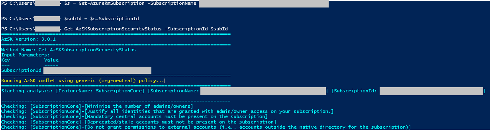
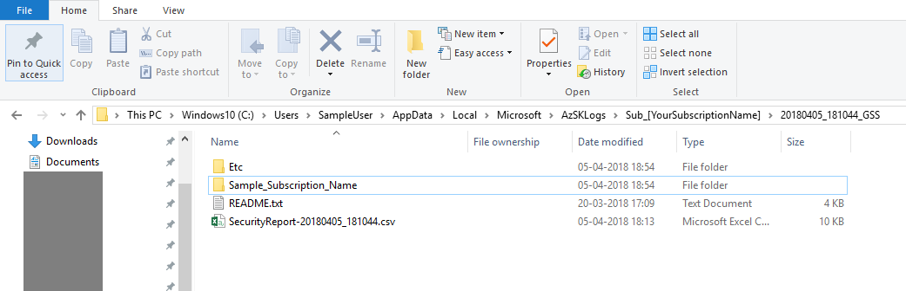
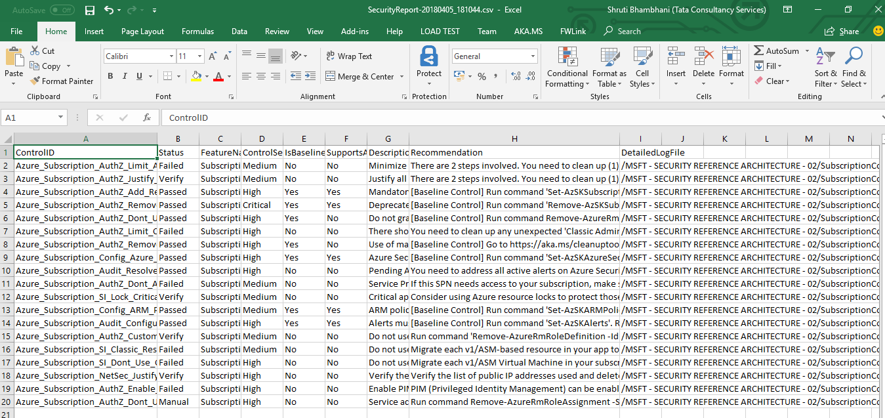
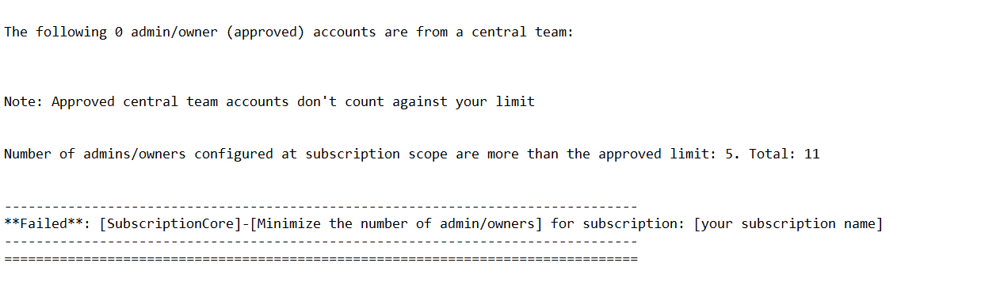

## Scan your Azure Subscription for security vulnerabilities
###### :clock10: 30 minutes to complete
The Subscription Security health check features in AzSK contains a set of scripts that examines a subscription and flags off security issues, misconfigurations or obsolete artifacts/settings which can put your subscription at higher risk.
This package adds-on to the exiting Azure capabilities like Security Center, IAM, etc. and extends it further to check for the presence for non-tenant accounts, SPN with higher priviliges, alerting configuration, etc.

> Note: Ensure that you already have the latest version of AzSK installed on your machine. If not, please follow instruction [here.](../00a-Setup/Readme.md)

**Step 1**: In the PowerShell ISE, run the below command after replacing `<SubscriptionId`> with your Azure SubscriptionId
```PowerShell  
Get-AzSKSubscriptionSecurityStatus -SubscriptionId <SubscriptionId>
```  

You will start seeing output such as the following in the PowerShell console. The script displays realtime progress as it scans your subscription for various security controls.

  

Once the subscription check completes, you will see the output folder (auto) open. At this point, we are ready to take a closer look at the results of the scan!

**So what's happening?** 

Basically, the AzSK command is scanning the specified target Azure resource (in this case your subscription) using a set of security rules implemented in the PS cmdlet 'Get-AzSKSubscriptionSecurityStatus'. 

As each rule is processed, the command prints out information about the specific security check being performed. For instance, above, the last rule it has checked is if any deprecated/stale account is present in the subscription.  

Once all rules have been processed execution completes and the output folder is opened for you. 

   

**Understanding the ouputs** 

As the rules are checked, in the background AzSK collates the following: 
- summary information of the control evaluation (pass/fail) status in a CSV file, 
- detailed control evaluation log in a LOG file and
- a few other anciliary files for additional support

> **Note:** The overall layout and files in the output folder are also described in the **ReadMe.txt** file present in the root output folder (the one that is opened automatically). 

Typically, you'd want to see the summary of control evaluation first. For that, we need to examine the CSV file. 
When you double-click the CSV file, it opens in XLS. You can use "Format as Table", "Hide Columns", "Filter", etc., to quickly look at controls that have "Failed" or ones that are marked "Verify". 
(Controls that are marked as "Verify" typically require that you review the output log for the control evaluation and attest to the correctness. Basically, a status of "Verify" is used for 
controls where it is not possible to mechanically determine "Pass" or "Fail".)

Basic 'quick fix' type guidance for addressing security issues flagged by the security scan is available
in the 'Recommendation' column of the CSV file.

  

For controls that are marked 'Failed' or 'Verify', there is usually additional information 
in the Detailed.LOG file in the <subscription-name> folder to help understand why a control was assessed as 'Failed' 
(or what needs verification if it was marked as 'Verify'). For instance, in the picture below, AzSK is telling us that 
there were more number of 
admins/owners in the subscription than the approved limit. (Just as FYI, all such 
policy/config info is present in JSON-based rule files that each command uses in the background. 
These files are downloaded 'live' from a central location for command execution. Copies of these control 
rule files are also present in the folder corresponding to each AzSK PS modules on your machine…
this helps if, for some reason, the central server is not available.)  

  


> **Note**: Timestamps are used to disambiguate multiple invocations of the cmdlets.  
 
Congratulations! You have completed this part of the Getting Started Guide successfully!!

**Next steps** 
As next steps you can explore one of the following:
1) try the Getting Started guide for scanning your application for security issues [here](./GettingStarted_AzureServiceSecurity.md) or
2) get more details and understand subscription security checks in depth [here](../01-Subscription-Security/Readme.md).
