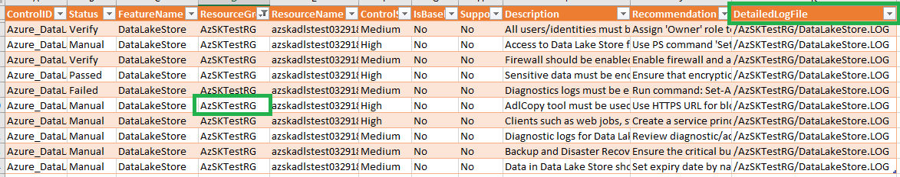
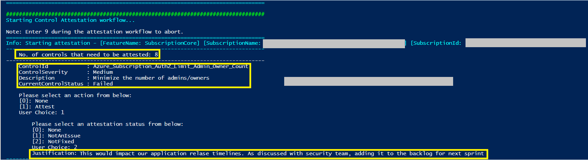
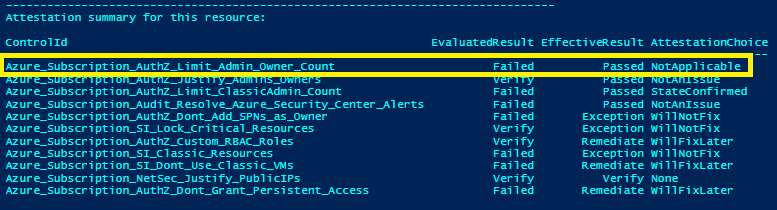
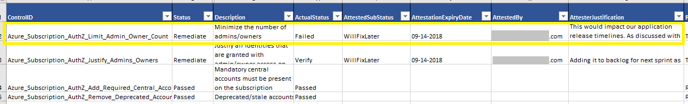

# Addressing Control Failures
### Contents

### [Introduction](Readme.md#introduction)

### [Automatically Generating Fixes](Readme.md#automatically-generating-fixes)
- [Overview](Readme.md#overview)  
- [How to generate fix script?](Readme.md#how-to-generate-fix-script)  
- [Understand 'FixControlScripts' folder](Readme.md#understand-fixcontrolscripts-folder)
- [How to run fix script generated by AzSK?](Readme.md#how-to-run-fix-script-generated-by-azsk)  
- [Repair-AzSKSubscriptionSecurity](Readme.md#repair-azsksubscriptionsecurity)  
- [Repair-AzSKAzureServicesSecurity](Readme.md#repair-azskazureservicessecurity)  

### [Control Attestation](Readme.md#control-attestation-1)
- [Overview](Readme.md#overview-1)  
- [Starting attestation](Readme.md#starting-attestation)  
- [How AzSK determines the effective control result](Readme.md#how-azsk-determines-the-effective-control-result)  
- [Permissions required for attesting controls](Readme.md#permissions-required-for-attesting-controls) 
- [Attestation expiry](Readme.md#attestation-expiry) 
- [Bulk attestation](Readme.md#bulk-attestation)  


### [FAQs](Readme.md#faqs)

----------------------------------------------------------------

# Introduction

This section assumes that you have used the basic subscription and resource security scan commands from 
the Getting Started document. It focuses on what you can do next after you have run the scans. 

Recall that, once a manual scan completes, the CSV file in the output folder that is (auto-) opened 
provides a consolidated security report for all the resources that were evaluated in the scan. 

To actually improve the security of your application, you now need to look at each control's evaluation
details in the AzSK scan results and understand what actions you need to take. 

There are **2 important components** in the scan results that can help:

  a) The control summary in the CSV file and
  b) The detailed evaluation info in the LOG file.

For each control that was evaluated for a specific resource, the control summary line from the CSV file 
provides information such as the control id, overall control status (result), control description, 
recommended fix and other control-related info.

For controls other than a result of 'Passed' you will typically need to take some action. For this, apart
from the 'Recommendation' field, additional control evaluation info present in the LOG file should be used.
This can ensure that you take the right next steps for a control in the context of the specific resource. 
For example, if you are getting a 'Failed' for an RBAC related control, the LOG file is where you will have
additional details such as which accounts were found that caused AzSK to flag a failure.

You can use the 'DetailedLogFile' field to locate the LOG file where control evaluation info for each control 
is written by AzSK. (This file can be different for different resources/resource groups.) 
See the image below:

  

For some controls, AzSK can automatically generate scripts that can be run to address the control failures.
This can be done using the '-GenerateFixScript' flag in the scan commands. Whether AzSK has support for
auto-generating the fix script for a control is represented by the 'SupportsAutoFix' column for that control.

Also, sometimes, you will need to complement or override AzSK's control evaluation result with additional 
contextual knowledge. This is called 'Control Attestation' and is supported by the '-ControlsToAttest' flag in the scan commands. 

The rest of this section explains these two capabilities in detail.


# Automatically Generating Fixes
### Overview
For several security controls, the fix required to remediate a control failure is automatable. The AzSK supports this scenario through the 'FixControls' feature. 
For the controls where this feature is available, AzSK has the ability to generate a 'control fix' script that the user can review and run to apply the fixes. For many controls, fix automation is not feasible because the workflow involved in fixing a control may be complex. As a result, this feature may not be available/applicable for all controls. 
The overall sequence when using this feature is as follows:
1. A user runs one of the AzSK scan scripts with a flag requesting the AzSK to generate a 'control fix' script.
2. Once the scan completes, the user can review the control fix script. 
3. The user can update a parameters file to provide input values for the fix script. This is required for controls where the fix/remediation requires input params to be supplied by the user (e.g., IP addresses, user alias, etc.)
4. The user runs the script to remediate the relevant controls
5. (Optionally) The user can rerun the scan to confirm that the target controls were indeed remediated.    

[Back to top...](Readme.md#contents)

### How to generate fix script?
The script to automatically implement the recommendation for a control can be generated by passing the *'GenerateFixScript'* switch to the following SVT commands:
```PowerShell
	Get-AzSKAzureServicesSecurityStatus
	Get-AzSKSubscriptionSecurityStatus
	Get-AzSKControlsStatus
```

Upon completion of command execution, a folder 'FixControlScripts' will be created in output folder (only if one or more of the failed controls support automated fixing). 
> Note: This folder contains multiple files which are described in a README.txt file in the same folder.


Run the script 'RunFixScript.ps1' from folder 'FixControlScripts'.  

[Back to top...](Readme.md#contents)

### Understand 'FixControlScripts' folder
This section describes how to interpret the different files created when AzSK cmdlets are executed with 'GenerateFixScript' parameter.
To implement the recommendations for controls,  
1. The user can review the PowerShell files under 'Services' folder.  
2. The user can update a parameters file (FixControlConfig.json) to provide input values for the fix script. This is required for controls where the fix/remediation requires input params to be supplied by the user (e.g., IP addresses, user alias, etc.).  
3. The user runs the script (RunFixScript.ps1) to remediate the relevant controls.  
4. (Optionally) The user can rerun the scan to confirm that the target controls were indeed remediated.  

The contents of the 'FixControlScripts' folder are organized as under:  
- *\RunFixScript.ps1* - The file which starts implementing the recommendations. The file typically contains repair command which uses the files from current folder.  
- *\FixControlConfig.json* - The file contains the configuration of controls along with mandatory/optional parameters which are required for implementing the fix for control.  
- *\Services* - The folder contains the PowerShell files which are used to implement the fix for control.  
	- *\\\<ResourceType>.ps1* - The file contains PowerShell code to implement the fix for control. The file can be referred for review.  
- *\FixControlConfig-\<Timestamp>.json* - This file is generated when repair command is run. The file contains the input values provided by user while running the repair command. The file can be referred for review.

[Back to top...](Readme.md#contents)

### How to run fix script generated by AzSK?
The recommendation for a control can be implemented automatically by using following commands:
```PowerShell
	Repair-AzSKAzureServicesSecurity
	Repair-AzSKSubscriptionSecurity 
```
These commands use the 'FixControlConfig.JSON' file from the 'FixControlScripts' folder for the set of controls to auto-remediate. They are described further below:  

### Repair-AzSKSubscriptionSecurity
This command remediates the subscription security related controls using the automated fixing scripts generated by running the corresponding AzSK scan command with the '-GenerateFixScript' flag.

|Parameter|Name|Description|
|----|----|----|
|ParameterFilePath |Full file path to 'FixControlConfig.json' (by default generated in sub-folder 'FixControlScripts' of the AzSK scan command output folder).|Mandatory|
|ControlIds|List of control ids for which fixes should be applied.|Optional|
|Force|Switch to bypass user consent of modifying Azure resources|Optional|  

For example,
```PowerShell
Repair-AzSKSubscriptionSecurity -ParameterFilePath <ParameterFilePath>
```
### Repair-AzSKAzureServicesSecurity 
This command remediates security controls for various Azure resources using the automated fixing scripts generated by running the corresponding AzSK scan command with the '-GenerateFixScript' flag.

|Parameter|Name|Description|
|----|----|----|
|ParameterFilePath |Full file path of  'FixControlConfig.json' (by default generated in sub-folder 'FixControlScripts' of the AzSK scan command output folder). |Mandatory |
|ResourceGroupNames	|List of resource groups for which fixes should be applied. |Optional |
|ResourceTypes |List of resource types for which fixes should be applied. E.g., Microsoft.Sql/servers. |Optional |
|ResourceTypeNames |List of resource type names for which fixes should be applied. E.g., SQLDatabase. |Optional |
|ResourceNames |List of resources for which fixes should be applied. |Optional |
|ControlIds |List of control ids for which fixes should be applied. |Optional |
|Force |Switch to bypass user consent prompts when modifying Azure resources |Optional |

For example,
```PowerShell
Repair-AzSKAzureServicesSecurity -ParameterFilePath <ParameterFilePath>
```
[Back to top...](Readme.md#contents)

# Control Attestation

> **Note**: Please use utmost discretion when attesting controls. In particular, when choosing to not fix a failing control, you are taking accountability that nothing will go wrong even though security is not correctly/fully configured. 
> </br>Also, please ensure that you provide an apt justification for each attested control to capture the rationale behind your decision.  

### Overview

The attestation feature empowers users to support scenarios where human input is required to augment or override the default control 
evaluation status from the AzSK. These may be situations such as:

- the AzSK has generated the list of 'Owners' or 'Contributors' for a resource but someone needs to have a look at the list and ratify that 
these are indeed the correct people, or
- the AzSK has marked a control as failed. However, given the additional contextual knowledge, the application owner wants to ignore the control failure, or
- the AzSK has marked a control as failed and the issue is a valid security concern. However, due to other constraints, 
the application owner wants to defer the fix for later and request a risk ack.

In all such situations, there is usually a control result that is based on the technical evaluation (e.g., Verify, Failed, etc.) that has to 
be combined with the user's input in order to determine the overall or effective control result. The user is said to have 'attested' such controls 
and, after the process is performed once, AzSK remembers it and generates an effective control result for subsequent control scans _until_ there 
is a state change.

The attestation feature is implemented via a new switch called *ControlsToAttest* which can be specified in any of the standard security scan cmdlets
of the AzSK. When this switch is specified, the AzSK first performs a scan of the target resource(s) like it is business as usual and, once
the scan is complete, it enters a special interactive 'attest mode' where it walks through each resource and relevant attestable controls
and captures inputs from the user and records them in the subscription (along with details about the person who attested, the time, etc.). 
After this, for all future scans on the resource(s), AzSK will show the effective control evaluation results. Various options are provided to support
different attestation scenarios (e.g., expiry of attestations, edit/change/delete previous attestations, attest only a subset of controls, etc.). 
These are described below. Also, for 'stateful' controls (e.g., "are these the right IP addresses to permit on the firewall?"), the attestation
state is auto-reset if there is any change in 'state' (e.g., someone added a new IP to the list).

Lastly, due to the governance implications, the ability to attest controls is available to a subset of subscription users. This is described in
the permissions required section below.  


[Back to top...](Readme.md#contents)
### Starting attestation
      
The AzSK subscription and services scan cmdlets now support a new switch called *ControlsToAttest*. When this switch is specified, 
AzSK enters 'attest' mode immediately after a scan is completed. This ensures that attestation is done on the basis of the most current
control statuses.

All controls that have a technical evaluation status of anything other than 'Passed' (i.e., 'Verify' or 'Failed' or 'Manual' or 'Error') are considered 
valid targets for attestation.

> **Note**: Some controls are very crucial from security stand point and hence AzSK does not support attesting them.

To manage attestation flow effectively, 4 options are provided for the *ControlsToAttest* switch to specify which subset of controls to target for attestation. These are described below:

|Attestation Option|Description|
|------------------|-----------|
|NotAttested|Attest only those controls which have not been attested yet.|
|AlreadyAttested|Attest those controls which have past attestations. To re-attest or clear attestation.|
|All|Attest all controls which can be attested (including those that have past attestations).|
|None|N/A.|

For example, to attest controls corresponding to a subscription security scan, run the command below:
```PowerShell  
$subscriptionId = <Your SubscriptionId>
Get-AzSKSubscriptionSecurityStatus -SubscriptionId $subscriptionId -ControlsToAttest NotAttested -DoNotOpenOutputFolder  
``` 
As shown in the images, the command enters 'attest' mode after completing a scan and does the following:

1. For each resource that was scanned, if a control is a target for attestation, control details (such as description, severity, etc.) and the current evaluation result are displayed (to help the user)
2. The user gets to choose whether they want to attest the control
3. If the user chooses to attest, attestation details (attest status, justification, etc.) are captured
4. This is repeated for all attestable controls and each resource.

 Sample attestation workflow in progress:
  
 
 Sample summary of attestation after workflow is completed:
  

Attestation details corresponding to each control (e.g., justification, user name, etc.) are also captured in the CSV file as shown below:
  

The attestation process for application resources is similar to that for subscriptions. For example, the command below shows how to 
trigger attestation for a specific resource in an RG:

```PowerShell  
$subscriptionId = <Your SubscriptionId>
$resourceGroupName = <ResourceGroup Name>
$resourceName = <ResourceName>
Get-AzSKAzureServicesSecurityStatus -SubscriptionId $subscriptionId `
                -ResourceGroupNames $resourceGroupName `
                -ResourceName $resourceName `
                -ControlsToAttest NotAttested `
                -DoNotOpenOutputFolder 
``` 
If, for any reason, the attestations of previously attested controls need to be revisited, it can be done by simply changing the 'NotAttested' flag in the commands above with 'AlreadyAttested'.  


[Back to top...](Readme.md#contents)
### How AzSK determines the effective control result

During the attestation workflow, the user gets to provide attestation (sub)status for each control attested. This basically represents the user's attestation preference w.r.t.
a specific control (i.e., whether the user wants to override/augment the AzSK status and treat the control as passed or whether the user agrees with the AzSK status but wants to defer
fixing the issue for the time being):

|Attestation Status | Description|
|---|---|
|None | There is no attestation done for a given control. User can select this option during the workflow to skip the attestation|
|NotAnIssue | User has verified the control data and attesting it as not an issue with proper justification to represent situations where the control is implemented in another way, so the finding does not apply. |
|WillNotFix | User has verified the control data and attesting it as not fixed with proper justification|
|WillFixLater | User has verified the control data and attesting it as not fixed with proper justification stating the future fix plan|
|**NotApplicable | User has verified the control data and attesting it as not applicable for the given design/context with proper justification. |
|**StateConfirmed | User has verified the control data and attesting it as state confirmed to represent that the control state is correct/appropriate with proper justification. |

 >  ** These are special attestation status which are supported only in selected controls.

The following table shows the complete 'state machine' that is used by AzSK to support control attestation. 
The columns are described as under:
- 'Control Scan Result' represents the technical evaluation result 
- 'Attestation Status' represents the user choice from an attestation standpoint
- 'Effective Status' reflects the effective control status (combination of technical status and user input)
- 'Requires Justification' indicates whether the corresponding row requires a justification comment
- 'Comments' outlines an example scenario that would map to the row

|Control Scan Result  |Attestation Status |Effective Status|Requires Justification | ExpiryInDays| Comments |
|---|---|---|---|---|---|
|Passed |None |Passed |No | -NA- |No need for attestation. Control has passed outright!|
|Verify |None |Verify |No | -NA- |User has to ratify based on manual examination of AzSK evaluation log. E.g., SQL DB firewall IPs list.|
|Verify |NotAnIssue |Passed |Yes | 90 |User has to ratify based manual examination that finding does not apply as the control has been implemented in another way. For example, AAD authentication for App Service was implemented through code. |
|Verify |WillNotFix |Exception |Yes | Based on the control severity table below|Valid security issue but a fix cannot be implemented immediately. E.g., A 'deprecated' account was found in the subscription. However, the user wants to check any dependencies before removal.|
|Verify |WillFixLater |Remediate |Yes| Based on the control severity table below|Valid security issue but a fix cannot be implemented immediately. E.g., A 'deprecated' account was found in the subscription. However, the user wants to check any dependencies before removal.|
|Verify |NotApplicable |Passed |Yes| 90 |User has to ratify based on manual examination that the finding is not applicable for given design/context. E.g., Runbook does not contain any hard-coded secure information. |
|Verify |StateConfirmed |Passed |Yes| Based on the control severity table below|User has to ratify based on manual examination that the control state is correct/appropriate. E.g., SQL firewall IPs scenario, where all IPs are legitimate.|
|Failed |None |Failed |No | -NA- | Control has failed but has not been attested. Perhaps a fix is in the works...|	 
|Failed |NotAnIssue |Passed |Yes | 90 |Control has failed. However, the finding does not apply as the control has been implemented in another way. For example, AAD authentication for App Service was implemented through code.|
|Failed |WillNotFix |Exception |Yes | Based on the control severity table below| Control has failed. The issue is not benign, but the user has some other constraint and cannot fix it. E.g., Need an SPN to be in Owner role at subscription scope.|
|Failed |WillFixLater |Remediate |Yes | Based on the control severity table below| Control has failed. The issue is not benign, but the user wishes to defer fixing it for later. E.g., AAD is not enabled for Azure SQL DB.|
|Failed |NotApplicable |Passed |Yes| 90 |Control has failed. However, user confirms based on manual examination that the finding is not applicable for given design/context.|
|Failed |StateConfirmed |Passed |Yes| Based on the control severity table below|Control has failed. However, user confirms based on manual examination that the control state is correct/appropriate. |
|Error |None |Error |No | -NA- | There was an error during evaluation. Manual verification is needed and is still pending.|
|Error |NotAnIssue |Passed |Yes | 90| There was an error during evaluation. Manual verification by user indicates that the finding does not apply as the control has been implemented in another way.|
|Error |WillNotFix |Exception |Yes | Based on the control severity table below| There was an error during evaluation. Manually verification by the user indicates a valid security issue.|
|Error |WillFixLater |Remediate |Yes | Based on the control severity table below| There was an error during evaluation. Manually verification by the user indicates a valid security issue.|
|Error |NotApplicable |Passed |Yes| 90 |There was an error during evaluation. However, user confirms based on manual examination that the finding is not applicable for given design/context.|
|Error |StateConfirmed |Passed |Yes| Based on the control severity table below|There was an error during evaluation. However, user confirms based on manual examination that the control state is correct/appropriate.|
|Manual |None |Manual |No | -NA-| The control is not automated and has to be manually verified. Verification is still pending.| 
|Manual |NotAnIssue |Passed |Yes | 90| The control is not automated and has to be manually verified. User has reviewed the security concern and implemented the fix in another way.|
|Manual |WillNotFix |Exception |Yes | Based on the control severity table below| The control is not automated and has to be manually verified. User has reviewed and found a security issue to be fixed.|
|Manual |WillFixLater |Remediate |Yes | Based on the control severity table below| The control is not automated and has to be manually verified. User has reviewed and found a security issue to be fixed.|
|Manual |NotApplicable |Passed |Yes| 90 |The control is not automated and has to be manually verified. User confirms based on manual examination that the finding for given design/context is not applicable. |
|Manual |StateConfirmed |Passed |Yes| Based on the control severity table below| The control is not automated and has to be manually verified. User has verified that there's no security concern.|

-NA- => Not Applicable

Control Severity Table:

|ControlSeverity| ExpiryInDays|
|----|---|
|Critical| 7|
|High   | 30|
|Medium| 60|
|Low| 90|
 
  
<br>
The following table describes the possible effective control evaluation results (taking attestation into consideration).

|Control Scan Result| Description|
|---|---|
|Passed |Fully automated control. Azure resource/subscription configuration meeting the AzSK control requirement|
|Verify |Semi-automated control. It would emit the required data in the log files which can be validated by the user/auditor. e.g. SQL DB IP ranges|
|Failed |Fully automated control. Azure resource/subscription configuration not meeting AzSK control requirement|
|Error |Automated control. Currently failing due to some exception. User needs to validate manually|
|Manual |No automation as of now. User needs to validate manually|
|Exception |Risk acknowledged. The 'WillNotFix' option was chosen as attestation choice/status. |
|Remediate |Risk acknowledged with a remediation plan. The 'WillFixLater' option was chosen as attestation choice/status.|

[Back to top...](Readme.md#contents)
### Permissions required for attesting controls:
The attestation feature internally stores state in a storage account in a resource group called AzSKRG. (This RG is also used by other features in the AzSK for stateful scenarios.)
If this RG has already been created, then a user needs 'Owner' permission to it.
If this RG is not present (as is possible when none of the scenarios that internally create this RG have been run yet), then the user needs 'Owner' or 'Contributor' permission to the subscription.

> **Note**: The attestation data stored in the AzSKRG is opaque from an end user standpoint. Any attempts to access/change it may impact correctness of security evaluation results.  

[Back to top...](Readme.md#contents)

### Attestation expiry:
All the control attestations done through AzSK is set with a default expiry. This would force teams to revisit the control attestation at regular intervals. 
Expiry of an attestation is determined through different parameters like control severity, attestation status etc. 
There are two simple rules for determining the attestation expiry. Those are:

Any control with evaluation result as not passed, 
 1. and attested as 'NotAnIssue' or 'NotApplicable', such controls would expire in 90 days.
 2. and attested as 'WillFixLater' or 'WillNotFix' or 'StateConfirmed', such controls would expire based on the control severity table below.

|ControlSeverity| ExpiryInDays|
|----|---|
|Critical| 7|
|High   | 30|
|Medium| 60|
|Low| 90|
 
The detailed matrix of attestation details and its expiry can be found under [this](Readme.md#how-azsk-determines-the-effective-control-result) section. Attestation expiry date is also emitted in CSV scan result as shown in [this](../Images/02_SVT_Attest_3.PNG) image.

> **Note**: 
> * All the controls are subjected to an initial grace period from the first scanned date. On expiry of grace period for a control,
>  1. 'WillFixLater' option will be disabled for further attestation.
>  2. if the control was attested as 'WillFixLater', then attestation will expire.
> User will then have the option to either fix the control or use other available attestation states with proper justification.
> 
>* Attestation may also expire before actual expiry in cases when the attested state for the control doesn't match with current control state.
[Back to top...](Readme.md#contents)

### Bulk attestation

In some circumstances, you may have to perform attestation for a specific resource type across several instances. For instance,
you may have 35 storage accounts for which you need to perform attestation for one specific control. To do this one resource at
a time can be inefficient - especially if the reason for attesting the control is the same across all those resource instances. The
bulk attestation feature helps by empowering subscription/security owners to provide a common justification for a set of resources
all of which have a specific (single) controlId that requires attestation. This essentially 'automates' attestation by using 
a slightly different combination of parameters alongside '-ControlsToAttest'.

 ```PowerShell  
$subscriptionId = 'Your subscription Id'
$resourceGroupNames = 'Comma-separated list of resource groups'
$resourceNames = 'Comma-separated list of resources'
$bulkAttestControlId = 'AzSK ControlId string'     # You can get this from the CSV file, first column.
$justificationText = 'Rationale behind your choice of AttestationStatus here...'

Get-AzSKAzureServicesSecurityStatus -SubscriptionId $subscriptionId `
                -ResourceGroupNames $resourceGroupNames `
                -ResourceNames $resourceNames `
                -ControlsToAttest NotAttested `
                -BulkAttestControlId $bulkAttestControlId `                 # ControlId to be attested
                -AttestationStatus <NotAnIssue | WillFixLater | WillNotFix> ` # Attestation choice/input, use one of these.
                -JustificationText $justificationText                   # Additional (text) justification
 
``` 
<br/>

|Parameter Name| Description|
|---|---|
|BulkAttestControlId |ControlId to bulk-attest. Bulk attest mode supports only one controlId at a time.|
|ControlsToAttest | See table in the  [Starting Attestation](Readme.md#starting-attestation) section. |
|AttestationStatus | Attester must select one of the attestation reasons (NotAnIssue, WillNotFix, WillFixLater)|
|JustificationText | Attester must provide an apt justification with proper business reason.|

To understand this better, let us take two example scenarios where bulk attestation can help,

###### Scenario 1: ######
The application uses multiple App Services where AAD authentication has been implemented through code. 
The control has been evaluated as 'Verify' by AzSK because it cannot infer the status from the settings.

You know that for all these applications, AAD-authentication has been correctly implemented and want to 'Attest' that
control for all of them in a single pass. 

In this scenario, bulk attestation can be used as below to 'attest' the ControlId 'Azure_AppService_AuthN_Use_AAD_for_Client_AuthN' 
for all App Service objects: 

```PowerShell  
$subscriptionId = 'Your SubscriptionId'
$resourceNames = 'Comma-separated list of AppService names' 
$bulkAttestControlId = 'Azure_AppService_AuthN_Use_AAD_for_Client_AuthN'
$justificationText = 'AAD authentication has been enabled through code and has been tested.'
Get-AzSKAzureServicesSecurityStatus -SubscriptionId $subscriptionId `
                -ResourceTypeName AppService `
                -ResourceNames $resourceName `
                -ControlsToAttest NotAttested `
                -BulkAttestControlId $bulkAttestControlId `
                -AttestationStatus NotAnIssue `
                -JustificationText $justificationText
 ``` 
 
The above command will record the justification and attestation input for all specified AppServices for the AAD-AuthN control. 
A user can re-run the scan command below, to confirm the control result status.

```PowerShell  
$subscriptionId = 'Your SubscriptionId'
$resourceNames = 'Comma separated values for the AppService resource names' 
$controlId = 'Azure_AppService_AuthN_Use_AAD_for_Client_AuthN'
Get-AzSKAzureServicesSecurityStatus -SubscriptionId $subscriptionId `
                -ResourceTypeName AppService `
                -ResourceNames $resourceName `
                -ControlIds $controlId 
 ``` 

###### Scenario 2: ###### 
An application uses many Storage Accounts, of which a subset is used only to store web site performance logs. 
Because these logs aren't critical business data, the business does not want to incur the expense of geo-redundant
storage for the storage accounts holding them. All other storage accounts, however, store critical business data which business absolutely
cannot afford to lose in the event of regional disasters. Thus, we have a situation where an AzSK control (in this case
the GRS setting for Storage Accounts) must pass for a subset of resources while it need to be 'attested' for 
the remainder.

In this scenario, bulk attestation can be used as shown below to attest the 'Azure_Storage_Deploy_Use_Geo_Redundant' ControlId 
for a specific set of storage accounts:

```PowerShell  
$subscriptionId = 'Your SubscriptionId'
$resourceNames = 'Comma-separated values for the Storage Account resource names' 
$bulkAttestControlId = 'Azure_Storage_Deploy_Use_Geo_Redundant'
$justificationText = 'Storage Account currently used for perf logs only. Business agrees that GRS option is not needed.'
Get-AzSKAzureServicesSecurityStatus -SubscriptionId $subscriptionId `
                -ResourceTypeName Storage `
                -ResourceName $resourceName `
                -BulkAttestControlId $bulkAttestControlId `
                -ControlsToAttest NotAttested `
                -AttestationStatus NotAnIssue `
                -JustificationText $justificationText
 ``` 
 
The above command will record the justification and attestation input/choice for all the specified StorageAccounts for the GRS control.
A user can re-run the scan command below to confirm the final control status:

```PowerShell  
$subscriptionId = 'Your SubscriptionId'
$resourceNames = 'Comma-separated values for the Storage Account resource names' 
$controlId = 'Azure_AppService_AuthN_Use_AAD_for_Client_AuthN'
Get-AzSKAzureServicesSecurityStatus -SubscriptionId $subscriptionId `
                -ResourceTypeName Storage `
                -ResourceNames $resourceName `
                -ControlIds $controlId 
 ``` 


**Bulk clearing past attestation:** 

The bulk attestation feature can also be used for situations where a user wants to clear the attestation for 
multiple resources in bulk, for a specified controlId. This can be achieved by running the command below:

 ```PowerShell  
$subscriptionId = <Your SubscriptionId>
$resourceGroupName = <ResourceGroup Name>
$resourceName = <ResourceName>
$bulkAttestControlId = <AzSK ControlId string>
$justificationText = <Your justification text for attestation>
Get-AzSKAzureServicesSecurityStatus -SubscriptionId $subscriptionId -ResourceGroupNames $resourceGroupName -ResourceName $resourceName `
				-BulkAttestControlId $bulkAttestControlId -ControlsToAttest AlreadyAttested -BulkClear
 ``` 
> **Note**: Usage of BulkClear with 'NotAttested' Option of ControlsToAttest param, would result in failure.

### FAQs

##### Can fixing an AzSK control impact my application?

Most of the AzSK recommendations are generic and are based on security standards and best practices that are widely applicable when processing sensitive data. However, just like any other configuration change, a change to security configuration should be treated with care especially in production environments. In other words, do exercise due diligence and perform good testing (to assess impact on functionality, performance and cost) and follow the required change management discipline expected from engineering teams in your org before making changes in the context of business critical workloads. It is also useful to review any changes with the application architect/design team. This helps ensure a more comprehensive impact assessment. 

As examples, we have had a few cases where teams directly made changes to production and realized that it broke their business scenarios. E.g. there were a couple of applications where internal components in the app were using a hard-coded 'non-HTTPS' string to access a Web API also within the app. As a result, when the Web API was switched to use HTTPS-only, the application workflow started breaking. :-( 

Clearly, these changes themselves were required (per security policy/standards) and were the right thing for securing the enterprise data these applications were handling. Yet, because the applications were not themselves designed to be able to handle the change it led to production impact. (These are also important lessons for all of us on the value of embedding security from the very start in every stage of dev ops...right from subscription provisioning through prototyping, development, deployment (CICD) and operations.)
On a related note, every control in the AzSK may not be applicable to every scenario. Some controls are, by nature, contextual. Others are best practices that are 'good to have' but not a 'must'. In such cases, the control recommendations do provide indications (using wording such as 'where possible' or 'where applicable'). For example, if a backend store is accessed from a multitude of client devices practically from anywhere then an IP-based restriction may not be practical to impose on the data store. However, in another application, one may have a scenario where the backend store is accessed from a controlled pool of middle tier servers (only). In such a case, an IP-based restriction is practical and can add an extra layer of security if the data is highly sensitive in nature.

#### What permission should I have to perform attestation in AzSK?

Control attestation is a privileged operation. As a result, non-owners don't have permissions to attest controls by default.
To be able to attest to controls for your subscription, you should ask the subscription owner to grant you 'Contributor' access to the storage account under the resource group 'AzSKRG'. The storage account looks something like: 'AzSKyyyymmddhhmmss'

The AzSK docs for control attestation are [here](../00c-Addressing-Control-Failures/Readme.md#control-attestation)

#### Attestation fails with permission error even though I am Owner.

It can happen due to below reasons
1. User who is attesting doesn't have Contributor/ Owner access on the AzSKRG </br>
   Sol. => In this scenario the user is already co-admin.

2. "AzSK-controls-state" Container is missing in the AzSK storage account </br>
   Sol. => Run the below script on your subscription after replacing the storage account name. You can find the AzSK storage account under AzSKRG resource group in your subscription
   ```PowerShell
   $StorageAccountName = "<AzSKStorageAccountName e.g. AzSK20170731999999>"
   $keys = Get-AzureRmStorageAccountKey -ResourceGroupName "AzSKRG"  -Name $StorageAccountName
   $currentContext = New-AzureStorageContext -StorageAccountName $StorageAccountName -StorageAccountKey $keys[0].Value -Protocol Https
   $Container = Get-AzureStorageContainer -Name "AzSK-controls-state" -Context $currentContext -ErrorAction SilentlyContinue
   if($null -eq $Container)
   {       
     New-AzureStorageContainer -Name "AzSK-controls-state" -Permission Off -Context $currentContext
   }
   ```

3. AzSKRG resource group is not present on the subscription </br>
   Sol. => By setting up Continuous Assurance on your subscription will create the required AzSK artifacts.
   ```PowerShell
   Install-AzSKContinuousAssurance -SubscriptionId "<subId>" -ResourceGroupNames "*" -OMSWorkspaceId "<omsWorkspaceId>" -OMSSharedKey "<omsSharedKey>"
   ```

    
#### Why do I have new control failures from AzSK?

You might come across a scenario that you spent some time and fixed all the issues that you were expected to and "got to green". Now, a few days (or weeks) later, you are seeing that you have to address a bunch of issues. You may wonder - 'What happened? Why do I get new failures from AzSK?'

There are many reasons why you may see 'new' control failures after you put in the effort to resolve existing ones. Here are some common ones: </br>
a- You may have net new resources that were created/deployed to the subscription. The first time CA scans these resources (usually within 24 hours of their creation), it will flag any security control failures. </br>
b- Someone on the team perhaps changed the configuration of an existing resource. In a large subscription with many stakeholders acting on different resources and resource groups, this is quite a possibility. That is where CA helps! It watches over the drift and reports it. </br>
c- Baseline control set may change. As attacks get sophisticated, so must our defense. It is quite possible that a control that was not considered "core hygiene" might become so a few months down. This will mean that for existing resources, everyone now has a new control to fix. </br>
d- New controls may get added. Azure is a very dynamic environment. The PG adds new features and security capabilities every quarter in some services and every six months in most others. When a new security feature is added, the AzSK may be modified to add a new control to cover it. If the control is core/fundamental, then everyone will be expected to fix it on existing resources. (Remember that CA automatically picks up latest AzSK bits for scanning. So, the moment a version of AzSK gets released with a new control and it is a 'baseline' control, CA scans will start checking the control on existing resources.) </br>
e- Control logic for existing controls may change - due to bug fixes or additional conditions in the detection logic. This change in control behavior will, again, start reflecting in CA scans when a version of AzSK with the 'fix' or 'logic change' is released. </br>
f- Configuration baselines may change. What is considered a mandatory account today may not remain so tomorrow or in 6 months. Certificates expire, credentials/accounts get deprecated. The AzSK is able to detect that your subscription contains these accounts but the access permissions that CA has does not let CA make any changes. </br>
Phew...We hope we covered the main reasons. One last thought is that in the current "agile + dev ops + cloud" era, with all rapid iterations and changes happening at all layers, security has also become a much more 'continuous' effort compared to the past.
[Back to top...](Readme.md#contents)
