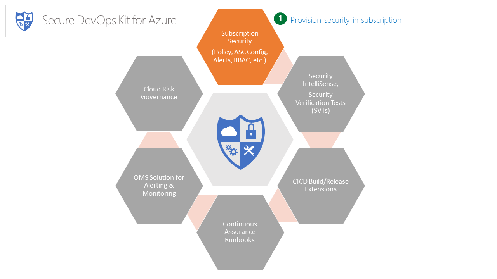

# AzSK Subscription Security Package



### Contents:

### [AzSK: Subscription Health Scan](Readme.md#azsk-subscription-health-scan-1)
- [Overview](Readme.md#overview)
- [Scan the security health of your subscription](Readme.md#scan-the-security-health-of-your-subscription)
- [Subscription Health Scan - What is covered?](Readme.md#subscription-health-scan---what-is-covered)
- [Subscription Health Scan - How to fix findings?](Readme.md#subscription-health-scan---how-to-fix-findings)
- [Target specific controls during a subscription health scan](Readme.md#target-specific-controls-during-a-subscription-health-scan)
- [FAQs](Readme.md#faqs)

### [AzSK: Subscription Security Provisioning](Readme.md#azsk-subscription-security-provisioning-1)
- [Overview](Readme.md#overview-1)
- [Provision security for your subscription](Readme.md#provision-security-for-your-subscription)
- [Remove previously provisioned security settings from your subscription](Readme.md#remove-azsk-subscription-security-provisioning-from-your-subscription)
- [FAQs](Readme.md#faqs-1)

### [AzSK: Subscription AccessControl Provisioning](Readme.md#azsk-subscription-access-control-provisioning)
- [Overview](Readme.md#overview-2)
- [Setup pre-approved mandatory accounts](Readme.md#setup-pre-approved-mandatory-accounts)
- [Remove pre-approved mandatory accounts](Readme.md#remove-previously-provisioned-accounts)

### [AzSK: Subscription Activity Alerts](Readme.md#azsk-subscription-activity-alerts-1)
- [Overview](Readme.md#overview-3)
- [Configure alerts in your subscription](Readme.md#configure-alerts-for-your-subscription)
- [Remove previously configured alerts from your subscription](Readme.md#remove-previously-configured-alerts-from-your-subscription)
- [Configure alerts scoped to specific resource groups](Readme.md#configure-alerts-scoped-to-specific-resource-groups)
- [FAQs](Readme.md#faqs-2)

### [AzSK: Azure Security Center (ASC) configuration](Readme.md#azsk-azure-security-center-asc-configuration-1)
	
- [Setup Azure Security Center (ASC) on your subscription](Readme.md#setup-azure-security-center-asc-on-your-subscription)


### [AzSK: Subscription Security - ARM Policy](Readme.md#azsk-subscription-security---arm-policy-1)

- [Overview](Readme.md#overview-4)
- [Setup ARM policies for your subscription](Readme.md#setup-arm-policies-on-your-subscription)
- [Remove ARM policies from your subscription](Readme.md#remove-arm-policies-from-your-subscription)
- [FAQs](Readme.md#faqs-3)

### [AzSK: Update subscription security baseline configuration](Readme.md#azsk-update-subscription-security-baseline-configuration-1)
- [Update subscription security baseline configuration](Readme.md#update-subscription-security-baseline-configuration)


----------------------------------------------------------
## AzSK: Subscription Health Scan

### Overview
 
The subscription health check script runs a set of automated scans to examine a subscription and flags 
off conditions that are indications that your subscription may be at a higher risk due to various security 
issues, misconfigurations or obsolete artifacts/settings. 

The following aspects of security are checked:
1. 	 Access control configuration - identity and access management related issues in the subscription
2. 	 Alert configuration - configuration of activity alerts for sensitive actions for the subscription and various cloud resources
3. 	 Azure Security Center configuration - configuration of ASC (security point of contact, various ASC policy settings, etc.)
4. 	 ARM Policy and Resource Locks configuration - presence of desired set of ARM policy rules and resource locks. 

[Back to top…](Readme.md#contents)
### Scan the security health of your subscription 

The subscription health check script can be run using the command below after replacing `<SubscriptionId`> 
 with your subscriptionId
```PowerShell
Get-AzSKSubscriptionSecurityStatus -SubscriptionId <SubscriptionId>
```
The parameters used are:
- SubscriptionId – Subscription ID is the identifier of your Azure subscription 

You need to have at least **Reader** role at the subscription scope to run this command. 
If you also have access to read the Graph in your tenant, the RBAC information and checking will be richer.


> **Note**: The check for presence of Management Certificates cannot be performed just with "Reader" privilege. 
> This check only works if you are running as a Co-Administrator. This is in itself a bad practice. Hence, in most
> situations, the user running the subscription health check will likely not be a co-admin and, because we will not be
> able to actually perform the check, the outcome of this control will be listed as 'Manual'.
>
> In general, in any scenario where the runtime account used to run an AzSK cmdlet does not have enough access to evaluate
> a control, the evaluation status is marked as "Manual" in the report. Basically, for such controls, someone with the
> correct access needs to manually verify the control and record the information through the "Control Attestation" feature.
> A common situation for this is in respect to "Graph Access" which is not available by default to SPNs.


[Back to top…](Readme.md#contents)
### Subscription Health Scan - What is covered?  
 

The various security checks performed by the health check script are listed in the table [here](../02-Secure-Development/ControlCoverage/Feature/SubscriptionCore.md). 

The next section explains how to interpret output in the LOG file and how to address control failures.

[Back to top…](Readme.md#contents)
### Subscription Health Scan - How to fix findings?

All cmdlets in AzSK generate outputs which are organized as under: 
- summary information of the control evaluation (pass/fail) status in a CSV file, 
- detailed control evaluation log in a LOG file and
- a few other anciliary files for additional support

The overall layout and files in the output folder are also described in the README.txt file present in the root output folder.

To address findings, you should do the following:
1. See the summary of control evaluation first in the CSV file. (Open the CSV in XLS. Use "Format as Table", "Hide Columns", "Filter", etc.)
2. Review controls that are marked as "Failed", "Verify" or "Manual"
3. The 'Recommendation' column for each control in the XLS will tell you the command/steps needed to resolve the issue.
4. The LOG file contains details about *why* AzSK has flagged each control as "Failed" or "Verify".
5. Use the following approach based on control status:
    - For "Failed" controls, look at the LOG file and use the Recommendation field to address the issue. (e.g., If the 'external accounts (LiveId)' control
has failed, the list of such external accounts found is displayed in the LOG file. Remove these using
the cmdlet mentioned in the Recommendation field.)
    - For "Verify" controls, look at the LOG file to get the supporting information that should help you to decide whether to consider
the control as "Passed" or not. (e.g., For an RBAC control, you should look at the actual list of users and confirm that it is appropriate. 
Then use the "Control Attestation" feature to record your attestation.)
    - For "Manual" controls, follow the steps using the Recommendation field in the CSV. (There will not be anything in the LOG file for "Manual" controls.) 

For provisioning related failures (e.g., you don't have central accounts correctly configured), you should use the
corresponding provisioning cmdlet as described in respective sections below. (E.g., `Set-AzSKSubscriptionRBAC` for
provisioning mandatory accounts).


[Back to top…](Readme.md#contents)
### Target specific controls during a subscription health scan

The subscription health check supports multiple parameters as specified below:
- SubscriptionId – Subscription ID is the identifier of your Azure subscription 
- FilterTags  - Comma-seperated tags to filter the security controls. E.g., RBAC, SOX, AuthN, etc.
- ExcludeTags - Comma-seperated tags to exclude the security controls. E.g., RBAC, SOX, AuthN, etc.
- ControlIds  - Comma-seperated AzSK control id's to filter security controls. E.g., Azure_Subscription_AuthZ_Limit_Admin_Owner_Count, Azure_Subscription_Config_Azure_Security_Center, etc.
```PowerShell
Get-AzSKSubscriptionSecurityStatus -SubscriptionId <SubscriptionId> [-ControlIds <ControlIds>] [-FilterTags <FilterTags>] [-ExcludeTags <ExcludeTags>]
```
These different parameters would enable you to execute different 'flavors' of subscription health scan. 
For example, they will let you scan only SOX relevant controls or AuthZ related controls or 
exclude best practices or even execute one specifc control. 
Here are some examples:

1. Execute only SOX related controls
```PowerShell
Get-AzSKSubscriptionSecurityStatus -SubscriptionId <SubscriptionId> -FilterTags "SOX"
``` 
2. Exclude *Best-Practice* while doing *AuthZ* related subscription health scan
```PowerShell
Get-AzSKSubscriptionSecurityStatus -SubscriptionId <SubscriptionId> -FilterTags "AuthZ" -ExcludeTags "Best Practice"
``` 

3. Execute ASC related security control of subscription health scan 
```PowerShell
Get-AzSKSubscriptionSecurityStatus -SubscriptionId <SubscriptionId> -ControlIds Azure_Subscription_Config_Azure_Security_Center
``` 

[Back to top…](Readme.md#contents)
### FAQs


[Back to top…](Readme.md#contents)

-----------------------------------------------------------------------  
## AzSK: Subscription Security Provisioning

### Overview
The Subscription Security Provisioning script is a master script that, in turn, invokes multiple other 
scripts to setup up all of the following in the target subscription:
- A set of mandatory accounts that are required for central scanning/audit/compliance functions.
- A group of subscription and resource activity alerts for activities with significant security implications.
- A baseline set of ARM policies corresponding to certain actions that are considered insecure.
- Default enterprise policy settings for Azure Security Center (ASC).
- Security contact information in ASC.

[Back to top…](Readme.md#contents)
### Provision security for your subscription
The Subscription Security setup script can be run by providing the subscriptionID, security contact 
E-mails (comma separated values) and a contact phone number.
```PowerShell
Set-AzSKSubscriptionSecurity -SubscriptionId <subscriptionId> -SecurityContactEmails <SecurityContactEmails> -SecurityPhoneNumber <SecurityPoCPhoneNumber>
```
|Config Param Name	|Purpose	|
| --------------- | -------- |
|SecurityContactEmails 	|Comma-separated list of emails (e.g., 'abc@microsoft.com, def.microsoft.com')	for contact preference|
|SecurityPhoneNumber 	|Single phone number (e.g., '425-882-8080' or '+91-98765-43210' or '+1-425-882-8080')	for contact preference|

> **Note**: 
>  - This command *overwrites* the contact emails and phone number previously configured in Azure Security Center.
>  - This command also helps you to recover if any of the base resources are accidentally deleted, like AzSK resource group, storage account, attestation container, continuous assurance log container etc.

While running command, you may see message that configuration in your subscription is already up to date. This indicates your subscription already have latest security configurations. If you still see any failures for controls in `Get-AzSKSubscriptionSecurityStatus` command, you can pass `-Force` parameter to the provisioning script and reconfigure AzSK artifacts (
Alerts, RBAC, ARM policies, etc.) in the subscription. 


[Back to top…](Readme.md#contents)
### Remove AzSK subscription security provisioning from your subscription
The subscription setup created by the provisioning command can be removed by running:
```PowerShell
Remove-AzSKSubscriptionSecurity -SubscriptionId <subscriptionId> -Tags <TagNames>
```
This command cleans up various security provisioning that was previously done using the Set-AzSKSubscriptionSecurity 
command such as alerts, access control (RBAC) settings, ARM policies, etc.

This command does not effect the Azure Security Center related settings (whether they were previously configured
by AzSK or directly by the user).

To remove access control related configuration, it is mandatory to use the `-Tags` parameter. If this
parameter is not specified, previously setup RBAC will not be deprovisioned will be done. 
Typically you would want to specify the tags which were used when setting up RBAC. If you did not specify 
any tags during provisioning then, by default, only the accounts marked as 'Mandatory' would get provisioned. Typically, you should not have
to remove those accounts but if you must you can do so using `-Tags "Mandatory"` in the command.


[Back to top…](Readme.md#contents)
### FAQs

#### Is it possible to setup an individual feature (e.g., just alerts or just ARM Policy)?
Yes, each of the components of the overall subscription provisioning setup can be individually 
run/controlled. 
You can run cmdlets in isolation for the following:
1. RBAC roles/permissions - Set-AzSKSubscriptionRBAC
2. Alerts - Set-AzSKAlerts
3. ARM Policy - Set-AzSKARMPolicies
4. Azure Security Center configuration - Set-AzSKAzureSecurityCenterPolicies

[Back to top…](Readme.md#contents)
	
------------------------------------------------------------
## AzSK: Subscription Access Control Provisioning

### Overview
The subscription access control provisioning script will setup certain permissions in the subscription 
that enable central security and compliance teams to perform automated scans and manual review/assessment 
activities in the subscription. This basically involves addition of some common accounts (service principals 
or security groups) to one or more roles in the subscription. The script also supports provisioning of 
some optional accounts based on the scenarios that the subscription is used for. (The specific accounts
and the roles they are deployed into are configurable by the central security team in your organization.) 

[Back to top…](Readme.md#contents)
### Setup pre-approved mandatory accounts
The subscription access control provisioning script can be run using the following command (by specifying 
the subscriptionId for the subscription in which you want to provision the various roles):
```PowerShell
Set-AzSKSubscriptionRBAC -SubscriptionId <subscriptionId> 
```
The subscription access control provisioning script ensures that certain central accounts and roles are 
setup in your subscription.

[Back to top…](Readme.md#contents)
### Remove previously provisioned accounts

The Remove-AzSKSubscriptionRBAC command can be used to remove access control (RBAC) settings that were
previously provisioned using AzSK.

To remove access control related configuration, use the '-Tags' parameter. If this
parameter is not specified, only the deprecated accounts will be deleted from the subscription. Typically you would want to specify
the tags which were used when setting up RBAC. If you did not specify any tags during provisioning then,
by default, only the accounts marked as 'Mandatory' would get provisioned. Typically, you should not have
to remove those accounts but if you must you can do so using '-Tags "Mandatory"' in the command.

Run the below command with the subscriptionId which you want to remove RBAC accounts from:
```PowerShell
Remove-AzSKSubscriptionRBAC -SubscriptionId <subscriptionId> [-Tags <TagName>]
```		
[Back to top…](Readme.md#contents)

----------------------------------------------------------
## AzSK: Subscription Activity Alerts

#### Subscription Activity Alerts (based on Azure Insights)

> **Note**: The alerts setup covered on this page uses the native 'Insights-based' alerts mechanism 
offered by the Azure PG. In the 'Alerting & Monitoring' section, we also cover support for OMS-based 
alerts which enable similar scenarios (and more). We have found that both approaches are in use across 
LoB application teams.

### Overview
This module helps setup and manage subscription and resource activity-based alerts in your Azure subscription. These alerts can be configured against actions that get recorded in Azure Audit Logs. These activity logs are natively generated upon resource activity by various ARM-based log providers (which are typically correspond to the different resource types in Azure). 

It is important to understand the concept of 'control plane' and 'data plane' in order to follow exactly which type of activities get covered by these alerts. In the ARM-model for Azure, everything that you can create from a subscription (at the portal or from PS) is considered a 'resource'. Various activities performed on these resources that you can do using the ARM APIs generate activity logs. For e.g., you can change the replication type of a storage account or you can set the size of an availability set, etc. These activities are usually considered 'control plane' activities. However, there are a set of activities that can happen "inside" the resource. For e.g., if you have a VM, you could log in to it as an Admin and add someone as a Guest user. Or just create a new folder under "C:\windows". These actions are usually considered 'data plane'. Insights-based alerts don't directly support alerting on 'data plane' actions. As is evident, each type of resource (VM, SQL Server, ADLS, etc.) will have their own ways of generating 'data plane' activity so alerting from that layer is usually very specific to each resource type. (Events from the 'data plane' are sometimes called 'Diagnostic Logs' whereas events from the 'control plane' are called 'Activity Logs'.)

In the context of this script, we have triaged the 200 or so activities that generate activity log entries and distilled them down to a subset that can be of interest to security. That subset was further triaged into Critical, High, Medium and Low severity alerts.

The basic script flow configures these alerts after taking an email id as input. After the alerts are setup, whenever a particular activity happens (e.g., adding a new person in the "Owners" group or modifying user defined routes on a virtual network), the configured email ID receives an email notification.  
 
[Back to top…](Readme.md#contents)
### Configure alerts for your subscription
You can setup alerts for a subscription using the following command:
```PowerShell
Set-AzSKAlerts -SubscriptionId <subscriptionid> -SecurityContactEmails <SecurityContactEmails> [-SecurityPhoneNumbers <SecurityPhoneNumbers>]
```
	
As noted above, by default alerts are configured for activities that are deemed to be Critical or High in severity by AzSK.

|Config Param Name	|Purpose	|Comments|
| ----------------  | --------- | ------ |
|SubscriptionId 	|Subscription ID against which the alerts would be setup| |
|SecurityContactEmails	|Email address of Security Point of Contact, can be a mail enabled security group or a distribution list |abc@contoso.com, xyz@contoso.net|
|SecurityPhoneNumbers	|Phone numbers of Security Point of Contact, provide contact no. with country code.|'+91-98765-43210' or '+1-425-882-8080'|

[Back to top…](Readme.md#contents)
### Remove previously configured alerts from your subscription
- Steps to remove all the alerts configured by AzSK:  
Run the below command:
```PowerShell
Remove-AzSKAlerts -SubscriptionId <SubscriptionID> -Tags <TagNames>
```
	
|Config Param Name	|Purpose	|
| ----------------  | --------- | 
|SubscriptionID	|Subscription ID against which these alerts would be setup|
|Tags |Comma-separated alert tag names which needs to be removed|

**Note**: This command cleans up all alerts in the resource group 'AzSKRG'. This resource group is used internally as a container for AzSK objects. As a result, it is advisable to not add other alerts (or other types of resources) to this RG.

[Back to top…](Readme.md#contents)
### Configure alerts scoped to specific resource groups
You may be interested in enabling alerts but only for resources within a particular (target) resource group. This may be done using the -TargetResourceGroup parameter. 

Run the below command
```PowerShell
Set-AzSKAlerts -SubscriptionId <subscriptionid> -TargetResourceGroup <TargetRGName>
```
These parameters above has to be updated with the appropriate values. See the table below for details.

|Config Param Name	|Purpose	|
| -----------------  | --------- | 
|SubscriptionId 	|Subscription ID against which these alerts would be setup	| 
|TargetResourceGroup 	|Target resource group on which alerts needs to be configured	|

[Back to top…](Readme.md#contents)
### FAQs
#### Can I get the alert emails to go to a distribution group instead of an individual email id?
Yes it is possible. While setting up the alerts you are asked to provide the SecurityContactEmails. It supports individual point of contact or mail enabled security group or a distribution list.  

#### How can I find out more once I receive an alert email?
You should visit portal with the details data provided in the Alert Email. For example, you could visit the resource id and look for the action that has been called out in the email, or to get more details about the alert, visit the Activity Log in the portal and look for this resource type, you should find more details on the action performed.  

**Note:** 
These alerts template and the generation is completely controlled through Azure Application Insights framework. 

#### Is there a record maintained of the alerts that have fired?
You could run the below command to check the alerts raised on the subscription.
```PowerShell
Get-AzureRmLog | where {$_.OperationName -eq "Microsoft.Insights/AlertRules/Activated/Action"}
```  
#### Troubleshooting
|Error Description	|Comments|
| --------------  | ------- |
|Error: Please enter valid subscription id!|	Provided subscription id is incorrect|
|Error Occurred! Try running the command with -Debug option for more details. |Failed to setup the policy. Share the details of the errors to AzSKSupExt@microsoft.com|

[Back to top…](Readme.md#contents)

----------------------------------------------------------
## AzSK: Azure Security Center (ASC) configuration

### Setup Azure Security Center (ASC) on your subscription

The Set-AzSKAzureSecurityCenterPolicies provisions the following for Azure Security Center (ASC) configuration:
1. Configure Azure Security Center by enabling all policies and rules.
2. Configure email address and phone number for contact preferences.

**Prerequisites:**
1. You need to be owner on the subscription which you want to onboard on to ASC.
2. Ensure you have the latest AzSK modules installed.

**Steps to onboard onto ASC:**
1. Open PowerShell under non admin mode.
2. Login into your Azure Account using Login-AzureRmAccount.
3. Run the below command with the subscriptionId on which you want to configure Azure Security Center.
```PowerShell
Set-AzSKAzureSecurityCenterPolicies -SubscriptionId <SubscriptionId> `
        -SecurityContactEmails <ContactEmails> `
        -SecurityPhoneNumber <ContactPhone>
```
|Config Param Name	|Purpose	|
| --------------- | -------- |
|SubscriptionId 	|Subscription ID against which ASC would be setup	|
|SecurityContactEmails 	|Comma-separated list of emails (e.g., 'abc@microsoft.com, def.microsoft.com')	for contact preference|
|SecurityPhoneNumber 	|Single phone number (e.g., '425-882-8080' or '+91-98765-43210' or '+1-425-882-8080')	for contact preference|

This command will *overwrite* the contact emails and contact phone previously set in Azure Security Center.

>**Note:** The Get-AzSKSubscriptionSecurityStatus cmdlet can be used to check Azure Security Center settings (amongst other things). That script checks for the following w.r.t. Azure Security Center: 
>1.  All ASC policies are configured per expectation.
>2. There are no pending ASC tasks.
>3. There are no pending ASC recommendations.  
(Presence of either of Tasks/Recommendations indicates that there are some security issues that need attention.)  

[Back to top…](Readme.md#contents)  

----------------------------------------------------------
## AzSK: Subscription Security - ARM Policy

### Overview
The native ARM Policy feature in Azure can be used control access to resources by explicitly auditing or denying access to certain operations on them. The ARM Policy setup script in the AzSK uses this feature to define and deploy some broadly applicable security policies in the subscription. By using the setup script (either standalone or through the overall Provisioning script), you can be assured that the subscription is compliant with respect to the core set of policies expected to be in place by AzSK.

[Back to top…](Readme.md#contents)
### Setup ARM policies on your subscription
You can install the ARM policies via the Set-AzSKARMPolicies cmdlet as below:
1. Login to your Azure Subscription using below command
	
```PowerShell
Login-AzureRmAccount
```
	
2. Once you have installed the AzSK, you should be able to run the below command
	
```PowerShell
Set-AzSKARMPolicies -SubscriptionId <subscriptionid>
```
	
|Config Param Name	|Purpose	|
| --------------- | -------- |
|SubscriptionId 	|Subscription ID against which these alerts would be setup	|

[Back to top…](Readme.md#contents)
### Remove ARM policies from your subscription
Use the following command to remove the ARM policies setup via the AzSK 

```PowerShell
Remove-AzSKARMPolicies -subscriptionId <subscriptionId> -Tags <TagNames>
```
You can also use native Azure PS commands to do the same. Refer to this MSDN [article](https://msdn.microsoft.com/en-us/library/mt652489.aspx) for more details.

[Back to top…](Readme.md#contents)
### FAQs
#### What happens if an action in the subscription violates the policy?
Currently "effect" parameter of all the AzSK policies is configured as "audit". So, in the event of policy violation, it would generate an audit log entry. You should watch for these policy violation audit events in the Azure audit log.

#### Which ARM policies are installed by the setup script?
The ARM policy configuration script currently enables the policies (Refer the list [here](../02-Secure-Development/ControlCoverage/Feature/ARMPolicyList.md)) in the subscription. Note that the policy level is currently set to 'Audit'.  

>Policy definitions exist in the JSON file at this location: 
 C:\Users\SampleUser\Documents\WindowsPowerShell\Modules\AzSK\\\<version\>\Framework\Configurations\SubscriptionSecurity\Subscription.ARMPolicies.json

#### How can I check for policy violations? 
You could run the below command to check for the policy violations on the subscription. By default this shows the violations for the last one hour. Other intervals can be specified.
```PowerShell
Get-AzureRmLog | where {$_.OperationName -eq "Microsoft.Authorization/policies/audit/action"} 
```

Refer to this [MSDN article](https://azure.microsoft.com/en-in/documentation/articles/resource-manager-policy/#policy-audit-events) for more details

#### Are there more policies available for use?
We have covered for the below resource types so far:
- Azure SQL DB
- Azure Storage
- Scheduler Service
- Usage of classic (v1/non-ARM) resources
 More policies will be added in upcoming releases.
	
#### Troubleshooting

|Error Description	|Comments|
| ----------------- |--------|
|Error: Please enter valid subscription id! |Provided subscription id is incorrect|
|Error Occurred! Try running the command with -Debug option for more details.	|Failed to setup the policy. Share the details of the errors to AzSDKSupExt@microsoft.com |

Reach out to AzSDKSupExt@microsoft.com for any further help  

[Back to top…](Readme.md#contents)

## AzSK: Update subscription security baseline configuration 

### Update subscription security baseline configuration
AzSK team is constantly improving subscription security capabilities so it is possible that newer AzSK version has enhanced baselines for ASC, Alerts, ARM policies, CA runbook etc. This is where below command can help you to update your baseline configuration for different features (ARM Policies, Alerts, ASC, Access control, Continuous Assurance runbook).  

```PowerShell
Update-AzSKSubscriptionSecurity -SubscriptionId <subscriptionid>
```
|Config Param Name	|Purpose	|
| --------------- | -------- |
|SubscriptionId 	|Subscription for which AzSK subscription security baseline would be upgraded	|

> **Note**: 
>  - This command is useful only for updating AzSK subscription security baseline. If you have never setup baseline, then you can set it up using Set-AzSKSubscriptionSecurity command.
>  - This command also helps you to recover if any of the base resources are accidentally deleted, like AzSK resource group, storage account, attestation container, continuous assurance log container etc.


[Back to top…](Readme.md#contents)
