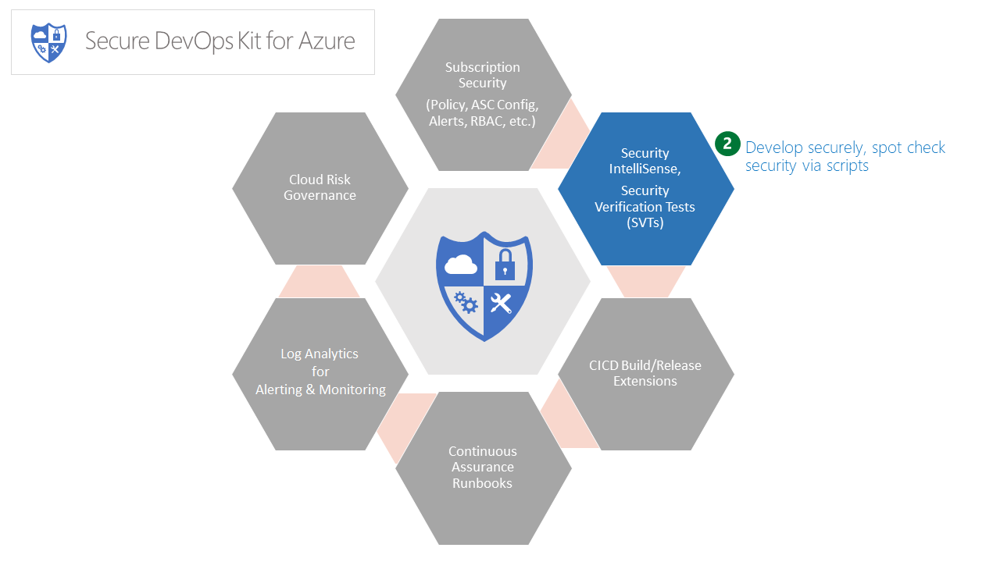
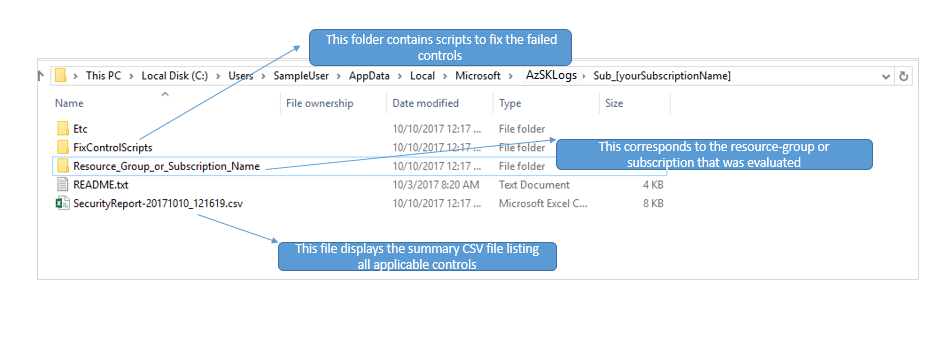
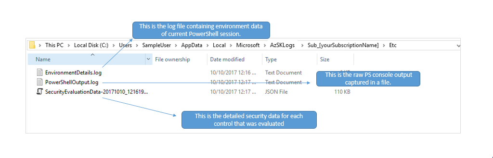

# Secure Development



### Contents
### [Security Verification Tests (SVT)](Readme.md#security-verification-tests-svt-1)

- [Overview](Readme.md#overview)
- [Execute SVTs for all controls in all resources in a given subscription](Readme.md#execute-svts-for-all-controls-of-all-resources-in-a-given-subscription)
- [Execute SVTs for specific resource groups (or tagged resources)](Readme.md#execute-svts-for-specific-resource-groups-or-tagged-resources)
- [Execute SVTs for a specific resource](Readme.md#execute-svts-for-a-specific-resource)
- [Execute SVTs for a specific resource type](Readme.md#execute-svts-for-a-specific-resource-type)
- [Execute SVTs in Baseline mode](Readme.md#execute-svts-in-baseline-mode) 
- [Execute SVTs using "-UsePartialCommits" switch](Readme.md#execute-svts-using--usepartialcommits-switch)
- [Understand the scan reports](Readme.md#understand-the-scan-reports)
- [Generate output report in PDF format](Readme.md#generate-output-report-in-pdf-format)
- [FAQs](Readme.md#faqs)

### [Express Route-connected Virtual Networks (ER-vNet)](Readme.md#express-route-connected-virtual-networks-er-vnet-1)

### [Security IntelliSense (Dev-SecIntel)](Readme.md#security-intellisense-dev-secintel-1)
#### [Basics](Readme.md#basics-1)
- [What is Security IntelliSense?](Readme.md#what-is-security-intellisense)
- [How do I enable Security IntelliSense on my dev box?](Readme.md#how-do-i-enable-security-intellisense-on-my-dev-box)
- [Is there a sample I can use to see how it works?](Readme.md#is-there-a-sample-i-can-use-to-see-how-it-works)

#### [Rules](Readme.md#rules)
- [What 'secure coding' rules are currently covered?](Readme.md#what-secure-coding-rules-are-currently-covered)
- [How are the rules updated? Do I need to refresh the plugin periodically?](Readme.md#how-are-the-rules-updated-do-i-need-to-refresh-the-plugin-periodically)
- [Can I add my own rules over and above the default set?](Readme.md#can-i-add-my-own-rules-over-and-above-the-default-set)
- [Can I 'mask' a particular rule or rules?](Readme.md#can-i-mask-a-particular-rule-or-rules)
- [Can I change the 'recommended' code for a rule?](Readme.md#can-i-change-the-recommended-code-for-a-rule-eg-i-want-to-recommend-gcm-instead-of-cbc-mode)

#### [Actions](Readme.md#actions-1)
- [What should I do to remove the extension?](Readme.md#what-should-i-do-to-remove-the-extension)
- [What default compiler actions are configured?](Readme.md#what-default-compiler-actions-are-configured)
- [Can I customize actions for my dev box / team? (E.g. change Error -> Warnings etc.)](Readme.md#can-i-customize-actions-for-my-dev-box--team-eg-change-error---warnings-etc)

-----------------------------------------------------------------
## Security Verification Tests (SVT)
>  **Prerequisites:**
> For all commands in this feature it is assumed that you have:
> 1. Logged in to your Azure account using Login-AzureRmAccount from a PowerShell ISE.
> 2. Selected a subscription using Set-AzureRmContext.


### Overview
Security Verifications Tests (or SVTs) represent the core of security testing functionality of the 
AzSK. For all the prominent features in Azure (e.g., Web Apps, Storage, SQL DB, Key Vault, etc.), 
the AzSK ccan perform automated security checks against Azure resources of those types. 
These checks are based on security standards and best practices as applicable for sensitive corporate 
data at Microsoft. In general, these are likely to be applicable for most scenarios that involve 
processing sensitive data in other environments.

An SVT for a particular resource type basically examines a resource of that type within a specified 
resource group and runs a set of security control checks pertinent to that resource type. 
The outcome of the analysis is printed on the console during SVT execution and a CSV and a LOG file are 
also generated for subsequent use.

The CSV file and LOG file are generated under a subscription-specific sub-folder in the folder  
*%LOCALAPPDATA%\Microsoft\AzSKLogs\Sub_[yourSubscriptionName]*  
E.g.  
C:\Users\UserName\AppData\Local\Microsoft\AzSKLogs\Sub_[yourSubscriptionName]\20170331_142819

There are multiple ways that SVTs can be executed:
1. Scan all resources in a subscription. This is the simplest approach and simply enumerates 
all resources in a specific subscription and runs security checks against all the known resource 
types found.
2. Scan all resources in specific resource group(s). In this option, you can target resources
within one or more resource group. The AzSK simply enumerates all resources in the resource group(s) 
and runs security checks..
3. Scan a specific resource. In this approach, you can target a specific (individual) resource.
4. Scan a specific resource type. In this approach, you can target a specific resource type (e.g., Storage)
by specifying the 'resource type' value.
	
These options are described with examples below.  

[Back to top…](Readme.md#contents)

### Execute SVTs for all controls of all resources in a given subscription
The cmdlet below checks security control state and generates a status report of all Azure resources 
in a given subscription:  

```PowerShell
Get-AzSKAzureServicesSecurityStatus -SubscriptionId <SubscriptionId>
```
		
The parameters required are:
- SubscriptionId – Subscription ID is the identifier of your Azure subscription.  

>**Note** Although this command is simple, it may take time proportionate to the number of 
>resources in your subscription and may not be ideal for 'shared' subscriptions. Typically, 
>you would want to scan a specific application (organized under one or more resource groups or 
>using tags). The subsequent options provide ability to narrow down the scope of the scan.
    
[Back to top…](Readme.md#contents)  
### Execute SVTs for specific resource groups (or tagged resources) 
The cmdlet below scans all Azure resources in the specified resource groups within a subscription and 
generates a status report:
```PowerShell
Get-AzSKAzureServicesSecurityStatus -SubscriptionId <SubscriptionId> -ResourceGroupNames <ResourceGroupNames>
```
	
The parameters required are:
- SubscriptionId – Subscription ID is the identifier of your Azure subscription. 
- ResourceGroupNames – Comma separated list of resource groups that hold related resources for an Azure subscription.
	
The cmdlet below scans all resources with specific tag names/values under a given subscription:  
1. Single Tag
```PowerShell
    Get-AzSKAzureServicesSecurityStatus -SubscriptionId <SubscriptionId> -TagName <TagName> -TagValue <TagValue>
```
		
2. Multiple Tags
```PowerShell
    Get-AzSKAzureServicesSecurityStatus -SubscriptionId <SubscriptionId> -Tag <TagHashset>
```
		
The parameters required are:
- SubscriptionId – Subscription ID is the identifier of your Azure subscription. 
- TagName – Key to identify the resources.
- TagValue – Value to identify the resources.
- Tag – The tag filter for Azure resource. The expected format is @{tagName1=$null} or @{tagName = 'tagValue'; tagName2='value1'}.  

[Back to top…](Readme.md#contents)
### Execute SVTs for a specific resource
The cmdlet below scans a single Azure resource within a specific resource group in a subscription and generates a status report:
```PowerShell
Get-AzSKAzureServicesSecurityStatus -SubscriptionId <SubscriptionId> -ResourceGroupNames <ResourceGroupNames> -ResourceName <ResourceName>
```
	
The parameters required are:
- SubscriptionId – Subscription ID is the identifier of your Azure subscription. 
- ResourceGroupNames – Name of the resource group that holds the individual resource to be scanned.
- ResourceName – Name of the resource. 

> **Note**: In the command above, 'ResourceName' should be the short name as used in Azure 
> and shown in the portal (as opposed to the fully qualified domain name (FQDN) which may 
> apply to some resource types such as storage blobs or SQL DB).  

[Back to top…](Readme.md#contents)
### Execute SVTs for a specific resource type
The cmdlet below scans all resources for a specific Azure resource type in a subscription (and a resource group [optional]):
1. 	Using Azure resource type
```PowerShell
 Get-AzSKAzureServicesSecurityStatus -SubscriptionId <SubscriptionId> [-ResourceGroupNames <ResourceGroupNames>] -ResourceType <ResourceType>
```
		
The parameters required are:
- SubscriptionId – Subscription ID is the identifier of your Azure subscription. 
- [Optional] ResourceGroupNames  – Name of the container that holds related resource under an Azure subscription. Comma separated values are allowed.
- ResourceType – Resource type as defined by Azure. E.g.: Microsoft.KeyVault/vaults. Run command 'Get-AzSKSupportedResourceTypes' to get the list of supported types.

2. Using a user-friendly resource type name
```PowerShell
 Get-AzSKAzureServicesSecurityStatus -SubscriptionId <SubscriptionId> [-ResourceGroupNames <ResourceGroupNames>] -ResourceTypeName <ResourceTypeName>
```
	
The parameters required are:
- SubscriptionId – Subscription ID is the identifier of your Azure subscription. 
- [Optional] ResourceGroupNames – Name of the container that holds related resource under an Azure subscription. Comma separated values are allowed.
- ResourceTypeName – Friendly name of resource type. E.g.: KeyVault. Run command 'Get-AzSKSupportedResourceTypes' to get the list of supported values.  

[Back to top…](Readme.md#contents)

### Execute SVTs in Baseline mode 
In 'baseline mode' a centrally defined 'control baseline' is used as the target control set for scanning.
The cmdlet below scans azure resources in a subscription in Baseline mode and generates a status report:
```PowerShell
Get-AzSKAzureServicesSecurityStatus -SubscriptionId <SubscriptionId> -UseBaselineControls
```
	
The parameters required are:
- SubscriptionId – Subscription ID is the identifier of your Azure subscription. 
- UseBaselineControls – UseBaselineControls is the flag used to enable scanning of resources in Baseline mode.

[Back to top…](Readme.md#contents)

### Execute SVTs using "-UsePartialCommits" switch
The Get-AzSKAzureServicesSecurityStatus command now supports checkpointing via a "-UsePartialCommits" switch. When this switch is used, the command periodically persists scan progress to disk. That way, if the scan is interrupted or an error occurs, a future retry can resume from the last saved state. This capability also helps in Continuous Assurance scans where Azure currently suspends 'long running' automation jobs by default.The cmdlet below checks security control state via a "-UsePartialCommits" switch:  

```PowerShell
Get-AzSKAzureServicesSecurityStatus -SubscriptionId <SubscriptionId> -UsePartialCommits
```
		
[Back to top…](Readme.md#contents)

### Understand the scan reports
Each AzSK cmdlet writes output to a folder whose location is determined as below:
- AzSK-Root-Output-Folder = %LocalAppData%\Microsoft\AzSKLogs  
	```
	E.g., "C:\Users\userName\AppData\Local\Microsoft\AzSKLogs"
	```
- Sub-Folder = Sub_\<Subscription Name>\\\<Timestamp>_\<CommandAbbreviation>  
	```
	E.g., "Sub_[yourSubscriptionName]\20170321_183800_GSS"  
	```	
Thus, the full path to an output folder might look like:  
```
E.g., "C:\Users\userName\AppData\Local\Microsoft\AzSKLogs\Sub_[yourSubscriptionName]\20170321_183800_GSS\
```
	
> **Note**: By default, cmdlets open this folder upon completion of the cmdlet (we assume you'd be interested in examining the control evaluation status, etc.)

The contents of the output folder are organized as under:  


- *\SecurityReport-\<timestamp>.csv*- This is the summary CSV file listing all applicable controls and their evaluation status. This file will be generated only for SVT cmdlets like Get-AzSKAzureServicesSecurityStatus, Get-AzSKSubscriptionSecurityStatus etc.  
- *\\\<Resource_Group_or_Subscription_Name>* - This corresponds to the resource-group or subscription that was evaluated  
	- *\\\<resourceType>.log*- This is the detailed/raw output log of controls evaluated  
- *\Etc*  
	- *\PowerShellOutput.log* - This is the raw PS console output captured in a file.  
	- *\EnvironmentDetails.log* - This is the log file containing environment data of current PowerShell session.  
	- *\SecurityEvaluationData.json* - This is the detailed security data for each control that was evaluated. This file will be generated only for SVT cmdlets like Get-AzSKAzureServicesSecurityStatus, Get-AzSKSubscriptionSecurityStatus etc.
	
- *\FixControlScripts* - This folder contains scripts to fix the failed controls. The folder is generated only when 'GenerateFixScript' switch is passed and one or more failed controls support automated fixing.  
	- *\README.txt* - This is the help file which describes about the 'FixControlScripts' folder.

You can use these outputs as follows - 
1. The SecurityReport.CSV file provides a quick glimpse of the control results. Investigate those that say 'Verify' or 'Failed'.  
2. For 'Failed' or 'Verify' controls, look in the <resourceType>.LOG file (search for 'failed' or by control-id). Understand what caused the control the fail.
3. For 'Verify' controls, you will also find the SecurityEvaluationData.JSON file handy. 
4. For some controls, you can also use the 'Recommendation' field in the control output to get the PS command you may need to use.
5. Make any changes to the subscription/resource configurations based on steps 2, 3 and 4. 
6. Rerun the cmdlet and verify that the controls you tried to fix are passing now.

[Back to top…](Readme.md#contents)

### Generate output report in PDF format
The Get-AzSKAzureServicesSecurityStatus command now supports generating output report in PDF format using "-GeneratePDF" parameter. You can use this parameter to generate output logs in PDF format. You can use this parameter to generate report either in 'portrait'or 'landscape mode'.The cmdlet below can be used to generate PDF report:  

```PowerShell
Get-AzSKAzureServicesSecurityStatus -SubscriptionId <SubscriptionId> -GeneratePDF <PdfOrientation>
```
		
The parameters required are:
- SubscriptionId – Subscription ID is the identifier of your Azure subscription.  
- GeneratePDF - This accepts either 'None', 'Portrait' or 'Landscape' as inputs.

If you execute SVTs using above command, a new PDF file with name 'SecurityReport' will get generated in the root output logs folder.

The PDF report consists of following sections:
- *Basic Details* - It consists of basic details like subscription id, name, AzSK Version, Date of generation, user, command executed etc.
- *Security Report Summary* -It displays the security status of all the controls Ids which gets scanned.
- *Powershell Output* -It displays the raw PS console output captured during execution of SVTs.
- *Detailed Output* -It displays the detailed/raw output log of controls evaluated.

[Back to top…](Readme.md#contents)


### FAQs
#### What Azure resource types that can be checked?

Below resource types can be checked for validating the security controls 

| Resource Name |Resource Type Name	|Resource Type|
|-------| ------------- | ----------- |
|Analysis Services |AnalysisService |Microsoft.AnalysisServices/servers|
|API Connection|APIConnection|Microsoft.Web/connections|
|App Services|AppService |Microsoft.Web/sites|
|Automation Acocunt|Automation|Microsoft.Automation/automationAccounts|
|Batch accounts |Batch |Microsoft.Batch/batchAccounts|
|CDN profiles |CDN |Microsoft.Cdn/profiles|
|Cloud Services|CloudService |Microsoft.ClassicCompute/domainNames|
|Cosmos DB|Cosmos DB|Microsoft.DocumentDb/databaseAccounts|
|Data Factories |DataFactory |Microsoft.DataFactory/dataFactories|
|Data Lake Analytics|DataLakeAnalytics |Microsoft.DataLakeAnalytics/accounts|
|Data Lake Store|DataLakeStore |Microsoft.DataLakeStore/accounts|
|Express Route-connected Virtual Networks|ERvNet |Microsoft.Network/virtualNetworks|
|Event Hubs|EventHub |Microsoft.Eventhub/namespaces|
|Key Vaults|KeyVault |Microsoft.KeyVault/vaults|
|Load Balancer|LoadBalancer|Microsoft.Network/loadBalancers|
|Logic Apps|LogicApps |Microsoft.Logic/Workflows|
|Notification Hubs|NotificationHub |Microsoft.NotificationHubs/namespaces/notificationHubs|
|On-premises Data Gateways |ODG |Microsoft.Web/connectionGateways|
|Redis Caches |RedisCache |Microsoft.Cache/Redis|
|Search services |Search |Microsoft.Search/searchServices|
|Service Bus |ServiceBus |Microsoft.ServiceBus/namespaces|
|Service Fabric clusters |ServiceFabric |Microsoft.ServiceFabric/clusters|
|SQL Databases|SQLDatabase |Microsoft.Sql/servers|
|Storage Accounts|StorageAccount |Microsoft.Storage/storageAccounts|
|Stream Analytics|StreamAnalytics|Microsoft.StreamAnalytics/streamingjobs|
|Traffic Manager profiles |TrafficManager |Microsoft.Network/trafficmanagerprofiles|
|Virtual Machines|VirtualMachine |Microsoft.Compute/virtualMachines|
|Virtual Networks|VirtualNetwork |Microsoft.Network/virtualNetworks|

This list continues to grow so best way to confirm is to look at the output of the following command:  
 ```PowerShell  
Get-AzSKSupportedResourceTypes  
 ```    
>  We regularly add SVT coverage for more Azure features. Please write to us (mailto:AzSDKSupExt@microsoft.com) if you are looking for SVTs for a service not listed here.  

#### What do the different columns in the status report mean?
Status report will be in CSV format and will contain below columns 
- ControlID - Unique ID for security control.
- Status – { Passed | Failed | Verify | Manual | Error} 
	-  Passed: The resource complies with the security control.
	-  Failed: The resource does not comply with the security control.
	-  Verify: The status needs to be verified using the data generated by the automated script. This is usually an indication that some level of human judgment is required in order to attest to the control status.
	-  Manual: The control is not automated (yet). It should be manually implemented and/or validated.
	-  Error: An error occurred due to which the control state could not be determined.
- FeatureName - Azure feature name e.g. AzureAppService, AzureSQLDB etc.
- ResourceName - Azure resource name. 
- ChildResourceName - Sub resource name of the Azure resource. E.g. for SQL Server, controls validating the databases will have the resource name as ‘SQLServerName’ and child resource name as 'SQLDBName' whereas features having no sub resources will have same value for resource name and child resource name.
- 	ResourceGroupName - Resource group name for resource name.
- 	ControlType - Control type can be ‘TCP’, ‘Best Practice’ or ‘Information’. 
- 	Automated - Yes or No	    
Note that not all security checks are automatable. The 'non-automated' checks (things that have to be manually validated/checked) are also listed in the reports from a completeness standpoint.
- 	Description - Security control description.
- 	Reference - Link to detailed document/explanation.
- 	Recommendation - Recommended steps to implement a fix for a failed control.  

#### How can I find out what to do for controls that are marked as 'manual'?
Refer the recommendations provided in the output CSV file for the security controls defined by AzSK. You can also email to AzSDKSupExt@microsoft.com or reach out to your security point of contact for any queries.  

#### How can I implement fixes for the failed ones which have no auto-fix available?
Refer the recommendations provided in the output CSV file for the security controls defined by AzSK. You can also email to AzSDKSupExt@microsoft.com or reach out to your security point of contact for any queries.  

#### Troubleshooting
|Error	|Comments|
| ----- |--------|
|Subscription xxxx was not found in tenant. Please verify that the subscription exists in this tenant…."|	Provide the valid Subscription Id to the 'Subscription' parameter while running the cmdlets that accept subscription id as the parameter.|
|File xxxx cannot be loaded because the execution of scripts is disabled on this system… "|	By default, PowerShell restricts execution of all scripts. Execute below cmdlet to fix this issue: **Set-ExecutionPolicy -ExecutionPolicy Unrestricted** |  

[Back to top…](Readme.md#contents)

--------------------------------------
# Express Route-connected Virtual Networks (ER-vNet)


**Summary**  
The following cmdlet can be used to scan the secure configuration of an ExpressRoute-connected virtual network (referred to as ERVnet below):

```PowerShel
 Get-AzSKExpressRouteNetworkSecurityStatus -SubscriptionId <SubscriptionId>
```

This cmdlet assumes that the vNet connected to ExpressRoute circuit is in a ResourceGroup named 'ERNetwork' or 'ERNetwork-DMZ'. 
If you have the vNet in a different resource group then the `-ResourceGroup` parameter can be used.

Just like other SVTs, this will create a summary ".CSV" file of the control evaluation and a detailed
".LOG" file that includes more information about each control and the outcome.

The following core checks are currently performed by this utility:
- There should not be any Public IPs (i.e., NICs with PublicIP) on ER-vNet VMs.
- There should not be multiple NICs on ER-vNet VMs.
- The 'EnableIPForwarding' flag cannot set to true for NICs in the ER-vNet.
- There should not be any NSGs on the GatewaySubnet of the ER-vNet.
- There should not be a UDR on *any* subnet in an ER-vNet
- There should not be another virtual network gateway (GatewayType = Vpn) in an ER-vNet.
- There should not be any virtual network peerings on an ER-vNet.
- Only internal load balancers (ILBs) may be used inside an ER-vNet.

Additionally the following other 'protective' checks are also done: 
- Ensuring that the resource lock that is setup to keep these resources from being deleted is intact.
- Ensuring that the RBAC permissions for the account used to track compliance are intact.
- Setting up alerts to fire for any of the above actions in the subscription.
	
[Back to top…](Readme.md#contents)

# Security IntelliSense (Dev-SecIntel)
--------------------------------------------------------------
> Note: Security IntelliSense extension works on Visual Studio 2015 Update 3 or later and Visual Studio 2017


 
### Basics:

### What is Security IntelliSense?
Security IntelliSense augments standard Visual Studio IntelliSense feature with secure coding knowledge. This makes it possible to get 'inline' assistance for fixing potential security issues while writing code. Code that is vulnerable or not policy compliant is flagged with red or green squiggles based on the level of severity.

In the current drop, we have support for the following features:
- About 80 rules that cover a variety of scenarios such as: 
   - various Azure PaaS API related secure coding rules
   - ADAL-based authentication best practices
   - Common Crypto errors
   - Classic App Sec and Web App Sec issues
- Rule are auto-updated without needing to reinstall the plug-in. The plug-in periodically checks if new rules have been published to a central rule store and updates its local rule set based on that. 

The screenshots below show the core functionality at work:
- Error and warning indications for incorrect and possibly vulnerable code:
	(E.g., use of custom token cache in ADAL scenario)  


- Suggestions for corrections/compliant coding practices:
	(E.g., Instead of Random, the RNGCryptoServiceProvider class should be used in a crypto context.)  
  

[Back to top…](Readme.md#contents)  

### How do I enable Security IntelliSense on my dev box?
- Open Visual Studio 2015

- Go to **Tools** -> **Extensions and Updates** -> In the left sidebar select **Online** -> **Visual Studio Gallery** and search for **Security IntelliSense** in the right sidebar


- Select Security IntelliSense item and click **Download**
- After download completes, in the pop-up click **Install**
- After installation completes, **restart Visual Studio**

[Back to top…](Readme.md#contents)
### Is there a sample I can use to see how it works?
- We have a sample project on GitHub that you can use. Run the command below to clone the repo. 
If you don't have Git setup in your machine, please visit https://git-scm.com/downloads to download it.
	
``` 
    git clone https://github.com/azsk/azsk-secintel-samples.git
```
	
- After cloning the repo, navigate to **azsk-secintel-samples** -> **SecIntelSample** and 
open the **SecIntelSample.sln** in Visual Studio (after completing the Security IntelliSense 
extension installation per steps from above).
- Build the solution (this will fetch any requisite Nuget packages)
- Go to View->Solution Explorer and then open one of demo files (e.g., "CryptoSample.cs") in the VS editor. 
   - You should see SecIntel in action -- i.e., code that is in violation of the rules in use for 
   the SecIntel VSIX plugin will appear as red-squigglies (errors) and green-squigglies (warnings).  
   

- Note: In the currently implemented behavior of the extension, 'errors' don’t actually fail the build. 
We will change this behavior in an upcoming sprint. After that anything that is considered an 'error' will start failing 
the build. This will be a useful feature when integrating with CICD pipelines.

[Back to top…](Readme.md#contents)

### Rules:

### What 'secure coding' rules are currently covered?

The following are some of the rules we support in current build (some are 'warnings' others 'error') -
- Azure:
   - Use of relays without client authentication
   - Creation of shared access policy without enforcing HTTPS explicitly
   - Creation of shared access policy with an overly long expiry period
   -Creation of container with access set to 'Public'
   - Creation of a blob with access set to 'Public'
- ADAL/Graph usage:
   - Use of simple member access as opposed to transitive search
   - Explicit handling of access and refresh tokens as opposed to letting ADAL manage them transparently
   - Disabling 'Authority' validation when fetching a token via ADAL
   - Use of custom mechanisms to cache the tokens (should let ADAL handle them transparently)
- Crypto:
   - Use of Random instead of RNGCryptoServiceProvider class
   - Use of MD5 for hashing instead of SHA256CryptoServiceProvider
   - Use of SHA1 for hashing instead of SHA256CryptoServiceProvider
   - Use of RijndaelManaged instead of AesCryptoServiceProvider
   - Use of key sizes that are considered inadequate
   - Use of X509Certificate2 class (that might lead to a SHA1 based HMAC as opposed to a SHA256-based one).

For a complete list of Security IntelliSense rules please go [here](Security_IntelliSense_rules_list.md)
	
[Back to top…](Readme.md#contents)
### How are the rules updated? Do I need to refresh the plugin periodically?
- Rule are auto-updated without the need to reinstall the plugin. Currently we have 
defined 5 different rule templates upon which individual rules are based. We have the ability to 
deploy new rules that use the existing templates silently in the background. 
- Once in a while we might add entirely new 'rule templates'. When that happens, a new version of 
the extension will need to be downloaded. When that happens will include a notification of the same 
in our release announcements.

[Back to top…](Readme.md#contents)
### Can I add my own rules over and above the default set?
- This will be included in the next month. It is a natural extension of the current behavior. We 
will merely need to include support for a locally managed rules file which has rules that adhere to 
the supported rule templates.

[Back to top…](Readme.md#contents)

### Can I 'mask' a particular rule or rules?
- This is in our backlog. We will add it in a future sprint.

[Back to top…](Readme.md#contents)
### Can I change the 'recommended' code for a rule? (e.g., I want to recommend GCM instead of CBC mode)
- This is in our backlog. We will add it in a future sprint.

[Back to top…](Readme.md#contents)

### Actions:
### What should I do to remove the extension?
-  Go to "Tools" -> "Extensions and Updates" menu option in Visual Studio and search for "Security".
   - If you have the extension installed, you will see a screen such as below with options to 
   "Disable" or "Uninstall" the extension.
- Click "Uninstall" and restart Visual Studio.
  

[Back to top…](Readme.md#contents)
### What default compiler actions are configured?
- Most of the rules configured are of severity "Warning"

[Back to top…](Readme.md#contents)
### Can I customize actions for my dev box / team? (E.g. change Error -> Warnings etc.)
- Currently we do not support it. We have it in our pipeline to support it.  

[Back to top…](Readme.md#contents)
