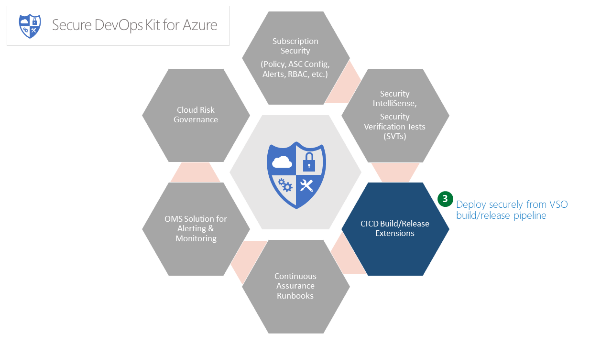
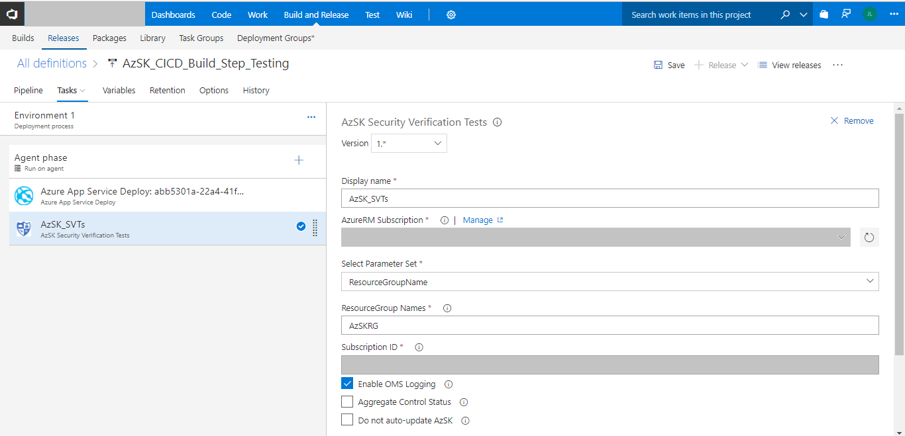
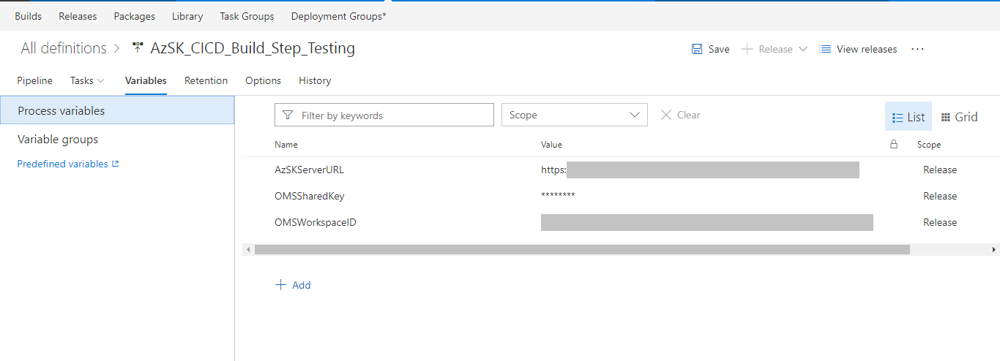
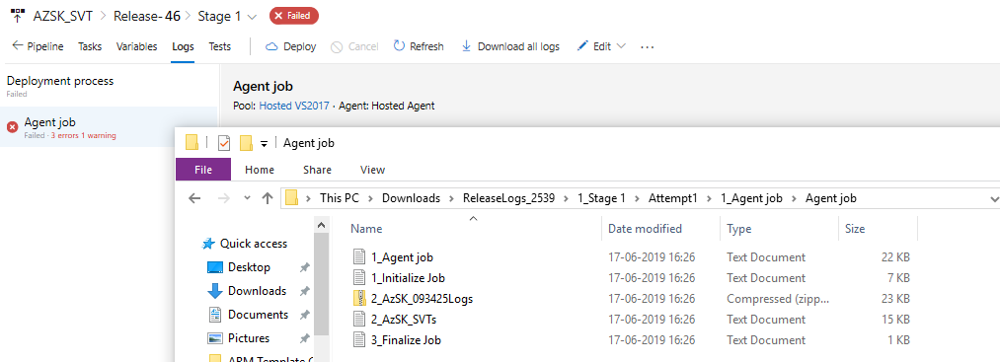
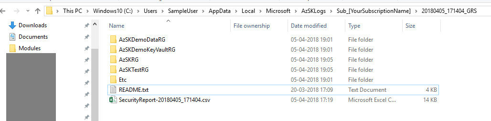

# Security Verification Tests (SVTs)

 
## Contents
- [Overview](Readme.md#overview) 
## [Security Verification Tests (SVTs) in VSTS pipeline](Readme.md#security-verification-tests-svts-in-VSTS-pipeline)
- [Enable AzSK extension for your VSTS](Readme.md#enable-azsk-extension-for-your-vsts)
- [Walkthrough](Readme.md#walkthrough)
  - [Adding SVTs in the release pipeline](Readme.md#adding-svts-in-the-release-pipeline)
  - [Verifying that SVTs have been added and configured correctly](Readme.md#verifying-that-the-svts-have-been-added-and-configured-correctly)
- [Advanced CICD scanning capabilities](Readme.md#advanced-cicd-scanning-capabilities) 
- [FAQs](Readme.md#faqs)  

## [Security Verification Tests (SVTs) in Jenkins pipeline (Preview)](Readme.md#security-verification-tests-svts-in-jenkins-pipeline-preview-1)
- [Enable AzSDK extension for your Jenkins](Readme.md#enable-azsdk-extension-for-your-jenkins)
- [Walkthrough](Readme.md#walkthrough-1)
  - [Adding SVTs in the Jenkins pipeline](Readme.md#adding-svts-in-the-jenkins-pipeline)
  - [Verifying that SVTs have been added and configured correctly](Readme.md#verifying-that-the-svts-have-been-added-and-configured-correctly-1)
- [Remediating Failures and Next Steps](Readme.md#remediating-failures-and-next-steps)
------------------------------------------------------------------
### Overview 
The AzSK contains Security Verification Tests (SVTs) for multiple PaaS and IaaS services of the Azure platform. 
As we have seen so far, these SVTs can be manually run against one or more target resources held in 
resource groups or tagged via a {tagName, tagValue} pair.

While it is invaluable to run these SVTs periodically from a PS console (to ensure that the subscription and 
the different resources that comprise your application are in a secure state), a key aspect of dev ops is 
to be able to automate such tests and integrate them as part of the dev ops workflows and release pipelines.
In other words, while checking that SVTs pass in an ad hoc manner is a good practice, it is important
to be able to also ensure that security control configuration remains intact in higher environments.

The CICD extensions feature of AzSK makes automated security configuration enforcement possible by 
making SVTs available as a Visual Studio Extension in the Marketplace so that engineering teams can run 
them within build/release pipeline. Once the build/release 
task is configured, SVTs run against a target deployment in an Azure subscription. Upon completion, 
SVTs will report the pass/fail status for controls along with aggregate control results. Hereafter, all the different 
'out-of-box' build/release workflow options from the CICD engine (e.g., VSTS)  can be used as 'next steps' based on 
the outcomes of SVTs. (For instance, one can decide whether to fail the release outright or to continue 
despite failures while sending an email to the build/release owners or to hold progress until someone 
manually approves, etc. Furthermore, if all SVTs pass in the pre-prod environment, then a release can 
be 'promoted' to prod.) 

Outcomes of the SVT execution can also be routed to an OMS workspace configured to receive various events 
generated by the AzSK.

[Back to top...](Readme.md#contents)

# Security Verification Tests (SVTs) in VSTS pipeline

### Enable AzSK extension for your VSTS

This extesion has been published to the VSTS gallery under "Build and Release" category. 
You can now install this extension from the Marketplace directly (https://marketplace.visualstudio.com/items?itemName=azsdktm.AzSDK-task).
> **Note:** You can also install this extension on your on-prem TFS instance. Please follow the instructions detailed at:
> https://docs.microsoft.com/en-us/vsts/marketplace/get-tfs-extensions

### Walkthrough
This part assumes that you are familiar with VS build tasks and pipelines at a basic level. To demonstrate 
the capability of the feature, we will use a basic MVC Web App that is checked into our trial repository. 
Our goal is to show how SVTs can be injected into the build/release workflow so that security testing for 
Azure subscription and resources is seamlessly integrated into CICD.  

[Back to top...](Readme.md#contents)
### Adding SVTs in the release pipeline

**Step-1:** Create a release definition or open an existing one.  
<!-- #TODO# make this end-to-end with AzSKDemoApp in GitHub etc -->
(Note: Here we will edit "AzSKDemoApp_SVTs_Rel3" which is part of our test instance of VSTS.
We also have a default build definition upstream to this which is not shown here as that is a pretty 
standard web app build flow using an MSBuild task.)  

As shown below, currently the release definition is configured to simply deploy a web app upon building 
it to a particular app service at the given URL. This is likely to be the state of any working CICD
pipeline that builds and deploys a web app (or App Service) from VSTS to an Azure subscription. 

Let us take a look at the steps needed to add the AzSK-SVT task to the release definition.

**Step-2:** Add the AzSK-SVT release task to the pipeline.  
Click on "Add Tasks", and select "AzSK Security Verification Test".  

  
Click on "Add" and "Close". 

> **Note:** The VSTS dialog doesn't provide a good visual indication but the task does 
get added when you click "Add" once!

**Step-3:** Specify the input parameters for the SVT task.  
The "AzSK_SVTs" task starts showing in the "Run on Agent" list and displays some configuration inputs 
that are required for the task to run. These are none other than the familiar options we have been specifying 
while running the AzSK SVTs manually - you can choose to specify the target resource group(s) or 
a {tagname, tagvalue} pair based on how your application's resources are organized.  
When the pipeline executes, SVTs will scan the specified set of resources.

Along with input parameter, you can check for below options
 **Enable OMS Logging:** Switch to enable this task to publish SVT evalution results to an OMS workspace. Steps to configure OMS credential are explained in Step-4
 **Aggregate Control Status:** Switch to aggregate the SVTs control output. When this is turned off it would show all the failed individual controls in the task summary output.
 **Do not auto-update AzSK:** Switch to toggle auto update of AzSK and required AzureRM modules on the build server. Keep this un-checked for Hosted agent and Hosted VS2017 and while using SVT task fot the first time and if you want to update AZSK the version of AzSK. 

**Step-4:** (Optional) Setup connectivity from CICD to OMS.  
> **Note:** You can skip this step in a first pass exploration of CICD integration of SVTs. 

This feature enables you to route the control scan results from SVTs in CICD pipelines to an OMS workspace.
Configuring an OMS workspace for the AzSK_SVTs task basically enables monitoring capability for 
build environments. Each time SVTs run in CICD, the AzSK events generated will be sent to 
the OMS repository and become available for subsequent queries, actions, alerts, etc. in the OMS workspace.
(The AzSK includes an OMS solution that can be used to create a 'single dashboard' view of security 
for one or more applications across multiple dev ops stages.)  
  
Below, we have added config info of a trial OMS workspace used by the AzSK team. You should choose your 
own target OMS workspace and the corresponding resource group instead. (You can use Get-AzureRmOperationalInsightsWorkspace 
cmdlet to quickly find out the resource group corresponding to your OMS workspace. If you do not know your
app's OMS workspace, you should check with your monitoring lead. Else you can create a trial workspace with
the 'Free' tier option.)   
  
The OMS workspace information may be provided using one of the two options below:  
**Option-1:** Use a 'variable group'  
In this option, a single variable group may be defined at the VSTS level to represent the OMS workspace 
that a collection of projects want to share. This variable group may be 'linked' from the individual 
build/release definitions across these projects. The benefit is that, in the future, if a key value changes, 
you just have to make that change in one place and all definitions will immediately reflect the change.

The images below show this option. It involves 2 steps:  
1. 	 Create a variable group that holds the OMS info (if one doesn't exist for your org) 
2. 	 Link that variable group to your project's release definition

The variable group name can be a unique name you can choose (and specify in the release task definition). 
The specific variable names for workspace ID and shared key have to be exactly as shown below. The values 
of these should correspond the corresponding info for your OMS workspace.  
  
Creating the variable group:

Linking to the release definition:

> **Note:** Variable groups can only be modified or added from the Library under VSTS instance.

**Option-2:** Directly use variables in individual build definitions.
 

Important: Ensure that the variable names used are exactly as above and the values correspond 
to *your* OMS workspace. Moreover, when you specify the OMS shared key, click on the 'lock' icon 
next to it so that it gets masked.

**Step-5:** Setup Online Policy URL  
(You may skip this step in a first-pass exploration of CICD integration of SVTs and come back to it later when setting the extension up for a real project.) 
This feature enables you to set up the CICD task to use your organization's AzSK policies. 
To use org-specific policies, you can get your org-specific url by (a) running Get-AzSKInfo -InfoType HostInfo and looking at the value of OnlinePolicyStoreUrl or (b) getting it from the AzSKSettings.json file on your machine under 'C:\Users\<userName>\AppData\Local\Microsoft\AzSK' folder.

Below, we have added configuration info of 'AzSKServerURL' used by the AzSK team. The URL at your org can be different assuming there is an org-policy setup unique to your org.  

The online policy URL can be configured for the CICD extension using one of the two options below:  

**Option-1**: Use a 'variable group'  
In this option, a single variable group may be defined at a VSTS level to represent the Policy URL that 
a collection of projects want to share. This variable group may be 'linked' from the individual 
build/release definitions across these projects. The benefit is that, in future, if a value changes, 
you just have to make that change in one place and all definitions will immediately reflect the change.  

The images below show this option. It involves 2 steps:  
1. Create a variable group that holds the URL info (if one doesn't exist for your org) 
2. Link that variable group to your project's release definition

The variable group name can be a unique name you can choose (and specify in the release task definition). 
The specific variable name for Policy URL  has to be exactly as shown below. 
  
Creating the variable group:  
    

Linking to the release definition:    
 
> Note: Variable groups can only be modified or added from the Library under VSO instance.

**Option-2**: Directly use variables in individual build definitions.  
    

**Step-6**: Save the Release Definition.
  
  

[Back to top...](Readme.md#contents)
### Verifying that the SVTs have been added and configured correctly
**Step-1:** Start the release pipeline. 
This can be done by adding a new release for an existing build (or trigger a new release via a minor/trial 
check-in). 

**Step-2:** Verify that the release pipeline has started. 
Once the release is triggered, we can see that it is in progress by clicking on "Releases" (or via 
"Build & Release" menu in the VSTS menu).

**Step-3:** View the release outcome.  
In a few minutes the release pipeline should complete and we can view the outcomes as shown below (in the 
pic below we can see that the release pipeline has failed):

**Step-4:** Look at the "Issues" to see why the release failed.  
The summary output shows the cause of failure (in this case it is because the AzSK SVTs have failed).

**Step-5:** Look at the complete output log of the AzSK portion of the release pipeline execution . 
Clicking on the "Security controls are failing" text (in the pic above) and, further, clicking on 
the "AzSK_SVTs" link (in the pic below) will show the details about the SVT execution and failures. 
Notice how the output is the same as what is displayed when SVTs are manually run in a PS console!
Essentially, the AzSK_SVTs extension gives us the capability to mirror the secure configuration state
that was established during the development/prototyping phases.

**Step-6:** See the summary "CSV" and detailed "LOG" output files for the AzSK SVTs.  
This is no different than the "ad hoc SVT run" scenarios. Note, above, how the SVT outputs the location 
of the "CSV" file and the "LOG" file at the end of the run. However, those locations are on the release 
agent machine. These are also packaged up in an overall ZIP file and are available to download. The 
overall ZIP file can be downloaded by clicking on the "Download all logs as ZIP" option.  
The ZIP file "ReleaseLogs_dd.zip" contains LOGs from the entire release pipeline including the master 
output for the AzSK_SVTs. The CSV file and the LOG file for AzSK SVTs are embedded in the 'inner' ZIP 
file that is named according to the parameterSet chosen to run the SVTs (in the pic below the ZIP file 
is named by the target resource group that we used 'mptestrg').

 

Opening/extracting the "AzSK_Logs" ZIP file will reveal a folder structure and files placement identical to 
what we have seen in the case of ad hoc SVT runs:

[Back to top...](Readme.md#contents)

### Advanced CICD scanning capabilities
DevOps kit CICD extension enables you to leverage all the advance capabilities of toolkit while running in adhoc mode.
You could scan for specific controlIds in your build pipeline, or you could just scan for specific resources,
or you could also run a specific version of kit etc.
These advance features are available to customers through VSTS variables. Table below provide the different variables 
that are supported by the VSTS task:

|Variable Name| Usage| Examples|
|-------------|------|---------|
|OMSWorkspaceID| Log analytics workspace to continuously monitor progressive release/deployment health| e.g. c18xxxxx-xxxx-abcd-efgh-12345613489c Refer to step-4 in the above section|
|OMSSharedKey| Log analytics workspace sharedkey for extension to push the scan results from CICD| Refer step-4 from the above section for detail steps|
|AzSKServerURL| Org policy url for hosting the central policy configuration| Refer step-5 from the above section for detail steps |
|EnableServerAuth| Specifies whether Org policy URL (AzSKServerURL) is protected by AAD authentication.| e.g. true - protected by AAD authentication, false - not protected by AAD authentication|
|AzSKVersion| You could specify which version of toolkit you want to use in your CICD scan. And version specified should be >= N-2 where N is latest prod version. If variable is not provided, it uses the latest version available| e.g. 2.8.1|
|AzSKModuleName| This variable enable use to participate in the Preview testing. If you want to participate in preview, Provide the module name as "AzSKPreview". If not used, it would by default uses AzSK as module name| e.g. AzSKPreview|
|ExtendedCommand| Enables you to provide other switches supported by the Get-AzSKAzureServicesSecurityStatus command to perform focused scanning in the CICD pipeline | e.g. -ControlIds "Azure_Storage_DP_Encrypt_In_Transit, Azure_Storage_DP_Encrypt_At_Rest_Blob" or -UseBaselineControls|

[Back to top...](Readme.md#contents)

### FAQs
#### I have enabled AzSK_SVTs task in my release pipeline. I am getting an error ‘The specified module 'AzSK' was not loaded because no valid module file was found in any module directory’. How do I resolve this issue?
- Go to ‘AzSK_SVTs’ task in your release definition.
- Make sure that the check box  ‘Do not auto-update AzSK’ is unchecked. This will ensure to run the AzSK scan using the latest module from PS Gallery.

This error typically occurs when AzSK scan identifies non-compatible AzureRm and AzSK modules present on the machine and tries to install the latest ones. 
 
#### I have enabled AzSK_SVTs task in my release pipeline. It is taking too much time every time I queue a release, how can I reduce that time?
- Go to ‘AzSK_SVTs’ task in your release definition.
- Mark the check box ‘Do not auto-update AzSK’ as checked. 
- This will help you save some time by not re-installing the AzSK from scratch in every run. This will skip the module check from PS Gallery and continue to use the installed modules for scan.
> **Note:** For Non-Hosted agent, it is always recommended to check if latest AzSK module is present on your machine before marking 'Do not auto-update AzSK' CheckBox as checked, since scan should always use latest AzSK module.  
> **Note:** You will need to keep the above checkbox unchecked if you are running the AzSK_SVTs task on any release agent for the first time OR you are running the task on Hosted VS2017 agent OR if non-hosted agent is already running on latest version.

[Back to top...](Readme.md#contents)

# Security Verification Tests (SVTs) in Jenkins pipeline (Preview)
	
> Note : AzSDK plugin requires PowerShell to be present on Jenkins Server. Therefore, the plugin is currently supported for Windows machines only.	

### Enable AzSDK extension for your Jenkins
	
Currently AzSDK CICD extension/plugin has not been published on Jenkins repository, However you can use Jenkins Web UI to upload this plugin([AzSDK_CICD_Jenkins_Plugin.hpi](Assets/AzSDK_CICD_Jenkins_Plugin.hpi) file) to Jenkins or place it in '$JENKINS_HOME/plugins' location.
	
**Step to upload plugin using Jenkins Web UI**
	
 Go to Home Page --> Manage Jenkins --> Manage plugins -->  Select Advanced --> Upload plugin file "[AzSDK_CICD_Jenkins_Plugin.hpi](Assets/AzSDK_CICD_Jenkins_Plugin.hpi)"

  
 

  Plugin is successfully imported. Now let's use plugin to scan Azure Resources.  

[Back to top...](Readme.md#contents)

### Walkthrough
This part assumes that you are familiar with Jenkins pipeline at a basic level. To explore more on Jenkins, refer: [article](https://jenkins.io/doc/).

### Adding SVTs in the Jenkins pipeline
	
- #### Step-1: Configure Service Principal (SPN) credentials
	To run the SVT, AzSK need SPN/application which has reader on resource group.
	To set up an identity for the app(i.e. SPN) and assign reader role on resource group, refer: [article](https://docs.microsoft.com/en-us/azure/azure-resource-manager/resource-group-create-service-principal-portal).  
	You can configure details of SPN using below steps under Jenkins Global Credentials 
    1. Go to Home Page -->  Credentials --> System --> Global Credentials  --> Click on "Add Credentials" --> Select credential type "Microsoft Azure Service Principal"
    2. Fill out the details Subscription Id, Client ID, Client	Secret, OAuth 2.0 Token Endpoint and ID.
    3. Click on "Verify Service Principal" to validate SPN details are correct 
    4. Click Ok.
	
- #### Step-2: Create a Jenkins Job or open an existing one.
		
	Refer to this [article](https://www.tutorialspoint.com/jenkins/jenkins_setup_build_jobs.htm) to create sample build job
	
- #### Step-3: Add the AzSK-SVT build step to the pipeline.
	
	 Click on  "Add build step" and select "AzSK Security Verification Tests".

 
	  

- #### Step-4: Specify the input parameters for the SVT step.
	Step displays some configuration inputs that are required for the task to run. Specify SPN credentials id as configured in Step-1. Remaining inputs are none other than the familiar options we have been specifying while running the AzSK SVTs manually. When the pipeline executes, SVTs will scan the specified set of resources.  
 
		
- #### Step-5: (Optional) Setup connectivity from CICD to OMS.
	 You can also configure build to send runtime security evaluation results to OMS workspace. For that configure OMS credetial using below steps:
	- For adding OMS workspace credentials  
		Go to Home Page -->  Credentials --> System --> Global credentials  --> Click on "Add Credentials" --> Select credential type "OMS Details"  
		Provide OMS details and click Ok
		
   
  	  

	- Provide OMS Credentials Id in build step  

  		
- #### Step-6: Save the Job 

	
[Back to top...](Readme.md#contents)
### Verifying that the SVTs have been added and configured correctly
- #### Step-1: Trigger the build.

	  
- #### Step-2: Verify that the build has started.

		  
- #### Step-3: View the 'Console Output'.

		  
- #### Step-4: See the summary "CSV" and detailed "LOG" output files for the AzSK SVTs.

	This is no different than the "ad hoc SVT run" scenarios. SVT outputs the location 
	of the "CSV" file and the "LOG" file at the end of the run.
	
	 
[Back to top...](Readme.md#contents)
> 	Note :
> 	- Currently task is configured to not stop if SVT fails.

### Remediating failures and next steps
Once you have the CSV file and the LOG file for the SVTs execution, the process of understanding and 
remediating failures is no different than what is used when SVTs are run manually. Basically, you will 
need to look at the failed SVTs in the CSV file and the corresponding details about 'what exactly caused 
each individual failure?' in the LOG file. Thereafter the issue can be remediated (additional guidance 
available from AzSK is at the link in the CSV file for each row).  

If you chose to route events to OMS, you can also use the AzSK Solution Pack for OMS to view things 
like "build/release security health", long term trends, configure and receive alerts for various 
conditions (e.g., back to back SVT failures) etc.

[Back to top...](Readme.md#contents)

