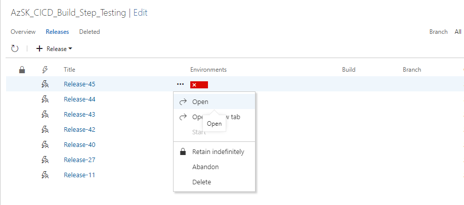

> <b>NOTE:</b>
> This article has been updated to use the new Azure PowerShell Az module. To learn more about the new Az module and AzureRM compatibility, see [Introducing the new Azure PowerShell Az module](https://docs.microsoft.com/en-us/powershell/azure/new-azureps-module-az).

# Security Verification Tests (SVTs)


 
## Contents
- [Overview](Readme.md#overview) 
## [Security Verification Tests (SVTs) in VSTS pipeline](Readme.md#security-verification-tests-svts-in-VSTS-pipeline) 
- [Enable AzSK extension for your VSTS](Readme.md#enable-azsk-extension-for-your-vsts)
- [Walkthrough](Readme.md#walkthrough)
  - [Adding SVTs in the release pipeline](Readme.md#adding-svts-in-the-release-pipeline)
  - [Verifying that SVTs have been added and configured correctly](Readme.md#verifying-that-the-svts-have-been-added-and-configured-correctly)
- [Advanced CICD scanning capabilities](Readme.md#advanced-cicd-scanning-capabilities) 
- [FAQs](Readme.md#faqs)  

## [Security Verification Tests (SVTs) in Jenkins pipeline (Preview)](Readme.md#security-verification-tests-svts-in-jenkins-pipeline-preview-1)
- [Enable AzSDK extension for your Jenkins](Readme.md#enable-azsdk-extension-for-your-jenkins)
- [Walkthrough](Readme.md#walkthrough-1)
  - [Adding SVTs in the Jenkins pipeline](Readme.md#adding-svts-in-the-jenkins-pipeline)
  - [Verifying that SVTs have been added and configured correctly](Readme.md#verifying-that-the-svts-have-been-added-and-configured-correctly-1)
- [Remediating Failures and Next Steps](Readme.md#remediating-failures-and-next-steps)

## [AzSK ARM Template Checker](Readme.md#azsk-arm-template-checker)
- [Overview](Readme.md#overview-1) 
  - [ARM Template Checker - Control coverage](Readme.md#arm-template-checker---control-coverage)
- [Enable AzSK extension for your VSTS](Readme.md#enable-azsk-extension-for-your-vsts-1)
- [Walkthrough](Readme.md#walkthrough-2)
  - [Adding ARM Template Checker in VSTS pipeline](Readme.md#adding-arm-template-checker-in-vsts-pipeline)
  - [Verifying that ARM Template Checker have been added and configured correctly](Readme.md#verifying-that-the-arm-template-checker-have-been-added-and-configured-correctly)
  - [Exclude files from scan](Readme.md#exclude-files-from-scan)
  - [Skip certain controls during scan](Readme.md#skip-certain-controls-during-scan)
  - [Use external parameter file](Readme.md#use-external-parameter-file)
  - [Extending ARM Template Checker for your organization](Readme.md#extending-arm-template-checker-for-your-organization)

------------------------------------------------------------------
### Overview 
The AzSK contains Security Verification Tests (SVTs) for multiple PaaS and IaaS services of the Azure platform. 
As we have seen so far, these SVTs can be manually run against one or more target resources held in 
resource groups or tagged via a {tagName, tagValue} pair.

While it is invaluable to run these SVTs periodically from a PS console (to ensure that the subscription and 
the different resources that comprise your application are in a secure state), a key aspect of dev ops is 
to be able to automate such tests and integrate them as part of the dev ops workflows and release pipelines.
In other words, while checking that SVTs pass in an ad hoc manner is a good practice, it is important
to be able to also ensure that security control configuration remains intact in higher environments.

The CICD extensions feature of AzSK makes automated security configuration enforcement possible by 
making SVTs available as a Visual Studio Extension in the Marketplace so that engineering teams can run 
them within build/release pipeline. Once the build/release 
task is configured, SVTs run against a target deployment in an Azure subscription. Upon completion, 
SVTs will report the pass/fail status for controls along with aggregate control results. Hereafter, all the different 
'out-of-box' build/release workflow options from the CICD engine (e.g., VSTS)  can be used as 'next steps' based on 
the outcomes of SVTs. (For instance, one can decide whether to fail the release outright or to continue 
despite failures while sending an email to the build/release owners or to hold progress until someone 
manually approves, etc. Furthermore, if all SVTs pass in the pre-prod environment, then a release can 
be 'promoted' to prod.) 

Outcomes of the SVT execution can also be routed to a Log Analytics workspace configured to receive various events 
generated by the AzSK.

[Back to top...](Readme.md#contents)

# Security Verification Tests (SVTs) in VSTS pipeline

### Enable AzSK extension for your VSTS

This extension has been published to the VSTS gallery under "Build and Release" category. 
You can now install this extension from the Marketplace directly (https://marketplace.visualstudio.com/items?itemName=azsdktm.AzSDK-task).
> **Note:** You can also install this extension on your on-prem TFS instance. Please follow the instructions detailed at:
> https://docs.microsoft.com/en-us/vsts/marketplace/get-tfs-extensions</br>
> **Note:** AzSK_SVT task is available in 'Release' pipeline tasks only. 

### Walkthrough
This part assumes that you are familiar with VS build tasks and pipelines at a basic level. To demonstrate 
the capability of the feature, we will use a basic MVC Web App that is checked into our trial repository. 
Our goal is to show how SVTs can be injected into the build/release workflow so that security testing for 
Azure subscription and resources is seamlessly integrated into CICD.  

[Back to top...](Readme.md#contents)
### Adding SVTs in the release pipeline

**Step-1:** Create a release definition or open an existing one.  
<!-- #TODO# make this end-to-end with AzSKDemoApp in GitHub etc -->
(Note: Here we will edit "AzSKDemoApp_SVTs_Rel3" which is part of our test instance of VSTS.
We also have a default build definition upstream to this which is not shown here as that is a pretty 
standard web app build flow using an MSBuild task.)  

As shown below, currently the release definition is configured to simply deploy a web app upon building 
it to a particular app service at the given URL. This is likely to be the state of any working CICD
pipeline that builds and deploys a web app (or App Service) from VSTS to an Azure subscription. 

Let us take a look at the steps needed to add the AzSK-SVT task to the release definition.


**Step-2:** Add the AzSK-SVT release task to the pipeline.  
Click on "Add Tasks", and select "AzSK Security Verification Test".  

  
Click on "Add" and "Close". 

> **Note:** The VSTS dialog doesn't provide a good visual indication but the task does 
get added when you click "Add" once!


**Step-3:** Specify the input parameters for the SVT task.  
The "AzSK_SVTs" task starts showing in the "Run on Agent" list and displays some configuration inputs 
that are required for the task to run. These are none other than the familiar options we have been specifying 
while running the AzSK SVTs manually - you can choose to specify the target resource group(s) or 
a {tagname, tagvalue} pair based on how your application's resources are organized.  
When the pipeline executes, SVTs will scan the specified set of resources.

Along with input parameter, you can check for below options
<br/>**Enable OMS Logging:** Switch to enable this task to publish SVT evaluation results to a Log Analytics workspace. Steps to configure workspace credentials are explained in Step-4
<br/>**Aggregate Control Status:** Switch to aggregate the SVTs control output. When this is turned off it would show all the failed individual controls in the task summary output.
<br/>**Do not auto-update AzSK:** Switch to toggle auto update of AzSK and required Az modules on the build server. Keep this un-checked for Hosted agent and Hosted VS2017 and while using SVT task fot the first time and if you want to update AZSK the version of AzSK. 


**Step-4:** (Optional) Setup connectivity from CICD to Log Analytics.  
> **Note:** You can skip this step in a first pass exploration of CICD integration of SVTs. 

This feature enables you to route the control scan results from SVTs in CICD pipelines to a Log Analytics workspace.
Configuring a Log Analytics workspace for the AzSK_SVTs task basically enables monitoring capability for 
build environments. Each time SVTs run in CICD, the AzSK events generated will be sent to 
the Azure Monitor repository and become available for subsequent queries, actions, alerts, etc. in the Log Analytics workspace.
(The AzSK includes a Monitoring solution that can be used to create a 'single dashboard' view of security 
for one or more applications across multiple dev ops stages.)  
  
We have added config info of a trial Log Analytics workspace used by the AzSK team below. You should choose your 
own target Log Analytics workspace and the corresponding resource group instead. (You can use Get-AzOperationalInsightsWorkspace 
cmdlet to quickly find out the resource group corresponding to your Log Analytics workspace. If you do not know your
app's Log Analytics workspace, you should check with your monitoring lead. Else you can create a trial workspace with
the 'Free' tier option.)   
  
The Log Analytics workspace information may be provided using one of the two options below:  
**Option-1:** Use a 'variable group'  
In this option, a single variable group may be defined at the VSTS level to represent the Log Analytics workspace 
that a collection of projects wants to share. This variable group may be 'linked' from the individual 
build/release definitions across these projects. The benefit is that, in the future, if a key value changes, 
you just have to make that change in one place and all definitions will immediately reflect the change.

The images below show this option. It involves 2 steps:  
1. 	 Create a variable group that holds the Log Analytics workspace info (if one doesn't exist for your org) 
2. 	 Link that variable group to your project's release definition

The variable group name can be a unique name you can choose (and specify in the release task definition). 
The specific variable names for workspace ID and shared key have to be exactly as shown below. The values 
of these should correspond the corresponding info for your Log Analytics workspace.  
  
Creating the variable group:


Linking to the release definition:


> **Note:** Variable groups can only be modified or added from the Library under VSTS instance.

**Option-2:** Directly use variables in individual build definitions.
 


Important: Ensure that the variable names used are exactly as above and the values correspond 
to *your* Log Analytics workspace. Moreover, when you specify the Log Analytics shared key, click on the 'lock' icon 
next to it so that it gets masked.

**Step-5:** Setup Online Policy URL (Mandatory for Org policy users e.g. CSE users)

This feature enables you to set up the CICD task to use your organization's AzSK policies. 
To use org-specific policies, you can get your org-specific settings by (a) running Get-AzSKInfo -InfoType HostInfo and looking at the value of 'OnlinePolicyStoreUrl' and 'EnableAADAuthForOnlinePolicyStore'(it specifies whether Org policy URL 'AzSKServerURL' is protected by AAD authentication).

Below, we have added configuration info of 'AzSKServerURL' and 'EnableServerAuth' used by the AzSK team. The URL at your org can be different assuming there is an org-policy setup unique to your org.  

The online policy URL can be configured for the CICD extension using one of the two options below:  

**Option-1**: Use a 'variable group'  
In this option, a single variable group may be defined at a VSTS level to represent the Policy URL that 
a collection of projects want to share. This variable group may be 'linked' from the individual 
build/release definitions across these projects. The benefit is that, in future, if a value changes, 
you just have to make that change in one place and all definitions will immediately reflect the change.  

The images below show this option. It involves 2 steps:  
1. Create a variable group that holds the URL info (if one doesn't exist for your org) 
2. Link that variable group to your project's release definition

The variable group name can be a unique name you can choose (and specify in the release task definition). 
The specific variable name for Policy URL  has to be exactly as shown below. 
  
Creating the variable group:  
    

Linking to the release definition:    
 
> Note: Variable groups can only be modified or added from the Library under VSO instance.

**Option-2**: Directly use variables in individual build definitions.  
    

**Step-6**: Save the Release Definition.
  
  

> **Note:** Please make sure that the service principal (SPN) that is used for the CICD pipeline task has the following permissions: (a) ‘Reader’ access on the resource groups that are to be scanned (or ‘Reader’ access at subscription level if all resource groups are being scanned) and (b) ‘Contributor’ access on the ‘AzSKRG’ resource group.
<br>The first permission is required so that the SVTs can scan resources for security issues successfully and the second permission is requires so that any past attestations for controls are respected by the scan.

[Back to top...](Readme.md#contents)
### Verifying that the SVTs have been added and configured correctly
**Step-1:** Start the release pipeline. 
This can be done by adding a new release for an existing build (or trigger a new release via a minor/trial 
check-in). 


**Step-2:** Verify that the release pipeline has started. 
Once the release is triggered, we can see that it is in progress by clicking on "Releases" (or via 
"Build & Release" menu in the VSTS menu).


**Step-3:** View the release outcome.  
In a few minutes the release pipeline should complete and we can view the outcomes as shown below (in the 
pic below we can see that the release pipeline has failed):



**Step-4:** Look at the "Issues" to see why the release failed.  
The summary output shows the cause of failure (in this case it is because the AzSK SVTs have failed).


**Step-5:** Look at the complete output log of the AzSK portion of the release pipeline execution . 
Clicking on the "Security controls are failing" text (in the pic above) and, further, clicking on 
the "AzSK_SVTs" link (in the pic below) will show the details about the SVT execution and failures. 
Notice how the output is the same as what is displayed when SVTs are manually run in a PS console!
Essentially, the AzSK_SVTs extension gives us the capability to mirror the secure configuration state
that was established during the development/prototyping phases.


**Step-6:** See the summary "CSV" and detailed "LOG" output files for the AzSK SVTs.  
This is no different than the "ad hoc SVT run" scenarios. Note, above, how the SVT outputs the location 
of the "CSV" file and the "LOG" file at the end of the run. However, those locations are on the release 
agent machine. These are also packaged up in an overall ZIP file and are available to download. The 
overall ZIP file can be downloaded by clicking on the "Download all logs as ZIP" option.  
The ZIP file "ReleaseLogs_dd.zip" contains LOGs from the entire release pipeline including the master 
output for the AzSK_SVTs. The CSV file and the LOG file for AzSK SVTs are embedded in the 'inner' ZIP 
file that is named according to the parameterSet chosen to run the SVTs (in the pic below the ZIP file 
is named by the target resource group that we used 'mptestrg').

 

Opening/extracting the "AzSK_Logs" ZIP file will reveal a folder structure and files placement identical to 
what we have seen in the case of ad hoc SVT runs:


[Back to top...](Readme.md#contents)

### Advanced CICD scanning capabilities
DevOps kit CICD extension enables you to leverage all the advance capabilities of toolkit while running in adhoc mode.
You could scan for specific controlIds in your build pipeline, or you could just scan for specific resources,
or you could also run a specific version of kit etc.
These advance features are available to customers through VSTS variables. Table below provide the different variables 
that are supported by the VSTS task:

|Variable Name| Usage| Examples|
|-------------|------|---------|
|OMSWorkspaceID| Log Analytics workspace to continuously monitor progressive release/deployment health| e.g. c18xxxxx-xxxx-abcd-efgh-12345613489c Refer to step-4 in the above section|
|OMSSharedKey| Log Analytics workspace shared key for extension to push the scan results from CICD| Refer step-4 from the above section for detail steps|
|AzSKServerURL| Org policy url for hosting the central policy configuration| Refer step-5 from the above section for detail steps |
|EnableServerAuth| Specifies whether Org policy URL (AzSKServerURL) is protected by AAD authentication.| e.g. true - protected by AAD authentication, false - not protected by AAD authentication|
|AzSKVersion| You could specify which version of toolkit you want to use in your CICD scan. And version specified should be >= N-2 where N is latest prod version. If variable is not provided, it uses the latest version available| e.g. 2.8.1|
|AzSKModuleName| This variable enable use to participate in the Preview testing. If you want to participate in preview, Provide the module name as "AzSKPreview". If not used, it would by default uses AzSK as module name| e.g. AzSKPreview|
|ExtendedCommand| Enables you to provide other switches supported by the Get-AzSKAzureServicesSecurityStatus command to perform focused scanning in the CICD pipeline | e.g. -ControlIds "Azure_Storage_DP_Encrypt_In_Transit,</br>Azure_Storage_DP_Encrypt_At_Rest_Blob" or -UseBaselineControls|
|TreatAsPassed| This variable is to provide users with more control over behavior of the SVT extension in case of various control statuses other than ‘Passed’ or ‘Failed’. For e.g., using this, one may choose to have the extension treat statuses such as 'Verify','Manual','Exception' or 'Remediate' as 'Passed'.|e.g. The value of the variable TreatAsPassed can be passed as Verify,Manual to skip Verify and Manual controls|


[Back to top...](Readme.md#contents)

### FAQs
#### I have enabled AzSK_SVTs task in my release pipeline. I am getting an error ‘The specified module 'AzSK' was not loaded because no valid module file was found in any module directory’. How do I resolve this issue?
- Go to ‘AzSK_SVTs’ task in your release definition.
- Make sure that the check box  ‘Do not auto-update AzSK’ is unchecked. This will ensure to run the AzSK scan using the latest module from PS Gallery.

This error typically occurs when AzSK scan identifies non-compatible Az and AzSK modules present on the machine and tries to install the latest ones. 
 
#### I have enabled AzSK_SVTs task in my release pipeline. It is taking too much time every time I queue a release, how can I reduce that time?
- Go to ‘AzSK_SVTs’ task in your release definition.
- Mark the check box ‘Do not auto-update AzSK’ as checked. 
- This will help you save some time by not re-installing the AzSK from scratch in every run. This will skip the module check from PS Gallery and continue to use the installed modules for scan.
> **Note:** For Non-Hosted agent, it is always recommended to check if latest AzSK module is present on your machine before marking 'Do not auto-update AzSK' CheckBox as checked, since scan should always use latest AzSK module.  
> **Note:** You will need to keep the above checkbox unchecked if you are running the AzSK_SVTs task on any release agent for the first time OR you are running the task on Hosted VS2017 agent OR if non-hosted agent is already running on latest version.

#### I have enabled AzSK_SVTs task in my release pipeline. I am getting an error 'Cannot bind argument to parameter 'String' because it is null.'

This error is occurring because some of the configurations are missing/incorrect. Please ensure you have selected the correct subscription/service principal in the drop-down list.

If your subscription is not listed or if you want to use an existing service principal, you can setup an Azure service connection using the 'Add' or 'Manage' button.  Managed Service Identity service connection scope is limited to access granted to the Azure virtual machine running the agent. Ensure that the VM has access to specified resources.

#### I have enabled AzSK_SVTs task in my release pipeline. I am getting an error 'Could not perform AzSK SVTs scan. Please check if task configurations are correct.'

This release fails with the below error message because one or more variables of the release pipeline is missing/incorrect. Make sure the value of AzSKServerURL and EnableServerAuth in the ‘Variables’ section of the pipeline is correctly set. 

- Run the command Get-AzSKInfo -InfoType HostInfo. 
- The value of OnlinePolicyStoreURL and EnableAADAuthForOnlinePolicyStore should be used for the variable AzSKServerURL and EnableServerAuth in the variables section of the release pipeline. 

#### Why AzSK_SVTs task in my release pipeline has suddenly started failing 'Verify'/'Manual'/'Remediate'/'Exception' controls?
 All the control statuses other than 'Passed' would be treated as 'Failed' in the AzSK_SVT Task(going forward from AzSK_SVTs version 3.0.3). To treat control statuses other than 'Failed' as 'Passed' you can use 'TreatAsPassed' variable. Refer this [link](Readme.md#advanced-cicd-scanning-capabilities)
 
#### I want to run AzSK_SVT on non-hosted agent. What are the pre-requisites for running AzSK_SVTs task on non-hosted agent?
If you are using non-hosted agents you need to have azureps installed on it for AzSK_SVTs to run.
Make sure you have latest version of AzSK installed on the machine,since scan should always use latest AzSK module.

#### Why attestation is not getting respected in AzSK_SVT task in CICD pipeline?
To read attestation data the context from which AzSK SVT command is run must have atleast 'Contributor' access on the AzSKRG resource group. So if you want your task to respect the attestation data you must give the CICD SPN contributor access on AzSKRG.

 
[Back to top...](Readme.md#contents)

# Security Verification Tests (SVTs) in Jenkins pipeline (Preview)
	
> Note : AzSDK plugin requires PowerShell to be present on Jenkins Server. Therefore, the plugin is currently supported for Windows machines only.	

### Enable AzSDK extension for your Jenkins
	
Currently AzSDK CICD extension/plugin has not been published on Jenkins repository, However you can use Jenkins Web UI to upload this plugin([AzSDK_CICD_Jenkins_Plugin.hpi](Assets/AzSDK_CICD_Jenkins_Plugin.hpi) file) to Jenkins or place it in '$JENKINS_HOME/plugins' location.
	
**Step to upload plugin using Jenkins Web UI**
	
 Go to Home Page --> Manage Jenkins --> Manage plugins -->  Select Advanced --> Upload plugin file "[AzSDK_CICD_Jenkins_Plugin.hpi](Assets/AzSDK_CICD_Jenkins_Plugin.hpi)"

  
 

 <br/>Plugin is successfully imported. Now let's use plugin to scan Azure Resources.  

[Back to top...](Readme.md#contents)

### Walkthrough
This part assumes that you are familiar with Jenkins pipeline at a basic level. To explore more on Jenkins, refer: [article](https://jenkins.io/doc/).

### Adding SVTs in the Jenkins pipeline
	
- #### Step-1: Configure Service Principal (SPN) credentials
	To run the SVT, AzSK need SPN/application which has reader on resource group.
	To set up an identity for the app(i.e. SPN) and assign reader role on resource group, refer: [article](https://docs.microsoft.com/en-us/azure/azure-resource-manager/resource-group-create-service-principal-portal).  
	You can configure details of SPN using below steps under Jenkins Global Credentials 
    1. Go to Home Page -->  Credentials --> System --> Global Credentials  --> Click on "Add Credentials" --> Select credential type "Microsoft Azure Service Principal"
    2. Fill out the details Subscription Id, Client ID, Client	Secret, OAuth 2.0 Token Endpoint and ID.
    3. Click on "Verify Service Principal" to validate SPN details are correct 
    4. Click Ok.
	
- #### Step-2: Create a Jenkins Job or open an existing one.
		
	Refer to this [article](https://www.tutorialspoint.com/jenkins/jenkins_setup_build_jobs.htm) to create sample build job
	
- #### Step-3: Add the AzSK-SVT build step to the pipeline.
	
	 Click on  "Add build step" and select "AzSK Security Verification Tests".

 
	  

- #### Step-4: Specify the input parameters for the SVT step.
	Step displays some configuration inputs that are required for the task to run. Specify SPN credentials id as configured in Step-1. Remaining inputs are none other than the familiar options we have been specifying while running the AzSK SVTs manually. When the pipeline executes, SVTs will scan the specified set of resources.  
 
		
- #### Step-5: (Optional) Setup connectivity from CICD to Log Analytics.
	 You can also configure build to send runtime security evaluation results to Log Analytics workspace. For that configure the credentials using below steps:
 	- For adding Log Analytics workspace credentials  
		Go to Home Page -->  Credentials --> System --> Global credentials  --> Click on "Add Credentials" --> Select credential type "OMS Details"  
		Provide the details and click Ok
		
   
  	  

	- Provide OMS Credentials Id in build step  

  		
- #### Step-6: Save the Job 

	
[Back to top...](Readme.md#contents)
### Verifying that the SVTs have been added and configured correctly
- #### Step-1: Trigger the build.

	  
 - #### Step-2: Verify that the build has started.

		  
- #### Step-3: View the 'Console Output'.

		  
- #### Step-4: See the summary "CSV" and detailed "LOG" output files for the AzSK SVTs.

	This is no different than the "ad hoc SVT run" scenarios. SVT outputs the location 
	of the "CSV" file and the "LOG" file at the end of the run.
	
	 
[Back to top...](Readme.md#contents)
> 	Note :
> 	- Currently task is configured to not stop if SVT fails.

### Remediating failures and next steps
Once you have the CSV file and the LOG file for the SVTs execution, the process of understanding and remediating failures is no different than what is used when SVTs are run manually. Basically, you will 
 need to look at the failed SVTs in the CSV file and the corresponding details about 'what exactly caused 
each individual failure?' in the LOG file. Thereafter the issue can be remediated (additional guidance 
available from AzSK is at the link in the CSV file for each row).  

If you chose to route events to Log Analytics, you can also use the AzSK Monitoring Solution to view things 
like "build/release security health", long term trends, configure and receive alerts for various 
conditions (e.g., back to back SVT failures) etc.

[Back to top...](Readme.md#contents)

# AzSK ARM Template Checker
### Overview

The ARM Template security check script runs a scan on your given ARM Template to examine various conditions and configurations that need to be present in your ARM Template for secured resource deployment.

[Back to top…](Readme.md#contents)
### Scan the security health of your ARM Template

The ARM Template health check script can be run using the command below after replacing `<Path to ARM Template>`
 with the path of your ARM Template
```PowerShell
Get-AzSKARMTemplateSecurityStatus –ARMTemplatePath <Path to ARM Template> 
```
The parameters used are:
- ARMTemplatePath – Path to ARM Template file or folder

[Back to top…](Readme.md#contents)

### ARM Template Checker - Control coverage
 
ARM Template checker covers Baseline controls for following services:

|FeatureName|Resource Type|
|-----------|-------------|
| AppService |Microsoft.Web/sites|
| CDN |Microsoft.Cdn/profiles|
| CosmosDB |Microsoft.DocumentDb/databaseAccounts|
| DataLakeStore |Microsoft.DataLakeStore/accounts|
| RedisCache |Microsoft.Cache/Redis|
| SQLDatabase |Microsoft.Sql/servers|
| Storage |Microsoft.Storage/storageAccounts|
| TrafficManager |Microsoft.Network/trafficmanagerprofiles|
| ServiceFabric |Microsoft.ServiceFabric/clusters|
| Kubernetes |Microsoft.ContainerService/ManagedClusters|
| LogicApps |Microsoft.Logic/workflows|
| ContainerRegistry |Microsoft.ContainerRegistry/registries|
| KeyVault |Microsoft.KeyVault/vaults|
| VirtualNetwork |Microsoft.Network/virtualNetworks|

ARM Templates for reference are available [here](../ARMTemplates).

### ARM Template Checker Scan - How to fix findings?

Get-AzSKARMTemplateSecurityStatus cmdlet generate outputs which are organized as under: 
- summary information of the control evaluation (pass/fail) status in a CSV file,
- detailed powershell output log in a LOG file

To address findings, you should do the following:
1. See the summary of control evaluation first in the CSV file. (Open the CSV in XLS. Use "Format as Table", "Hide Columns", "Filter", etc.)
2. Review controls that are marked as "Failed", "Verify" or "Manual"
3. Use the following approach based on control status:
     - For the “Verify” controls, look at the expected property, expected value and description column in .CSV file to decide whether to consider the    control as "Passed" or not. 
     - For the “Failed” controls, look at the .CSV file to get the supporting information like expected property, expected value, line no. and resource path etc.
> **Note**: If 'ExpectedProperty' column in .CSV file contains multiple properties (for e.g. $.properties.siteConfig.alwaysOn | $.properties.alwaysOn), in this case you only need to provide expected value in anyone of these properties to fix the failed control.

#### Scan multiple ARM Templates :-	 
To scan multiple ARM Templates at a time you can pass folder path containing different ARM Template(s) to “–ARMTemplatePath” parameter in “Get-AzSKARMTemplateSecurityStatus” cmdlet.
e.g. :
```PowerShell
 Get-AzSKARMTemplateSecurityStatus  –ARMTemplatePath "D:\DSRE\TestARMChecker\" [-Recurse]
```
> **Note**: You need to pass “-Recurse” switch in cmdlet if you want to scan ARM Templates in the specified location and in all child folders of the location.

[Back to top...](Readme.md#contents)	

### Enable AzSK extension for your VSTS

This extension has been published to the VSTS gallery under "Build and Release" category. 
You can now install this extension from the Marketplace directly (https://marketplace.visualstudio.com/items?itemName=azsdktm.AzSDK-task).
> **Note:** You can also install this extension on your on-prem TFS instance. Please follow the instructions detailed at:
> https://docs.microsoft.com/en-us/vsts/marketplace/get-tfs-extensions

### Walkthrough
This part assumes that you are familiar with VS build tasks and pipelines at a basic level. To demonstrate 
the capability of the feature, we will use a basic ARMTemplate that is checked into our trial repository. 
Our goal is to show how ARM checker can be injected into the build/release workflow so that security testing for 
Azure resources can be done before deployment of ARM Template seamlessly in CICD.  

[Back to top...](Readme.md#contents)

### Adding ARM Template Checker in VSTS pipeline

**Step-1:** Create a release definition or open an existing one.   
As shown below, currently the release definition is configured to simply deploy a ARM Template using Azure Powershell script. This is likely to be the state of any working CICD pipeline that deploys a ARM Template from VSTS to an Azure subscription.

Let us take a look at the steps needed to add the AzSK-ARM Template Checker task to the release definition.


**Step-2:** Add the AzSK-ARM Template Checker release task to the pipeline.
Click on "Add Tasks", and select "AzSK ARM Template Checker".
Click on "Add" and "Close".
> **Note:** The VSTS dialog doesn't provide a good visual indication but the task does 
get added when you click "Add" once!


**Step-3:** Specify the input parameters for the ARM Checker task.
The "AzSK ARM Template Checker" task starts showing in the "Run on Agent" list and displays some configuration inputs that are required for the task to run. These are none other than the familiar options we have been specifying while running the AzSK ARM Template Checker manually - you can specify the target ARM Template file path or a folder path based on your requirement.

Along with input parameter, you can check for below options
<br/>**Recurse:** Switch this if you want to scan ARM Templates in the specified location and in all child folders of the location.
<br/>**Do not auto-update AzSK:** Switch to toggle auto update of AzSK and required Az modules on the build server. Keep this un-checked for Hosted agent and Hosted VS2017 and while using SVT task fot the first time and if you want to update AZSK the version of AzSK. 


**Step-4**: Specify AzSKServerURL and EnableServerAuth variables if you want to use your own org-policy. Please follow this [link](../07-Customizing-AzSK-for-your-Org#how-does-azsk-use-online-policy) to understand how does AzSK use online policy.

AzSKServerURL -> AzSK OnlinePolicyStoreUrl

EnableServerAuth -> EnableAADAuthForOnlinePolicyStore
 


**Step-5**: Save the Release Definition.
  
[Back to top...](Readme.md#contents)

### Verifying that the ARM Template Checker have been added and configured correctly
**Step-1:** Start the release pipeline. 
This can be done by adding a new release for an existing build (or trigger a new release via a minor/trial 
check-in). 


**Step-2:** Verify that the release pipeline has started. 
Once the release is triggered, we can see that it is in progress by clicking on "Releases" (or via 
"Build & Release" menu in the VSTS menu).


**Step-3:** View the release outcome.  
In a few minutes the release pipeline should complete and we can view the outcomes as shown below (in the 
pic below we can see that the release pipeline has failed):


**Step-4:** Look at the "Issues" to see why the release failed.  
The summary output shows the cause of failure (in this case it is because the AzSK ARM Template Checker have failed).


**Step-5:** Look at the complete output log of the ARM Checker portion of the release pipeline execution . Notice how the output is the same as what is displayed when ARM Template Checker cmdlet manually run in a PS console.


**Step-6:** See the summary "CSV" and detailed "LOG" output files for the AzSK_ARMTemplateChecker. 
This is no different than the "ad hoc ARM Template Checker run" scenarios. Note, above, how the ARM Template Checker outputs the location of the "CSV" file and the "LOG" file at the end of the run. However, those locations are on the release 
agent machine. These are also packaged up in an overall ZIP file and are available to download. The 
overall ZIP file can be downloaded by clicking on the "Download all logs as ZIP" option.  
The ZIP file "ReleaseLogs_dd.zip" contains LOGs from the entire release pipeline including the master 
output for the AzSK_ARMTemplateChecker. The CSV file and the LOG file for AzSK ARM Template Checker are embedded in the 'inner' ZIP 
file that is named as ArmTemplateChecker_Logs_yyyymmdd_hhmmss.zip .

 

Opening/extracting the "ArmTemplateChecker_Logs" ZIP file will reveal a folder structure and files placement identical to 
what we have seen in the case of ad hoc ARMChecker runs:


[Back to top...](Readme.md#contents)

### Exclude files from scan
To scan multiple ARM Templates at a time you can pass folder path containing different ARM Template(s) but it is possible that folder may contain some ARM Template(s) that are not valid or currently not supported by ARM Checker. In this case AzSK ARM Template Checker Task will skip those file(s) and will fail.


The overall ZIP file can be downloaded by clicking on the "Download all logs as ZIP" option. The ZIP file "ReleaseLogs_dd.zip" contains LOGs from the entire release pipeline including the master output for the AzSK_ARMTemplateChecker. The CSV file and the LOG file for   AzSK ARM Template Checker are embedded in the 'inner' ZIP file that is named as ArmTemplateChecker_Logs_yyyymmdd_hhmmss.zip . Download "ArmTemplateChecker_Logs" ZIP file and then Open/extract the "ArmTemplateChecker_Logs". It will contains SkippedFiles.LOG file along with other files. On opening this file you will get list of all file(s) skipped during scan. 


In such case you can exclude files from scan using "Exclude Files" input, you need to pass name of the files (comma separated) you want to exclude in "Exclude Files" input as shown in image below:


[Back to top...](Readme.md#contents)

### Skip certain controls during scan

AzSK ARM Template Checker will fail if any security control will fail for provided ARM Template. But in some case it may be possible that some controls failure you don't want to fix. In such case you can skip specific controls from scan using below step:<br>
**Step-1:** The overall ZIP file can be downloaded by clicking on the "Download all logs as ZIP" option. The ZIP file "ReleaseLogs_dd.zip" contains LOGs from the entire release pipeline including the master output for the AzSK_ARMTemplateChecker. The CSV file and the LOG file for AzSK ARM Template Checker are embedded in the 'inner' ZIP file that is named as ArmTemplateChecker_Logs_yyyymmdd_hhmmss.zip . Opening/extracting the "ArmTemplateChecker_Logs" ZIP file will reveal a folder structure and files placement as shown below:


**Step-2:** Open CSV file and start editing, keep only those controls with failed status which you want to skip from scan.


After editing CSV should look like this,


**Step-3:** Upload this edited CSV file to your repository and give path of this file in "Skip Controls From File" input as shown in below image:


[Back to top...](Readme.md#contents)

### Use external parameter file

To pass parameter values while scanning your ARM Template by ARM Checker, you can use external parameter file. The parameter file contains a value for the parameter. This value is automatically passed to the template during scanning. 
To pass external paramter file, give path of this file in "Parameter file path or folder path" input as shown in below image:


> **Note:** If you are passing folder path instead of single parameter file path, then parameter file must follow specific naming convention, [Template file name].parameters.json </br>
> for e.g. </br>
> ARM template file name - storage.json </br>
> Related parameter file name- storage.parameters.json
  
[Back to top...](Readme.md#contents)

### Extending ARM Template Checker for your organization
> **Note:** This is a draft, we are currently working on couple of areas to make the experience more seamless.

If you are using org-policy feature, you can extend ARM template checker for your organization like, adding support to scan new services (which currently not supported by ARM Checker) or adding new controls to existing services in ARM Checker. But before extending ARM Template Checker, we need to understand how ARM Template Checker works.

### How ARM Checker scans a control

To understand this, let's look at a single control for any service (e.g., Storage -> encrypt-in-transit control), 
```json
{ 
"featureName": "Storage", 
"supportedResourceTypes": ["Microsoft.Storage/storageAccounts"], 
"controls": [ 
	{ 
	"id": "AzureStorage160", 
	"controlId": "Azure_Storage_DP_Encrypt_In_Transit_Test", 
	"isEnabled": true, 
	"description": "HTTPS protocol must be used for accessing Storage Account resources", 
	"rationale": "Use of HTTPS ensures server/service authentication and protects data in transit from network layer man-in-the-middle, eavesdropping, session-hijacking attacks. When enabling HTTPS one must remember to simultaneously disable access over plain HTTP else data can still be subject to compromise over clear text connections.", 
	"recommendation": "Run command 'Set-AzStorageAccount -ResourceGroupName <RGName> -Name <StorageAccountName> -EnableHttpsTrafficOnly `$true'. Run 'Get-Help Set-AzStorageAccount -full' for more help.", 
	"severity": "Medium", 
	"jsonPath":  ["$.properties.supportsHttpsTrafficOnly"], 
	"matchType": "Boolean", 
	"data": {"value": true} 
	} 
	] 
} 
```

Once you pass ARM Template file to ARM Checker for scanning, while scanning ARM Template it follows steps mentioned below:

1. First of all, ARM Checker checks if the services used in the ARM template being scanned are supported by looking at the "SupportedResourceType" field in a file called “ARMControls.json” that is a global list of all services and corresponding controls covered by the ARM Checker. (It will look for this file in the folder “%userprofile%\Documents\WindowsPowerShell\Modules\AzSK\<version>\Framework\Configurations\ARMChecker\ARMControls.json”. For instance, for the above example, it will look for: "Microsoft.Storage/storageAccounts".)
> **Note:** If "ARMControls.json" file is present on your org-server, server file will override the file present in your local machine.

2. For each service type that is covered, it will look under the “controls” list for that service type to identify the properties it needs to check for in the ARM template as mentioned by the “jsonPath” for each control (in our example,  Microsoft.Storage/storageAccounts -> properties -> supportsHttpsTrafficOnly) 
3. If the corresponding property is found on the object in the ARM template, it will compare with the expectation by using the “MatchType” and “Data” fields in the control. 
	* If the property is found and it's value matches with the value(s) specified in the "data" field (e.g., "True" above), ARM Checker will pass the control. 
	* If the property is not found, or its value doesn't match with expected value ARM Checker will fail the control. 

### Adding a new control to an existing service

1. Edit ARMControls.json 
2. Go to the service in which you want to add new controls 
3. Add new control object in the "controls" array.  
	``` json
	{ 
		"id": "TBD910", 
		"controlId": "TBD", 
		"isEnabled": true, 
		"description": "TBD", 
		"rationale": "TBD", 
		"recommendation": "TBD", 
		"severity": "High", 
		"jsonPath": [ "$.properties.properties1" ], 
		"matchType": "Boolean", 
		"data": { 
			"value": false 
			}  
	}
	```

> **Note:** For control id, please use format like featureName  + Integer (should be greater than 900) e.g. "id" : TrafficManager910 .

#### Important properties in control object:  
* "isEnabled" :  To enable/disable control during scan. If set to 'false' control will not be scanned. 
* "jsonPath":  Path of the property/object in ARM Template which will be evaluated by ARM Checker. 
* "matchType":  This field defines the type of property/object, expected at the path provided as "jsonPath"
* "data": This field determines control evaluation, different properties and values of those properties depends on the "matchType" defined above.

#### Supported Match type and their respective Data type:

<table>
  <tr>
    <th>MatchType</th>
    <th>Data.Type</th>
    <th>Data.Value</th>
    <th>Data.IsCaseSensitive</th>
    <th>Description</th>
    <th>Example</th>
  </tr>
  <tr>
    <td>Boolean</td>
    <td>NA</td>
    <td>true/false</td>
    <td>NA</td>
    <td>Property should be present at "JsonPath", Property value should be a boolean and matches the value as mentioned in "data.value"</td>
    <td>If we want to ensure, in App Service "remote debugging" should be turned off, <br>"jsonPath": [ "$.properties.siteConfig.remoteDebuggingEnabled"]<br> "matchType": "Boolean",<br> "data": { <br>     "value": false<br> }</td>
  </tr>
  <tr>
    <td>IntegerValue</td>
    <td>GreaterThan/LesserThan/Equals</td>
    <td>&lt; Any integer value &gt;<br></td>
    <td>NA</td>
    <td>Property should be present at "JsonPath", Property value should be a integer and Property value should be "GreaterThan/LesserThan/Equals" ( as mentioned in "data.type" ) to value (as mentioned in "data.value")<br></td>
    <td>If we want to ensure, App Service must be deployed on a minimum of two instances, <br>     "jsonPath": [ "$.sku.capacity" ],<br>    "matchType": "IntegerValue",<br>    "data": {<br>    "type": "GreaterThan",<br>    "value": 1<br>}<br></td>
  </tr>
  <tr>
    <td>ItemCount</td>
    <td>GreaterThan/LesserThan/Equals</td>
    <td>&lt; Any integer value &gt;<br></td>
    <td>NA</td>
    <td>Property should be present at "JsonPath", Property value should be an Array and Count of object in Array should be "GreaterThan/LesserThan/Equals" ( as mentioned in "data.type" ) to value (as mentioned in "data.value")<br></td>
    <td>If we want to ensure, CosmosDB uses replication, <br>  "jsonPath": [ "$.properties.locations" ],<br>    "matchType": "ItemCount",<br>    "data": {<br>    "type": "GreaterThan",<br>    "value": 1<br>}<br></td>
  </tr>
  <tr>
    <td>StringWhitespace</td>
    <td>NA</td>
    <td>false/true<br></td>
    <td>NA</td>
    <td>Property should be present at "JsonPath" and Property value should be "Empty string " or "Non empty String" (as mentioned in "data.value" )<br></td>
    <td>If we want to ensure, App Service must authenticate users using AAD backed credentials <br>  "jsonPath": [ "$.properties.siteConfig.siteAuthSettings.clientId"],<br>    "matchType": "StringWhitespace",<br>      "data": {
            <br>"value": false
          }<br></td>
  </tr>
  <tr>
    <td>StringSingleToken</td>
    <td>Allow/NotAllow</td>
    <td>&lt; Any string value &gt;<br></td>
    <td>false/true<br></td>
    <td>Property should be present at "JsonPath", Property value should be string and Property value should be "equal to (Allow)" or "not to equal(Not Allow)" (as mentioned in "data.type" )<br></td>
    <td>If we want to ensure, latest version of .NET framework version must be used for App Service    <br>    "jsonPath": [ "$.properties.siteConfig.netFrameworkVersion"],<br>    "matchType": "StringSingleToken",<br>      "data": {
            <br>"type": "Allow",
            <br>"value": "v4.7",
            <br>"isCaseSensitive": false
          }<br></td>
  </tr>
  <tr>
    <td>VerifiableSingleToken</td>
    <td>NA</td>
    <td>NA</td>
    <td>NA</td>
    <td>Property should be present at "JsonPath" and Property value should be string<br></td>
     <td>If we want to ensure, only the required IP addresses are configured on Cosmos DB firewall <br> "jsonPath": [ "$.properties.ipRangeFilter" ],<br>    "matchType": "VerifiableSingleToken",",<br>  "data": {}<br></td>
  </tr>
</table>

### Adding new service

1. Edit ARMControls.json
2. Add new Service object in  "resourceControlSets" array like,
	```json
	{
	"featureName": "NewServiceName",
	"supportedResourceTypes": [ "Microsoft.XYZ/abc" ],
	"controls": [ ]			
	}
	```
	E.g.
	```json
	{
     "featureName": "ContainerRegistry",
     "supportedResourceTypes": [ "Microsoft.ContainerRegistry/registries" ],
     "controls": []
    }

	```
> **Note:** Resource type defined in "supportedResourceTypes" must be exactly same as resource type present in ARM template of the service.

If a service contains multiple resource type, you can add multiple types in "supportedResourceTypes" array.
 E.g. 
			
"supportedResourceTypes": [ "Microsoft.Web/sites", "Microsoft.Web/serverfarms", "Microsoft.Web/sites/config" ]
