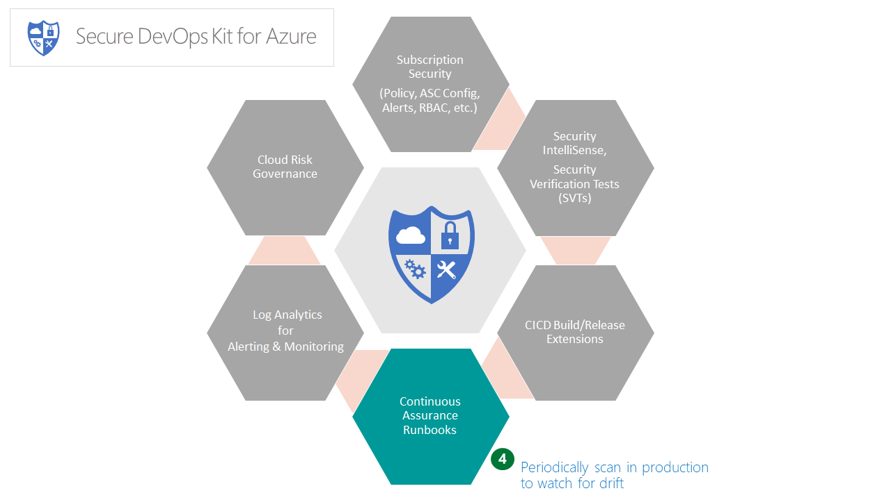
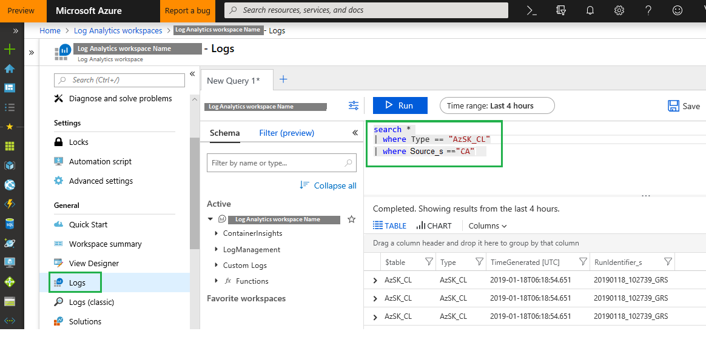
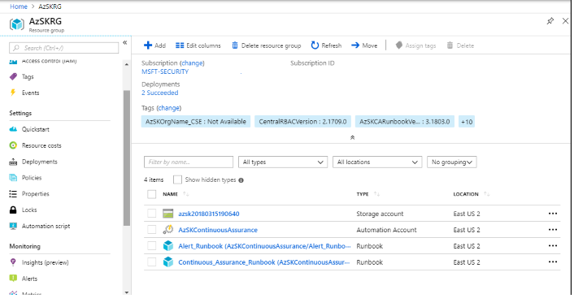
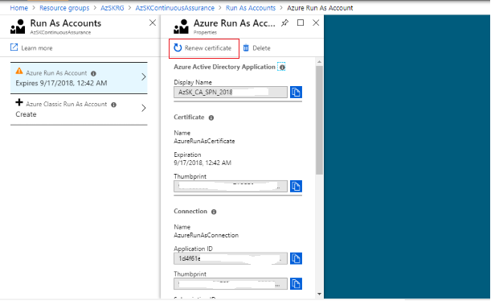
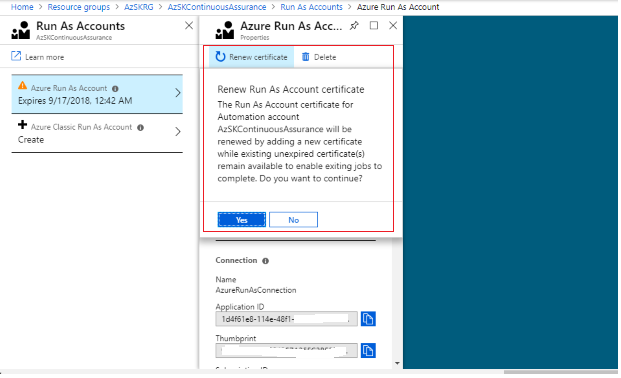
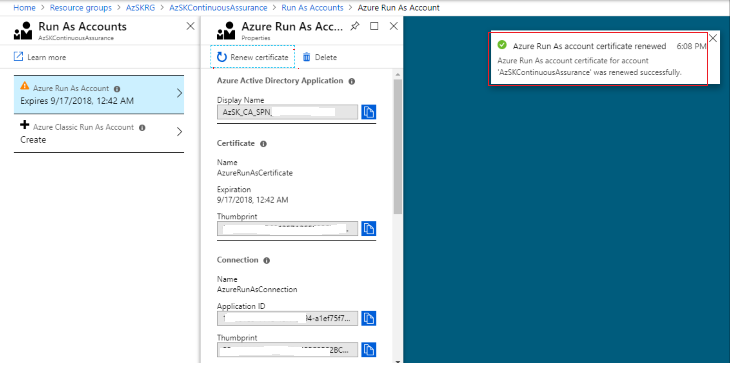
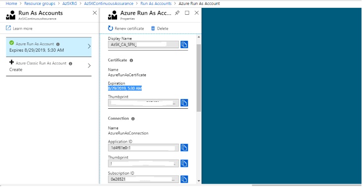

> The Secure DevOps Kit for Azure (AzSK) was created by the Core Services Engineering & Operations (CSEO) division at Microsoft, to help accelerate Microsoft IT's adoption of Azure. We have shared AzSK and its documentation with the community to provide guidance for rapidly scanning, deploying and operationalizing cloud resources, across the different stages of DevOps, while maintaining controls on security and governance.
<br>AzSK is not an official Microsoft product – rather an attempt to share Microsoft CSEO's best practices with the community..

><b>NOTE:</b>  
>The OMS* parameter/variable names will soon be deprecated. Please ensure that you have made the necessary changes to CA, CICD and AzSK Monitoring Solution as per below:  
>	1. Updated CA setups with new names ([details here](../04-Continous-Assurance#updating-an-existing-continuous-assurance-setup)). (Not required for CSEO subscriptions!)  
>	2. Switched to new names in CICD extension ([details here](../03-Security-In-CICD#advanced-cicd-scanning-capabilities)). (Required for all subscriptions)  
>	3. Start using the new parameters for [CA](../04-Continous-Assurance#setting-up-continuous-assurance---step-by-step) and [AzSK Monitoring Solution](../05-Alerting-and-Monitoring#1-c).

# Continuous Assurance (CA)



## Baseline Continuous Assurance
### Contents
- [Overview](Readme.md#overview)
- [Setting up Continuous Assurance - Step by Step](Readme.md#setting-up-continuous-assurance---step-by-step)
- [Continuous Assurance - how it works (under the covers)](Readme.md#continuous-assurance---how-it-works-under-the-covers)
- [Updating an existing Continuous Assurance setup](Readme.md#updating-an-existing-continuous-assurance-setup)
- [Removing a Continuous Assurance setup](Readme.md#removing-a-continuous-assurance-setup)
- [Getting details about a Continuous Assurance setup](Readme.md#getting-details-about-a-continuous-assurance-setup)
- [Continuous Assurance (CA) - 'Central Scan' mode](Readme.md#continuous-assurance-ca---central-scan-mode)
- [Continuous Assurance (CA) - Trigger scan on resource deployment (Preview)](Readme.md#continuous-assurance-ca---scanondeployment-mode)
- [Scan Databricks using custom AzSK Job](Readme.md#scan-databricks-using-custom-azsk-job)
- [FAQ](Readme.md#faq)

-----------------------------------------------------------------
## Overview 
The basic idea behind Continuous Assurance (CA) is to setup the ability to check for "drift" from what is 
considered a secure snapshot of a system. Support for Continuous Assurance lets us treat security truly as 
a 'state' as opposed to a 'point in time' achievement. This is particularly important in today's context 
when 'continuous change' has become a norm.

There can be two types of drift:        
1. Drift involving 'baseline' configuration:
This involves settings that have a fixed number of possible states (often pre-defined/statically determined 
ones). For instance, a SQL DB can have TDE encryption turned ON or OFF…or a Storage Account may have 
auditing turned ON however the log retention period may be less than 365 days. 	 
2. Drift involving 'stateful' configuration: There are settings which cannot be constrained within a finite 
set of well-known states. For instance, the IP addresses configured to have access to a SQL DB can be any (arbitrary) set of IP addresses. In such scenarios, usually human judgment is initially required to determine whether a particular configuration should be considered 'secure' or not. However, once that is done, it is important to ensure that there is no "stateful drift" from the attested configuration. (E.g., if, in a troubleshooting session, someone adds the IP address of a developer machine to the list, the Continuous Assurance feature should be able to identify the drift and generate notifications/alerts or even trigger 'auto-remediation' depending on the severity of the change). 

Besides 'drift tracking' there are also two other aspects of "staying secure" in operations. First of them 
is the simple concept that if new, more secure options become available for a feature, it should be possible to detect that 
a particular application or solution can benefit from them and notify/alert the owners concerned. In a way this can be thought 
of as facilitating "positive" security drift. The other aspect is about supporting "operational hygiene". In this area, 
we will add the ability to remind an app team about the security hygiene tasks that they need to periodically 
perform (key rotation, access reviews,  removing inactive/dormant power users, etc.). These two capabilities are on our backlog for H1-FY18.

>**Note:** If you have already installed Continuous Assurance using a version prior to 2.2.0, 
you should run 'Install-AzSKContinuousAssurance' command again by following the steps in the next section.


[Back to top…](Readme.md#contents)
## Setting up Continuous Assurance - Step by Step
In this section, we will walk through the steps of setting up a subscription and application(s) for Continuous Assurance coverage. 

To get started, we need the following:
1. The user setting up Continuous Assurance needs to have 'Owner' access to the subscription. (This is necessary because during setup, 
AzSK adds the service principal runtime account as a 'Reader' to the subscription.) 

>**Note:**  Starting AzSK v3.15.0, users having 'Contributor' permissions can set up AzSK Continuous Assurance (CA) for the subscription. The part of the setup where 'Owner' access is required will not abort if the user does not have that permission any more... instead, it will print a warning and ask the user to ensure that the required permissions are granted by someone (else) with 'Owner' access for the CA SPN (that does is used for the runtime scanning). Note that the CA SPN requires 'Reader' permission on the subscription and 'Contributor' permission on the DevOps Kit resource group in the subscription. CA will work seamlessly so long as these permissions are assigned (soon after the install cmdlet) by the owner.

2. Target Log Analytics WorkspaceID* and SharedKey. (The Log Analytics workspace can be in a different subscription, see note below)

**Prerequisite:**

**1.** We currently support following OS options: 	
- Windows 10
- Windows Server 2016


> **\*Note** CA leverages Azure Monitor repository for aggregating security scan results, you must determine which Log Analytics workspace 
you will use to view the security state of your subscription and applications (If you don't have a Log Analytics workspace please 
follow the steps in [Setting up the AzSK Monitoring Solution](../05-Alerting-and-Monitoring/Readme.md#setting-up-the-azsk-monitoring-solution-step-by-step). 
This can be a single workspace that is shared by multiple applications which may themselves be in different subscriptions. 
Alternately, you can have a Log Analytics workspace that is dedicated to monitoring a single application as well. 
(Ideally, you should use the same workspace that is being used to monitor other aspects like availability, performance, etc. 
for your application.)


**Step-1: Setup**  
0. Setup the latest version of the AzSK following the installation instructions for your organization. (For CSE use https://aka.ms/devopskit/onboarding).
1. Open the PowerShell ISE and login to your Azure account (using **Connect-AzAccount**).  
2. Run the '**Install-AzSKContinuousAssurance**' command with required parameters given in below table. 

```PowerShell
	Install-AzSKContinuousAssurance -SubscriptionId <SubscriptionId> `
		[-AutomationAccountLocation <AutomationAccountLocation>] `
		[-AutomationAccountRGName <AutomationAccountRGName>] `
		[-AutomationAccountName <AutomationAccountName>] `
	        -ResourceGroupNames <ResourceGroupNames> `
	        -LAWSId <WorkspaceId> `
	        -LAWSSharedKey <SharedKey> `
	        [-AltLAWSId <AltWorkspaceId>] `
	        [-AltLAWSSharedKey <AltSharedKey>] `
	        [-WebhookUrl <WebhookUrl>] `
	        [-WebhookAuthZHeaderName <WebhookAuthZHeaderName>] `
	        [-WebhookAuthZHeaderValue <WebhookAuthZHeaderValue>] `
	        [-ScanIntervalInHours <ScanIntervalInHours>] `
	        [-AzureADAppName <AzureADAppName>]
```

Here is one basic example of continuous assurnace setup command:

```PowerShell
	Install-AzSKContinuousAssurance -SubscriptionId <SubscriptionId> `
	        -ResourceGroupNames ‘rgName1, rgName2,…etc.’ ` # You can also use “*” to specify all RGs
	        -LAWSId <WorkspaceId> `
	        -LAWSSharedKey <SharedKey> 
```

Note:

For Azure environments other than Azure Cloud, don't forget to provide AutomationAccountLocation as the default value won't work in those environments.

|Param Name|Purpose|Required?|Default value|Comments|
|----|----|----|----|----|
|SubscriptionId|Subscription ID of the Azure subscription in which an Automation Account for Continuous Assurance will be created |TRUE|None||
|AutomationAccountLocation|(Optional) The location in which this cmdlet creates the Automation Account|FALSE|EastUS2|To obtain valid locations, use the Get-AzLocation cmdlet|
|AutomationAccountRGName|(Optional) Name of ResourceGroup where Automation Account will be installed|FALSE|AzSKRG|Don't pass default value explicitly for this param|
|AutomationAccountName|(Optional) Name of AutomationAccount|FALSE|AzSKContinuousAssurance|Don't pass default value explicitly for this param|
|ResourceGroupNames|Comma-separated list of resource group names which cover the application resources that need to be scanned. |TRUE|None|Use **"*"** to cover all resource groups in the subscription.|
|LAWSId|Workspace ID of Log Analytics workspace which is used to monitor security scan results|TRUE|None||
|LAWSSharedKey|Shared key of Log Analytics workspace which is used to monitor security scan results|TRUE|None||
|AltLAWSId|(Optional) Workspace ID of alternate Log Analytics workspace to monitor security scan results|FALSE|None||
|AltLAWSSharedKey|(Optional) Shared key of alternate Log Analytics workspace which is used to monitor security scan results|FALSE|None||
|WebhookUrl|(Optional) All the scan results shall be posted to this configured webhook |FALSE|None||
|WebhookAuthZHeaderName|(Optional) Name of the AuthZ header (typically 'Authorization')|FALSE|None||
|WebhookAuthZHeaderValue|(Optional) Value of the AuthZ header |FALSE|None||
|ScanIntervalInHours|(Optional) Overrides the default scan interval (24hrs) with the custom provided value |FALSE|None||
|AzureADAppName|(Optional) Name for the Azure Active Directory(AD) Application that will be created in the subscription for running the runbooks. |FALSE|None||
|ScanOnDeployment|(Optional) CA scan can be auto-triggered upon resource deployment.Installing CA with this flag will make sure that the Resource Group in which resource is deployed will be scanned. |FALSE|None||
|UsageTelemetryLevel|(Optional) CA scan evets get captured at AzSK side using anonymous telemetry.Installing CA with this flag with value as None will disable scan telemetry being captured at AzSk side. |FALSE|Anonymous||

> <b>NOTE:</b>  
> You can use **"*"** to cover all resource groups in the subscription. If **"*"** is specified, CA will automatically cover new resource groups that are added. Thus **"*"** might be a preferred option in enterprise-wide compliance/visibility initiatives based on CA.

**More about the 'AzureADAppName' parameter:**

The AzureADAppName parameter is optional. This represents the runtime account that will be used by the
CA runbook to scan the subscription/resources. 
- If the user does not specify a parameter, then CA will: 
    - Find if there is an existing AAD app (from a previous attempt to setup CA) in the subscription that can be reused.
    - Else, create a fresh Azure AD app on behalf of the user (in this case the user must have permission to create apps in the tenant).
- If the user specifies an AzureADAppName, then CA will try to find the AAD application corresponding to that 
name and attempt to use it (in this case the user must have 'Owner' permission on the specified app name). 

Here's a quick summary of the permissions required for the user who sets up CA:
- "Owner" access on the subscription
- Ability to create an AAD app in the tenant (This permissions is only required if app does not exist in tenant)
- "Owner" access to the AAD app if the user specifies one (or CA internally finds a previously created one)


**Note-1**: Completion of this one-time setup activity can take up to 2 hours. (This is because one of the things that setup does 
is download and add PowerShell modules for Azure PS library and for AzSK. This is a slow and sometimes flaky process and, 
as a result, the setup internally retries failed downloads. The Azure Automation product team is aware of this challenge and are working on a resolution.)

**Note-2**: Due to the complexity of various dependent activities involved, there are multiple places where CA setup can run into issues. 
It is important to verify that everything has worked without hiccups. Please review and ascertain each of the "Verifying" steps below carefully.

**Note-3**: If the person who had set up CA leaves organization/team then it's strongly advised to remove the service principal (configured in runtime account) access from subscription/AzSKRG to prevent any misuse.


**Step-2: Verifying that CA Setup is complete**  
**1:** In the Azure portal, select the application subscription that was used above and search for resources of type Automation Account. You should see an Automation Account created by the name 'AzSKContinuousAssurance'. Clicking on it will display the contents of the Automation Account (something that looks like the below, the counts shown may vary a little):

 

**2:** Click on 'Runbooks' tile. It should show the following runbook: 
	
 

**3:** Click on 'Schedules' tile. It should show the scheduling details of runbook. You can change the schedule timings according to your need. Default schedule is created as below. First job will run ten minutes after the installation: 

 

**4:** Click on 'Run As Accounts' tile. It should show the following account:

 

**Step-3: Verifying that all required modules are downloaded successfully (after about two hours of starting the installation)**

**1**: Click on the 'Modules' tile for the Automation Account. 'AzSK' module should be listed there. 'Status' column value for all modules should be 'Available' as below.

 
 
**Step-4: Verifying CA Runbook execution and Log Analytics connectivity**  
Once CA setup and modules download are completed successfully, the runbooks will automatically execute periodically (once a day) and scan the subscription and the specified resource groups for the application(s) for security issues. The outcomes of these scans will get stored in a storage account created by the installation (format : azsk\<YYYYMMDDHHMMSS> e.g. azsk20170505181008) and follows a similar structure as followed by standalone SVT execution (CSV file, LOG file, etc.).    

The results of the control evaluation are also routed to the Log Analytics for viewing via a security dashboard.  
  
Let us verify that the runbook output is generated as expected and that the Log Analytics connectivity is setup and working correctly.

**1:** Verify that CSV file and LOG file are getting generated as expected.  
 
1. Go to Storage Explorer and look for a storage account with a name in azsk<YYYYMMDDHHMMSS> format in your subscription in 'AzSKRG' resource group.
2. Find a blob container called 'ca-scan-logs' in this storage account.
3. There should be a ZIP file named using a timestamp based on the date time for the manual execution in this container (most likely the ZIP file with the most recent creation date). 
4. Download the ZIP file and extract its contents locally. The folder structure will be similar to how SVTs/Subscription Health scan generate when run locally. 
5. In a single zip file you will find two folders (name format: Timestamp). One folder contains reports of Subscription Health scan and another folder contains reports of application(s) resource groups security scan.
	
 

**2:** Verify that data is being sent to the target Log Analytics workspace   

1. Go to the Log Analytics workspace that we used to setup CA above.
2. Navigate to 'Logs' window, and enter Type=AzSK_CL Source_s=CA. (Source_s used to be 'CC' in the past.)
3. You should see results similar to the below:
	
 

Once CA is setup in the subscription, an app team can start leveraging the Monitoring Solution from AzSK as a one-stop dashboard 
for visibility of security state. Please follow the steps to setup the Monitoring solution [here](../05-Alerting-and-Monitoring#setting-up-the-azsk-monitoring-solution-step-by-step) to enable that part.

[Back to top…](Readme.md#contents)
## Continuous Assurance - how it works (under the covers)
The CA feature is about tracking configuration drift. This is achieved by enabling support for running AzSK 
SVTs/SS-Health via automation runbook. 

The CA installation script that sets up CA creates the following resources in your subscription:

- Resource group (Name : AzSKRG) :- 
To host all the Continuous Assurance artifacts
- Storage account (Format : azskYYYYMMDDHHMMSS) :- To store the daily results of CA scans. The storage account is named with a timestamp-suffix applied to 'azsk'(e.g. azsk20170420111140)
- Azure AD App and Service Principal :- This is used as the runtime identification of the automation runbook. Adds SPN to 'Reader' role on the subscription and contributor role on the resource group containing Automation Account.
- Automation Account (Name : AzSKContinuousAssurance) :- Creates the following assets within the Automation Account,
   - Runbook (Name : Continuous_Assurance_Runbook) - To download/update Azure/AzSK modules and scan subscription/app resource groups  
   - Variables 
      - AppResourceGroupNames 
      - LAWSId 
      - LAWSSharedKey 
      - ReportLogsStorageAccountName
   - Azure Run As Account - To authenticate runbook at runtime  
      This account uses below certificate and connection.  
      AzureRunAsCertificate - This certificate gets expired after six months of installation  
      AzureRunAsConnection - This connection is created using service principal with a AzureRunAsCertificate
   - Two schedules to trigger the runbook :-
      - CA_Scan_Schedule - This is to trigger job to scan subscription and app resource groups 
      - CA_Helper_Schedule - This is a temporary schedule created by runbook to retry download of modules
   - Modules - Downloaded by the runbook
   

#### Next Steps
Once CA is setup in the subscription, an app team can start leveraging the Monitoring Solution from AzSK as a one-stop dashboard for visibility of security state.
Occasionally, you may also feel the need to tweak the configuration of CA. See the "Update" section below about how to do that.

[Back to top…](Readme.md#contents)

## Updating an existing Continuous Assurance setup

The '**Update-AzSKContinuousAssurance**' command can be used to make changes to a previously setup CA configuration.
For instance, you may use it to:
- update the target resource groups to include in the scanning
- switch the Log Analytics workspace information that CA should use to send control evaluation events to
- use a different AAD SPN for the runbooks 
- remove previously set LogAnalytics, AltLogAnalytics, Webhook settings or ScanOnDeployment mode for CA account.
- etc.

To do any or all of these:
1. Open the PowerShell ISE and login to your Azure account (using **Connect-AzAccount**).  
2. Run the '**Update-AzSKContinuousAssurance**' command with required parameters given in below table. 

```PowerShell
Update-AzSKContinuousAssurance -SubscriptionId <SubscriptionId> `
    [-ResourceGroupNames <ResourceGroupNames>] `
    [-LAWSId <WorkspaceId>] `
    [-LAWSSharedKey <SharedKey>] `
    [-AltLAWSId <AltWorkspaceId>] `
    [-AltLAWSSharedKey <AltSharedKey>] `
    [-WebhookUrl <WebhookUrl>] `
    [-WebhookAuthZHeaderName <WebhookAuthZHeaderName>] `
    [-WebhookAuthZHeaderValue <WebhookAuthZHeaderValue>] `
    [-ScanIntervalInHours <ScanIntervalInHours>] `
    [-AzureADAppName <AzureADAppName>] `
    [-FixRuntimeAccount] ` 
    [-NewRuntimeAccount] `
    [-FixModules] `
    [-RenewCertificate]`
    [-Remove <LogAnalyticsSettings/AltLogAnalyticsSettings/WebhookSettings/ScanOnDeployment"]
```

|Param Name|Purpose|Required?|Default Value|Comments
|----|----|----|----|----|
|SubscriptionId|Subscription ID of the Azure subscription in which Automation Account exists |TRUE|None||
|ResourceGroupNames|Use this parameter if you want to update the comma separated list of resource groups within which the application resources are contained. The previously configured list of RGs will be replaced with the one provided here.|FALSE|None||
|LAWSId|Use this parameter if you want to update the workspace ID of Log Analytics workspace which is used to monitor security scan results|FALSE|None||
|LAWSSharedKey|Use this parameter if you want to update the shared key of Log Analytics workspace which is used to monitor security scan results|FALSE|None||
|AltLAWSId|(Optional) Workspace ID of alternate Log Analytics workspace to monitor security scan results|FALSE|None||
|AltLAWSSharedKey|(Optional) Shared key of alternate Log Analytics workspace which is used to monitor security scan results|FALSE|None||
|WebhookUrl|(Optional) All the scan results shall be posted to this configured webhook |FALSE|None||
|WebhookAuthZHeaderName|(Optional) Name of the AuthZ header (typically 'Authorization')|FALSE|None||
|WebhookAuthZHeaderValue|(Optional) Value of the AuthZ header |FALSE|None||
|ScanIntervalInHours|(Optional) Overrides the default scan interval (24hrs) with the custom provided value |FALSE|None||
|AzureADAppName|Use this parameter if you want to update the connection (used for running the runbook) with new AD App and Service principal|FALSE|None|This is useful if existing connection is changed/removed by mistake|
|FixRuntimeAccount|Use this switch to fix CA runtime account in case of below issues.<ol><li>Runtime account deleted<br>(Permissions required: Subscription owner)</li><li>Runtime account permissions missing<br>(Permissions required: Subscription owner and AD App owner)</li><li>Certificate deleted/expired<br>(Permissions required: Subscription owner and AD App owner)</li></ol>|FALSE|None||
|NewRuntimeAccount|Use this switch to setup new runtime account and the person running the command will become new SPN owner.This feature is helpful in case when CA certificate is expired but the SPN owner who had setup CA is not available and certificate can't be renewed. |FALSE|None||
|FixModules|Use this switch in case Az.Automation/Az.Accounts module(s) extraction fails in CA Automation Account.|FALSE|None||
|RenewCertificate|Renews certificate credential of CA SPN if the caller is Owner of the AAD Application (SPN). If the caller is not Owner, a new application is created with a corresponding SPN and a certificate owned by the caller. CA uses the updated credential going forward.|FALSE|None||
|ScanOnDeployment|CA scan can be auto-triggered upon resource deployment.Updating CA with this flag will make sure that the Resource Group in which resource is deployed will be scanned.|FALSE|None||
|Remove|Use this switch to clear previously set LogAnalytics, AltLogAnalytics,Webhook settings from CA Automation Account or to unregister from scan on deployment mode|False|None||
|UsageTelemetryLevel|Use this switch to stop anonymous telemetry capture at AzSK side.|False|Anonymous||

[Back to top…](Readme.md#contents)
## Removing a Continuous Assurance setup
1. Open the PowerShell ISE and login to your Azure account (using **Connect-AzAccount**).  
2. Run the '**Remove-AzSKContinuousAssurance**' command as below. 

```PowerShell
Remove-AzSKContinuousAssurance -SubscriptionId <SubscriptionId>  [-DeleteStorageReports] 
```
|Param Name |Purpose |Required?	|Default value	|Comments|
|-----|-----|-----|----|-----|
|SubscriptionId	|Subscription ID of the Azure subscription in which Automation Account exists |True |None||	 
|DeleteStorageReports |Add this switch to delete AzSK execution reports from storage account. This will delete the storage container where reports are stored. Generally you will not want to use this option as all previous scan reports will be purged. |False |None||  

[Back to top…](Readme.md#contents)
## Getting details about a Continuous Assurance setup
1. Open the PowerShell ISE and login to your Azure account (using **Connect-AzAccount**).  
2. Run the '**Get-AzSKContinuousAssurance**' command as below. 
3. Result will display the current status of CA in your subscription. If CA is not working as expected, it will display remediation steps else it will display a message indicating CA is in healthy state.  
4. Once you follow the remediation steps, run the command again to check if anything is still missing in CA setup. Follow the remediation steps accordingly until the CA state becomes healthy. 
```PowerShell
Get-AzSKContinuousAssurance -SubscriptionId <SubscriptionId> 
```
**Note:** This command is compatible only for Automation Account installed after 5th May, 2017 AzSK release.

[Back to top…](Readme.md#contents)

## Continuous Assurance (CA) - 'Central Scan' mode

The description so far has focused on setting up CA in a single subscription. When you have multiple subscriptions, you can setup CA individually for scanning each subscription. Alternatively, you can also setup CA in what is called a 'central scan' mode. The 'central scan' mode is more suited for scenarios where a single central team wants to exercise oversight of several subscription using a single master subscription for scanning. This section describes this mode and how to set it up further.


Unlike the 'individual subscription' mode where each subscription get its own instance of CA automation account, runbook, scan logs etc., the 'central scan' mode uses a single 'master' subscription to perform all scanning activities from. Use the following steps to setup 'central scan' mode: 

#### Pre-requisites:
- The user executing this command should have "Owner" access on all the subscriptions that are being enabled for central scanning mode including the master subscription.
- User should have the latest version of the DevOps Kit installed on the machine (>= [AzSK v3.1.x](https://www.powershellgallery.com/packages/AzSK/3.1.0))
- [Optional: Have a custom DevOps Kit policy setup for your org. This would provide more capabilities to control the scanning behavior. 
  (See [here](../07-Customizing-AzSK-for-your-Org/Readme.md) for more details on org policy.)

### Central Scan mode - single versus multiple Automation accounts:
When setting up CA with central scan mode, you have a choice regarding division of the scanning workload between automation accounts. You can choose to have all target subscriptions scanned via a single automation account *or* you can configure multiple automation accounts to divide the scanning workload amongst them by assigning each automation account a subset of the subscriptions for scanning. These two options and when to choose which one are covered below: 

#### 1. Central Scan mode CA using a single Automation account (default behavior):

With this option, a single automation account will get created in the host (master) subscription, which will scan all the target subscriptions. This mode is suitable for scanning up to a max of 40-50 subscriptions. (As the number of target subscriptions increases, the frequency of scan for each subscription reduces. Ideally each subscription should get scanned at least once per day. The multiple Automation account option might help if the count of subscriptions to be scanned is higher.)

##### 1.1 Setting up Continuous Assurance (CA) in Central Scan mode (single Automation account option):

This can be achieved by adding extra params to the existing CA command as shown in the command below:

```PowerShell
$SubscriptionId = '<subscriptionId>'
$ResourceGroupNames = '*' #This should always be '*' for Central Scan mode CA
$LAWSId = '<WorkspaceId>'
$LAWSSharedKey = '<SharedKey>' 
$TargetSubscriptionIds = '<SubId1, SubId2, SubId3...>' #Need to provide comma separated list of all subscriptionId that needs to be scanned.

Install-AzSKContinuousAssurance -SubscriptionId $SubscriptionId -TargetSubscriptionIds $TargetSubscriptionIds 
        -ResourceGroupNames $ResourceGroupNames -LAWSId $LAWSId -LAWSSharedKey $LAWSSharedKey -CentralScanMode 
        [-LoggingOption '<CentralSub|IndividualSubs>'] [-SkipTargetSubscriptionConfig]
```
</br>

The table below lists only the parameters that are mandatory or have specific needs when used in the central scan mode CA setup. For the overall set of parameters, please review the CA parameters table above.

|Param Name| Purpose| Required?| DefaultValue| Comments|
|----------|--------|----------|-------------|---------|
|SubscriptionId| Central subscriptionId which is responsible for scanning all the other subscriptions| True | This subscription would host the Automation account which is responsible for scanning all the other subscriptions|
|TargetSubscriptionIds| Comma separated list of subscriptionIds that needs to be scanned by the central subscription. Host subscription is always appended by default. No need to pass that value in this param| True | The user executing this command should be owner on these subscriptions. |
|ResourceGroupNames| Comma separated list of ResourceGroupNames| True | Since you are planning to run in the central mode, you should use * as its value. This is because you need not have the same RG across all the subscriptions|
|LAWSId| All the scanning events will be send to this Log Analytics workspace. This will act as central monitoring dashboard | True | |
|LAWSSharedKey| SharedKey for the central monitoring dashboard| True | |
|LoggingOption| "IndividualSubs/CentralSub". This provides the capability to users to store the CA scan logs on central subscription or on individual subscriptions| False |CentralSub |
|SkipTargetSubscriptionConfig| (Optional) Use this switch if you dont have the owner permission on the target sub. This option assumes you have already done all the required configuration on the target sub. Check the note below| False| |
|CentralScanMode| Mandatory switch to specify in central scan mode| True | |
|UsageTelemetryLevel| Optional paramater to turn off anonymous telemetry at AzSK side if value set as None| False | Anonymous |

</br>

> **Note:** If you are using switch -SkipTargetSubscriptionConfig, then it assumes you have done all the required configuration on the target subscriptions. 
> Like, adding the CA SPN as Reader on target sub, Creating AzSK RG and a storage account name starting with azsk, Contributor permission to SPN on AzSKRG. 
> If any of the steps are not done, then central scan automation account will skip those target subscriptions. 
> You can use the script [here](https://github.com/azsk/DevOpsKit-docs/blob/master/04-Continous-Assurance/scripts/PrepareTargetSubscriptionForCentralModeCA.md) to prepare one or more target subscriptions for central mode scanning. The example invocation at the bottom of the script shows how to invoke the function in the script for a single target sub.

##### 1.2 Updating/modifying Central Scan mode CA (single Automation account option)

In case you want to add subscriptions covered via central scanning mode you can use Update-AzSKContinuousAssurance as shown below. (All other CA configuration settings can also be updated as described in Update-AzSKContinuousAssurance earlier in this document.)

```PowerShell
$SubscriptionId = '<subscriptionId>'
$LAWSId = '<WorkspaceId>'
$LAWSSharedKey = '<SharedKey>' 
$TargetSubscriptionIds = '<SubId1, SubId2, SubId3...>' #Need to provide comma separated list of all subscriptionId that needs to be scanned.

Update-AzSKContinuousAssurance -SubscriptionId $SubscriptionId -TargetSubscriptionIds $TargetSubscriptionIds -CentralScanMode -FixRuntimeAccount
     [-LoggingOption <CentralSub|IndividualSubs>] 
```
</br>

> **Note:** All other parameters as described in the main Update-AzSKContinuousAssurance parameters table apply. They are not repeated below for brevity.

|Param Name| Purpose| Required?| DefaultValue| Comments|
|----------|--------|----------|-------------|---------|
|SubscriptionId| Central subscriptionId which is responsible for scanning all the other subscriptions| True | This subscription would host the Automation account which is responsible for scanning all the other subscriptions|
|TargetSubscriptionIds| Comma separated list of subscriptionIds that needs to be scanned by the central subscription. It would always append the values provided in this param to the current scanning list.| True | The user executing this command should be owner on these subscriptions. |
|LoggingOption| "IndividualSubs/CentralSub" | False | Only provide if you want to change the logging option|
|FixRuntimeAccount| This will correct all the permissions issues related to the scanning account| False | Provide this switch only when you want to add new subscriptions for central scanning mode |
|CentralScanMode| It is mandatory to use CentralScanMode switch| True | |

##### 1.3 Diagnosing the health of Central Mode CA (single Automation account option)

You can run the command below to enquire the health of CA setup in your subscription. Note that the '-CentralScanMode' flag is not required for this command.

```PowerShell
$SubscriptionId = '<subscriptionId>'

Get-AzSKContinuousAssurance -SubscriptionId $SubscriptionId [-ExhaustiveCheck]
```
</br>

|Param Name| Purpose| Required?| DefaultValue| Comments|
|----------|--------|----------|-------------|---------|
|SubscriptionId| Central SubscriptionId which is responsible for scanning all the other subscriptions| True | This subscription would host the Automation account which is responsible for scanning all the other subscriptions|
|ExhaustiveCheck| (Optional) By appending this switch it would check whether all the modules installed in central automation account are up to date| False | Only include if default diagnosis is not resulting in any issue |

##### 1.4  Remove Central Scan mode CA from the master subscription (single Automation account option)

In case you want to 
</br>(a) unregister some subs from central scanning mode, or 
</br>(b) to delete the scan logs, or 
</br>(c) to remove the whole automation account

```PowerShell
$SubscriptionId = '<subscriptionId>'

Remove-AzSKContinuousAssurance -SubscriptionId $SubscriptionId -DeleteStorageReports -CentralScanMode 
```


|Param Name| Purpose| Required?| DefaultValue| Comments|
|----------|--------|----------|-------------|---------|
|SubscriptionId| Central SubscriptionId which is responsible for scanning all the other subscriptions| True | This subscription would host the Automation account which is responsible for scanning all the other subscriptions|
|TargetSubscriptionIds| Comma separated list of target subIds which will be un-registered from the central scanning mode. | False | |
|DeleteStorageReports| Deletes all the scan logs from the azsk storage account based on the logging option and value provided in the target subscription. If used with out CentralScanMode switch, it would remove all logs from the host sub central storage account.| False | Only include if default diagnosis is not resulting in any issue |
|CentralScanMode| It is mandatory to use CentralScanMode switch| True | |

>**Note** If just subscriptionId is passed, then it would check if the host sub is in central scanning mode, if so, user needs to pass CentralScanMode switch specifically. In these scenarios, it would remove the whole automation account from host sub.

 
#### 2. Central Scan mode CA using multiple Automation accounts

If you are trying to scan multiple target subscriptions, then scanning all of them using a single Automation account can be tedious and face scale/performance issues. Furthermore, with too many subscriptions to scan, you may not be able to scan each subscription with the desired scan interval.
In such scenarios, you can use the multiple accounts approach by grouping your subscriptions into batches and scanning these batches 
using multiple independent automation accounts with in the same host/central subscription.
In this scenario, all your logs, scanning configuration, attestation data is persisted under the default AzSKRG whereas each automation account will have its own dedicated RG for CA bookkeeping.


##### 2.1 Setting up Continuous Assurance (CA) in Central Scan mode (multiple Automation accounts option):

When you have more than about 40-50 subscriptions to scan, it is better to use multiple Automation accounts option of the Central Scan mode. You need to split the overall set of target subscriptions into multiple groups and then decide names to use for the Automation account and the resource groups that will host the CA for each group. Once this grouping and naming is done, you simply run the central scan mode CA setup command once for each group (with additional parameters identifying the Automation account name and the resource group that will serve as the host for scanning the respective group).

> **Note:** When using multi-Automation Account mode, be sure to provide a _unique_ Automation account name and a _unique_ resource group name for each CA setup. Basically, each such tuple represents a unique CA setup within the master/central subscription. You will need to carefully provide this tuple for subsequent Update-CA/Remove-CA calls as well...as it is this tuple that helps CA identify the subscription group being targeted. 

> Furthermore, make sure you do not use the default CA account name ("AzSKContinuousAssurance") or the default AzSK resource group name for the org (e.g., "AzSKRG") when using this mode. Those are reserved for the single CA account mode!

```PowerShell
$SubscriptionId = '<subscriptionId>'
$ResourceGroupNames = '*' #This should always be '*' for Central Scan mode CA
$LAWSId = '<WorkspaceId>'
$LAWSSharedKey = '<SharedKey>' 
$TargetSubscriptionIds = '<SubId1, SubId2, SubId3...>' #Need to provide comma separated list of all subscriptionId that needs to be scanned.

#if you have text file containing subscription ids then run below script
#$FileContent = Get-Content -Path "<TextFilePath>"
#$TargetSubscriptionIds = ($FileContent| foreach {$_.Trim()}) -join "," 

#if you have PowerShell array object containing subscription ids e.g. $SubIdArray = @("subid1","subid2","subid3") then run below script
#$TargetSubscriptionIds = ($SubIdArray| foreach {$_.Trim()}) -join "," 

$AutomationAccountLocation = '<location>'
$AutomationAccountRGName = '<RGName>' # e.g. AzSK-Category-ScanRG01
$AutomationAccountName = '<accountName>' # e.g. AzSKScanningAccount01

# **Note** You should use the unique names for AutomationAccountRG and AutomationAccountName to avoid any conflicts while setup

Install-AzSKContinuousAssurance -SubscriptionId $SubscriptionId -TargetSubscriptionIds $TargetSubscriptionIds 
        -ResourceGroupNames $ResourceGroupNames -LAWSId $LAWSId -LAWSSharedKey $LAWSSharedKey 
        -AutomationAccountRGName $AutomationAccountRGName -AutomationAccountName $AutomationAccountName -AutomationAccountLocation $AutomationAccountLocation -CentralScanMode 
        [-LoggingOption '<CentralSub|IndividualSubs>'] [-SkipTargetSubscriptionConfig]
```
</br>

|Param Name| Purpose| Required?| DefaultValue| Comments|
|----------|--------|----------|-------------|---------|
|SubscriptionId| Central subscriptionId which is responsible for scanning all the other subscriptions| True | This subscription would host the Automation account which is responsible for scanning all the other subscriptions|
|TargetSubscriptionIds| Comma separated list of subscriptionIds that needs to be scanned by the central subscription. Host subscription is always appended by default. No need to pass that value in this param| True | The user executing this command should be owner on these subscriptions. |
|ResourceGroupNames| Comma separated list of ResourceGroupNames| True | Since you are planning to run in the central mode, you should use * as its value. This is because you need not have the same RG across all the subscriptions|
|LAWSId| All the scanning events will be send to this Log Analytics workspace. This will act as central monitoring dashboard | True | |
|LAWSSharedKey| SharedKey for the central monitoring dashboard| True | |
|AutomationAccountLocation| (Optional) Location where the AutomationAccount to be created | False | |
|AutomationAccountRGName| Name of ResourceGroup which will hold the scanning automation account. Should be different than "AzSKRG". | True | e.g. AzSK-Category-ScanRG01 |
|AutomationAccountName| Name of the automation account which will scan the target subscriptions. (This should be different than "AzSKContinuousAssurance".) | True | e.g. AzSKScanningAccount01|
|LoggingOption| "IndividualSubs/CentralSub". This provides the capability to users to store the CA scan logs on central subscription or on individual subscriptions| False |CentralSub |
|SkipTargetSubscriptionConfig| (Optional) Use this switch if you dont have the owner permission on the target sub. This option assumes you have already one all the required configuration on the target sub. Check the note below| False| |
|CentralScanMode| Mandatory switch to specify in central scan mode| True | |

</br>

> **Note:** If you are using switch -SkipTargetSubscriptionConfig, then it assumes you have done all the required configuration on the target subscriptions. 
> Like, adding the CA SPN as Reader on target sub, Creating AzSK RG and a storage account name starting with azsk, Contributor permission to SPN on AzSKRG. 
> If any of the steps are not done, then central scan automation account will skip those target subscriptions. 
> You can use the script [here](https://github.com/azsk/DevOpsKit-docs/blob/master/04-Continous-Assurance/scripts/PrepareTargetSubscriptionForCentralModeCA.md) to prepare one or more target subscriptions for central mode scanning. The example invocation at the bottom of the script shows how to invoke the function in the script for a single target sub.

##### 2.2 Updating/modifying Central Scan mode CA (multiple Automation accounts option)

In case you want to add/update new subscriptions to any of the groups, you can do so using the command below (this is similar to the single Automation account command, except that you have to specify the AutomationAccountRGName and AutomationAccountName):

```PowerShell
$SubscriptionId = '<subscriptionId>'
$AutomationAccountRGName = '<RGName>' # e.g. AzSK-Category-ScanRG01
$AutomationAccountName = '<accountName>' # e.g. AzSKScanningAccount01
$TargetSubscriptionIds = '<SubId1, SubId2, SubId3,...>' #Need to provide comma separated list of all subscriptionId that needs to be scanned.

#if you have text file containing subscription ids then run below script
#$FileContent = Get-Content -Path "<TextFilePath>"
#$TargetSubscriptionIds = ($FileContent| foreach {$_.Trim()}) -join "," 

#if you have PowerShell array object containing subscription ids e.g. $SubIdArray = @("subid1","subid2","subid3") then run below script
#$TargetSubscriptionIds = ($SubIdArray| foreach {$_.Trim()}) -join "," 

Update-AzSKContinuousAssurance -SubscriptionId $SubscriptionId -TargetSubscriptionIds $TargetSubscriptionIds 
        -AutomationAccountRGName $AutomationAccountRGName -AutomationAccountName $AutomationAccountName -CentralScanMode -FixRuntimeAccount
        [-LoggingOption <CentralSub|IndividualSubs>] 
```
</br>

> **Note:** All other parameters as described in the main Update-AzSKContinuousAssurance parameters table apply. They are not repeated below for brevity.

|Param Name| Purpose| Required?| DefaultValue| Comments|
|----------|--------|----------|-------------|---------|
|SubscriptionId| Central subscriptionId which is responsible for scanning all the other subscriptions| True | This subscription would host the Automation account which is responsible for scanning all the other subscriptions|
|TargetSubscriptionIds| Comma separated list of subscriptionIds that needs to be scanned by the central subscription. It would always append the values provided in this param to the current scanning list.| True | The user executing this command should be owner on these subscriptions. |
|AutomationAccountRGName| Name of Resource Group which will hold the scanning automation account | True | e.g. AzSK-Category-ScanRG01 |
|AutomationAccountName| Name of the Automation Account which will scan target subscriptions | True | e.g. AzSKScanningAccount01|
|LoggingOption| "IndividualSubs/CentralSub" | False | Only provide if you want to change the logging option|
|FixRuntimeAccount| This will correct all the permissions issues related to the scanning account| False | Provide this switch only when you want to add new subscriptions for central scanning mode or if scanning account credential needs to be updated |
|CentralScanMode| It is mandatory to use CentralScanMode switch| True | |

##### 2.3 Diagnosing the health of Central Mode CA (multiple Automation accounts option)

You can run the command below to enquire the health of CA setup in your subscription. In the case of multi-Automation account setup, you can query the status of one setup at a time. As a result, you must pass the name of the automation account and the automation account resource group as parameters. Note that the '-CentralScanMode' flag is not required for this command.

```PowerShell
$SubscriptionId = '<subscriptionId>'
$AutomationAccountRGName = '<RGName>' # e.g. AzSK-Category-ScanRG01
$AutomationAccountName = '<accountName> # e.g. AzSKScanningAccount01

Get-AzSKContinuousAssurance -SubscriptionId $SubscriptionId -AutomationAccountRGName $AutomationAccountRGName -AutomationAccountName $AutomationAccountName [-ExhaustiveCheck] 
```
</br>

|Param Name| Purpose| Required?| DefaultValue| Comments|
|----------|--------|----------|-------------|---------|
|SubscriptionId| Central SubscriptionId which is responsible for scanning all the other subscriptions| True | This subscription would host the Automation account which is responsible for scanning all the other subscriptions
|AutomationAccountRGName| Name of Resource Group which will hold the scanning automation account | True | e.g. AzSK-Category-ScanRG01 |
|AutomationAccountName| Name of the Automation Account which will scan target subscriptions | True | e.g. AzSKScanningAccount01|
|ExhaustiveCheck| (Optional) By appending this switch it would check whether all the modules installed in central automation account are up to date| False | Only include if default diagnosis is not resulting in any issue |


##### 2.4  Remove Central Scan mode CA from the master subscription (multiple Automation accounts option)

In case you want to 
</br>(a) unregister some subs from central scanning mode, or 
</br>(b) to delete the scan logs, or 
</br>(c) to remove the whole automation account

```PowerShell
$SubscriptionId = '<subscriptionId>'
$AutomationAccountRGName = '<RGName>' # e.g. AzSK-Category-ScanRG01
$AutomationAccountName = '<accountName> # e.g. AzSKScanningAccount01

Remove-AzSKContinuousAssurance -SubscriptionId $SubscriptionId -DeleteStorageReports -AutomationAccountRGName $AutomationAccountRGName -AutomationAccountName $AutomationAccountName -CentralScanMode 
```


|Param Name| Purpose| Required?| DefaultValue| Comments|
|----------|--------|----------|-------------|---------|
|SubscriptionId| Central SubscriptionId which is responsible for scanning all the other subscriptions| True | This subscription would host the Automation account which is responsible for scanning all the other subscriptions|
|TargetSubscriptionIds| Comma separated list of target subIds which will be un-registered from the central scanning mode. | False | |
|AutomationAccountRGName| Name of Resource Group which will hold the scanning automation account | True | e.g. AzSK-Category-ScanRG01 |
|AutomationAccountName| Name of the Automation Account which will scan target subscriptions | True | e.g. AzSKScanningAccount01|
|DeleteStorageReports| Deletes all the scan logs from the azsk storage account based on the logging option and value provided in the target subscription. If used with out CentralScanMode switch, it would remove all logs from the host sub central storage account.| False | Only include if default diagnosis is not resulting in any issue |
|CentralScanMode| It is mandatory to use CentralScanMode switch| True | |

>**Note** If just subscriptionId is passed, then it would check if the host sub is in central scanning mode, if so, user needs to pass CentralScanMode switch. In these scenarios, it would remove the whole automation account from host sub.

[Back to top…](Readme.md#contents)

## Scan Databricks using custom AzSK Job
The basic idea behind setting up job in databricks workspace is to continuously validate security state of workspace. We are also exploring this as a general approach to expand AzSK scans into the ‘data’ plane for various cluster technologies.

>**Note:** This feature is currently in preview, changes are expected in upcoming releases.

### Setting up Job - Step by Step

In this section, we will walk through the steps of setting up a AzSK Job in databricks workspace. 

To get started, we need the following:
1. The user setting up Job needs to have 'admin' access to the Databricks workspace.

2. User should have generated a Personal Access Token(PAT).

**Step-1: Setup** 

0. Copy latest script from scripts section(SetupDatabricksScanJob.md).
1. Open the PowerShell ISE and paste script. 
2. Run the script after updating required parameters.
3. When prompted enter personal access token(PAT).

**Step-2: Verifying that Job Setup is complete** 

**1:** Go to your Databricks workspace that was used above. In workspace you should see an folder created by the name 'AzSK'. Inside this folder, there should be a notebook by the name "AzSK_CA_Scan_Notebook".

**2:** Go to jobs in your workspace, there should be a job by the name "AzSK_CA_Scan_Job".

>**Note:** To ensure the proper access control of Notebook and Job, you should use Workspace Access Control and Job Access Control to prevent unauthorized access to notebook contents and job.

### How it works (under the covers)

The Job installation script that sets up Job creates the following resources in your workspace:

- Secret scope (Name : AzSK_CA_Secret_Scope) :- 
To keep personal access token(PAT) that will be used further by Notebook to scan controls.
- Folder (Name : AzSK) :- To store the scan Notebook.
- Notebook (Name : AzSK_CA_Scan_Notebook) :- This is the notebook that will contain logic to run AzSK control scan over workspace.
- Job (Name : AzSK_CA_Scan_Job) :- This is the job that will be used to run Notebook on a scheduled basis.

### FAQ

#### What permission do I need to setup CA?
You need to be 'Owner' on the subscription.
This is required because, during CA setup, we add RBAC access to an Azure AD App (SPN) that's utilized for running the 'security scan' runbooks in Azure Automation. Only an'Owner' for a subscription has the right to change subscription RBAC.  

#### SPN permission could not be set while renewing the CA certificate. What should I do?
In order to fix missing permissions/ setup new runtime account, you need to be an ‘Owner’ on the subscription. This is required because we add RBAC access to an Azure AD App (SPN) that's utilized for running the 'security scan' runbooks in Azure Automation. Only an 'Owner' for a subscription has the right to change subscription RBAC. Please verify whether you have ‘Owner’ permission on the subscription.

#### What are AzSKRG and AzSK_CA_SPN used for?

The AzSK Continuous Assurance (CA) setup basically provisions your subscription with the ability to do daily scans and sends the scan results to your Log Analytics workspace.
To do the scanning, the CA setup process creates a runtime account (owned by you) and grants that account 'Reader' access to your subscription. This is the AzSK_CA_SPN_xxxx that you will notice in a 'Reader' role if you look at the Access Control (IAM) list for your subscription.
 
The CA setup also creates an automation account that holds the runbook (scanning code), the schedules (that trigger the daily scan) and other configuration parameters (e.g., your Log Analytics workspace info, target resource groups list, etc.) This, and other artifacts related to AzSK and functioning of AzSK commands, are held in a resource group called 'AzSKRG' in your subscription. 

Each day, the runbook executes under the identity of the AzSK_CA_SPN_xxxx runtime account and performs a scan of the subscription and contained resources (per the currently applicable baseline controls list). 

At the end of the each scan, the SPN needs some place to store the results (so that they can be examined by someone as need be later). For the purpose of storing the ZIP files from daily scans, a storage account is used. This storage account is also held within the same (AzSKRG) resource group and a blob container called 'AzSKexecutionlogs' is where the ZIP files are written each day. Because the CA SPN writes to the storage account, it needs 'Contributor' access to the 'AzSKRG' resource group. This access is also setup during the Install-AzSKContinuousAssurance (CA setup) command. 

In general, all artifacts within the AzSKRG resource group are considered 'read only'. Respective AzSK cmdlets have the logic to manage these resources built-in. You should not make any modifications directly to either the contents of this resource group or to the permissions of the SPN (AzSK_CA_SPN_xxxx) as this may impact the functioning of AzSK CA or other AzSK commands. 

#### How to fix SPN permissions for my AzSK Continuous Assurance setup?

The AzSK_CA_SPN is used to perform scanning and do the bookkeeping necessary for Continuous Assurance scans. As a result, during CA installation, it is granted 'Reader' access at subscription scope and 'Contributor' access at AzSKRG resource group scope. If any of these are changed/removed, CA functioning will be impacted. To revert to correct permissions run the following:

```PowerShell
Update-AzSKContinuousAssurance -SubscriptionId <sub_id> -FixRuntimeAccount
``` 
See the above question for more info about the SPN and AzSKRG.

#### Is it possible to setup CA if there is no Log Analytics workspace?
No. The intent of CA is to scan regularly and be able to monitor the outcomes for security drift. Out of the box, AzSK CA uses Log Analytics for the monitoring capabilities. (Basically, AzSK sends control evaluation results to a connected Log Analytics workspace.)  

#### Which Log Analytics workspace should I use for my team when setting up CA?
Check with your service offering leader/org's cloud lead.
You would typically use one of the following options:
- Utilize a workspace is shared across a related set of services from your SO
- Create a new Log Analytics workspace and use that exclusively for your service ('free' tier is OK for just AzSK use cases)
- Utilize an IT-wide shared workspace  

#### Why does CA setup ask for resource groups?
CA supports scanning a subscription and a set of cloud resources that make up an application. These cloud resources are assumed to be hosted within one or more resource groups. A typical CA installation takes both the subscription info and resource groups info.

#### How can I find out if CA was previously setup in my subscription?
You can check using the "Get-AzSKContinuousAssurance" cmdlet. If CA is correctly setup, it will show a list of artifacts that are deployed during CA setup (e.g., Automation account, Connections, Schedules, Log Analytics workspace info, etc.). If CA has not been setup, you will see a message indicating so.

#### How can I tell that my CA setup has worked correctly?
There are 2 important things you should do to verify this:
Run the Get-AzSKContinuousAssurance and confirm that the output tells you as in the previous question.
Verify that the runbooks have actually started scanning your subscription and resource groups. You can check for this in Log Analytics.
  
#### Is providing resource groups mandatory?
We would like teams to, at a minimum, provide the list of resource groups that cover the most critical components of their application. It is unlikely that you will just have a subscription but no important resources inside it. Still, if you absolutely can't provide a resource group, then specify the "*"* as the resource group when setting up CA. 
If you do provide **"*"** as an option, CA will automatically grow/shrink the resource group list as you add/delete resource groups in your subscription.
  
#### What if I need to change the resource groups after a few weeks?
That is easy! Just run the Update-AzSKContinuousAssurance cmdlet with the new list of resource groups you would like monitored.
  
#### Do I need to also setup AzSK Monitoring solution?
This part is not mandatory for CA itself to work.
However, setting up the AzSK Monitoring solution is recommended as it will help you get a richer view of continuous assurance for your subscription and resources as scanned by CA. Secondly, it will give you several out-of-box artefacts to assist with security monitoring for your service. For instance, you will start getting email alerts if any of the high or critical severity controls from AzSK fail in your service.  

#### How to renew the certificate used for Continuous Assurance? 

#### Option 1: Renew certificate using powershell command

The SPN used for daily scanning by AzSK CA uses a cert credential which has a default expiry of 6 months. When the cert comes close to expiry both the Azure portal and the Get-AzSKContinuousAssurance command warn about a need to renew the credential. Here's how to renew the cert:

The SPN belongs to an AAD application that is created on behalf of the person who setup CA for the first time. You need to ensure that either that person performs the renewal or you can request that person to give you 'Owner' permission to that application. If the owner is unavailable (or has left the org) then you can create altogether new application in AAD (owned by you), SPN and a certificate credential and new SPN will be used for scanning your subscription moving forward.

Run the following command to renew CA certificate.

```PowerShell
Update-AzSKContinuousAssurance -SubscriptionId <sub_id_here> -RenewCertificate
```
Run the following command to create new application in AAD (owned by you).

```PowerShell
Update-AzSKContinuousAssurance -SubscriptionId <sub_id_here> -NewRuntimeAccount
```

Verify that it worked by running Get-AzSKContinuousAssurance again to confirm that the warning is gone.

```PowerShell
Get-AzSKContinuousAssurance -SubscriptionId <sub_id_here>
```

Note:
If you don't know who ran CA setup earlier, you can find the owner of the AAD SPN by going to "Azure Active Directory" in the left pane in the portal and clicking "Enterprise Applications" and searching for the specific SPN (as shown below). Once you find the SPN, click on it and click "Owners". You can now contact one of the listed owners to either perform the above steps or add you as the owner so you can.

#### Option 2: Renew certificate from Portal

**Prerequisites:**
You need to be owner on the Subscription and SPN

**Steps to renew certificate from portal:**

1) Go to AzSKRG Resoure Group (or the one which has your AzSK CA automation account).



2) Go to "Automation Account -> Run as accounts -> Azure Run as account".Click on "Renew certificate".



3) After clicking "Renew certificate" click on option "Yes" and then it will initiate the certificate renewal as displayed in below screenshots. 




4) On successful renewal of certificate you will be able to see that the expiration date gets extended. 



#### What are some example controls that are not scanned by CA?

Here are a few examples of controls that CA cannot fully scan or can only 'partially' infer compliance for: 
* Azure_Subscription_AuthZ_Dont_Use_NonAD_Identities - requires Graph API access to determine if an AAD object is an 'external' identity </br>
* Azure_Subscription_AuthZ_Remove_Management_Certs - querying for management certs requires Co-Admin permission </br>
* Azure_AppService_AuthN_Use_AAD_for_Client_AuthN - often this is implemented in code so an app owner has to attest this control. Also, any 'security-related' config info is not accessible to the 'Reader' RBAC role. </br>
* Azure_CloudService_SI_Enable_AntiMalware - needs co-admin access. </br> 
* Azure_CloudService_AuthN_Use_AAD_for_Client_AuthN - no API available to check this (has to be manually attested). </br>
* Azure_Storage_AuthN_Dont_Allow_Anonymous - needs 'data plane' access to storage account (CA SPN being a 'Reader' cannot do 'ListKeys' to access actual data). </br>
As always, the most foolproof way to check all control failures is to ensure you are doing the following:

Step-1: Update to the latest version of AzSK (it will tell you each time a command starts if your version is not the latest)

Step-2: Run a subscription controls scan (as Co-Admin) with "-UseBaselineControls" flag

Step-3: Run a complete scan of resources (as Co-Admin if you have classic resources or as Owner if you don't)

Step-4: Lastly, if you fix or attest any controls which CA cannot scan, you may need to rerun (b) or (c) above at least once so that the final status of those non-CA controls gets sent to the Azure Monitor.

#### Should I manually update modules in the AzSK CA automation account?

No! Manually updating Azure modules like that will break AzSK CA.

AzSK is reliant on a specific version of Az PowerShell modules. It is extensively tested against that version (and that version only). The Continuous Assurance setup process ensures that the correct version of Az modules is installed and imported into the CA automation account. If you attempt to update Azure modules (see pic below), it may bring in incompatible versions of Az modules and cause CA scanning to break. 

Note that once in a few months, the AzSK team reviews new releases of Az modules and updates the dependencies after extensive testing. At that point, the CA automation account will be automatically updated to import the newer modules. (No action is needed from your side.)

If Azure modules happens to be updated other than AzSK dependancy version(One option is using "Update Azure Module" in Portal), you can recover module dependency by deleting AzSK module from automation account and triggering Runbook job. Runbook will install AzSK with all dependencies. 

**Note:** If you are using Org policy feature, make sure you have latest RunbookCoreSetup file present in policy store. Org Policy update [page](https://aka.ms/devopskit/orgpolicy/updates) gives instruction to update coresetup file against latest AzSK versions.

#### Difference between scanned controls from CA v. ad hoc scans

Some controls require elevated access and are not scanned by CA because the CA runtime account is only configured with 'Reader' privilege on the subscription. 

The elevated access required may itself be different based on the control... e.g., some classic/v1 controls (such as presence of management certs) can be checked only if the runtime account has 'Co-Admin' privilege. Other controls (such as RBAC access to non-AAD identities) can be checked if you have read access to the AAD Graph. Yet others may need 'data plane' access (e.g., is a storage blob set to be publicly accessible?). 

Such controls will be counted as 'failing' by default until you run the scans manually (which is when the actual result will start reflecting for them). 

Also, when running scans manually, make sure you are on the latest version of the kit. That may also cause a discrepancy between a CA scan and a local scan. (CA always runs using the latest version of the kit.)

#### How much does it cost to setup Continuous Assurance along with the Monitoring solution?
Using the following ballpark calculations (and service costs as of Q1-FY18), we estimate that a Continuous Assurance
setup along with a Log Analytics workspace for monitoring will cost a little about $80/year for a typical
subscription with about 30-40 resources of various types. 
 
The average cost of AzSK CA and AzSK Monitoring solution per Azure resources comes to about $2.7 per year. (So, assuming
that a typical app has about 30 resources, we get about $81/year for an application.) 

The main/dominant component of the cost is automation runtime (storage/Azure Monitor costs are negligible in comparison). 
 

###### Assumptions:

- Typical application = 1 subscription + 3 resource groups (RGs) = ~30 resources (10 resources per RG)
- About 3 min per resource scan (higher side) => max ~100 min runbook time each day
- Central telemetry DB cost is not included (as in our model that’s not borne by individual app teams)
		 
###### (a) Automation Runtime cost: ($80/year)

- Rate = $0.002/min of automation job
- For a 100 min runbook == $ 0.2 / day  
			=> $80 / year
		 
###### (b) Blob Storage cost:  ($0.14/year)
			
- AzSK CA Storage accumulation = 150KB / resource * 30 =  4.5MB per day
- Average data for the month = 70MB (let’s take 100MB for simplicity) 
- Retention Cost: 
    - Rate = $.03/50TB/month for GRS-cool SKU 
		=> Average for the year ~ 0.6GB => cost =  $0.03*0.6*12/50000 ~ $4x10^-6/year 

- Access Cost (Listing): 
	- Rate = $0.2/10000 transactions
	- Our usage = ~ 1000 per year => $0.02 / year
   
- Access Cost (replication+retrieval): 
    - Rate = $0.1/GB
	- Our usage = ~ 1.2GB per year = $0.12 / year

- Total Blob Storage Cost (retention + listing + access)
	- 0.00 + 0.12 + 0.02 = $0.14/year
 
###### (c) Log Analytics storage cost: ($0.34/year)

- Assumes that the team is using Log Analytics for monitoring in general, otherwise, just for AzSK, free tier is sufficient.
- Data Upload
    - Rate = $2.3 / GB / month
	- Our usage = 10KB / resource scan => 300KB added per day = ~10MB data written for the month  = (2.3*10*12/1000) = $0.27/year

- Retention 
	- Rate - $0.10 / GB / month
	- Our usage = 60MB avg/month (at mid-year)  = $0.10 * 0.06 *12 = $0.07/year

- Total Log Analytics Cost (Upload + Retention)  
     - 0.27+0.07 = $0.34/year


[Back to top…](Readme.md#contents)

## Continuous Assurance (CA) - Trigger scan on resource deployment (Preview)

When you want to trigger scan on resource deployment in a subscription, need to use the flag -ScanOnDeployment. Using this flag will make sure to add an alert which will trigger the newly added runbook and scan the resource group in which the resource(s) have been deployed.ScanOnDeployment currently is not supported for Multi CA and Central Scan mode CA.
ScanOnDeployment works for resource deployment operation only, doesn't work on resource deletion.

#### 1. Install CA with flag -ScanOnDeployment

This can be achieved by adding extra param to the existing CA command as shown in the command below:

```PowerShell
$SubscriptionId = '<subscriptionId>'
$ResourceGroupNames = '*' #This should always be '*'
$LAWSId = '<WorkspaceId>'
$LAWSSharedKey = '<SharedKey>' 

Install-AzSKContinuousAssurance -SubscriptionId $SubscriptionId  
        -ResourceGroupNames $ResourceGroupNames -LAWSId $LAWSId -LAWSSharedKey $LAWSSharedKey -ScanOnDeployment
```

#### 2. Update CA with flag -ScanOnDeployment

In case you want to add/edit subscriptions covered via scan on deployment mode you can use Update-AzSKContinuousAssurance as shown below.

```PowerShell
$SubscriptionId = '<subscriptionId>' 

Update-AzSKContinuousAssurance -SubscriptionId $SubscriptionId -ScanOnDeployment
```

#### 3. Remove flag -ScanOnDeployment

In case you want to unregister sub from scan on deployment mode need to run command as below:

```PowerShell
$SubscriptionId = '<subscriptionId>' 

Update-AzSKContinuousAssurance -SubscriptionId $SubscriptionId -Remove ScanOnDeployment
```


#### Troubleshooting
Please reach out to us at [azsksup@microsoft.com]() if you face any issues with this feature. 

[Back to top…](Readme.md#contents)

