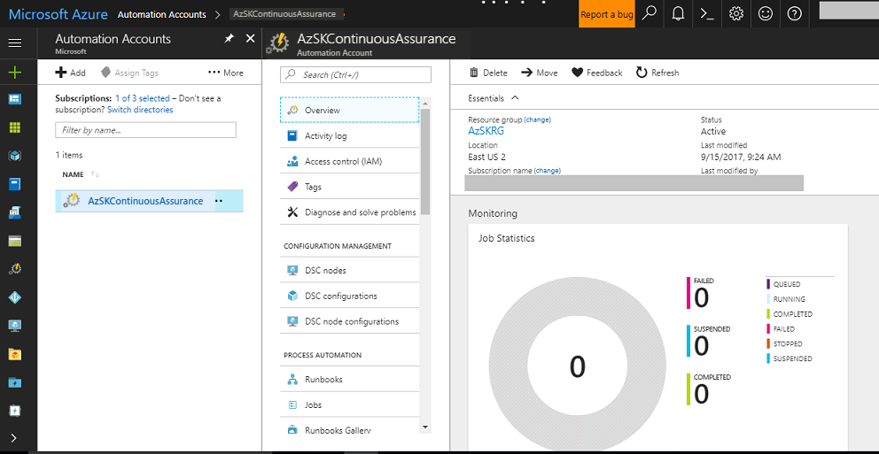
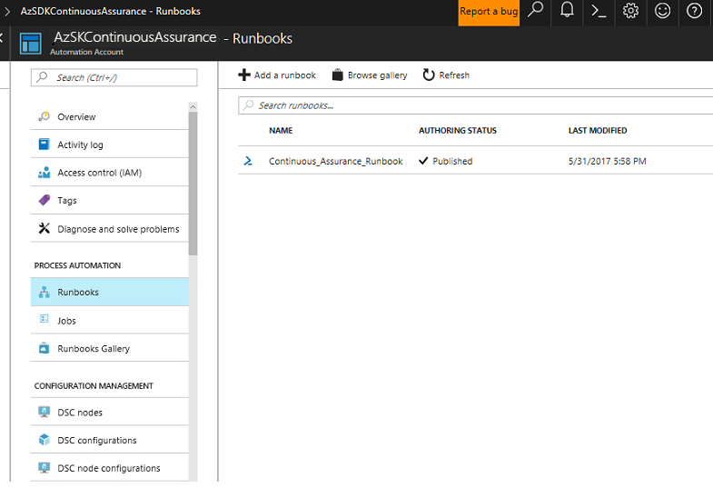
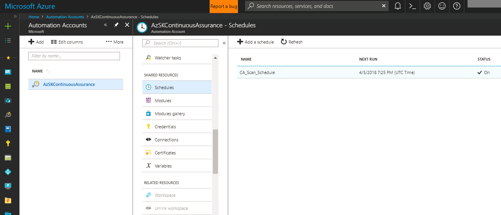
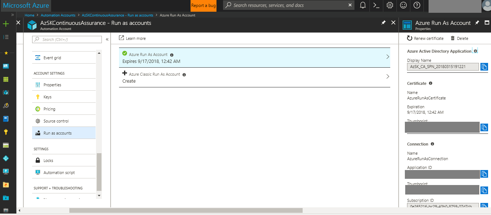
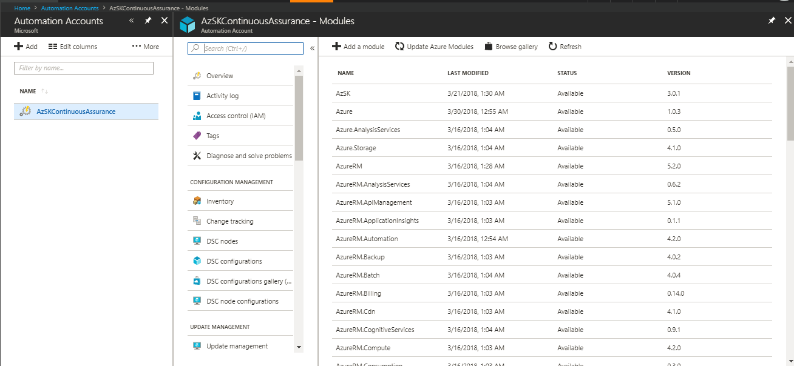
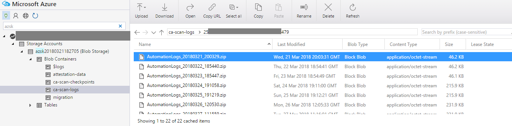
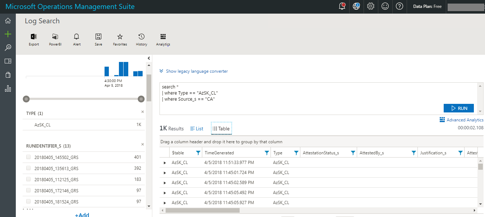

# Continuous Assurance (CA)


## Baseline Continuous Assurance
### Contents
- [Overview](Readme.md#overview)
- [Setting up Continuous Assurance - Step by Step](Readme.md#setting-up-continuous-assurance---step-by-step)
- [Continuous Assurance - how it works (under the covers)](Readme.md#continuous-assurance---how-it-works-under-the-covers)
- [Update existing Continuous Assurance Automation Account](Readme.md#update-existing-continuous-assurance-automation-account)
- [Remove Continuous Assurance Automation Account](Readme.md#remove-continuous-assurance-automation-account)
- [Fetch details of an existing Continuous Assurance Automation Account](Readme.md#fetch-details-of-an-existing-continuous-assurance-automation-account)
- [Continuous Assurance through central scanning mode (Preview) - Step by Step](Readme.md#continuous-assurance-through-central-scanning-mode-preview---step-by-step)
- [FAQ](Readme.md#faq)

-----------------------------------------------------------------
### Overview 
The basic idea behind Continuous Assurance (CA) is to setup the ability to check for "drift" from what is 
considered a secure snapshot of a system. Support for Continuous Assurance lets us treat security truly as 
a 'state' as opposed to a 'point in time' achievement. This is particularly important in today's context 
when 'continuous change' has become a norm.

There can be two types of drift: 
1. Drift involving 'baseline' configuration:
This involves settings that have a fixed number of possible states (often pre-defined/statically determined 
ones). For instance, a SQL DB can have TDE encryption turned ON or OFF…or a Storage Account may have 
auditing turned ON however the log retention period may be less than 365 days. 	 
2. Drift involving 'stateful' configuration: There are settings which cannot be constrained within a finite 
set of well-known states. For instance, the IP addresses configured to have access to a SQL DB can be any (arbitrary) set of IP addresses. In such scenarios, usually human judgment is initially required to determine whether a particular configuration should be considered 'secure' or not. However, once that is done, it is important to ensure that there is no "stateful drift" from the attested configuration. (E.g., if, in a troubleshooting session, someone adds the IP address of a developer machine to the list, the Continuous Assurance feature should be able to identify the drift and generate notifications/alerts or even trigger 'auto-remediation' depending on the severity of the change). 

Besides 'drift tracking' there are also two other aspects of "staying secure" in operations. First of them 
is the simple concept that if new, more secure options become available for a feature, it should be possible to detect that 
a particular application or solution can benefit from them and notify/alert the owners concerned. In a way this can be thought 
of as facilitating "positive" security drift. The other aspect is about supporting "operational hygiene". In this area, 
we will add the ability to remind an app team about the security hygiene tasks that they need to periodically 
perform (key rotation, access reviews,  removing inactive/dormant power users, etc.). These two capabilities are on our backlog for H1-FY18.

>**Note:** If you have already installed Continuous Assurance using a version prior to 2.2.0, 
you should run 'Install-AzSKContinuousAssurance' command again by following the steps in the next section.


[Back to top…](Readme.md#contents)
### Setting up Continuous Assurance - Step by Step
In this section, we will walk through the steps of setting up a subscription and application(s) for Continuous Assurance coverage. 

To get started, we need the following:
1. The user setting up Continuous Assurance needs to have 'Owner' access to the subscription. (This is necessary because during setup, 
AzSK adds the service principal runtime account as a 'Reader' to the subscription.) 

2. Target OMS WorkspaceID* and SharedKey. (The OMS workspace can be in a different subscription, see note below)


> **\*Note** CA leverages an OMS repository for aggregating security scan results, you must determine which OMS workspace 
you will use to view the security state of your subscription and applications (If you don't have an OMS repository please 
follow the steps in [Setting up the AzSK OMS Solution](../05-Alerting-and-Monitoring/Readme.md) ). 
This can be a single workspace that is shared by multiple applications which may themselves be in different subscriptions. 
Alternately, you can have an OMS workspace that is dedicated to monitoring a single application as well. 
(Ideally, you should use the same workspace that is being used to monitor other aspects like availability, performance, etc. 
for your application.)


**Step-1: Setup**  
0. Setup the latest version of the AzSK following the installation instructions for your organization. (For MSIT use https://aka.ms/azsdkdocs).
1. Open the PowerShell ISE and login to your Azure account (using **Login-AzureRmAccount**).  
2. Run the '**Install-AzSKContinuousAssurance**' command with required parameters given in below table. 

```PowerShell
	Install-AzSKContinuousAssurance -SubscriptionId <SubscriptionId> `
		[-AutomationAccountLocation <AutomationAccountLocation>] `
	        -ResourceGroupNames <ResourceGroupNames> `
	        -OMSWorkspaceId <OMSWorkspaceId> `
	        -OMSSharedKey <OMSSharedKey> `
	        [-AltOMSWorkspaceId <AltOMSWorkspaceId>] `
	        [-AltOMSSharedKey <AltOMSSharedKey>] `
	        [-WebhookUrl <WebhookUrl>] `
	        [-WebhookAuthZHeaderName <WebhookAuthZHeaderName>] `
	        [-WebhookAuthZHeaderValue <WebhookAuthZHeaderValue>] `
	        [-ScanIntervalInHours <ScanIntervalInHours>] `
	        [-AzureADAppName <AzureADAppName>]
```

|Param Name|Purpose|Required?|Default value|Comments|
|----|----|----|----|----|
|SubscriptionId|Subscription ID of the Azure subscription in which an Automation Account for Continuous Assurance will be created |TRUE|None||
|AutomationAccountLocation|(Optional) The location in which this cmdlet creates the Automation Account|FALSE|EastUS2|To obtain valid locations, use the Get-AzureRMLocation cmdlet|
|ResourceGroupNames|Comma separated list of resource groups within which the application resources are contained.|TRUE|None||
|OMSWorkspaceId|Workspace ID of OMS which is used to monitor security scan results|TRUE|None||
|OMSSharedKey|Shared key of OMS which is used to monitor security scan results|TRUE|None||
|AltOMSWorkspaceId|(Optional) Alternate Workspace ID of OMS to monitor security scan results|FALSE|None||
|AltOMSSharedKey|(Optional) Shared key of Alternate OMS which is used to monitor security scan results|FALSE|None||
|WebhookUrl|(Optional) All the scan results shall be posted to this configured webhook |FALSE|None||
|WebhookAuthZHeaderName|(Optional) Name of the AuthZ header (typically 'Authorization')|FALSE|None||
|WebhookAuthZHeaderValue|(Optional) Value of the AuthZ heade |FALSE|None||
|ScanIntervalInHours|(Optional) Overrides the default scan interval (24hrs) with the custom provided value |FALSE|None||
|AzureADAppName|(Optional) Name for the Azure Active Directory(AD) Application that will be created in the subscription for running the runbooks. |FALSE|None||

**More about the 'AzureAdAppName' parameter:**

The AzureADAppName parameter is optional. This represents the runtime account that will be used by the
CA runbook to scan the subscription/resources. 
- If the user does not specify a parameter, then CA will: 
    - Find if there is an existing AAD app (from a previous attempt to setup CA) in the subscription that can be reused.
    - Else, create a fresh Azure AD app on behalf of the user (in this case the user must have permission to create apps in the tenant).
- If the user specifies an AzureADAppName, then CA will try to find the AAD application corresponding to that 
name and attempt to use it (in this case the user must have 'Owner' permission on the specified app name). 

Here's a quick summary of the permissions required for the user who sets up CA:
- "Owner" access on the subscription
- Ability to create an AAD app in the tenant (this app is used as the runtime account for scanning via the CA runbook)
- "Owner" acceess to the AAD app if the user specifies one (or CA internally finds a previously created one)


**Note-1**: Completion of this one-time setup activity can take up to 2 hours. (This is because one of the things that setup does 
is download and add PowerShell modules for Azure PS library and for AzSK. This is a slow and sometimes flaky process and, 
as a result, the setup internally retries failed downloads. The Azure Automation product team is aware of this challenge and are working on a resolution.)


**Note-2**: Due to the complexity of various dependent activities involved, there are multiple places where CA setup can get tripped up. 
It is important to verify that everything has worked without hiccups. Please review and ascertain each of the "Verifying" steps below carefully.


**Step-2: Verifying that CA Setup is complete**  
**1:** In the Azure portal, select the application subscription that was used above and search for resources of type Automation Account. You should see an Automation Account created by the name 'AzSKContinuousAssurance'. Clicking on it will display the contents of the Automation Account (something that looks like the below, the counts shown may vary a little):

 

**2:** Click on 'Runbooks' tile. It should show the following runbook: 
	
 

**3:** Click on 'Schedules' tile. It should show the scheduling details of runbook. You can change the schedule timings according to your need. Default schedule is created as below. First job will run ten minutes after the installation: 

 

**4:** Click on 'Run As Accounts' tile. It should show the following account:

 

**Step-3: Verifying that all required modules are downloaded successfully (after about two hours of starting the installation)**

**1**: Click on the 'Modules' tile for the Automation Account. 'AzSK' module should be listed there. 'Status' column value for all modules should be 'Available' as below.

 
 
**Step-4: Verifying CA Runbook execution and OMS connectivity**  
Once CA setup and modules download are completed successfully, the runbooks will automatically execute periodically (once a day) and scan the subscription and the specified resource groups for the application(s) for security issues. The outcomes of these scans will get stored in a storage account created by the installation (format : azsk\<YYYYMMDDHHMMSS> e.g. azsk20170505181008) and follows a similar structure as followed by standalone SVT execution (CSV file, LOG file, etc.).    

The results of the control evaluation are also routed to the OMS repository for viewing via a security dashboard.  
  
Let us verify that the runbook output is generated as expected and that the OMS connectivity is setup and working correctly.

**1:** Verify that CSV file and LOG file are getting generated as expected.  
 
1. Go to Storage Explorer and look for a storage account with a name in azsk<YYYYMMDDHHMMSS> format in your subscription in 'AzSKRG' resource group.
2. Find a container called 'azskexecutionlogs' in this storage account.
3. There should be a ZIP file named using a timestamp based on the date time for the manual execution in this container (most likely the ZIP file with the most recent creation date). 
4. Download the ZIP file and extract its contents locally. The folder structure will be similar to how SVTs/Subscription Health scan generate when run locally. 
5. In a single zip file you will find two folders (name format: Timestamp). One folder contains reports of Subscription Health scan and another folder contains reports of application(s) resource groups security scan.
	
 

**2:** Verify that data is being sent to the target OMS workspace   

1. Go to the OMS dashboard that we used to setup CA above.
2. In the 'Search' window, enter Type=AzSK_CL Source_s=CC. Source will be changed to 'CA' in future.
3. You should see results similar to the below:
	
 

Once CA is setup in the subscription, an app team can start leveraging the OMS Solution from AzSK as a one-stop dashboard 
for visibility of security state. Please follow the steps in the OMS solution setup (in Alerting & Monitoring sub-section of 
this notebook) to enable that part.

[Back to top…](Readme.md#contents)
### Continuous Assurance - how it works (under the covers)
The CA feature is about tracking configuration drift. This is achieved by enabling support for running AzSK 
SVTs/SS-Health via automation runbook. 

The CA installation script that sets up CA creates the following resources in your subscription:

- Resource group (Name : AzSKRG) :- 
To host all the Continuous Assurance artifacts
- Storage account (Format : azskYYYYMMDDHHMMSS) :- To store the daily results of CA scans. The storage account is named with a timestamp-suffix applied to 'azsk'(e.g. azsk20170420111140)
- Azure AD App and Service Principal :- This is used as the runtime identification of the automation runbook. Adds SPN to 'Reader' role on the subscription and contributor role on the resource group containing Automation Account.
- Automation Account (Name : AzSKContinuousAssurance) :- Creates the following assets within the Automation Account,
   - Runbook (Name : Continuous_Assurance_Runbook) - To download/update Azure/AzSK modules and scan subscription/app resource groups  
   - Variables 
      - AppResourceGroupNames 
      - OMSWorkspaceId 
      - OMSSharedKey 
      - ReportLogsStorageAccountName
   - Azure Run As Account - To authenticate runbook at runtime  
      This account uses below certificate and connection.  
      AzureRunAsCertificate - This certificate gets expired after six months of installation  
      AzureRunAsConnection - This connection is created using service principal with a AzureRunAsCertificate
   - Two schedules to trigger the runbook :-
      - CA_Scan_Schedule - This is to trigger job to scan subscription and app resource groups 
      - CA_Helper_Schedule - This is a temporary schedule created by runbook to retry download of modules
   - Modules - Downloaded by the runbook
   
About 63 assets are created overall.

#### Next Steps
Once CA is setup in the subscription, an app team can start leveraging the OMS Solution from AzSK as a one-stop dashboard for visibility of security state.
Occasionally, you may also feel the need to tweak the configuration of CA. See the "Update" section below about how to do that.

[Back to top…](Readme.md#contents)
### Update existing Continuous Assurance Automation Account
The '**Update-AzSKContinuousAssurance**' command can be used to make changes to a previously setup CA configuration.
For instance, you may use it to:
- update the target resource groups to include in the scanning
- switch the OMS workspace information that CA should use to send control evaluation events to
- use a different AAD SPN for the runbooks 
- etc.

To do any or all of these:
1. Open the PowerShell ISE and login to your Azure account (using **Login-AzureRmAccount**).  
2. Run the '**Update-AzSKContinuousAssurance**' command with required parameters given in below table. 

```PowerShell
Update-AzSKContinuousAssurance -SubscriptionId <SubscriptionId> `
    [-ResourceGroupNames <ResourceGroupNames>] `
    [-OMSWorkspaceId <OMSWorkspaceId>] `
    [-OMSSharedKey <OMSSharedKey>] `
    [-AltOMSWorkspaceId <AltOMSWorkspaceId>] `
    [-AltOMSSharedKey <AltOMSSharedKey>] `
    [-WebhookUrl <WebhookUrl>] `
    [-WebhookAuthZHeaderName <WebhookAuthZHeaderName>] `
    [-WebhookAuthZHeaderValue <WebhookAuthZHeaderValue>] `
    [-ScanIntervalInHours <ScanIntervalInHours>] `
    [-AzureADAppName <AzureADAppName>] `
    [-FixRuntimeAccount] ` 
    [-FixModules] `
    [-RenewCertificate]
```

|Param Name|Purpose|Required?|Default value|Comments
|----|----|----|----|----|
|SubscriptionId|Subscription ID of the Azure subscription in which Automation Account exists |TRUE|None||
|ResourceGroupNames|Use this parameter if you want to update the comma separated list of resource groups within which the application resources are contained. The previously configured list of RGs will be replaced with the one provided here.|FALSE|None||
|OMSWorkspaceId|Use this parameter if you want to update the workspace ID of OMS which is used to monitor security scan results|FALSE|None||
|OMSSharedKey|Use this parameter if you want to update the shared key of OMS which is used to monitor security scan results|FALSE|None||
|AltOMSWorkspaceId|(Optional) Alternate Workspace ID of OMS to monitor security scan results|FALSE|None||
|AltOMSSharedKey|(Optional) Shared key of Alternate OMS which is used to monitor security scan results|FALSE|None||
|WebhookUrl|(Optional) All the scan results shall be posted to this configured webhook |FALSE|None||
|WebhookAuthZHeaderName|(Optional) Name of the AuthZ header (typically 'Authorization')|FALSE|None||
|WebhookAuthZHeaderValue|(Optional) Value of the AuthZ heade |FALSE|None||
|ScanIntervalInHours|(Optional) Overrides the default scan interval (24hrs) with the custom provided value |FALSE|None||
|AzureADAppName|Use this parameter if you want to update the connection (used for running the runbook) with new AD App and Service principal|FALSE|None|This is useful if existing connection is changed/removed by mistake|
|FixRuntimeAccount|Use this switch to fix CA runtime account in case of below issues.<ol><li>Runtime account deleted<br>(Permissions required: Subscription owner)</li><li>Runtime account permissions missing<br>(Permissions required: Subscription owner and AD App owner)</li><li>Certificate deleted/expired<br>(Permissions required: Subscription owner and AD App owner)</li></ol>|FALSE|None||
|FixModules|Use this switch in case 'AzureRm.Automation' module extraction fails in CA Automation Account.|FALSE|None||
|RenewCertificate|Renews certificate credential of CA SPN if the caller is Owner of the AAD Application (SPN). If the caller is not Owner, a new application is created with a corresponding SPN and a certificate owned by the caller. CA uses the updated credential going forward.|FALSE|None||

[Back to top…](Readme.md#contents)
### Remove Continuous Assurance Automation Account
1. Open the PowerShell ISE and login to your Azure account (using **Login-AzureRmAccount**).  
2. Run the '**Remove-AzSKContinuousAssurance**' command as below. 

```PowerShell
Remove-AzSKContinuousAssurance -SubscriptionId <SubscriptionId>  [-DeleteStorageReports] 
```
|Param Name |Purpose |Required?	|Default value	|Comments|
|-----|-----|-----|----|-----|
|SubscriptionId	|Subscription ID of the Azure subscription in which Automation Account exists |True |None||	 
|DeleteStorageReports |Add this switch to delete AzSK execution reports from storage account. This will delete the storage container where reports are stored. Generally you will not want to use this option as all previous scan reports will be purged. |False |None||  

[Back to top…](Readme.md#contents)
### Fetch details of an existing Continuous Assurance Automation Account
1. Open the PowerShell ISE and login to your Azure account (using **Login-AzureRmAccount**).  
2. Run the '**Get-AzSKContinuousAssurance**' command as below. 
3. Result will display the current status of CA in your subscription. If CA is not working as expected, it will display remediation steps else it will display a message indicating CA is in healthy state.  
4. Once you follow the remediation steps, run the command again to check if anything is still missing in CA setup. Follow the remediation steps accordingly until the CA state becomes healthy. 
```PowerShell
Get-AzSKContinuousAssurance -SubscriptionId <SubscriptionId> 
```
**Note:** This command is compatible only for Automation Account installed after 5th May, 2017 AzSK release.

[Back to top…](Readme.md#contents)

### Continuous Assurance through central scanning mode (Preview) - Step by Step

In scenarios where central team wants to monitor a group of subscriptions from a single and more controlled central subscription, this command would help to achieve such scenarios.
#### Pre-requisites:
- The user executing this command should have "Owner" access on all the subscriptions that are being enabled for central scanning mode including the central subscription.
- User should have the latest version of the kit installed on the machine (>= v2.8.1)
- Optional: Have the own instance of AzSK setup for your org. This would provide more capabilities to control the scanning behavior

#### Setup Continuous Assurance (CA) in central mode:
> **Note:** This feature is still in preview. 

This can be achieved by adding extra params to the existing CA command. You can run the command below:

```PowerShell
$SubscriptionId = '<subscriptionId>'
$ResourceGroupNames = '*' 
$OMSWorkspaceId = '<omsWorkspaceId>'
$OMSSharedKey = '<omsSharedKey>' 
$TargetSubscriptionIds = '<TargetSubscriptionId>' #Need to provide comma separated list of all subscriptionId that needs to be scanned.

Install-AzSKContinuousAssurance -SubscriptionId $SubscriptionId -TargetSubscriptionIds $TargetSubscriptionIds -ResourceGroupNames $ResourceGroupNames -OMSWorkspaceId $OMSWorkspaceId -OMSSharedKey $OMSSharedKey -Preview
```
</br>

|Param Name| Purpose| Required?| DefaultValue| Comments|
|----------|--------|----------|-------------|---------|
|SubscritionId| Central subscriptionId which is responsible for scanning all the other subscriptions| True | This subscription would host the Automation account which is responsible for scanning all the other subscriptions|
|TargetSubscriptionIds| Comma separated list of subscriptionIds that needs to be scanned by the central subscription. Host subscription is always appended by default. No need to pass that value in this param| True | The user executing this command should be owner on these subscriptions. |
|ResourceGroupNames| Comma separated list of ResourceGroupNames| True | Since you are planning to run in the central mode, you should use * as its value. This is because you need not have the same RG across all the subscriptions|
|OMSWorkspaceId| All the scanning events will be send to this OMSWorkspace. This will act as central monitoring dashboard | True | |
|OMSSharedKey| OMSSharedKey for the central monitoring dashboard| True | |
|AltOMSWorkspaceId|(Optional) Alternate Workspace ID of OMS to monitor security scan results|FALSE|None||
|AltOMSSharedKey|(Optional) Shared key of Alternate OMS which is used to monitor security scan results|FALSE|None||
|WebhookUrl|(Optional) All the scan results shall be posted to this configured webhook |FALSE|None||
|WebhookAuthZHeaderName|(Optional) Name of the AuthZ header (typically 'Authorization')|FALSE|'Authorization'||
|WebhookAuthZHeaderValue|(Optional) Value of the AuthZ heade |FALSE|24 hrs||
|ScanIntervalInHours|(Optional) Overrides the default scan interval (24hrs) with the custom provided value |FALSE|None||
|LoggingOption| "IndividualSubs/CentralSub". This provides the capability to users to store the CA scan logs on central subscription or on individual subscriptions| False |CentralSub |
|Preview| It is mandatory to use preview switch| True | |

#### Append/modify/fix the central CA setup

In case you want to 
</br>(a) add new subscriptions to central scanning mode, or 
</br>(b) CA is not using the latest runbook, or 
</br>(c) OMS workspace needs to be updated, or
</br>(d) OMS keys have been rotated and you want to use the latest keys, or
</br>(e) AltOMS workspace details needs to updated, or
</br>(f) Webhook details needs to updated, or
</br>(g) ScanInterval needs to updated, or
</br>(h) the scanning account credential needs to be rotated as part of hygiene/ expiry, or
</br>(i) modify the logging option to central mode

In all such scenarios, you can run the command below:

```PowerShell
$SubscriptionId = '<subscriptionId>'
$OMSWorkspaceId = '<omsWorkspaceId>'
$OMSSharedKey = '<omsSharedKey>' 
$TargetSubscriptionIds = '<TargetSubscriptionId>' #Need to provide comma separated list of all subscriptionId that needs to be scanned.

Update-AzSKContinuousAssurance -SubscriptionId $SubscriptionId -TargetSubscriptionIds $TargetSubscriptionIds -OMSWorkspaceId $OMSWorkspaceId -OMSSharedKey $OMSSharedKey -FixRuntimeAccount -LoggingOption CentralSub -Preview
```
</br>

|Param Name| Purpose| Required?| DefaultValue| Comments|
|----------|--------|----------|-------------|---------|
|SubscritionId| Central subscriptionId which is responsible for scanning all the other subscriptions| True | This subscription would host the Automation account which is responsible for scanning all the other subscriptions|
|TargetSubscriptionIds| Comma separated list of subscriptionIds that needs to be scanned by the central subscription. It would always append the values provided in this param to the current scanning list.| True | The user executing this command should be owner on these subscriptions. |
|OMSWorkspaceId| All the scanning events will be send to this OMSWorkspace. This will act as central monitoring dashboard | False | Only provide if you want to change the workspace details |
|OMSSharedKey| OMSSharedKey for the central monitoring dashbaord| False | Only provide if you want to update the OMS Sharedkey along with workspaceId param |
|LoggingOption| "IndividualSubs/CentralSub" | False | Only provide if you want to change the logging option|
|FixRuntimeAccount| This will correct all the permissions issues related to the scanning account| False | Provide this switch only when you want to add new subscriptions for central scanning mode or if scanning account credential needs to be updated |
|Preview| It is mandatory to use preview switch| True | |

#### Diagnose the health of central CA

You could run the command below. It would diagnose the Continuous Assurance Automation account running under central subscription

```PowerShell
$SubscriptionId = '<subscriptionId>'

Get-AzSKContinuousAssurance -SubscriptionId $SubscriptionId -ExhaustiveCheck
```
</br>

|Param Name| Purpose| Required?| DefaultValue| Comments|
|----------|--------|----------|-------------|---------|
|SubscritionId| Central SubscriptionId which is responsible for scanning all the other subscriptions| True | This subscription would host the Automation account which is responsible for scanning all the other subscriptions|
|ExhaustiveCheck| By appending this switch it would check whether all the modules installed in central automation account are up to date| False | Only include if default diagnosis is not resulting in any issue |

#### Remove CA from the central subscription

In case you want to 
</br>(a) unregister some subs from central scanning mode, or 
</br>(b) to delete the scan logs, or 
</br>(c) to remove the whole automation account

```PowerShell
$SubscriptionId = '<subscriptionId>'

Remove-AzSKContinuousAssurance -SubscriptionId $SubscriptionId -DeleteStorageReports -Preview 
```


|Param Name| Purpose| Required?| DefaultValue| Comments|
|----------|--------|----------|-------------|---------|
|SubscritionId| Central SubscriptionId which is responsible for scanning all the other subscriptions| True | This subscription would host the Automation account which is responsible for scanning all the other subscriptions|
|TargetSubscriptionIds| Comma separated list of target subIds which will be un-registered from the central scanning mode. | False | |
|DeleteStorageReports| Deletes all the scan logs from the azsk storage account based on the logging option and value provided in the target subscription. If used with out preview switch, it would remove all logs from the host sub central storage account.| False | Only include if default diagnosis is not resulting in any issue |

>**Note** If just subscrptionId is passed, then it would check if the host sub is in central scanning mode, if so, user needs to pass Preview switch. In these scenarios, it would remove the whole automation account from host sub.

[Back to top…](Readme.md#contents)

### FAQ

#### What permission do I need to setup CA?
You need to be 'Owner' on the subscription.
This is required because, during CA setup, we add RBAC access to an Azure AD App (SPN) that's utilized for running the 'security scan' runbooks in Azure Automation. Only an'Owner' for a subscription has the right to change subscription RBAC.  

#### Is it possible to setup CA if there is no OMS workspace?
No. The intent of CA is to scan regularly and be able to monitor the outcomes for security drift. Out of the box, AzSK CA uses OMS for the monitoring capabilities. (Basically, AzSK sends control evaluation results to a connected OMS workspace.)  

#### Which OMS workspace should I use for my team when setting up CA?
Check with your service offering leader/org's cloud lead.
You would typically use one of the following options:
- Utilize a workspace is shared across a related set of services from your SO
- Create a new OMS workspace and use that exclusively for your service ('free' tier is OK for just AzSK use cases)
- Utilize an IT-wide shared workspace  

#### Why does CA setup ask for resource groups?
CA supports scanning a subscription and a set of cloud resources that make up an application. These cloud resources are assumed to be hosted within one or more resource groups. A typical CA installation takes both the subscription info and resource groups info.

#### How can I find out if CA was previously setup in my subscription?
You can check using the "Get-AzSKContinuousAssurance" cmdlet. If CA is correctly setup, it will show a list of artifacts that are deployed during CA setup (e.g., Automation Account, Connections, Schedules, OMS workspace info, etc.). If CA has not been setup, you will see a message indicating so.

#### How can I tell that my CA setup has worked correctly?
There are 2 important things you should do to verify this:
Run the Get-AzSKContinuousAssurance and confirm that the output tells you as in the previous question.
Verify that the runbooks have actually started scanning your subscription and resource groups. You can check for this in OMS.
  
#### Is providing resource groups mandatory?
We would like teams to, at a minimum, provide the list of resource groups that cover the most critical components of their application. It is unlikely that you will just have a subscription but no important resources inside it. Still, if you absolutely can't provide a resource group, then specify the "*"* as the resource group when setting up CA. 
If you do provide **"*"** as an option, CA will automatically grow/shrink the resource group list as you add/delete resource groups in your subscription.
  
#### What if I need to change the resource groups after a few weeks?
That is easy! Just run the Update-AzSKContinuousAssurance cmdlet with the new list of resource groups you would like monitored.
  
#### Do I need to also setup AzSK OMS solution?
This part is not mandatory for CA itself to work.
However, setting up the AzSK OMS solution is recommended as it will help you get a richer view of continuous assurance for your subscription and resources as scanned by CA. Secondly, it will give you several out-of-box artefacts to assist with security monitoring for your service. For instance, you will start getting email alerts if any of the high or critical severity controls from AzSK fail in your service.  

#### How much does it cost to setup Continuous Assurance alongwith OMS monitoring solution?
Using the following ballpark calculations (and service costs as of Q1-FY18), we estimate that a Continuous Assurance
setup along with an OMS workspace for monitoring will cost a little about $80/year for a typical
subscription with about 30-40 resources of various types. 
 
The average cost of AzSK CA and AzSK OMS solution per Azure resources comes to about $2.7 per year. (So, assuming
that a typical app has about 30 resources, we get about $81/year for an application.) 

The main/dominant component of the cost is automation runtime (storage/OMS costs are negligible in comparison). 
 

###### Assumptions:

- Typical application = 1 subscription + 3 resource groups (RGs) = ~30 resources (10 resources per RG)
- About 3 min per resource scan (higher side) => max ~100 min runbook time each day
- Central telemetry DB cost is not included (as in our model that’s not borne by individual app teams)
		 
###### (a) Automation Runtime cost: ($80/year)

- Rate = $0.002/min of automation job
- For a 100 min runbook == $ 0.2 / day  
			=> $80 / year
		 
###### (b) Blob Storage cost:  ($0.14/year)
			
- AzSK CA Storage accumulation = 150KB / resource * 30 =  4.5MB per day
- Average data for the month = 70MB (let’s take 100MB for simplicity) 
- Retention Cost: 
    - Rate = $.03/50TB/month for GRS-cool SKU 
		=> Average for the year ~ 0.6GB => cost =  $0.03*0.6*12/50000 ~ $4x10^-6/year 

- Access Cost (Listing): 
	- Rate = $0.2/10000 transactions
	- Our usage = ~ 1000 per year => $0.02 / year
   
- Access Cost (replication+retrieval): 
    - Rate = $0.1/GB
	- Our usage = ~ 1.2GB per year = $0.12 / year

- Total Blob Storage Cost (retention + listing + access)
	- 0.00 + 0.12 + 0.02 = $0.14/year
 
###### (c) OMS storage cost: ($0.34/year)

- Assumes that the team is using OMS for monitoring in general, otherwise, just for AzSK, free tier is sufficient.
- Data Upload
    - Rate = $2.3 / GB / month
	- Our usage = 10KB / resource scan => 300KB added per day = ~10MB data written for the month  = (2.3*10*12/1000) = $0.27/year

- Retention 
	- Rate - $0.10 / GB / month
	- Our usage = 60MB avg/month (at mid-year)  = $0.10 * 0.06 *12 = $0.07/year

- Total OMS Cost (Upload + Retention)  
     - 0.27+0.07 = $0.34/year


#### Troubleshooting
Please reach out to us at AzSDKSupExt@microsoft.com if you face any issues with this feature. 

[Back to top…](Readme.md#contents)

