> The Secure DevOps Kit for Azure (AzSK) was created by the Core Services Engineering & Operations (CSEO) division at Microsoft, to help accelerate Microsoft IT's adoption of Azure. We have shared AzSK and its documentation with the community to provide guidance for rapidly scanning, deploying and operationalizing cloud resources, across the different stages of DevOps, while maintaining controls on security and governance.
AzSK is not an official Microsoft product – rather an attempt to share Microsoft CSEO's best practices with the community..

><b>NOTE:</b>  
>The OMS* parameter/variable names will soon be deprecated. Please ensure that you have made the necessary changes to CA, CICD and AzSK Monitoring Solution as per below:  
>	1. Updated CA setups with new names ([details here](../04-Continous-Assurance#updating-an-existing-continuous-assurance-setup)). (Not required for CSEO subscriptions!)  
>	2. Switched to new names in CICD extension ([details here](../03-Security-In-CICD#advanced-cicd-scanning-capabilities)). (Required for all subscriptions)  
>	3. Start using the new parameters for [CA](../04-Continous-Assurance#setting-up-continuous-assurance---step-by-step) and [AzSK Monitoring Solution](../05-Alerting-and-Monitoring#1-c).

# Alerting & Monitoring

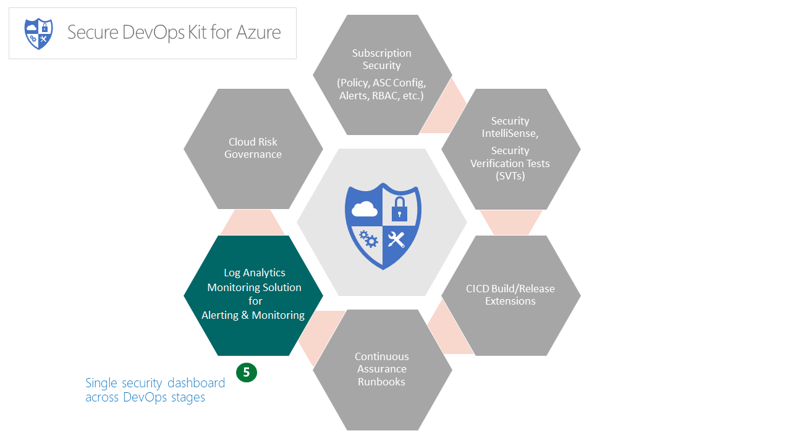

## Monitoring Solution for AzSK
 ### Contents
- [Overview](Readme.md#overview)
- [Components of the AzSK Monitoring Solution](Readme.md#components-of-the-azsk-monitoring-solution)
- [Setting up the AzSK Monitoring Solution (Step by Step)](Readme.md#setting-up-the-azsk-monitoring-solution-step-by-step)
- [Guide to AzSK Monitoring Solution queries](Readme.md#guide-to-azsk-monitoring-solution-queries)
- [Next Steps](Readme.md#next-steps)
- [Appendix](Readme.md#appendix)
  - [Creating a Log Analytics workspace](Readme.md#a-creating-a-log-analytics-workspace)
  - [Testing Log Analytics workspace connectivity](Readme.md#b-testing-log-anaytics-workspace-connectivity)
  - [Routing AzSK events to Log Analytics](Readme.md#c-routing-azsk-events-to-log-analytics)
  - [Leveraging other Management Solutions from the Azure Marketplace](Readme.md#d-leveraging-other-management-solutions-from-the-azure-marketplace)

--------------------------
### Overview: 
The Alerting & Monitoring features of AzSK empower dev ops teams with the following capabilities:
- a single pane of glass view of cloud security across dev ops stages
- visibility to control status for their Azure subscription and critical enterprise/application resources
- pre-configured search queries for creating alerts to facilitate action on security drift

Out of the box, these capabilities can be leveraged via the Log Analytics-based Monitoring solution in AzSK.

However, a dev ops team can equally easily leverage a different system for log analytics (e.g., Splunk) and view the AzSK control evaluation events
in the alternate system. This can be accomplished by using connectors for Event Hubs or Webhooks in the AzSK.
  
[Back to top…](Readme.md#contents)


### Components of the AzSK Monitoring Solution
The AzSK Monitoring Solution is deployed to a Log Analytics workspace that is used by the dev ops team for monitoring and 
generating a dashboard for security monitoring and alerting based on AzSK control evaluation events.

The out of box security dashboard generated by the AzSK Monitoring Solution includes:
1. An "Overview tile" for the Log Analytics workspace summary (Home view)
2. A detailed "View dashboard" comprised of multiple blades displaying security control status for your: 
   a) subscription, 
   b) express route networks and 
   c) other cloud resources (shown with various pivots)
3. Ready to use Logs queries for security drift conditions

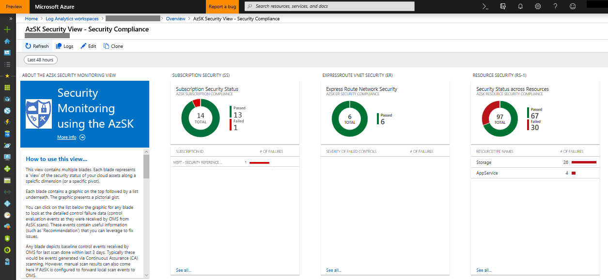  

[Back to top…](Readme.md#contents)

### Setting up the AzSK Monitoring Solution (Step by Step)
This section will walk you through the step-by-step experience of setting up the AzSK Monitoring Solution.

Note that for the Monitoring Solution to display anything, you have to configure AzSK in SDL or CICD or
CA mode to send events to the target Log Analytics workspace as mentioned [here](Readme.md#c-routing-azsk-events-to-log-analytics).

If you do not have a Log Analytics workspace yet, see [Appendix](Readme.md#appendix) to create one.

The rest of this section assumes that:
a) you have a Log Analytics worskpace**
b) you have setup AzSK to send events to that workspace (from one or more of SDL, CICD, CA stages)
c) some AzSK scans have run in respective stages and events are already present in the Log Analytics workspace

If you need help for any of the above, see the respective section in the [Appendix](Readme.md#appendix) at the bottom.

The AzSK Monitoring setup involves two sets of steps - one set to be run by the monitoring team that owns 
the Log Analytics workspace and the other set to be run by the application team (for applications which 
are to be monitored via a common Log Analytics dashboard). 
We will refer to the monitoring team as the "**Ops team**" and the application team as 
the "**App team**" below. 

The general model assumed is one where there are (1) multiple subscriptions covering a 
portfolio of applications for a business unit and (2) a central subscription that hosts the Log Analytics workspace for that business unit. We call the former the 'app subscriptions' and 
the latter the 'Log Analytics subscription'.

> **Note**: This is not to suggest a hard separation of roles between the actual individuals
involved. Indeed, most dev ops teams will have Dev rotating to support Ops and vice versa.)


### Step-1 (Ops Team): Deploy the AzSK Monitoring Solution

### [1-a]
Use Set-AzContext to choose the subscription corresponding to the Log Analytics workspace and run the command below 
to get the details about your Log Analytics workspace:

```PowerShell
 Set-AzContext -SubscriptionId '<subscriptionId here>'   #switch to the Log Analytics subscription
 Get-AzOperationalInsightsWorkspace #get info about the Log Analytics workspace (we'll need that below)
```

This outputs the Log Analytics workspaces from the Log Analytics subscription as shown below:

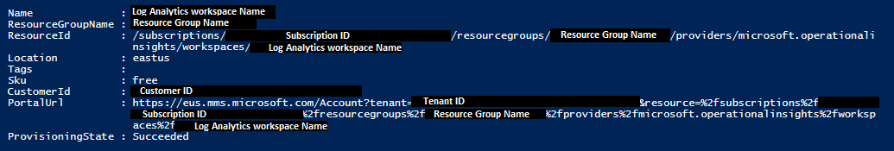

### [1-b]
Obtain the workspaceId and sharedKey for the Log Analytics workspace you'd like to use for monitoring.
Go to the Log Analytics workspace and navigate to "Advanced Settings -> Connected Sources -> Windows Servers" as shown in the image below:
> **Note**: The "Advanced Settings" option will be visible only if you have 'Owners' access (and have elevated to Owner if using PIM). It will not be visible if you are 'Reader'.


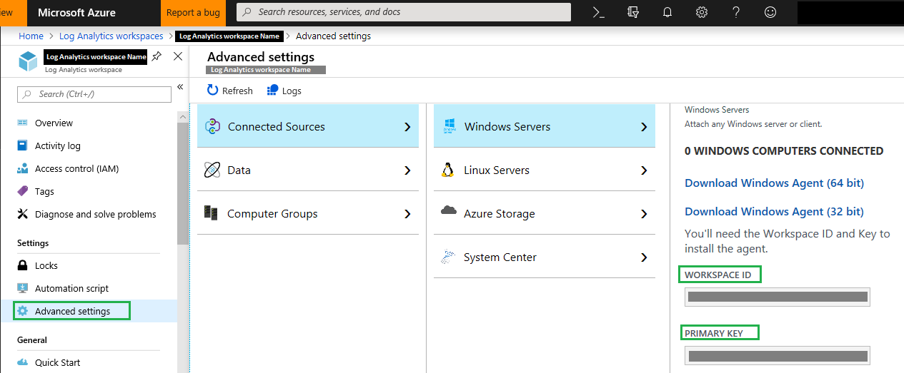


### [1-c]
Run the commands below in PS after replacing the various '<>' with
  (a) respective values for the Log Analytics workspace to be used
  and (b) a unique name to identify the view with in the Log Analytics workspace summary (Overview).

```PowerShell
    $lawsSubId ='<Log Analytics subscription id>'   #subscription hosting the Log Analytics workspace
    $lawsId ='<Log Analytics workspace id>'
    $lawsRGName ='<Log Analytics workspace resource group name>'     #RG where the Log Analytics workspace is hosted (See 1-a)
    $azSkViewName = '<unique_name_for_your_AzSK_view>' #This will identify the tile for AzSK view in Log Analytics workspace. E.g., MyApp-View-1


    #This command will deploy the AzSK view in the Log Analytics workspace. Happy monitoring!  
    Install-AzSKMonitoringSolution -LAWSSubscriptionId $lawsSubId `
                    -LAWSResourceGroup $lawsRGName `
                    -WorkspaceId $lawsId `
                    -ViewName $azSkViewName
```

The table below explains the different parameters used by Install-AzSKMonitoringSolution cmdlet:

|ParameterName|Comments|
| ----- | ---- | 
|LAWSSubscriptionId|Id of the subscription where the Log Analytics workspace is hosted|
|LAWSResourceGroup|Name of the resource group where the Log Analytics workspace is hosted|
|WorkspaceId|Workspace ID of the Log Analytics workspace name which will be used for monitoring|
|ViewName|Name of the AzSK Log Analytics Workspace summary (Overview) (unique per Log Analytics workspace)|

> Note: A resource group name such as 'mms-xxx' is used by default by the Monitoring setup process (where 'xxx' can 
be 'eus' or 'sea' etc. based on the region). If you specified a custom resource group name when creating 
the Log Analytics workspace, then remember to use *that* name in the install command above. 
If you forgot the custom resource group name you used, you can always use 
<code>Get-AzOperationalInsightsWorkspace</code> to see the correct value to use for 
the respective Log Analytics workspace.

The installation command will display output like the below:

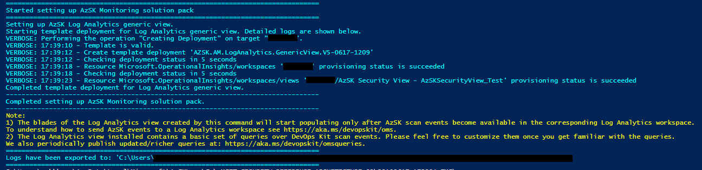
      
At this point, assuming that AzSK events were already being sent to the Log Analytics workspace, you should start
seeing a tile such as the one below:

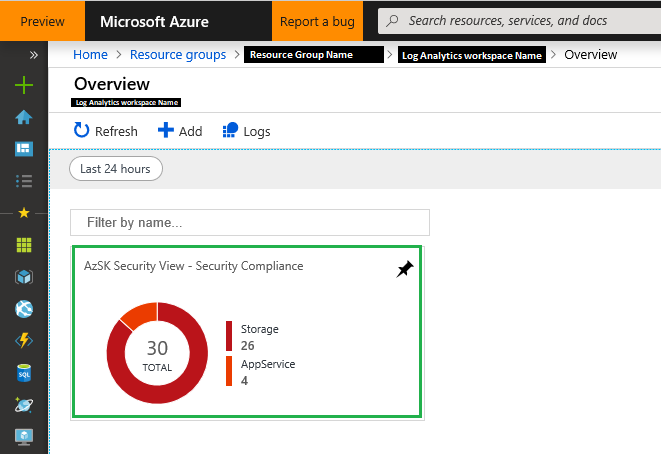


**Step-2 (Ops Team): Using the Log Analytics Workspace Summary (Overview) for monitoring**

**2 (a)** Viewing raw events from AzSK (sanity check)

Click on the 'Logs' in the menu bar on the left to open the "Logs" query page.

Enter "AzSK_CL" in the query field. (Old query: "Type=AzSK_CL")


You should see data about AzSK events as query results. (Again, this assumes that by now AzSK 
control scan results are being sent to this workspace. See [this](Readme.md#b-testing-log-anaytics-workspace-connectivity) for
how that is done.)

 

If you are certain that events are being sent to the Log Analytics workspace but you are seeing blank views/no query results, 
you may need to extend the duration applicable to the queries. (This can be done using the 'Time range' selector next to the 'Run' button at the top of the query window.)

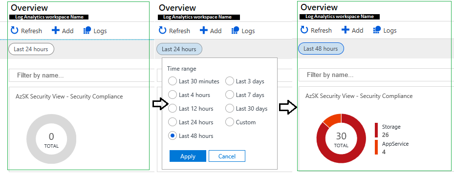

	

**2 (b)** Using the AzSK Monitoring Solution
The solution view contains multiple blades representing alerts, various types of security activity, 
security trends, etc. This view shows up when you click on the view tile and looks like the picture
below:

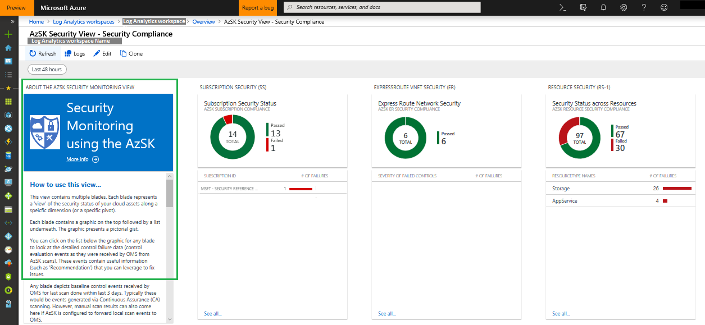

The very first (Summary) blade provides complete instructions on how to interpret the different
blades in this view. These blades cover the complete picture of baseline security compliance
for your subscription and resources. It starts with a couple of blades that display subscription
level security baseline issues and any issues with Express Route connections (if one is enabled
for your subscription). The subsequent blades display resource level security queries - each 
blade takes a different pivot to show the resource baseline compliance data. The very last blade
provides some handy queries that you can use to get started with building your own custom 
queries for log searches and alerting on top of the AzSK events in the repository.

As shown in the image below, you can dive deeper into a specific control failure and look at 
the AzSK control event for details such as severity, controlId, recommendation, etc. These 
are the same fields that display in the CSV file when you run the AzSK manually as a developer.

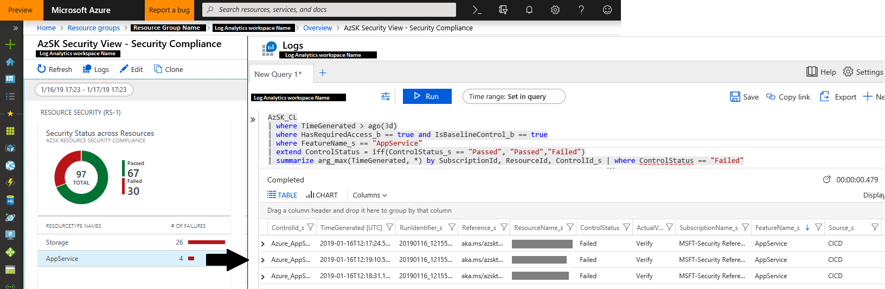
	
[Back to top…](Readme.md#contents)
### Guide to AzSK Monitoring Solution queries
This section walks you through the queries present in the AzSK Monitoring solution. To get the latest queries make sure that you have the latest solution installed in your Log Analytics workspace. To get the latest version of solution you need to re-install Monitoring solution using step **[[1-c]](#1-c)** mentioned above. The queries show the status of controls based on the following criteria.
- Each blade shows the aggregated control status for all subscriptions whose data is sent to the Log Analytics workspace.
- By default, each blade shows the status of baseline controls.
- The queries show counts based on control status received for last scan data(done with required access) received by the Log Analytics workspace.
- Any control status other than "Passed" is treated as "Failed"(including "Verify",Manual,etc.) in queries for calculating failure counts.

Details of various blades of Azure Security Health View are as follows:

**1) Subscription Security Status:** This blade shows the status of baseline Subscription Security controls of your subscription(s).

- Donut: The query below shows the aggregated control status of Subscription Security controls.

	``` AIQL
	AzSK_CL 
	| where TimeGenerated > ago(3d)  
	| summarize arg_max(TimeGenerated, *) by SubscriptionId,ControlId_s 
	| where HasRequiredAccess_b == true and IsBaselineControl_b == true  
	| where FeatureName_s == "SubscriptionCore"  
	| extend ControlStatus=iff(ControlStatus_s!= "Passed","Failed","Passed") 
	| summarize  count() by SubscriptionId,ControlId_s,ControlStatus 
	| summarize AggregatedValue = count() by ControlStatus 
	| sort by AggregatedValue desc
	```
- List: The query below shows the list of subscriptions that have one or more Subscription Security controls failing along with the number of controls failing on each subscription. 

	``` AIQL
	AzSK_CL 
	| where TimeGenerated > ago(3d)  
	| summarize arg_max(TimeGenerated, *) by SubscriptionName_s,ControlId_s 
	| where HasRequiredAccess_b == true and IsBaselineControl_b == true  
	| where FeatureName_s == "SubscriptionCore"  
	| extend ControlStatus=iff(ControlStatus_s!= "Passed","Failed","Passed") 
	| where ControlStatus=="Failed"
	| summarize  count() by SubscriptionName_s,ControlId_s,ControlStatus_s 
	| summarize AggregatedValue = count() by SubscriptionName_s 
	| sort by AggregatedValue desc
	```
	
**2) Express Route vNet Security Status:** This blade shows the status of baseline ERvNet Controls for virtual networks in your subscription that have Express Route connectivity setup.

- Donut: The query below shows the aggregated control status of ERvNet controls.

	``` AIQL
	AzSK_CL 
	| where TimeGenerated > ago(3d)  
	| where HasRequiredAccess_b == true and IsBaselineControl_b == true 
	| where FeatureName_s == "ERvNet"  
	| extend ControlStatus=iff(ControlStatus_s!= "Passed","Failed","Passed")   
	| summarize arg_max(TimeGenerated,*) by SubscriptionName_s,ResourceId,ControlId_s 
	| summarize AggregatedValue = count() by ControlStatus 
	| sort by AggregatedValue desc
	```
- List: The query below shows the list of subscriptions that have one or more ERvNet control failing and number of failures on each subscription.

	``` AIQL
	AzSK_CL 
	| where TimeGenerated > ago(3d)  
	| where HasRequiredAccess_b == true and IsBaselineControl_b == true 
	| where FeatureName_s == "ERvNet"  
	| extend ControlStatus=iff(ControlStatus_s!= "Passed","Failed","Passed")   
	| summarize arg_max(TimeGenerated,*) by  SubscriptionName_s,ResourceId,ControlId_s 
	| where ControlStatus =="Failed" 
	| summarize AggregatedValue = count() by SubscriptionName_s 
	| sort by AggregatedValue desc
	```

**3) Resource Security (RS-1):** This blade shows the status of baseline controls for all resources present on your subscription(s). The below image depicts the blade:


- Donut: The query below shows the aggregated status of controls for all the resources present on your subscription(s).

	``` AIQL
	AzSK_CL 
	| where TimeGenerated > ago(3d) 
	| where HasRequiredAccess_b == true and IsBaselineControl_b == true  
	| where FeatureName_s != "SubscriptionCore"  
	| extend ControlStatus = iff(ControlStatus_s == "Passed", "Passed","Failed") 
	| summarize arg_max(TimeGenerated, *) by SubscriptionId, ResourceId, ControlId_s 
	| summarize AggregatedValue = count() by ControlStatus 
	| sort by AggregatedValue desc
	```
- List: The query below shows the list of resource type that have one or more control failing along with the number of controls failing for each resource type.

	``` AIQL
	AzSK_CL  
	| where TimeGenerated > ago(3d) 
	| where HasRequiredAccess_b == true and IsBaselineControl_b == true  
	| where FeatureName_s != "SubscriptionCore"  
	| extend ControlStatus = iff(ControlStatus_s == "Passed", "Passed","Failed") 
	| summarize arg_max(TimeGenerated, *) by SubscriptionId, ResourceId, ControlId_s 
	| where ControlStatus == "Failed" | summarize AggregatedValue = count() by FeatureName_s 
	| sort by AggregatedValue desc	
	```

**4) Resource Security (RS-2):** This blade shows resources present on your subscription(s) that have some baseline controls failing. The below image depicts the blade:


- Tile: The query below shows the number of unique resources that have at least one control failing. 

	``` AIQL
	AzSK_CL  
	| where TimeGenerated >ago(3d)  
	| where HasRequiredAccess_b == true and IsBaselineControl_b == true  
	| where FeatureName_s != "SubscriptionCore"  
	| extend ControlStatus = iff(ControlStatus_s == "Passed", "Passed","Failed") 
	| summarize arg_max(TimeGenerated, *) by SubscriptionId, ResourceId, ControlId_s 
	| where ControlStatus == "Failed" 
	| summarize  AggregatedValue = count() by ResourceName_s  
	| count 
	```
- List: The query below shows the the list of resources that have one or more control failing along with the number of failed controls for each resource.

	``` AIQL
	AzSK_CL  
	| where TimeGenerated >ago(3d)  
	| where HasRequiredAccess_b == true and IsBaselineControl_b == true  
	| where FeatureName_s != "SubscriptionCore"  
	| extend ControlStatus = iff(ControlStatus_s == "Passed", "Passed","Failed") 
	| summarize arg_max(TimeGenerated, *) by SubscriptionId, ResourceId, ControlId_s 
	| where ControlStatus == "Failed" 
	| summarize  AggregatedValue = count() by ResourceName_s 
	```

**5) Resource Security (RS-3):** This blade shows resource groups present on your subscription(s) that failed baseline controls. The below image depicts the blade:


- Tile: The query below shows the number of unique resource groups containing resources that are failing.

	``` AIQL
	AzSK_CL  
	| where TimeGenerated > ago(3d)  
	| where HasRequiredAccess_b == true and IsBaselineControl_b == true  
	| where FeatureName_s != "SubscriptionCore"   
	| extend ControlStatus = iff(ControlStatus_s == "Passed", "Passed","Failed") 
	| summarize arg_max(TimeGenerated, *) by SubscriptionId, ResourceId, ControlId_s  
	| where ControlStatus == "Failed" 
	| summarize  AggregatedValue = count() by ResourceGroup 
	| count
	```
- List: The query below shows list of resource groups that have one or more controls failing along with the number of failed controls for each resource group.

	``` AIQL
	AzSK_CL  
	| where TimeGenerated > ago(3d)  
	| where HasRequiredAccess_b == true and IsBaselineControl_b == true  
	| where FeatureName_s != "SubscriptionCore"   
	| extend ControlStatus = iff(ControlStatus_s == "Passed", "Passed","Failed") 
	| summarize arg_max(TimeGenerated, *) by SubscriptionId, ResourceId, ControlId_s  
	| where ControlStatus == "Failed" 
	| summarize  AggregatedValue = count() by ResourceGroup
	```

**6) Resource Security (RS-4):** This blade shows baseline security controls that are failing on your subscription(s). The below image depicts the blade:


- Tile: The query below shows the number of unique controls that are failing.

	``` AIQL
	AzSK_CL  
	| where TimeGenerated > ago(3d)  
	| where HasRequiredAccess_b == true and IsBaselineControl_b == true  
	| where FeatureName_s != "SubscriptionCore"   
	| extend ControlStatus = iff(ControlStatus_s == "Passed", "Passed","Failed") 
	| summarize arg_max(TimeGenerated, *) by SubscriptionId, ResourceId, ControlId_s  
	| where ControlStatus == "Failed" 
	| summarize  AggregatedValue = count() by ControlId_s 
	| count 
	```
- List: The query below shows the list of controls that are failing along with the number of failures for each control.

	``` AIQL
	AzSK_CL  
	| where TimeGenerated > ago(3d)  
	| where HasRequiredAccess_b == true and IsBaselineControl_b == true  
	| where FeatureName_s != "SubscriptionCore"   
	| extend ControlStatus = iff(ControlStatus_s == "Passed", "Passed","Failed") 
	| summarize arg_max(TimeGenerated, *) by SubscriptionId, ResourceId, ControlId_s  
	| where ControlStatus == "Failed" 
	| summarize  AggregatedValue = count() by ControlId_s
	```
	
**7) Useful Queries:** In this last blade, we have included a few queries that you can use as is or tweak to create your own custom queries. These queries are similar to the queries for various other blades except that they will show the status of **all controls** (opposed to baseline controls only). These can be used as a starting point for setting up your own alerts, doing auto-heal, etc. 

[Back to top…](Readme.md#contents)

### Next Steps
Assuming that you have setup the AzSK Monitoring solution and configured AzSK control event routing from one or more of 
the dev ops stages (developer machines (SDL stage), your build environment (CICD stage) and operational environment (CA)) 
with the appropriate Log Analytics settings, you are all set to monitor and act on security issues/drift for your 
cloud subscription and (application) resources across the multiple stages of dev ops.

As next steps, you can modify, customize and enhance the default AzSK Monitoring solution in several interesting ways.
Here are some interesting ideas to pursue:

***Create additional search queries***
Out of the box, the AzSK Monitoring solution provides some common search queries you may find useful. However, you can 
use the Azure Monitor Logs to create and save your own queries that you may find valuable towards monitoring. 

***Setup Alerts in Log Analytics***
Based on threat modeling for critical, alertworthy conditions, you can setup Microsoft Azure alerts based on search
queries. These alerts can be raised over Email or SMS or can also trigger some action (e.g., an auto-correct script) 
via webhooks/runbooks. (For instance, if you know that a particular storage account contains extremely sensitive data, 
you can define a search query and a respective alert for any hint of abnormal activity on that storage account.) 

***Implement 'auto-correction' scripts***
For critical resources which you want to never go out of compliance, you can implement 'auto-correct' scripts 
using search queries to define the condition that should trigger corrective action. For most controls which are 
'auto-correctable', the AzSK can help you generate the 'auto-correct' script by using the -GenerateFixScript flag
in the AzSK scan commands such as Get-AzSKAzureServicesSecurityStatus.

***Create views application-centric views***
You can start by cloning the default view and make modifications to the queries underpinning the individual blades 
to make your own custom views. For example, you can modify the cloned view to monitor specific applications using the AzSK Monitoring solution. 
This can be done simply by filtering the default queries underpinning the blades by resource groups corresponding to 
one or more applications. You could monitor all apps via different blades in the same view or create multiple views - 
one for each application.

***Create views with separate blades for SDL/CICD/CA stages***
You can further refine application-specific views to observe the security status as the application flows through
different dev ops stages. For instance, the view shown below can be generated by querying for AzSK control events 
corresponding to different dev ops stages ("SDL", "CICD", "CA") in respective blades. 
(Note: Events from CA appear with a source tag of "CC" which stands for 'Continuous Compliance' the older name 
for "Continuous Assurance".)

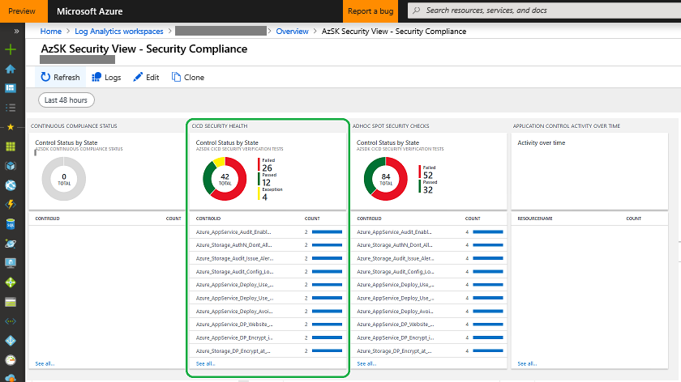


[Back to top…](Readme.md#contents)

--------------------------
## Appendix ##
### [A] Creating a Log Analytics workspace ###
**Step-1 (Ops team):** Create a new Log Analytics workspace.

Go [here](https://docs.microsoft.com/en-in/azure/azure-monitor/learn/quick-create-workspace) and follow the simple steps to create a new Log Analytics workspace.

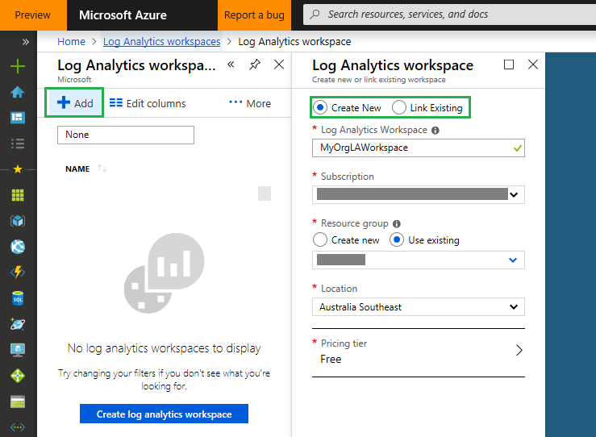

**Note:** If you already have a Log Analytics workspace that is used for other monitoring activities, 
then, ideally, the same workspace should be used for setting up the AzSK Monitoring solution as well. 
The idea is that the security views appear alongside other views on the 'general' operations dashboard and 
not in a standalone one.


**Step-2 (Ops Team):** Capture the Workspace ID and Primary Key for the Log Analytics workspace by navigating to "Advanced Settings -> Connected Sources -> Windows Servers".


### [B] Testing Log Anaytics workspace connectivity ###
Let us look at how to send events to the Log Analytics workspace from AzSK running on a local machine. This is a handy way to 
test connectivity and to see if the <Log Analytics workspace> Logs can display the received events.

**Step-1 (App Team):** 
Connect the local (dev box) installation of AzSK to your Log Analytics workspace for sending AzSK control evaluation events.

Run the below in a PS session after logging in to Azure (this assumes that you have the latest AzSK installed).
```PowerShell
 $wsID = 'workspace_ID_here'       #See pictures in [A] above for how to get wsId and shrKey
 $shrKey = 'workspace_PrimaryKey_here'
	
 Set-AzSKMonitoringSettings -WorkspaceID $wsID -SharedKey $shrKey
```
Close the current PS window and start a new one. (This is required for the new settings to take effect.)
After this, all AzSK cmdlets, SVTs, etc. run on the local machine will start sending events (outcomes of 
security scans) into the Log Analytics repository corresponding to the workspace ID above.


**Step-2 (App Team):** Generate some AzSK events and validate that they are reaching the configured Log Analytics workspace.

Run a few AzSK cmdlets to generate events for the Log Analytics repo. 
For example, you can run one or both of the following:

```PowerShell
 Get-AzSKSubscriptionSecurityStatus -SubscriptionId $subID 
 Get-AzSKAzureServicesSecurityStatus -SubscriptionId $subID -ResourceGroupNames 'app_rg_name'
```

After the above scans finish, if we go into Log Analytics workspace Logs and search for 'AzSK_CL', it should show 
AzSK events similar to the below ("_CL" stands for "custom log"):
	
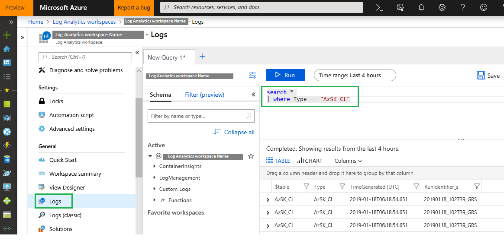

If you have already set the AzSK Monitoring solution up, you will also be able to see these in pictorial form
in the AzSK Log Analytics Workspace Summary (Overview). However, the workspace summary can be setup later as it is not required just to check if 
the events are being sent into the Log Analytics workspace.


### [C] Routing AzSK events to Log Analytics
Note that the Security Verification Tests (SVTs) from AzSK can be run in 3 stages:
1. Development (referred to as "SDL")
2. Build/Deployment ("CICD")
3. Continuous Assurance ("CA")

The results of control evaluation generated by running AzSK SVTs in **all** of these stages can be 
(independently) sent to Log Analytics. Depending on the dev ops stage the mechanism used to 'wire up' AzSK with Log Analytics is different. 

1. In the development ("SDL") stage, the following command can be used to set the Log Analytics workspace that will collect events 
generated via various AzSK-scripts/SVTs etc. in a subscription:

```PowerShell
 Set-AzSKMonitoringSettings -WorkspaceId <LAWSId> -SharedKey <LAWSSharedKey>
```
Basically, after the above command is run (once) on your desktop, subsequent AzSK SVT control evaluation events will be sent
to the Log Analytics workspace configured above. 
> Note: You will need to close and reopen PS session after running the above command for the setting change to take effect.

2. In the build/deployment (CICD) stage, Log Analytics settings are specified via input parameters for the [AzSK SVTs build/release extension](../03-Security-In-CICD/Readme.md#adding-svts-in-the-release-pipeline).

3. For Continuous Assurance (CA), the Log Analytics workspace info is specified in the input parameters of the [Continuous Assurance setup script](../04-Continous-Assurance/Readme.md#setting-up-continuous-assurance---step-by-step).  

Events sent from these (different dev ops) stages of one or more applications get aggregated 
in the Log Analytics workspace alongside events from various out-of-box solutions available in the Log Analytics Solution gallery.   
Overall, this provides a single pane view of the security across the entire set of cloud resources in 
a subscription. A schematic of this (aggregate view model) is shown below:

> Note AzSK control evaluation results (AzSK events) show up as Type=AzSK_CL in the Log Analytics workspace.

[Back to top…](Readme.md#contents)

### [D] Leveraging other Management Solutions from the Azure Marketplace ###
The Azure Monitor contains several out of the box solutions that are invaluable to use towards 
a comprehensive coverage of monitoring and alerts of various Azure resource types. Many resources generate
a rich set of 'data plane' diagnostics and logs which can be routed into a Log Analytics dashboard for monitoring
using these solutions. In the part, we will look at how to leverage a couple of common solutions. You can
add more based on the specific resources (SQL, VM, Service Fabric, Key Vault, etc.) you are using in your subscription.

The AzSK solution complements the coverage from these individual solutions by its focus on cloud resource configuration.
It is also unique in its coverage of events across dev ops stages.
You can read more about intalling a Management Solution to Log Analytics workspace [here](https://docs.microsoft.com/en-in/azure/azure-monitor/insights/solutions#install-a-management-solution).
> **Note**: Setting up other solutions from the Azure Marketplace is not required for the AzSK Monitoring Solution to work.

**Step-1: Optional** (Ops Team) Configure alerts on Analytics queries.
Read more about setting up Log alerts [here](https://docs.microsoft.com/en-in/azure/azure-monitor/platform/alerts-log).

**Step-2: Optional** (Ops Team) Collect and analyze Azure activity logs in Log Analytics
Below are the steps to connect to a log source:

1. This connection is setup in the Log Analytics subscription by going into the Log Analytics workspace feature and 
clicking on "Azure Activity Log" in the Workspace Data Sources list as below:

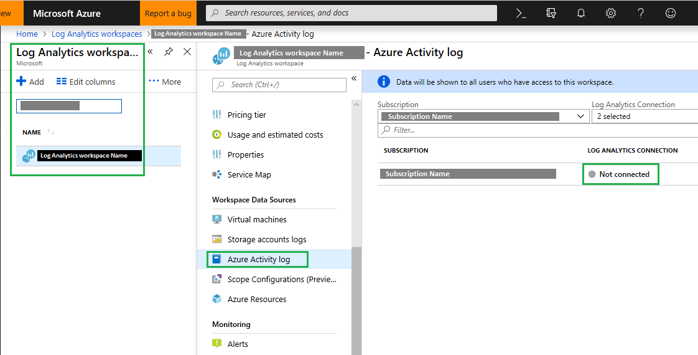  

2. From the Log Analytics Subscription, one can view all subscriptions that the Ops team person (current user) 
has at least "Log Analytics Reader" level access. It means that App team 
subscriptions will show here as an option only if at least "Log Analytics Reader" access is granted to the 
current Log Analytics user.

Choose the subscription(s) corresponding to the apps that are being monitored and click 'Connect'.
      
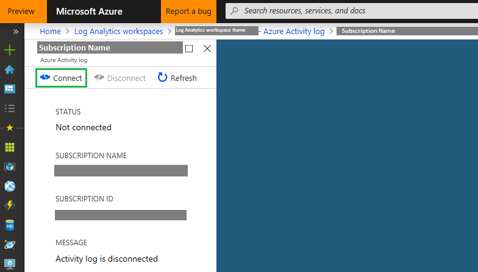
	
> Note: The above steps have to be done from the **Log Analytics** subscription.

At this point, the app subscription is setup to pipe it's Azure Activity Log events to the Log Analytics workspace. 

In the next steps we will configure AzSK to send data to the Log Analytics workspace from a PowerShell session. This can be done by running commands discussed in [[B] Testing Log Anaytics workspace connectivity](Readme.md#b-testing-log-anaytics-workspace-connectivity).
This is just so that we can verify that events generated AzSK are getting routed to the Log Analytics workspace
correctly. 
