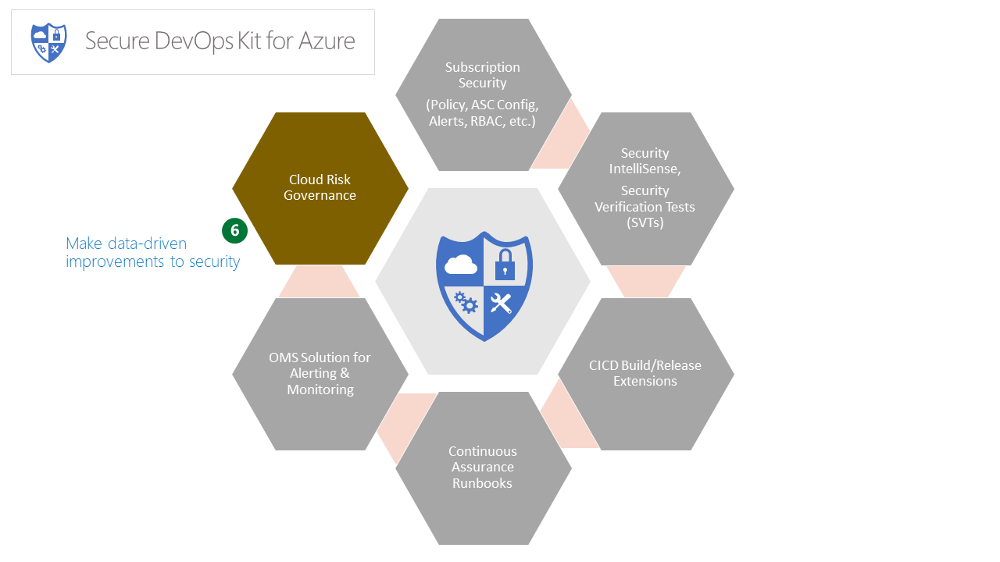

# Security Telemetry



## Contents

- [Overview](#overview)
- [Control Telemetry](#control-telemetry)
  - [Organization Level Setup](#organization-level-setup)
  - [Local Control Telemetry](#local-control-telemetry)
  - [Understanding Data in App Insights](#understanding-data-in-app-insights)
  - [App Insights Visualization](#app-insights-visualization)
- [Usage Telemetry](#usage-telemetry)
  - [Enable/Disable Usage Telemetry](#enabledisable-usage-telemetry)
- [FAQs](#faqs)

## Overview

The Secure DevOps Kit generates telemetry events from all stages of dev ops. That is, events are generated when an engineer runs a scan ad hoc or when SVTs are run in CICD or subscriptions are scanned via Continuous Assurance (CA). The telemetry can be collected and aggregated across an organization. When combined with other organization metadata (e.g., a mapping of subscriptions to applications or service lines or business groups), this can yield a powerful platform for supporting a data-driven approach cloud risk governance and allow organizations to drive measured and targeted security improvement initiatives in a continuous and incremental fashion (just like the rest of dev ops). The telemetry data from AzSK can be leveraged in two key ways:

- Application Insights based – called Control Telemetry (will be renamed to Org Telemetry soon). There are two ways possible. One, configure it centrally, two, configure it specifically in end-user's machine

- API based – this is a custom solution using WebAPI and SQL to collect events and enrich it with organizational metadata. This lets an organization track and drive adoption and usage of the AzSK and provides a window into the org's DevSecOps Maturity. API based telemetry will be release in coming months when we release documents for how organization can customize AzSK for their needs

[Back to top...](#contents)

## Control Telemetry

The part in the telemetry feature that captures mainly the adoption, usage and security issues in resources scanned by AzSK across all the subscriptions and services in an organization. This helps organizations to be aware of the security health of the applications, improvements needed and done. By default this is disabled and user have to enable it in their machine to push the data.

Currently the toolkit support App Insights based collector. The ability to set the collector settings across the organization in a single place will be available in coming months, for now please refer [local control telemetry](#local-control-telemetry) section for configuring locally in user's machine.

### Organization Level Setup

The setup is done once by a central security team or monitoring team. No action required from the end-users in the organization. The steps for setting up centrally will be available in coming months.

#### Application Insights

An Application Insights account is required to collect the data. Create an Application Insights account in Azure with the Application Type 'General' and take a note of the Instrumentation Key from the Overview section of the resource.


 With this you can refer [local control telemetry](#local-control-telemetry) section for further steps.

#### Azure SQL

Coming soon

[Back to top...](#contents)

### Local Control Telemetry

The team that created the instrumentation key (in [section](#application-insights)) can share the key with the below command for the application development teams to use it. It is preferred to have this step as part of on-boarding.

``` PowerShell
Set-AzSKLocalControlTelemetrySettings -LocalControlTelemetryKey '<instrumentation-key>' -EnableLocalControlTelemetry $true
```

The command configures the AzSK toolkit to send data to the given Applications Insights account from user's machine.

[Back to top...](#contents)

### Understanding Data in App Insights

To check that events are flowing into Application Insights, after setting the local telemetry key execute a subscription security command. Normally it will take around 4 to 5 minutes for the data to appear in App Insights. In Azure portal, navigate to App Insights resource 'Overview' -> Search and select an event listed with name **Control Scanned**.


#### Event Data Properties

Event Name | Definition
--- | ---
Control Scanned | A resource was scanned for a control

<br/>

Event Properties | Definition
--- | ---
AccountId | User or App (in CICD / CC) identity executed the scan
AccountType | User / ServicePrincipal
ActualVerificationResult | Irrespective of attestation, what is the current actual result for the control scanned
AttestationStatus | Whether the control was attested or not
AzureEnv | Azure Environment
ControlId | Mutable descriptive control string identifier
ControlIntId | Immutable internal control identifier
ControlSeverity | Severity of the control that was scanned
Feature | Name of the Azure feature. Eg. Storage
FeatureGroup | Service or Subscription. Whether the scan performed was on service related controls or subscription related
InfoVersion | More of schema version for the event properties
IsNestedResource | Whether the resource is a nested resource. Eg. SQL Database is a nested resource in SQL Server
NestedResourceName | Name of the nested resource
ResourceGroup | Name of the resource group in which the resource scanned is part of
ResourceId | Azure URI for the resource scanned
ResourceName | Name of the resource that was scanned
RunIdentifier | Internal identifier for the run. All the scans from the same run with have same RunIdentifier. But there is a possibility for two runs having same RunIdentifier. Please use <b>UniqueRunIdentifier</b> property for correlations
ScanKind | <ul><li>**SubCore** - Partial or Complete<ul><li>**Partial** - All controls were not scanned</li><li>**Complete** - All controls were scanned</li></ul></li><li>**Services** - Partial or ResourceGroup or Complete<ul><li>**Partial** - All controls or all resources in a resource group or subscription was not scanned</li><li>**ResourceGroup** - All resources that belong to a resource group was scanned against all applicable controls</li><li>**Subscription** - All resources that belong to a subscription was scanned against all applicable controls</li></ul></li></ul>
ScannerModuleName | Mostly it is AzSK, sometimes if preview version is used it will be AzSKPreview
ScannerVersion | PowerShell module version
ScanSource | Source of the scan - SpotCheck or VSO or Runbook <ul><li>**SpotCheck** (SDL) - An ad-hoc scan ran from an user machine.</li><li>**VSO** (CICD) - Scan ran from Visual Studio Online as part of release pipeline</li><li>**Runbook** (CA) - Scan ran from Runbook as part of regular schedule</li></ul>
SubscriptionId | Subscription id
SubscriptionName | Subscription name
TenantId | Tenant to which the user / app that ran the scan belongs to
UniqueRunIdentifier | Globally unique identifier for the run. All the scans from the same run with have same UniqueRunIdentifier
VerificationResult | Result of the scan with attestation if any

[Back to top...](#contents)

### App Insights Visualization

For understanding the collected data, there are 2 simple options.

1. Using visualizations in App Insights from Azure portal
1. Using querying capabilities provided by App Insights

Option 1 is straight forward. For more information on it, check the [link](https://docs.microsoft.com/en-us/azure/application-insights/app-insights-dashboards)

Option 2 gives the flexibility of querying and visualizing. To start click on the Analytics link on the App Insights resource overview. This will launch a new site.


After the site is loaded, click on the new tab option to start writing queries.


Run the following query

``` AIQL
customEvents
 | where customDimensions.VerificationResult == "Failed"
 | summarize count() by tostring(customDimensions.Feature)
 | top 10 by count_
```

There is a filter in the top right, which gives the easy option to select time ranges. This can be done via code as well.


The query computes top failing 10 Azure features that are scanned by the toolkit.

Few more simple queries to try

#### Top 20 failing controls

``` AIQL
customEvents
 | where customDimensions.VerificationResult == "Failed"
 | summarize count() by tostring(customDimensions.ControlId)
 | top 20 by count_
```

#### Top 10 subscription with most failing controls

``` AIQL
customEvents
 | where customDimensions.VerificationResult == "Failed"
 | summarize count() by tostring(customDimensions.SubscriptionId)
 | top 10 by count_
```

#### Subscription that are scanned by Runbooks (CA)

``` AIQL
customEvents
 | where customDimensions.ScanSource == "Runbook"
 | distinct tostring(customDimensions.SubscriptionId), tostring(customDimensions.SubscriptionName)
```

#### Subscription with Critical and High severity failures

``` AIQL
customEvents
 | where customDimensions.ControlSeverity == "Critical" or customDimensions.ControlSeverity == "High"
 | where customDimensions.VerificationResult == "Failed"
 | where customDimensions.FeatureGroup == "Subscription"
 | summarize count() by tostring(customDimensions.SubscriptionId)
 | sort by count_ desc
```

#### Unique users using the toolkit

``` AIQL
customEvents
 | where customDimensions.AccountType == "User"
 | distinct tostring(customDimensions.AccountId)
 | count
```

[Back to top...](#contents)

## Usage Telemetry

Usage telemetry captures anonymous usage data and sends it to Microsoft servers. This will help in improving the product quality and prioritize meaning fully on the highly used features.

### Enable/Disable Usage Telemetry

There is two levels available to set by the end-user.

- **None** - No telemetry is sent
- **Anonymous** - Anonymously usage telemetry

> It is not an organization level configuration. It is meant to be configured by the end-user.

#### To disable

``` PowerShell
Set-AzSKUsageTelemetryLevel -Level None
```

#### To enable

``` PowerShell
Set-AzSKUsageTelemetryLevel -Level Anonymous
```

[Back to top...](#contents)