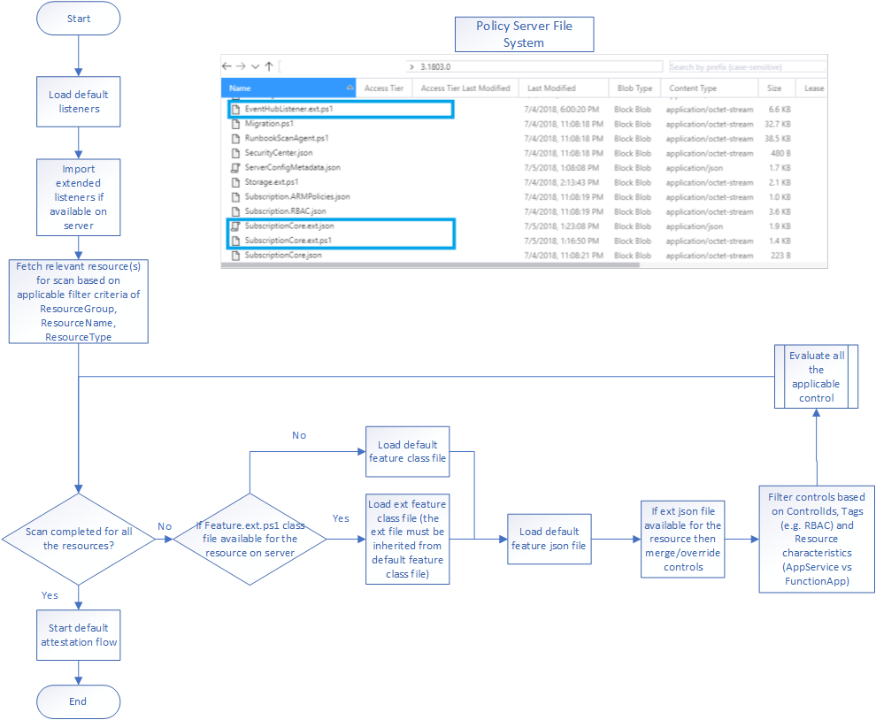

> <b>NOTE:</b>
> This article has been updated to use the new Azure PowerShell Az module. To learn more about the new Az module and AzureRM compatibility, see [Introducing the new Azure PowerShell Az module](https://docs.microsoft.com/en-us/powershell/azure/new-azureps-module-az).

# Extending AzSK Modules

## Contents
- [Structure](Readme.md#structure)  
- [Know more about SVTs](Readme.md#know-more-about-svts)
- [Block diagram to represent the extension model](Readme.md#block-diagram-to-represent-the-extension-model)
- [Steps to extend the control SVT](Readme.md#steps-to-extend-the-control-svt)  
- [Steps to override the logic of existing SVT](Readme.md#steps-to-override-the-logic-of-existing-svt)  
- [Steps to add extended control in baseline control list](Readme.md#steps-to-add-extended-control-in-baseline-control-list)  
- [Steps to debug the extended control while developement](Readme.md#steps-to-debug-the-extended-control-while-development)  
- [Steps to add a new SVT to the AzSK module](Readme.md#steps-to-add-a-new-SVT-to-the-AzSK-module)
- [FAQ](Readme.md#faqs)  
- [References](Readme.md#references) 

----------------------------------------------
### Structure

Before we get started with extending the toolkit, it is important to understand the structure of its PowerShell module. Below represents the tree structure of DevOpsKit PS module. You can currently extend SVT (subscription & services) and Listeners only. SVT stands for Security Verification Tests, which constitute different Azure security controls that are scanned by the DevOps Kit. Listeners are like subscribers for control evaluation results that can route the control results data to data source choice of yours. 
		
    
      
      ├───AlertMonitoring  
      ├───ARMChecker  
      ├───ARMCheckerLib  
      ├───AzSKInfo  
      ├───ContinuousAssurance  
      ├───Framework  
      │   ├───Abstracts  
      │   │   └───FixControl  
      │   ├───Configurations  
      │   │   ├───AlertMonitoring  
      │   │   ├───ARMChecker  
      │   │   ├───AutoUpdate
      │   │   ├───AzSKInfo
      │   │   ├───ContinuousAssurance
      │   │   ├───Migration
      │   │   ├───PolicySetup  
      │   │   ├───SubscriptionSecurity  
      │   │   └───SVT  
      │   │       ├───AzSKCfg  
      │   │       ├───Services  
      │   │       └───SubscriptionCore  
      │   ├───Core  
      │   │   ├───ARMChecker  
      │   │   ├───AzSKInfo  
      │   │   ├───AzureMonitoring  
      │   │   ├───ContinuousAssurance  
      │   │   ├───FixControl  
      │   │   │   └───Services  
      │   │   ├───PolicySetup  
      │   │   ├───SubscriptionSecurity  
      │   │   └───SVT  
      │   │       ├───AzSKCfg  
      │   │       ├───Services  
      │   │       └───SubscriptionCore  
      │   ├───Helpers  
      │   ├───Listeners  
      │   │   ├───CA  
      │   │   ├───EventHub  
      │   │   ├───FixControl  
      │   │   │   └───FixControlScripts
      │   │   ├───GenericListener
      │   │   ├───LogAnalytics  
      │   │   ├───RemoteReports  
      │   │   ├───UserReports  
      │   │   └───Webhook  
      │   ├───Managers  
      │   └───Models
      │       ├───Common
      │       ├───ContinuousAssurance  
      │       ├───Exception  
      │       ├───FixControl  
      │       ├───RemoteReports  
      │       ├───SubscriptionCore  
      │       ├───SubscriptionSecurity  
      │       └───SVT  
      ├───PolicySetup  
      ├───SubscriptionSecurity  
      └───SVT  


### Know more about SVTs:


All the SVTs inherit from a base class called SVTBase which takes care of all the required plumbing from the control evaluation code. Every SVT has a corresponding feature json file under the Framework -> Configurations folder. For example, Storage.ps1 (in the Core folder) has a corresponding Storage.json file under 'Configurations' folder. The SVT json has a bunch of configuration parameters that can be controlled by a policy owner, for instance, based on the org rquirements one can change the recommendation, modify the description of the control, change the severity, etc.
Every time a SVT scan happens, each automated control calls the corresponding method which in turn evaluates the control result.

Below is the typical schema for each control inside the feature json
  ```
{
    "ControlID": "Azure_Subscription_AuthZ_Limit_Admin_Count",   //Human friendly control Id. The format used is Azure_<FeatureName>_<Category>_<ControlName>
    "Description": "Minimize the number of admins/owners",  //Description for the control, which is rendered in all the reports it generates (CSV, AI telemetry, emails etc.).
    "Id": "SubscriptionCore1100",   //This is internal ID and should be unique. Since the ControlID can be modified, this internal ID ensures that we have a unique link to all the control results evaluation.
    "ControlSeverity": "Medium", //Represents the severity of the Control. 
    "Automated": "Yes",   //Indicates whether the given control is Manual/Automated.
    "MethodName": "CheckSubscriptionAdminCount",  // Represents the Control method that is responsible to evaluate this control. It should be present inside the feature SVT associated with this control.
    "Recommendation": "There are 2 steps involved. You need to clean up (1) unexpected 'Classic Administrators'and (2) unexpected 'Owners' on the subscription. (1) Steps to clean up classic administrators (a) Go to https://manage.windowsazure.com/ --> settings tab -> administrators --> select and remove unwanted administrators using remove icon on the bottom ribbon (2) To remove unwanted members from the Owners group simply run the command 'Remove-AzRoleAssignment -SignInName '{signInName}' -Scope '/subscriptions/{subscriptionid}' -RoleDefinitionName Owner'.",	  //Recommendation typically provides the precise instructions on how to fix this control.
    "Tags": [
        "SDL",
        "Best Practice",
        "Automated",
        "AuthZ"
    ], // You can decorate your control with different set of tags, that can be used as filters in scan commands.
    "Enabled": true ,  //Defines whether the control is enabled or not.
    "Rationale": "Each additional person in the Owner/Contributor role increases the attack surface for the entire subscription. The number of members in these roles should be kept to as low as possible." //Provides the intent of this control.
}
 ```  
    
Below is the corresponding feature SVT.ps1 for SubscriptionCore SVT.

```PowerShell
#using namespace Microsoft.Azure.Commands.Search.Models
Set-StrictMode -Version Latest
class SubscriptionCore: SVTBase
{
	hidden [AzureSecurityCenter] $ASCSettings
	hidden [ManagementCertificate[]] $ManagementCertificates
	.
	.
	.
	hidden [string[]] $SubscriptionMandatoryTags = @()

	SubscriptionCore([string] $subscriptionId):
        Base($subscriptionId)
    {
		$this.GetResourceObject();		
    }
	.
	.
	.
	hidden [ControlResult] CheckSubscriptionAdminCount([ControlResult] $controlResult)
	{

		#Step 1: This is where the code logic is placed
		#Step 2: ControlResult input to this function, which needs to be updated with the verification Result (Passed/Failed/Verify/Manual/Error) based on the control logic
		Messages that you add to ControlResult variable will be displayed in the detailed log automatically.
		#Step 3: You can directly access the properties from ControlSettings.json e.g. $this.ControlSettings.NoOfApprovedAdmins. Any property that you add to controlsettings.json will be accessible from your SVT
		
		
		
		$controlResult.AddMessage("There are a total of $($SubAdmins.Count) admin/owner accounts in your subscription`r`nOf these, the following $($ClientSubAdmins.Count) admin/owner accounts are not from a central team.", ($ClientSubAdmins | Select-Object DisplayName,SignInName,ObjectType, ObjectId));

		if(($ApprovedSubAdmins | Measure-Object).Count -gt 0)
		{
			$controlResult.AddMessage("The following $($ApprovedSubAdmins.Count) admin/owner (approved) accounts are from a central team:`r`n", ($ApprovedSubAdmins | Select-Object DisplayName, SignInName, ObjectType, ObjectId));
		}
		$controlResult.AddMessage("Note: Approved central team accounts don't count against your limit");

		if($ClientSubAdmins.Count -gt $this.ControlSettings.NoOfApprovedAdmins)
		{
			$controlResult.VerificationResult = [VerificationResult]::Failed
			$controlResult.AddMessage("Number of admins/owners configured at subscription scope are more than the approved limit: $($this.ControlSettings.NoOfApprovedAdmins). Total: " + $ClientSubAdmins.Count);
		}
		else {
			$controlResult.AddMessage([VerificationResult]::Passed,
										"Number of admins/owners configured at subscription scope are with in approved limit: $($this.ControlSettings.NoOfApprovedAdmins). Total: " + $ClientSubAdmins.Count);
		}

		return $controlResult;
	}
	.
	.
	.
}
```

### Block diagram to represent the extension model:


	
### Steps to extend the control SVT:
##### A. Extending a GSS SVT
1. 	Copy the SVT.ps1 script that you want to extend and rename the file by replacing ".ps1" with ".ext.ps1".
	For example, if you want to extend SubscriptionCore.ps1, copy the file and rename it to SubscriptionCore.ext.ps1.
  
2. 	Rename the class, inherit it from the core feature class, and then update the constructor to reflect the new name as shown below:
    
   > For example, class SubscriptionCore : SVTBase => SubscriptionCoreExt : SubscriptionCore
	
   ```PowerShell
	Set-StrictMode -Version Latest
	class SubscriptionCoreExt: SubscriptionCore
	{
	  SubscriptionCoreExt([string] $subscriptionId): Base($subscriptionId)
	  {       
	    
	  }
	}
   ```
> Note: All the other functions from the class file should be removed.
  
3. 	 If logic for a specific control needs is to be updated, then retain the required function; or if a new control is to be added, copy any control function from the base class to the extension class reference.
	> Note: For a given control in json, the corresponding PowerShell function is provided as value under MethodName property. For eg. Below is an example of adding a new control that fails if you have more than 2 co-admins. 
  
  ```PowerShell
	Set-StrictMode -Version Latest
	class SubscriptionCoreExt: SubscriptionCore
	{
		SubscriptionCoreExt([string] $subscriptionId):
		Base($subscriptionId)
		{       
		    
		}
		hidden [ControlResult] CheckSubscriptionAdminCountExtension([ControlResult] $controlResult)
		{
			#This is internal
			$scope = $this.SubscriptionContext.Scope;
			$RoleAssignments = Get-AzRoleAssignment -Scope $scope -IncludeClassicAdministrators
			#Excessive number of admins (> 2)
			$SubAdmins = @();
			$SubAdmins += $RoleAssignments | Where-Object { ($_.RoleDefinitionName -eq 'CoAdministrator' -or $_.RoleDefinitionName -like '*ServiceAdministrator*') -and $_.Scope -eq $scope}
			if(($SubAdmins| Measure-Object).Count -gt 2)
			{
				$controlResult.VerificationResult = [VerificationResult]::Failed
				$controlResult.AddMessage("Number of admins/owners configured at subscription scope are more than the approved limit: 2. Total: " + $SubAdmins.Count);
			}
			else {
				$controlResult.AddMessage([VerificationResult]::Passed,
				"Number of admins/owners configured at subscription scope are with in approved limit: 2. Total: " + $SubAdmins.Count);
			}
			return $controlResult;
		}
	}
  ```  
  
  4. 	For the above a corresponding control in extension json is required. 
  	Step 1: Copy the default base json, rename it to <feature>.ext.json. 
	Step 2: Remove all the other controls except for one being added, update it with new control details. See additional instructions as '//comments' on each line in the example JSON below. Note: Remove the comments from JSON if you happen to use the below as-is.
	
  > IMPT: Do *not* tag 'Ext' to the 'FeatureName' here. Make sure you have updated the method name to corresponding method in ps1 file. 
  > Note: Remove the comments in the below JSON before saving the file
  
```
	{
	   "FeatureName": "SubscriptionCore",
	   "Reference": "aka.ms/azsktcp/sshealth",
	   "IsMaintenanceMode": false,
	   "Controls": [
            {
                "ControlID": "Azure_Subscription_AuthZ_Limit_Admin_Count_Ext",  //define the new control id
                "Description": "Minimize the number of admins", //Description for your control
                "Id": "SubscriptionCore1100", //Ensure that all the internal ids are appended with 4 digit integer code
                "ControlSeverity": "Medium", //Control the severity
                "Automated": "Yes",  // Control the automation status
                "MethodName": "CheckSubscriptionAdminCountExtension", //Update the method name with the new one provided above
                "Recommendation": "There are 2 steps involved. You need to clean up unexpected 'Classic Administrators'. Steps to clean up classic administrators: Go to https://manage.windowsazure.com/ --> settings tab -> administrators --> select and remove unwanted administrators using remove icon on the bottom ribbon.",
                "Tags": [
                      "SDL",
                      "Best Practice",
                      "Automated",
                      "AuthZ"
                ],
                "Enabled": true,
                "Rationale": "Each additional person in the Owner/Contributor role increases the attack surface for the entire subscription. The number of members in these roles should be kept to as low as possible."
            }
	   ]
	}
```
5. 	 Upload these files(json and correspondinf ps1 file) to org policy storage container under base schema version folder (currently 3.1803.0) like any other org policy and add an entry to ServerConfigMetadata.json as shown below:
``` 
    {
      "Name":  "SubscriptionCore.ext.json"
    },
    {
      "Name":  "SubscriptionCore.ext.ps1"
    }
```  
   Refer the below screenshot.  
   
  
6. 	 The new control is now added the SubscriptionCore SVT. The new extended control can be scanned like any other control.
  
```PowerShell
	Get-AzSKSubscriptionSecurityStatus -SubscriptionId '<sid>' -ControlIds 'Azure_Subscription_AuthZ_Limit_Admin_Count_Ext'
```

##### B. Extending a GRS SVT

Below is an example to add a mock control that 'storage accounts must be created in 'eastus2' region.

1) Download preview policy to a local folder on your system by executing the below command:

    ```Powershell
    gop -SubscriptionId <subid> -OrgName <orgname> -DepartmentName <deptname> -PolicyFolderPath <localPolicyfolderpath> -DownloadPolicy
    ```

2) Copy Storage.ps1 from module folder ->  <localPolicyfolderpath>\Storage.ext.ps1

    a)  Remove all the methods except constructor, change class name to StorageExt, base-class to Storage, remove all class members.

    b) Add method that will implement the new control. Find sample script StorageExt.ps1 [here](../StorageExt.ps1)


3) Copy Storage.json from module folder to <localPolicyfolderpath>\Storage.ext.json
       
    a) Remove all, except one existing control (to update it into new control JSON)
       
    b) Edit the control to reflect desired controlId, description, etc.
       
    
    Few important things:
        
    i) ControlId and Id should not conflict with existing ones
            
    ii) MethodName should correctly reflect the new method written in Storage.ext.ps1 above
            
    iii) Do not change 'Storage' to 'StorageExt' inside the JSON (at the root node) 

4) Update org policy using below command... (Important: Do not edit anything else or manually tweak policy in the blob)!

    ```Powershell    
    uop -SubscriptionId <subid> -OrgName <orgname> -DepartmentName <deptname> -PolicyFolderPath <policyfolderpath> 
    ```


> Important: Also note that the "ext" in the file-names above is in all lower-case!

===============================================================

5) Verifying that the added control works:

1) Put the local AzSK into the target policy for that run "iwr" that is echoed by Step-4 above.

        
2) Run grs for storage accounts and verify that the control is getting scanned:
        grs -s <subid> -rgns <resourcegroupname> -rtn Storage

3) Run specific controlId across a couple of storage accounts in diff regions (the storage present AzSKRG one will pass 'eastus2' check):
        
```Powershell
    grs -s <subid> -ResourceGroupNames 'AzSKRG, <RG1>, <RG2>' -ResourceTypeName Storage -ControlIds 'Azure_Storage_Create_In_Approved_Regions'
```

### Steps to override the logic of existing SVT:

1. Add new Feature.ext.ps1/SubscriptionCore.ext.ps1 file with the new function that needs to be executed as per the above documentation.
2. Customize Feature.json file as per https://github.com/azsk/DevOpsKit-docs/blob/master/07-Customizing-AzSK-for-your-Org/Readme.md#d-customizing-specific-controls-for-a-service by overriding "MethodName" property value with the new function name that needs to be executed.
3. That's it!! You can now scan the older control with overridden functionality. 

### Steps to add extended control in baseline control list:

1. Add new control to Feature.ext.json/SubscriptionCore.ext.json file as per the above documentation.
2. Add the new ControlId in baseline control list as per https://github.com/azsk/DevOpsKit-docs/blob/master/07-Customizing-AzSK-for-your-Org/Readme.md#c-creating-a-custom-control-baseline-for-your-org
3. That's it!! The newly added control will be scanned when "-UseBaselineControls" switch is passed to GSS/GRS cmdlets.

### Steps to debug the extended control while development:

Extended Feature.ext.ps1 files are downloaded at C:\Users\<UserAccount>\AppData\Local\Microsoft\AzSK\Extensions folder in the execution machine. While debugging, breakpoints need to be inserted in those files to step into the code you want to debug. 

### Steps to add a new SVT to the AzSK module:

Followig are the instructions to add an SVT for an Azure service that is not currently supported in DevOps Kit.

Below are the step to develop a sample SVT for Application Insights (as Application Insights is a resource type not currently supported in the DevOps kit.)

>**Note:** Currently, adding a completely new SVT to AzSK requires collaboration with the DevOps Kit team. This is because we need to make some changes in the core module to support the new SVT. Please email azsksup@microsoft.com to initiate a discussion. Typically, we will be able to turn such requests around within our monthly sprint. 

> However, while that process is under way, you can still make progress on this task and, in fact, have a completely functioning new SVT created and tested within your org. Only thing is that you may need to do some renaming/minor file updates after the base support is included by the DevOps Kit team in the AzSK code (after which you can deploy for all users in your org for SDL/CICD/usage).

>In the steps below, those marked '###' are the steps that you have to do when writing your own new SVT for the first time. However, after you communicate the requirement to the AzSK team, we will include changes corresponding to those steps in the official module for future sprints. Subsequently, you will only need to maintain the code corresponding to the remaining steps.

The steps below follow roundabout the same model as in section [Extending AzSK Module](Readme.md#block-diagram-to-represent-the-extension-model). All controls you implement for the new SVT will be treated as ‘extended’ controls of a blank core SVT.

1. [###] Create files AppInsights.json and AppInsights.ps1 to represent base classes/control placeholders in the core module.

    Basically these files will serve the purpose of the (within-module) base class for AppInsights SVT and the controls you will write will go into the SVT extension.

    a.	Save AppInsights.json (content below) to <pathToAzSK>\AzSK\<version>\Framework\Configurations\SVT\Services.
    
    AppInsights.json

    ```PowerShell
    {
    "FeatureName": "AppInsights",
    "Reference": "aka.ms/azsktcp/appinsights",
    "IsMaintenanceMode": false,
    "Controls": []
    }
    ```

    b.	Save AppInsights.ps1 (content below) to <pathToAzSK>\AzSK\<version>\Framework\Core\SVT\Services.

    AppInsights.ps1

    ``` PowerShell
    Set-StrictMode -Version Latest
    class AppInsights: SVTBase
    {
        hidden [PSObject] $ResourceObject;
    
        AppInsights([string] $subscriptionId, [SVTResource] $svtResource):
            Base($subscriptionId, $svtResource)
        {
            $this.GetResourceObject();
        }
    
        hidden [PSObject] GetResourceObject()
        {
            if (-not $this.ResourceObject)
            {
                # Get resource details from AzureRm
                $this.ResourceObject = Get-AzApplicationInsights -Name $this.ResourceContext.ResourceName -ResourceGroupName $this.ResourceContext.ResourceGroupName -Full # Use corresponding Az command for the SVT service 
    
                if(-not $this.ResourceObject)
                {
                    throw ([SuppressedException]::new(("Resource '$($this.ResourceContext.ResourceName)' not found under Resource Group '$($this.ResourceContext.ResourceGroupName)'"), [SuppressedExceptionType]::InvalidOperation))
                }
                
            }
    
            return $this.ResourceObject;
        }
    }
    ```

    Note that the content/structure of these files is similar to the other SVT base class files (e.g., Batch.json/Batch.ps1). Only that these are hollow classes (i.e., they do not have any controls implemented.)

2. Create AppInsights.ext.json and AppInsights.ext.ps1 (using the content below) wherever you store AzSK extension code in your source tree.

    Also copy these files to the (local) org policy folder (e.g., %userprofile%\Desktop\ContosoPolicies).

    Note that below we have implemented a single dummy control for App Insights called ‘Azure_AppInsights_No_Limited_Basic_Plan’ (which  checks and fails if the pricing plan is ‘Limited Basic’). 

    AppInsights.ext.json

    ```PowerShell
    {
        "FeatureName": "AppInsights",
        "Reference": "aka.ms/azsktcp/appinsights", 
        "IsMaintenanceMode": false,
        "Controls": [
            {
                "ControlID": "Azure_AppInsights_No_Limited_Basic_Plan", 
                "Description": "Do not use ‘Limited Basic' tier plan for enterprise apps.", 
                "Id": "AppInsights1001", 
                "ControlSeverity": "Medium", 
                "Automated": "Yes",  
                "MethodName": "CheckAIPricingPlan", 
                "Recommendation": "Use an enterprise grade pricing plan other than ‘Limited Basic’.",
                "Tags": [
                    "SDL",
                    "Best Practice",
                    "Automated",
                    "AppInsights"
                ],
                "Enabled": true,
                "Rationale": "Logical intention for the extended control"
            }
        ]
    }
    ```

    AppInsights.ext.ps1

    ``` PowerShell
    Set-StrictMode -Version Latest
    
    # Class name must have Ext suffix. Class must be inherited from Feature class
    class AppInsightsExt: AppInsights
    {       
        AppInsightsExt([string] $subscriptionId, [SVTResource] $svtResource):
            Base($subscriptionId, $svtResource)
        { 
            $this.GetResourceObject();
        }
    
        hidden [ControlResult] CheckAIPricingPlan([ControlResult] $controlResult)
        {
            # Your function logic goes here.
            Write-Host("Checking AI pricing plan...")
            $ai = $this.ResourceObject
            if ($ai.PricingPlan -eq 'Limited Basic')
            {
                $controlResult.VerificationResult = [VerificationResult]::Failed
                $controlResult.AddMessage("AI: Use an enterprise grade pricing plan other than ‘Limited Basic’");
            }
            else {
                $controlResult.VerificationResult = [VerificationResult]::Passed
                $controlResult.AddMessage("AI: Non-basic plan is used per expectation!");
            }
            return $controlResult;
        }
    } 
    ```

3.	Now push the extension files to the org policy server using the command below:

    ``` PowerShell
    Update-AzSKOrganizationPolicy -SubscriptionId <SubscriptionId> `
    -OrgName "Contoso" `
    -DepartmentName "IT" `
    -PolicyFolderPath "%userprofile%\Desktop\ContosoPolicies"
    ```

4.	[###] Edit AllResourceTypes.json (<pathToAzSK>\AzSK\<version>\Framework\Configurations\SVT\) in the local module by adding an entry for the Application Insights resource type at the end (note the comma).

    Basically, this is where AzSK looks in the core module code to determine if a resource type is supported or not.

    ``` PowerShell
                                     ,
      "Microsoft.Insights/Components"
    ]
    ```
    >**Note:** To determine the exact name for a resource type you are trying to implement an SVT for, you can use the following commands (shown here for Application Insights):

    ```PowerShell
    # List all RPs/registration state:
    Get-AzResourceProvider -ListAvailable | Select-Object ProviderNamespace, RegistrationState
    
    # microsoft.insights
    (Get-AzResourceProvider -ProviderNamespace microsoft.insights).ResourceTypes.ResourceTypeName
    ```
5.	[###] Edit SVTMapping.ps1 (<pathToAzSK>\AzSK\<version>\Framework\Helpers) to add a resource type mapping entry for Application Insights.

    This mapping is how AzSK determines which PowerShell class implements the controls for the resource type.

    ```PowerShell
        [ResourceTypeMapping]@{
            ResourceType = "Microsoft.Insights/Components";
            ClassName = "AppInsights";
            JsonFileName = "AppInsights.json";
            ResourceTypeName = "AppInsights";
        },
    ```
6.	(In a fresh PS session) Run the following scan command to evaluate the control:

    ```PowerShell
      Get-AzSKAzureServicesSecurityStatus -SubscriptionId <SubscriptionId> -ResourceTypeName AppInsights
      #or
      Get-AzSKAzureServicesSecurityStatus -SubscriptionId <SubscriptionId> -ResourceGroupNames <RGName> -ResourceNames <AppInsightsRsrcName>
    ```
### FAQs:

#### I have added ext control in Storage/AppService/VirtualMachine feature as per documentation. My control is still not getting executed. The control is not even coming as Manual in the csv.
Controls in the services like Storage/AppService/VirtualMachine must have some required "Tags" in the feature.ext.json. While initialization of the feature, calculation of applicable control should be done based on those Tags. If the tags are not present in the control, it will be filtered out and will not be executed. Below are some examples of the Tags which are required for the specific features.  
      **Storage**: Either "StandardSku" or "PremiumSku"/ or both should be added based on application of the ext control  
      **AppService**:  Either "AppService" or "FunctionApp" / or both should be added based on application of the ext control  
      **VirtualMachine**: Either "Windows" or "Linux" / or both should be added based on application of the ext control  
      **SQLDatabase**: "SqlDatabase" should be added if control is applicable for SQLDatabase.   
      For more details about Tag please refer: [Tag details](https://github.com/azsk/DevOpsKit-docs/blob/master/01-Subscription-Security/Readme.md#target-specific-controls-during-a-subscription-health-scan) 
    
### References:
- [SubscriptionCore.ext.json](SubscriptionCore.ext.json)
- [SubscriptionCore.ext.ps1](SubscriptionCore.ext.ps1)
- [Feature.ext.json](Feature.ext.json)
- [Feature.ext.ps1](Feature.ext.ps1)
- [ListenerName.ext.ps1](ListenerName.ext.ps1)
