> The Secure DevOps Kit for Azure (AzSK) was created by the Core Services Engineering & Operations (CSEO) division at Microsoft, to help accelerate Microsoft IT's adoption of Azure. We have shared AzSK and its documentation with the community to provide guidance for rapidly scanning, deploying and operationalizing cloud resources, across the different stages of DevOps, while maintaining controls on security and governance.
<br>AzSK is not an official Microsoft product – rather an attempt to share Microsoft CSEO's best practices with the community..
# Customizing AzSK for your organization
 
### [Overview](Readme.md#Overview-1)
 - [When and why should I set up org policy?](Readme.md#when-and-why-should-i-setup-org-policy)
 - [How does AzSK use online policy?](Readme.md#how-does-azsk-use-online-policy)

### [Setting up org policy](Readme.md#setting-up-org-policy-1)
 - [What happens during org policy setup?](Readme.md#what-happens-during-org-policy-setup)
 - [The org policy setup command: Install-AzSKOrganizationPolicy](Readme.md#the-org-policy-setup-command-install-azskorganizationpolicy)
 - [First-time policy setup - an example](Readme.md#first-time-policy-setup---an-example)
 
### [Consuming custom org policy](Readme.md#consuming-custom-org-policy-1)

 - [Running scan in local machine with org policy](Readme.md#1-running-scan-in-local-machine-with-custom-org-policy)
 - [Setup Continuous Assurance](Readme.md#2-setup-continuous-assurance)
 - [Using CICD Extension with org-policy](Readme.md#3-using-cicd-extension-with-custom-org-policy)
 
### [Modifying and customizing org policy](Readme.md#modifying-and-customizing-org-policy-1)
 - [Getting Started](Readme.md#getting-started)


 - [Basic scenarios for org policy customization](Readme.md#basic-scenarios-for-org-policy-customization) 

      - [Changing the default 'Running AzSK using…' message](Readme.md#a-changing-the-default-running-azsk-using-message)
      - [Changing control setting](Readme.md#b-changing-a-control-setting-for-specific-controls)
      - [Customizing specific controls for a service SVT](Readme.md#c-customizing-specific-controls-for-a-service)
      - [Setting up and updating baselines for your org](Readme.md#d-creating-a-custom-control-baseline-for-your-org)
      - [Customizing severity labels](Readme.md#e-customizing-severity-labels)

### [Managing policy/advanced policy usage ](Readme.md#managing-policyadvanced-policy-usage)

- [Downloading and examining policy folder](Readme.md#downloading-and-examining-policy-folder)

- [Working with ‘local’ mode (policy dev-test-debug)](Readme.md#working-with-local-mode-policy-dev-test-debug)

- [How to upgrade org version to latest AzSK version](Readme.md#how-to-upgrade-org-azsk-version-to-the-latest-azsk-version)
   
   <!-- - [Testing CA ($updateToLatestVersion variable) before flipping AzSK.Pre]()
   - [Use of AzSK.Pre.JSON]()  -->
   - [Upgrade scenarios in different scan sources(SDL/CA/CICD)](Readme.md#upgrade-scenarios-in-different-scan-sources)

- [Maintaining policy in source-control](Readme.md#maintaining-policy-in-source-control)

- [Policy deployment using CICD pipeline](Readme.md#policy-deployment-using-cicd-pipeline)


### [Create compliance and monitoring solutions](Readme.md#create-security-compliance-monitoring-solutions)

- [Create cloud security compliance report for your org in PowerBI](Readme.md#create-cloud-security-compliance-report-for-your-org-using-powerbi)

- [AzSK org health monitoring dashboard](Readme.md#azsk-org-health-monitoring-dashboard)

- [Detail resource inventory dashboard](Readme.md#detail-resource-inventory-dashboard)


### [Compliance notifications](Readme.md#compliance-notifications-1)

- [Create compliance notification to subscription owners](Readme.md#compliance-notification-to-subscription-owners)


### [Advanced scenarios for org policy customization/extending AzSK](Readme.md#advanced-usage-of-org-policy-extending-azsk) 

- [SVT customization](Readme.md#customizing-the-svts)
   - [Update/extend existing control by augmenting logic](./Extending%20AzSK%20Module/Readme.md#steps-to-override-the-logic-of-existing-svt)
   - [Add new control for existing GSS/GRS SVT](./Extending%20AzSK%20Module/Readme.md#steps-to-extend-the-control-svt)
   - [Add new SVT altogether (non-existing SVT)](./Extending%20AzSK%20Module/Readme.md#steps-to-add-a-new-svt-to-the-azsk-module)

- [Subscription security provisioning](Readme.md#customizing-subscription-security)
   - [ARM policy](Readme.md#arm-policy)
   - [Alert set](Readme.md#alert-set)
   - [Security center configurations](Readme.md#security-center-configurations)
   - [Mandatory/deprecated RBAC list](Readme.md#rbac-mandatorydeprecated-lists)

- [ARM checker policy customization](Readme.md#arm-checker-policy-customization)

- [Scenarios for modifying scanagent](Readme.md#scenarios-for-modifying-scanagent)
   - [Scanning only baseline controls using continuous assurance setup](Readme.md#scanning-only-baseline-controls-using-continuous-assurance-setup)
   - [Scanning admin and graph access controls using CA](Readme.md#scanning-owner-and-graph-access-controls-using-ca)
   - [Reporting critical alerts](#reporting-critical-alerts)


- [Change default resource group name (AzSKRG) and location (EastUS2) created for AzSK components](Readme.md#change-default-resource-group-name-(AzSKRG)-and-location-(EastUS2)-created-for-AzSK-components)

### [Org policy usage statistics and monitoring using telemetry](Readme.md#org-policy-usage-statistics-and-monitoring-using-telemetry-1)


### [Troubleshooting common issues](Readme.md#testing-and-troubleshooting-org-policy-1)
 
### [Frequently Asked Questions](Readme.md#frequently-asked-questions)

----------------------------------------------------------------

## Overview

#### When and why should I setup org policy

When you run any scan command from the AzSK, it relies on JSON-based policy files to determine various 
parameters that effect the behavior of the command it is about to run. These policy files are downloaded 'on the fly' from a policy 
server. When you run the public version of the toolkit, the policy files are accessed from a CDN endpoint 
that is managed by the AzSK team. Thus, whenever you run a scan from a vanilla installation, 
AzSK accesses the CDN endpoint to get the latest policy configuration and runs the scan using 
it. 

The JSON inside the policy files dictate the behavior of the security scan. 
This includes things such as:
 - Which set of controls to evaluate?
 - What control set to use as a baseline?
 - What settings/values to use for individual controls? 
 - What messages to display for recommendations? Etc.


Note that the policy files needed for security scans are downloaded into each PS session for **all** 
AzSK scenarios. That is, apart from manually-run scans from your desktop, this same behavior happens 
if you include the AzSK SVTs Release Task in your CICD pipeline or if you setup Continuous Assurance. 
Also, the AzSK policy files on the CDN are based on what we use internally in Core Services Engineering and Operations
(CSEO) at Microsoft. We also keep them up to date from one release to next.

<!---->


 
 While the out-of-box files on CDN may be good for limited use, in many contexts you may want to "customize" 
the behavior of the security scans for your environment. You may want to do things such as: (a) enable/disable 
some controls, (b) change control settings to better match specific security policies within your org, 
(c) change various messages, (d) add additional filter criteria for certain regulatory requirements that teams 
in your org can leverage, etc. When faced with such a need, you need a way to create and manage 
a dedicated policy endpoint customized to the needs of your environment. The organization policy setup feature 
helps you do that in an automated fashion. 

In this document, we will look at how to setup an organization-specific policy endpoint, how to make changes 
to and manage the policy files and how to accomplish various common org-specific policy/behavior customizations 
for the AzSK.

#### How does AzSK use online policy?

Let us look at how policy files are leveraged in a little more detail. 

When you install AzSK, it downloads the latest AzSK module from the PS Gallery. Along with this module there
is an *offline* set of policy files that go in a sub-folder under the %userprofile%\documents\WindowsPowerShell\Modules\AzSK\<version> folder. 
It also places (or updates) an AzSKSettings.JSON file in your %LocalAppData%\Microsoft\AzSK folder that contains the policy endpoint (or policy server) URL that is used by all local commands. 

Whenever any command is run, AzSK uses the policy server URL to access the policy endpoint. It first downloads 
a 'metadata' file that contains information about what other files are available on the policy server. After 
that, whenever AzSK needs a specific policy file to actually perform a scan, it loads the local copy of 
the policy file into memory and 'overlays' any settings *if* the corresponding file was also found on the 
server-side. 

It then accesses the policy to download a 'metadata' file that helps it determine the actual policy files list 
that is present on the server. Thereafter, the scan runs by overlaying the settings obtained from the server with 
the ones that are available in the local installation module folder. This means that if there hasn't been anything 
overridden for a specific feature (e.g., Storage), then it won't find a policy file for that listed in the server
 metadata file and the local policy file for that feature will get used. 

The image below shows this flow with inline explanations: 

<!---->


## Setting up org policy

#### What happens during org policy setup?

At a high level, the org policy setup support for AzSK does the following:
 - Sets up a storage account to hold various policy artifacts in the subscription you want to use for hosting 
your policy endpoint. (This should be a secure, limited-access subscription to be used only for managing your 
org's AzSK policy.)
 - Uploads the minimum set of policy files required to bootstrap your policy server.
 - Sets up an Application Insights telemetry account in the subscription so as to facilitate visibility of control 
scan/telemetry events in your central subscription. (This is where control 'pass/fail' events will get sent when other 
people in the org start using the version of AzSK customized for your org.)
 - Creates a special folder (or uses one specified by you) for storing a local copy of all customizations made to policy.
 - Creates an org-specific (customized) installer that others in your org will use to install and configure the AzSK 
per your org's policy.

Let us now look at the command that will help with the above and a few examples…

#### The org policy setup command (`Install-AzSKOrganizationPolicy`)

This command helps the central security team of an organization to customize the behavior of various functions
and security controls checked by AzSK.  

As discussed in previous sections, AzSK runtime behavior is mainly controlled through JSON-based policy files 
which have a predefined schema. The command helps in creating a policy store and other required components to
host and maintain a custom set of policy files that override the default AzSK behavior. 

| Parameter| Description | Required? | Default Value | Comments |
| ---- | ---- | ---- |----|---- |
| SubscriptionId | Subscription ID of the Azure subscription in which organization policy store will be created. | Yes | None | 
|OrgName | The name of your organization. The value will be used to generate names of Azure resources being created as part of policy setup. This should be alphanumeric. | Yes | None |
| DepartmentName | The name of a department in your organization. If provided, this value is concatenated to the org name parameter. This should be alphanumeric. | No | None |
| PolicyFolderPath | The local folder in which the policy files capturing org-specific changes will be stored for reference. This location can be used to manage policy files. | No | User Desktop |
| ResourceGroupLocation | The location in which the Azure resources for hosting the policy will be created. | No | EastUS2 | To obtain valid locations, use Get-AzLocation cmdlet |
| ResourceGroupName | Resource Group name where policy resources will be created. | No | AzSK-\<OrgName>-\<DepName>-RG | Custom resource group name for storing policy resources. **Note:** ResourceGroupName, StorageAccountName and AppInsightName must be passed together to create custom resources. The same parameters must be used to update org policy. |
| StorageAccountName | Name for policy storage account | No | azsk-\<OrgName>-\<DepName>-sa | |
| AppInsightName | Name for application insight resource where telemetry data will be pushed | No | AzSK-\<OrgName>-<DepName>-AppInsight |   |
| AppInsightLocation | The location in which the AppInsightLocation resource will be created. | No | EastUS |  |
#### First-time policy setup - an example
The following example will set up policies for IT department of Contoso organization.  

You must be an 'Owner' or 'Contributor' for the subscription in which you want to host your org's policy artifacts.
Also, make sure that that the org name and dept name are purely alphanumeric and their combined length is less than 19 characters. The policy setup command is fairly lightweight - both in terms of effort/time and in terms of costs incurred.

```PowerShell
Install-AzSKOrganizationPolicy -SubscriptionId <SubscriptionId> `
           -OrgName "Contoso" `
           -DepartmentName "IT" `
           -PolicyFolderPath "D:\ContosoPolicies"
```

> **Note:** For Azure environments other than Azure Cloud (like Azure Gov, China etc.), don't forget to provide ResourceGroupLocation as the default value won't work in those environments.

The execution of command will create following resources in the subscription (if they don't already exist): 
1. Resource Group (AzSK-Contoso-IT-RG) - AzSK-\<OrgName>-\<DepartmentName>-RG. 
2. Storage Account (azskcontosoitsa) - azsk\<OrgName>\<DepartmentName>sa.
3. Application Insight (AzSK-Contoso-IT-AppInsight) - AzSK-\<OrgName>-\<DepartmentName>-AppInsight.
4. Monitoring dashboard (DevOpsKitMonitoring (DevOps Kit Monitoring Dashboard [Contoso-IT])) 

> **Note:** You must not have any other resources than created by setup command in org policy resource group.

It will also create a very basic 'customized' policy involving below files uploaded to the policy storage account.

##### Basic files setup during Policy Setup 
 
| File | Container | Description  
| ---- | ---- | ---- |
| AzSK-EasyInstaller.ps1 | installer | Org-specific installation script. This installer will ensure that anyone who installs AzSK using your 'iwr' command not only gets the core AzSK module but their local installation of AzSK is also configured to use org-specific policy settings (e.g., policy server URL, telemetry key, etc.) **IMPORTANT:** Make sure anyone in your org who needs to scan according to your policies uses the above 'iwr' command to install AzSK. (They should not use 'install-module AzSK' directly. Anyone using an incorrect setup will not get your custom policy when they run any AzSK cmdlet. |
| AzSK.Pre.json | policies  | This file contains a setting that controls/defines the AzSK version that is 'in effect' at an organization. An org can use this file to specify the specific version of AzSK that will get used in SDL/CICD/CA scenarios at the org for people who have used the org-specific 'iwr' to install and configure AzSK.<br/> <br/>  **Note:** During first time policy setup, this value is set with AzSK version available on the client machine that was used for policy creation. Whenever a new AzSK version is released, the org policy owner should update the AzSK version in this file with the latest released version after performing any compatibility tests in a test setup.<br/> You can get notified of new releases by following the AzSK module in PowerShell Gallery or release notes section [here](https://azsk.azurewebsites.net/ReleaseNotes/LatestReleaseNotes.html).  
| RunbookCoreSetup.ps1 | policies  | Used in Continuous Assurance to setup AzSK module
| RunbookScanAgent.ps1 | policies  | Used in Continuous Assurance to run daily scan 
| AzSk.json | policies | Includes org-specific message, telemetry key, InstallationCommand, CASetupRunbookURL etc.
| ServerConfigMetadata.json | policies | Index file with list of policy files.  


Output of command looks like below 

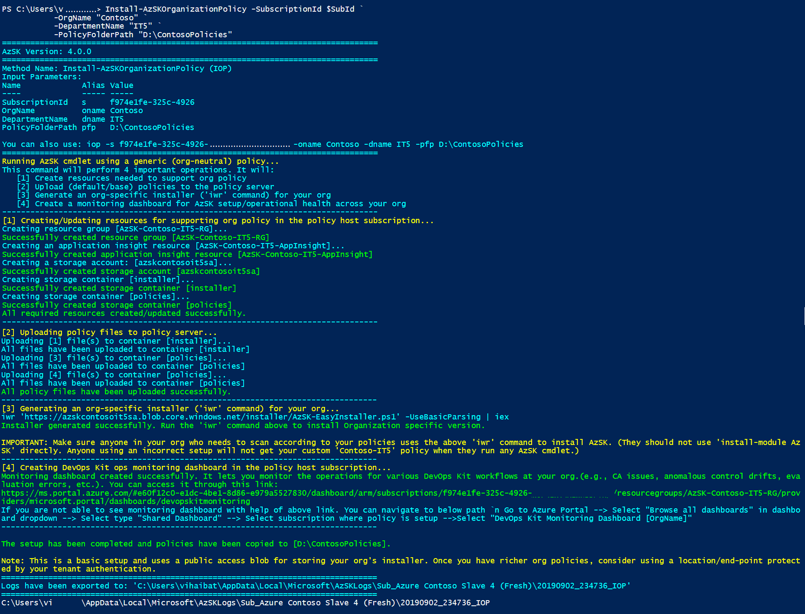


If you note section 3 of the command output , an 'iwr' command line is printed to the console. This command leverages the org-specific
 installation script from the storage account for installing AzSK. You can run this IWR followed by some scan commands (GSS/GRS) to see org policy in effect in your dev box.


```PowerShell
#IWR to install org specific configurations
iwr 'https://azskcontosoitsa.blob.core.windows.net/installer/AzSK-EasyInstaller.ps1' -UseBasicParsing | iex

#Subscription Scan with org policy
Get-AzSKSubscriptionSecurityStatus -SubscriptionId <SubId>
```
 Output:

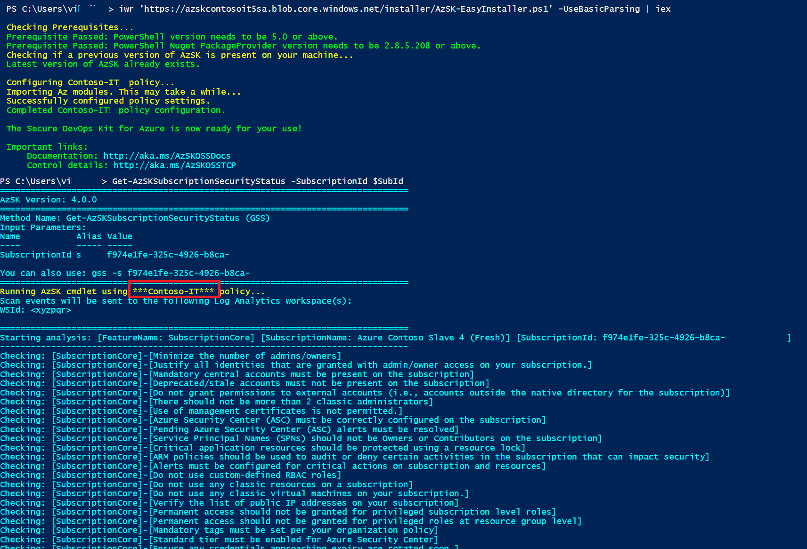


## Next Steps:

Once your org policy is setup, all scenarios/use cases of AzSK should work seamlessly with your org policy server
as the policy endpoint for your org (instead of the default CDN endpoint). Basically, you should be able to do one 
or more of the following using AzSK:

 - People will be able to install AzSK using your special org-specific installer (the 'iwr' install command)
 - Developers will be able to run manual scans for security of their subscriptions and resources (GRS, GSS commands)
 - Teams will be able to configure the AzSK SVT release task in their CICD pipelines
 - Subscription owners will be able to setup Continuous Assurance (CA) from their local machines (**after** they've installed
 AzSK using your org-specific 'iwr' installer locally)
 - Monitoring teams will be able to setup AzSK Log Analytics view and see scan results from CA (and also manual scans and CICD if configured) 
 - You will be able to do central governance for your org by leveraging telemetry events that will collect in the master subscription
 from all the AzSK activity across your org. 

## Consuming custom org policy

Running scan with custom org policy is supported from all three avenues of AzSK viz. local scan (SDL), continuous assurance setup and CICD SVT task. Follow the steps below for the same:

### 1. Running scan in local machine with custom org policy

 To run scan with custom org policy from any machine, get IWR cmdlet from org policy owner. This IWR is generated at the time of policy setup (IOP) or policy update (UOP) in the following format

```PowerShell
#Sample IWR to install org specific configurations
iwr 'https://azskcontosoitsa.blob.core.windows.net/installer/AzSK-EasyInstaller.ps1' -UseBasicParsing | iex

#Run subscription scan cmdlet and validate if it is running with org policy
Get-AzSKSubscriptionSecurityStatus -SubscriptionId <SubId>
```

This step is pre-requisite for the other two scan methods.

### 2. Setup Continuous Assurance

Setting up CA with org policy is pretty simple. Once you have followed the first step i.e. running iwr in local machine, you can run CA setup with the help of doc [here](https://github.com/azsk/DevOpsKit-docs/blob/master/04-Continous-Assurance/Readme.md#setting-up-continuous-assurance---step-by-step). 
CA setup command will refer policy setting from your local machine and configure it in automation runbook.
For existing CA, you just need to run *Update-AzSKContinuousAssurance* in your local.


You can validate if CA is running with custom org policy, via the options below:

   Option 1:

   Go to central CA resource group --> automation account --> Jobs --> Open one of the completed jobs --> It prints initials of PolicyStoreURL (Policy Store URL is nothing but org policy storage account blob url)

   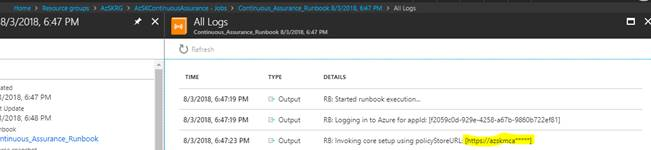

   Option 2:

   i) Download latest AzSK Scan logs stored in storage account (inside AzSKRG) 

   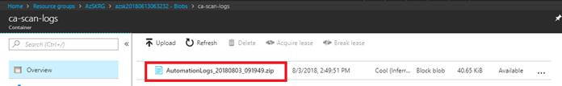

   ii) Open PowerShellOutput.log file under etc folder and validate policy name

   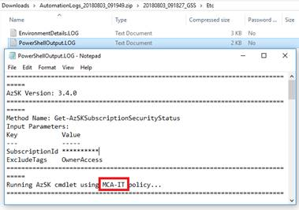

   Option 3:

   Go to Log Analytics workspace which was configured during CA setup and execute below query

   ```AI Query
   AzSK_CL | where Source_s == "CA" |  summarize arg_max(TimeGenerated,*) by SubscriptionId  | project SubscriptionId,PolicyOrgName_s | render table
   ```
   It will show the subscriptions running with org policy in a table as depicted below:

   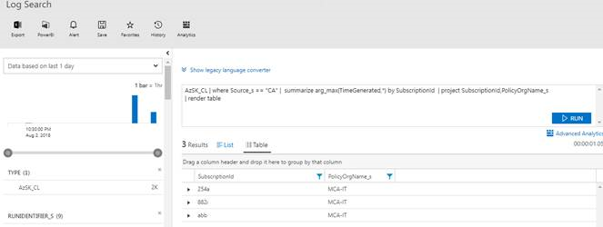


### 3. Using CICD Extension with custom org policy

To set up CICD when using custom org policy, please follow below steps:
1. Add Security Verification Tests (SVTs) in VSTS pipeline by following the steps [here](../03-Security-In-CICD#adding-svts-in-the-release-pipeline).
2. Make sure AzSKServerURL and EnableServerAuth settings in the AzSK_SVTs task are setup correctly (Refer step 5 in the document referred above)

Having set the policy URL along with AzSK_SVTs Task, you can verify if your CICD task has been properly setup by following steps [here](../03-Security-In-CICD#verifying-that-the-svts-have-been-added-and-configured-correctly).


Policy owner can monitor the subscriptions being scanned from different environments with the help of application insight telemetry.

```AI Query
customEvents
| where timestamp >= ago(7d)
| where name == "Control Scanned"
| summarize arg_max(timestamp, *)  by Day = bin(timestamp,1d), ScanSource = tostring(customDimensions.ScanSource),tostring(customDimensions.SubscriptionId) 
| summarize SubscriptionCount = count() by Day, ScanSource
| render barchart
```
Output:

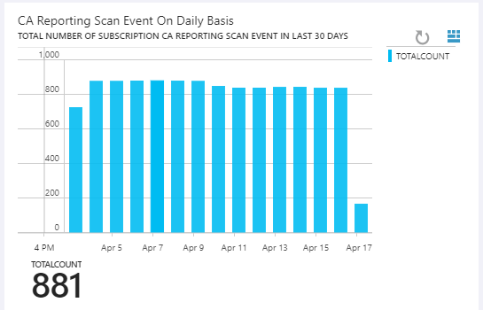


## Modifying and customizing org policy 

#### Getting Started

The typical workflow for all policy changes will remain same and will involve the following basic steps:

 1) Go to the folder on your dev box which has your org-customized policies. This could either be the folder you specified while running org policy setup command or the default one used by it. If you don't have policies on your dev box, you can download those using the following cmdlet. (Please note that the OrgName, DepartmentName and PolicyFolderPath values are for illustration only. You may need to replace them with the ones used during your org policy setup.)

      ```PowerShell
      Get-AzSKOrganizationPolicyStatus -SubscriptionId <SubscriptionId> `
               -OrgName "Contoso" `
               -DepartmentName "IT" `
               -DownloadPolicy `
               -PolicyFolderPath "D:\ContosoPolicies"
      ```


 2) Make modifications to the existing files (or add additional policy files as required)
 3) Run the policy update command to upload all artifacts to the policy server (*Update-AzSKOrganizationPolicy*). It is possible to test policies in local before uploading to server. We will cover this scenario in detail further in this document.
 4) Test in a fresh PS console that the policy change is in effect. (Policy changes do not require re-installation of AzSK.)


Note that you can upload policy files from any folder (e.g., a clone of the originally used/created one). It just needs to 
have the same folder structure as the default one generated by the first-time policy setup and you must specify
the folder path using the '-PolicyFolderPath' parameter.

Because policy on the server works using the 'overlay' approach, **the corresponding file on the server
needs to have only those specific changes that are required (plus some identifying elements in some cases).**

Lastly, note that while making modifications, you should **never** edit the files that came with the AzSK installation folder(%userprofile%\documents\WindowsPowerShell\Modules\AzSK). 
You should create copies of the files you wish to edit, place them in our org-policy folder and make requisite
modifications there.

> **Note**: ServerConfigMetadata.json and AzSK-EasyInstaller.ps1 will always get overwritten on the subsequent run of the command. 

	
### Basic scenarios for org policy customization


In this section let us look at typical scenarios in which you would want to customize the org policy and ways to accomplish them. 

> Note: To edit policy JSON files, use a friendly JSON editor such as Visual Studio Code. It will save you lot of
> debugging time by telling you when objects are not well-formed (extra commas, missing curly-braces, etc.)! This
> is key because in a lot of policy customization tasks, you will be taking existing JSON objects and removing
> large parts of them (to only keep the things you want to modify).


##### a) Changing the default `'Running AzSK using...'` message
Whenever any user in your org runs an AzSK command after having installed AzSK using your org-specific installer (IWR), 
they should see a message such as the following (note the 'Contoso-IT') indicating that AzSK is running using an org-specific policy:

    Running AzSK cmdlet using ***Contoso-IT*** policy

Notice that here, the default (first-time) org policy setup injects the 'Contoso-IT' based on the OrgName and
the DeptName that you provided when you setup your org policy server. (When users are running without your 
org policy correctly setup, they will see the 'Running AzSK cmdlet using generic (org-neutral)
policy' message which comes from the AzSK public CDN endpoint.)

This message resides in the AzSk.json policy file on the server and the AzSK *always* displays the text 
from the server version of this file.

You may want to change this message to something more detailed. (Or even use this as a mechanism to notify all users
within the org about something related to AzSK that they need to attend to immediately.) 
In this example let us just make a simple change to this message. We will just more '*' characters on either side 
of the 'Contoso-IT' so it stands out a bit.

###### Steps:

 i) Open the AzSk.json from your local org-policy folder.
     Path from example: D:\ContosoPolicies\Config\AzSK.json

 ii) Edit the value for "Policy Message" field by adding 5 '*' characters on each side of 'Contoso-IT' as under:
   ```
   "PolicyMessage" : "Running AzSK cmdlet using ***** Contoso-IT ***** policy"
   ```
 iii) Save the file
 
 iv) Run the policy update command 

```PowerShell
Update-AzSKOrganizationPolicy -SubscriptionId <SubscriptionId> `
   -OrgName "Contoso" `
   -DepartmentName "IT" `
   -PolicyFolderPath "D:\ContosoPolicies"

 #If custom resource names are used during setup, you can use below parameters to download policy

Update-AzSKOrganizationPolicy -SubscriptionId <SubscriptionId> `
   -OrgName "Contoso-IT" `           
   -ResourceGroupName "Contoso-IT-RG" `
   -StorageAccountName "contosoitsa" `
   -AppInsightName "ContosoITAppInsight" `
   -PolicyFolderPath "D:\ContosoPolicies"
```


###### Testing:

The updated policy is now on the policy server. You can ask another person to test this by running any AzSK cmdlet
(e.g., Get-AzSKInfo) in a **fresh** PS console. When the command starts, it will show an updated message as in the 
image below:

 

This change will be effective across your organization immediately. Anyone running AzSK commands (in fresh PS sessions)
should see the new message. 

##### b) Changing a control setting for specific controls 
Let us now change some numeric setting for a control. A typical setting you may want to tweak is the maximum number of
owners/admins allowed for your org's subscriptions.  It is verified in one of the subscription security controls. (The default value is 5.)

This setting resides in a file called ControlSettings.json. Because the first-time org policy setup does not
customize anything from this, we will first need to copy this file from the local AzSK installation.

The local version of this file should be in the following folder:
```PowerShell
    %userprofile%\Documents\WindowsPowerShell\Modules\AzSK\<version>\Framework\Configurations\SVT
```

    
 
Note that the 'Configurations' folder in the above picture holds all policy files (for all features) of AzSK. We 
will make copies of files we need to change from here and place the changed versions in the org-policy folder. 
Again, you should **never** edit any file directly in the local installation policy folder of AzSK. 
Rather, **always** copy the file to your own org-policy folder and edit it there.

###### Steps:

 i) Copy the ControlSettings.json from the AzSK installation to your org-policy folder
 
 ii) Remove everything except the "NoOfApprovedAdmins" line while keeping the JSON object hierarchy/structure intact
     

 iii) Save the file
 
 iv) Rerun the policy update or setup command (the same command you ran for the first-time setup)
 
###### Testing: 

Anyone in your org can now start a fresh PS console and the result of the evaluation of the number of owners/admins control in 
the subscription security scan (Get-AzSKSubscriptionSecurityStatus) should reflect that the new setting is in 
effect. (E.g., if you change the max count to 3 and they had 4 owners/admins in their subscription, then the result for control (Azure_Subscription_AuthZ_Limit_Admin_Owner_Count) will change from 'Passed' to 'Failed'.)

##### c) Customizing specific controls for a service 

In this example, we will make a slightly more involved change in the context of a specific SVT (Storage). 

Imagine that you want to turn off the evaluation of some control altogether (regardless of whether people use the `-UseBaselineControls` parameter or not).
Also, for another control, you want people to use a recommendation which leverages an internal tool the security team
in your org has developed. Let us do this for the Storage.json file. Specifically, we will:
1. Turn off the evaluation of `Azure_Storage_Audit_Issue_Alert_AuthN_Req` altogether.
2. Modify severity of `Azure_Storage_AuthN_Dont_Allow_Anonymous` to `Critical` for our org (it is `High` by default).
3. Change the recommendation for people in our org to follow if they need to address an issue with the `Azure_Storage_DP_Encrypt_In_Transit` control.
4. Disable capability to attest the control `Azure_Storage_DP_Restrict_CORS_Access` by adding 'ValidAttestationStates' object.

###### Steps: 
 
 i) Copy the Storage.json from the AzSK installation to your org-policy folder

 ii) Remove everything except the ControlID, the Id and specific property we want to modify as mentioned above. 

 iii) Make changes to the properties of the respective controls so that the final JSON looks like the below. 

```JSON
{
  "Controls": [
   {
      "ControlID": "Azure_Storage_AuthN_Dont_Allow_Anonymous",
      "Id": "AzureStorage110",
      "ControlSeverity": "Critical"
   },
   {
      "ControlID": "Azure_Storage_Audit_Issue_Alert_AuthN_Req",
      "Id": "AzureStorage120",
      "Enabled": false
   },
   {
      "ControlID": "Azure_Storage_DP_Encrypt_In_Transit",
      "Id": "AzureStorage160",
      "Recommendation": "**Note**: Use our Contoso-IT-EncryptInTransit.ps1 tool for this!"
   },
   {
      "ControlID": "Azure_Storage_DP_Restrict_CORS_Access",
      "ValidAttestationStates" : ["None"]
   }
  ]
}
```
> **Note:** The 'Id' field is used for identifying the control for policy merging. We are keeping the 'ControlId'
> field only because of the readability.

 iii) Save the file

 iv) Rerun the org policy update or setup command (the same command you ran for the first-time setup)
 
###### Testing: 
Someone in your org can test this change using the `Get-AzSKAzureServicesSecurityStatus` command on a target
resource group which contains a storage account. If run with the `-UseBaselineControls` switch, you will see that
the control Azure_Storage_AuthN_Dont_Allow_Anonymous shows as `Critical` in the output CSV and the recommendation for control Azure_Storage_DP_Encrypt_In_Transit has changed to
the custom (internal tool) recommendation you wanted people in your org to follow. 

Likewise, even after you run the scan without the `-UseBaselineControls` parameter, you will see that the control Azure_Storage_Audit_Issue_Alert_AuthN_Req is not evaluated and does not
appear in the resulting CSV file. 


##### d) Creating a custom control 'baseline' for your org
A powerful capability of AzSK is the ability for an org to define a baseline control set on the policy server
that can be leveraged by all individuals in the org (and in other AzSK scenarios like CICD, CA, etc.) via the "-UseBaselineControls" parameter
during scan commands. 

By default, when someone runs the scan with "-UseBaselineControls" parameter, it leverages the set of
controls listed as baseline in the ControlSettings.json file present on default AzSK CDN endpoint. 

However, once you have set up an org policy server for your organization, this CDN endpoint is no more in use. (As a 
side note, you can always 'simulate' CDN-based/org-neutral execution by removing or renaming your 
`%localappdata%\Microsoft\AzSK\AzSKSettings.json` file.) Thus, after org policy is setup, there will 
not be a 'baseline' control set defined for your organization. Indeed, if you run any of the scan commands using the
"-UseBaselineControls" switch, you will see exception "There are no baseline controls defined for your org. No controls will be scanned."

To define baseline controls for your org, you will need to define update the ControlSettings.json
file as per the steps below-
 
(We assume that you have tried the max owner/admin count steps in (b) above and edited the ControlSettings.json 
file is already present in your org policy folder.)

 i) Edit the ControlSettings.json file to add a 'BaselineControls' object as per below:
 
```JSON
{
   "NoOfApprovedAdmins": 1,
   "BaselineControls": {
      "ResourceTypeControlIdMappingList": [
         {
            "ResourceType": "AppService",
            "ControlIds": [
               "Azure_AppService_DP_Dont_Allow_HTTP_Access",
               "Azure_AppService_AuthN_Use_AAD_for_Client_AuthN"
            ]
         },
         {
            "ResourceType": "Storage",
            "ControlIds": [
               "Azure_Storage_AuthN_Dont_Allow_Anonymous",
               "Azure_Storage_DP_Encrypt_In_Transit"
            ]
         }
      ],
      "SubscriptionControlIdList": [
         "Azure_Subscription_AuthZ_Limit_Admin_Owner_Count",
         "Azure_Subscription_AuthZ_Dont_Use_NonAD_Identities",
         "Azure_Subscription_Config_Azure_Security_Center"
      ]
   }
}
```

> Notice how, apart from the couple of extra elements at the end, the baseline set is pretty much a list of 'ResourceType'
and 'ControlIds' for that resource...making it fairly easy to customize/tweak your own org baseline. 
> Here the name and casing of the resource type name must match that of the policy JSON file for the corresponding resource's JSON file > in the SVT folder and the control ids must match those included in the JSON file. 

> Note: Here we have used a very simple baseline with just a couple of resource types and a very small control set.
> A more realistic baseline control set will be more expansive. You can refer CSEO defined baseline using ControlSettings file [here](https://github.com/azsk/DevOpsKit/blob/master/src/OSSConfiguration/ControlSettings.json).
    
 ii) Save the ControlSettings.json file
 
 iii) Confirm that an entry for ControlSettings.json is already there in the ServerConfigMetadata.json file. (Else see step-iii in (c) above.)
 
 iv) Run the policy setup command (the same command you ran for the first-time setup)

###### Testing:

To test that the baseline controls set is in effect, anyone in your org can start a fresh PS console and run the subscription
and resources security cmdlets with the `-UseBaselineControls` parameter. You will see that regardless of the actual
types of Azure resources present in their subscriptions, only the ones mentioned in the baseline get evaluated in the scan
and, even for those, only the baseline controls get evaluated.


> **Note:** Similar to baseline control, you can also define preview baseline set with the help of similar property "PreviewBaselineControls" in ControlSettings.json. This preview set gets scanned using parameter `-UsePreviewBaselineControls` with scan commands.


##### e) Customizing Severity labels 
Ability to customize naming of severity levels of controls (e.g., instead of High/Medium, etc. one can now have Important/Moderate, etc.) with the changes reflecting in all avenues (manual scan results/CSV, Log Analytics workspace, compliance summaries, dashboards, etc.)

###### Steps: 

 i) Edit the ControlSettings.json file to add a 'ControlSeverity' object as per below:
 
```JSON
{
   "ControlSeverity": {
    "Critical": "Critical",
    "High": "Important",
    "Medium": "Moderate",
    "Low": "Low"
  }
}
```
 ii) Save the file
 
 iii) Run the policy setup command (the same command you ran for the first-time setup)

 ###### Testing: 

Someone in your org can test this change using the `Get-AzSKAzureServicesSecurityStatus`. You will see that
the controls severity shows as `Important` instead of `High` and `Moderate` instead of `Medium` in the output CSV.

### Managing policy/advanced policy usage

#### Downloading and examining policy folder

After installing org policy, you must have observed that the command creates policy folder in local machine with some default folders and files. 

If you don't have policies, you can always download them using the following command:

```PowerShell
Get-AzSKOrganizationPolicyStatus -SubscriptionId <SubscriptionId> `
         -OrgName "Contoso" `
         -DepartmentName "IT" `
         -DownloadPolicy `
         -PolicyFolderPath "D:\ContosoPolicies"
```


These files are uploaded to the policy storage as well. You can recollect the function of each of these files from [here.](Readme.md#basic-files-setup-during-policy-setup)


#### Working with ‘local’ mode (policy dev-test-debug)

You can run the scan pointing to the local policy present on your dev box using the following steps. It will enable you test the policy customizations before pushing those to the server. 

Step 1: Point AzSK settings to local org policy folder("D:\ContosoPolicies\"). 
    
```PowerShell
Set-AzSKPolicySettings -LocalOrgPolicyFolderPath "D:\ContosoPolicies\"
```

This will update "AzSKSettings.json" file present at location "%LocalAppData%\Microsoft\AzSK" to point to local folder instead of server storage.

You can run Get-AzSKInfo (GAI) cmdlet to check the current AzSK settings. It will show OnlinePolicyStoreUrl as policyFolder path (instead of the blob URL). 

   ```PowerShell
   GAI -InfoType HostInfo
   ```
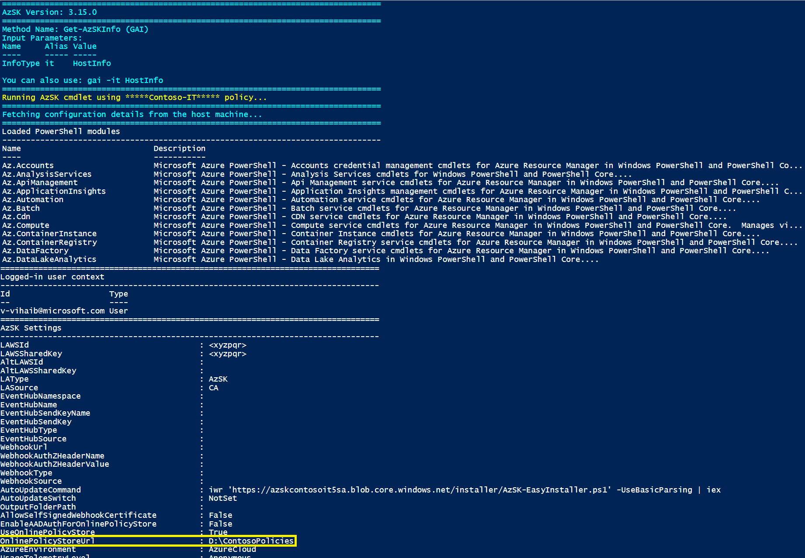


Step 2: Perform the customization to policy files as per scenarios. 

Here you can customize the list of baseline or preview baseline controls for your org using steps already explained [here](Readme.md#d-creating-a-custom-control-baseline-for-your-org) (excluding the last step of running the policy setup or policy update command.)

Step 3: Now you run scan to see policy updates in effect. Clear session state and run scan commands (GRS or GSS) with parameters sets for which config changes are done like UseBaselineControls,ResourceGroupNames, controlIds etc.

```PowerShell
# Clear AzSK session cache for settings
Clear-AzSKSessionState

# Run subscription scan using local policy settings
Get-AzSKSubscriptionSecurityStatus -SubscriptionId <SubscriptionId>

# Run services security scan with baseline using local policy settings
Get-AzSKAzureServicesSecurityStatus -SubscriptionId <SubscriptionId> -UseBaselineControls
```     

Step 3: If scan commands are running fine with respect to the changes done to the configuration, you can update policy based on parameter set used during installations. If you see some issue in scan commands, you can fix configurations and repeat step 2. 

```PowerShell
Update-AzSKOrganizationPolicy -SubscriptionId <SubscriptionId> `
   -OrgName "Contoso" `
   -DepartmentName "IT" `
   -PolicyFolderPath "D:\ContosoPolicies"

#If custom resources names are used during setup, you can use below parameters to download policy
Update-AzSKOrganizationPolicy -SubscriptionId <SubscriptionId> `
   -OrgName "Contoso-IT" `           
   -ResourceGroupName "Contoso-IT-RG" `
   -StorageAccountName "contosoitsa" `
   -AppInsightName "ContosoITAppInsight" `
   -PolicyFolderPath "D:\ContosoPolicies"
```

Step 4: Validate if policy is correctly uploaded and there are no missing mandatory policies using policy health check command

**Note:**
It is always recommended to validate health of org policy for mandatory configurations and policy schema syntax issues using below command. You can review the failed checks and follow the remedy suggested.

```PowerShell
Get-AzSKOrganizationPolicyStatus -SubscriptionId <SubscriptionId> `
           -OrgName "Contoso" `
           -DepartmentName "IT"

#If you have used customized resource names, you can use below parameter sets to run health check

Get-AzSKOrganizationPolicyStatus -SubscriptionId <SubscriptionId> `
           -OrgName "Contoso-IT" `
           -ResourceGroupName "RGName" `
           -StorageAccountName "PolicyStorageAccountName" 
```

Step 5: If all the above steps works fine, you can point back your AzSK setting to online policy server by running "IWR" command generated at the end of *Update-AzSKOrganizationPolicy*


You can also set up a 'Staging' environment where you can do all pre-testing of policy setup, policy changes, etc. A limited number of 
people could be engaged in testing the actual end user effects of the policy changes before deploying them for broader usage. 
Also, you can choose to retain the staging setup or just re-create a fresh one for each major policy change.


For your actual (production) policies, we recommend that you check them into source control and use the local clone of *that* folder as the location
for the AzSK org policy setup command when uploading to the policy server. In fact, setting things up so that any policy
modifications are pushed to the policy server via a CICD pipeline would be ideal. (That is how we do it at CSE.)
Refer [maintaining policy in source-control]() and [deployment using CICD pipeline]().

	
#### Troubleshooting common issues 
Here are a few common things that may cause glitches and you should be careful about:

- Make sure you use exact case for file names for various policy files (and the names must match case-and-all
with the entries in the ServerConfigMetadata.json file)
- Make sure that no special/BOM characters get introduced into the policy file text. (The policy upload code does scrub for
a few known cases, but we may have missed the odd one.)
- Note that the policy upload command always generates a fresh installer.ps1 file for upload. If you want to make changes to 
that, you may have to keep a separate copy and upload it. (We will revisit this in future sprints.)


### How to upgrade org AzSK version to the latest AzSK version

DevOps kit team releases the newer version of the AzSK module on 15th of every month. It is recommended that you upgrade your org's AzSK version to the latest available version to ensure that your org is up to date with the latest security controls and features. You need to follow the steps below to smoothly upgrade AzSK version for your org: 

1. Install latest AzSK module in your local machine with the help of common setup command

   ```PowerShell
   # Use -Force switch as and when required 
   Install-Module AzSK -Scope CurrentUser -AllowClobber
   ```

2. Go through the [release notes](https://azsk.azurewebsites.net/ReleaseNotes/LatestReleaseNotes.html) for AzSK latest version. It typically lists the changes which may impact org policy users under section 'Org policy/external user updates'.

3. If the release notes indicate that you need to perform any additional steps before upgrading the org policy version then perform those changes with the help of [org policy updates page](OrgPolicyUpdate.md). It is highly recommended that you do these changes to your local policy folder and test those before pushing to the policy server. Instructions at [downloading your existing org policies](Readme.md#downloading-and-examining-policy-folder) and [Working with ‘local’ mode (policy dev-test-debug)](Readme.md#working-with-local-mode-policy-dev-test-debug) would be useful to do so. 
If there are no additional steps mentioned, then you can go ahead with next step. 

5. Run UOP with AzSK version update flag

   ```PowerShell
   # For Basic Setup
   Update-AzSKOrganizationPolicy -SubscriptionId <SubscriptionId> `
      -OrgName "Contoso" `
      -DepartmentName "IT" `
      -PolicyFolderPath "D:\ContosoPolicies" -OverrideBaseConfig OrgAzSKVersion

   #For custom Resource Group Setup
   Update-AzSKOrganizationPolicy -SubscriptionId <SubscriptionId> `
      -OrgName "Contoso-IT" `           
      -ResourceGroupName "Contoso-IT-RG" `
      -StorageAccountName "contosoitsa" `
      -PolicyFolderPath "D:\ContosoPolicies" -OverrideBaseConfig OrgAzSKVersion
   ```

 Internally, this will update the AzSK version in the AzSK.Pre.json file present on your org policy server.. 
 
#### Upgrade scenarios in different scan sources

Once org policy is updated with the latest AzSK version, you will see it in effect in all environments

 **Local scans:** If application teams are using older version(or any other version than mentioned in org policy), they will start seeing warning as shown below while running scans.

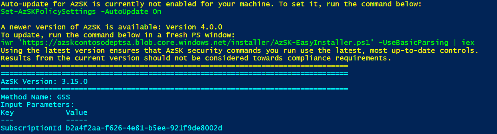

**Continuous Assurance:** CA will auto-upgrade to latest org version when the next scheduled job runs. You can monitor upgrade status with the help of application insight events. Use below query in org AI 

 ``` AI Query
| customEvents
| where timestamp >= ago(6d)
| where name == "Control Scanned"
| where customDimensions.ScanSource =="Runbook"
| where customDimensions.ScannerModuleName == "AzSK"
| summarize arg_max(timestamp, *) by SubId = tostring(customDimensions.SubscriptionId)
| summarize CAModuleVersionSummary= count() by Version = tostring(customDimensions.ScannerVersion)
| render piechart
 ```

 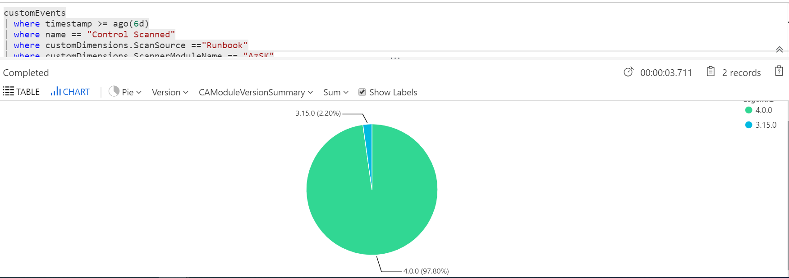
 
 **CICD:** As of now, CICD SVT task does not support version from org policy settings. It always installs latest AzSK version available in PowerShell gallery, irrespective of version mentioned in policy. Although it refers other control policies from policy store.

### Maintaining policy in source-control

Coming soon

### Policy deployment using CICD pipeline

Coming soon

# Create security compliance monitoring solutions
Once you have an org policy setup running smoothly with multiple subscriptions across your org, you will need a solution that provides visibility of security compliance for all the subscriptions across your org. This will help you drive compliance/risk governance initiatives for your organization. 

When you setup your org policy endpoint (i.e. policy server), one of the things that happens is creation of an Application Insights workspace for your setup. After that, whenever someone performs an AzSK scan for a subscription that is configured to use your org policy, the scan results are sent (as 'security' telemetry) to your org's Application Insights workspace. Because this workspace receives scan events from all such subscriptions, it can be leveraged to generate aggregate security compliance views for your cloud-based environments. 

## Create cloud security compliance report for your org using PowerBI
We will look at how a PowerBI-based compliance dashboard can be created and deployed in a matter of minutes starting with a template dashboard that ships with the AzSK. All you need apart from the Application Insights instance is a CSV file that provides a mapping of your organization hierarchy to subscription ids (so that we know which team/service group owns each subscription).

> Note: This is a one-time activity with tremendous leverage as you can use the resulting dashboard (example below) towards driving security governance activities over an extended period at your organization. 

#### Step 0: Pre-requisites
To create, edit and publish your compliance dashboard, you will need to install the latest version of PowerBI desktop on your local machine. Download it from [here](https://powerbi.microsoft.com/en-us/desktop/).


#### Step 1: Prepare your org-subscription mapping
In this step you will prepare the data file which will be fed to the PowerBI dashboard creation process as the mapping from subscription ids to the org hierarchy within your environment. The file is in a simple CSV form and should appear like the one below. 

> Note: You may want to create a small CSV file with just a few subscriptions for a trial pass and then update it with the full subscription list for your org after getting everything working end-to-end.

A sample template for the CSV file is [here](./TemplateFiles/OrgMapping.csv):

 

The table below describes the different columns in the CSV file and their intent.

| ColumnName  | Description | Required? | Comments |
| ---- | ---- | ---- |---- |
| BGName | Name of business group (e.g., Finance, HR, Marketing, etc.) within your enterprise | Yes |  This you can consider as level 1 hierarchy for your enterprise | 
| ServiceGroupName | Name of Service Line/ Business Unit within an organization | Yes |  This you can consider as level 2 hierarchy for your enterprise | 
| SubscriptionId | Subscription Id belonging to a org/servicegroup | Yes |   | 
| SubscriptionName | Subscription Name | Yes | This should match the actual subscription name. If it does not, then the actual name will be used.  | 
| IsActive | Use "Y" for Active Subscription and "N" for Inactive Subscription  | Yes | This will be used to filter active and inactive subscriptions .| 
| OwnerDetails | List of subscription owners separated by semi-colons (;)  | Yes | These are people accountable for security of the subscription.  | 

> **Note**: Ensure you follow the correct casing for all column names as shown in the table above. The 'out-of-box' PowerBI template is bound to these columns. If you need additional columns to represent your org hierarchy then you may need to modify the template/report as well.


#### Step 2: Upload your mapping to the Application Insights (AI) workspace

In this step you will import the data above into the AI workspace created during org policy setup. 

 **(a)** Locate the AI resource that was created during org policy setup in your central subscription. This should be present under org policy resource group. After selecting the AI resource, copy the Instrumentation Key.
 
 **(b)** To push org Mapping details, copy and execute the script available [here](./Scripts/OrgPolicyPushOrgMappingEvents.txt).

 > **Note**: Due to limitation of application insight, you will need to repeat this step every 90 days interval. 

#### Step 3: Create a PowerBI report file
In this section we shall create a PowerBI report locally within PowerBI Desktop using the AI workspace from org policy subscription as the datasource. We will start with a default (out-of-box) PowerBI template and configure it with settings specific to your environment. 

> Note: This step assumes you have completed Step-0 above!

**(a)** Get the ApplicationId for your AI workspace from the portal as shown below:


**(b)** Download and copy the PowerBI template file from [here](https://github.com/azsk/DevOpsKit-docs/blob/master/07-Customizing-AzSK-for-your-Org/TemplateFiles/AzSKComplianceReport.pbit) to your local machine.

**(c)** Open the template (.pbit) file using PowerBI Desktop, provide the AI ApplicationId and click on 'Load' as shown below:


**(d)** PowerBI will prompt you to login to the org policy subscription at this stage. Authenticate using your user account. (This step basically allows PowerBI to import the data from AI into the PowerBI Desktop workspace.)


Once you have successfully logged in, you will see the AI data in the PowerBI report along with org mapping as shown below: 


The report contains 2 tabs. There is an overall/summary view of compliance and a detailed view which can be used to see control 'pass/fail' details for individual subscriptions. An example of the second view is shown below:


> TBD: Need to add steps to control access to the detailed view by business group. (Dashboard RBAC.) 

#### Step 4: Publish the PowerBI report to your enterprise PowerBI workspace

**(a)** Before publishing to the enterprise PowerBI instance, we need to update AI connection string across data tables in the PowerBI report. The steps to do this are as below:

[a1] Click on "Edit Queries" menu option.


[a2] Copy the value of "AzSKAIConnectionString"


[a3] Replace the value of "AzSKAIConnectionString" with the actual connection string (e.g., AzSKAIConnectionString => "https://api.applicationinsights.io/v1/apps/[AIAppID]/query"). You should retain the "" quotes in the connection string.


[a4] Repeat this operation for ControlResults_AI, Subscriptions_AI, and ResourceInventory_AI data tables.

[a5] Click on "Close and Apply".

**(b)** You can now publish your PBIX report to your workspace. The PBIX file gets created locally when you click "Publish".

Click on Publish


Select destination workspace


Click on "Open [Report Name] in Power BI" 


**(c)** Now report got published successfully. You can schedule refresh for report with below steps

Go to Workspace --> Datasets --> Click on "..." --> Click on "Schedule Refresh"


Click on "Edit credentials"

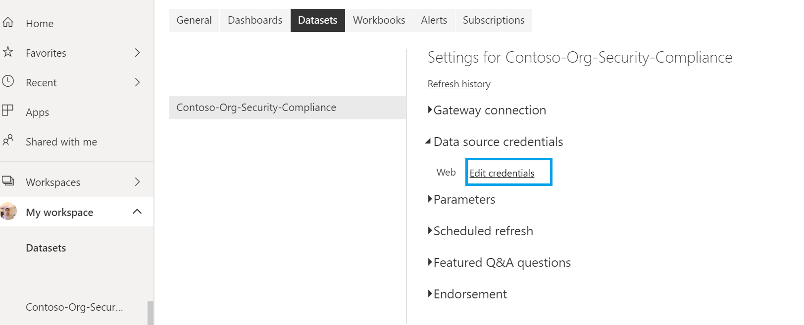

Sign in with account with which policy is created


Add refresh scheduling timings and click on "Apply"

> **Note:** You may not see "Schedule refresh" option if step [a3] and [a4] is not completed successfully.


## AzSK org health monitoring dashboard

Monitoring dashboard gets created along with policy setup and it lets you monitor the operations for various DevOps Kit workflows at your org.(e.g. CA issues, anomalous control drifts, evaluation errors, etc.). 

You will be able to see the dashboard at the home page of Azure Portal. If not, you can navigate to the following path to see the dashboard

Go to Azure Portal --> Select "Browse all dashboards" in dashboard dropdown -->  Select type "Shared Dashboard" --> Select subscription where policy is setup -->Select "DevOps Kit Monitoring Dashboard [OrgName]"

Below is snapshot of the dashboard


## Detail resource inventory dashboard

With the help of telemetry events you will be able to monitor resources inventory in the Org. This will give the visibility over all resources along with control failures over all subscriptions. The PowerBI based template will be shared soon

# Compliance notifications

## Compliance notification to subscription owners

Coming soon

# Advanced usage of org policy (extending AzSK)

## Customizing the SVTs


 It is powerful capability of AzSK to enable an org to customize the SVT behaviour.  Refer [extending AzSK modules](./Extending%20AzSK%20Module/Readme.md) for more details. You will be able to achieve the following scenarios.

   - [Update/extend existing control by augmenting logic](./Extending%20AzSK%20Module/Readme.md##steps-to-extend-the-control-svt)
   - [Add new control for existing GSS/GRS SVT](./Extending%20AzSK%20Module/Readme.md#a-extending-a-gss-svt)
   - [Add an altogether new SVT (non-existing service scan)](./Extending%20AzSK%20Module/Readme.md#steps-to-add-a-new-svt-to-the-azsk-module)


## Customizing subscription security
   Along with subscription security checks, AzSK provides security provisioning commands (e.g. setting up mandatory ARM policies, RBAC roles, ASC configurations etc.) on a subscription. Refer [link](https://github.com/azsk/DevOpsKit-docs/blob/master/01-Subscription-Security/Readme.md#azsk-subscription-security-provisioning-1) for more details on provisioning commands. Each provisioning status is validated with the help of subscription scan controls. Below table gives the details of provisioning commands , GSS control to validate provisioning status and policy file name where all provisioning configurations are present.

| Component  | Provisioning Command | Control in GSS  | Policy File Name | Description | 
| ---- | ---- | ---- |---- | ---- |
| ARM Policy | Set-AzSKARMPolicies | Azure_Subscription_Config_ARM_Policy | Subscription.ARMPolicies.json | Sets ARM policies corresponding to certain actions that are considered insecure. |
| Critical Alerts | Set-AzSKAlerts | Azure_Subscription_Audit_Configure_Critical_Alerts |  Subscription.InsARMAlerts.json | Configuration of subscription and resource alerts for activities with significant security implications |
| Azure Security Center configuration | Set-AzSKAzureSecurityCenterPolicies | Azure_Subscription_Config_Azure_Security_Center |  SecurityCenter.json | Default enterprise policy settings for Azure Security Center like configuring security contact information in ASC etc. |
| RBAC roles/permissions | Set-AzSKSubscriptionRBAC | Azure_Subscription_AuthZ_Add_Required_Central_Accounts |  Subscription.RBAC.json | Setup mandatory accounts that are required for central scanning/audit/compliance functions. |

Common steps for configuring policies for subscription provisioning

 i) Copy the provisioning policy file from the AzSK installation folder (%userprofile%\documents\WindowsPowerShell\Modules\AzSK\<version>\Framework\Configurations\SubscriptionSecurity) to your org-policy folder

 ii) Edit policy file with schema and guidance given below section for each component 

 iii) Add entry for configuration in index file (ServerConfigMetadata.json) with OverrideOffline property. OverrideOffline is required for all provisioning policies as it does not support overlay method. 

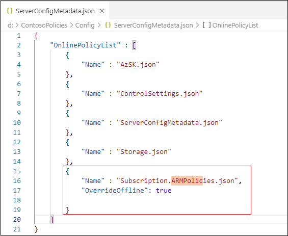

 iv) Rerun the org policy update or setup command (the same command you ran for the first-time setup)


Once policy is updated, it will start respecting in subscription scan command and failing controls with details of missing configuration on subscriptions. 
Ideally below steps are expected to be executed by individual subscription owners.

 i) Run subscription scan
   
   ```PowerShell
   # Subscription scan
   Get-AzSKSubscriptionSecurityStatus -SubscriptionId <SubscriptionId>
   # Scanning perticular policy control 
   Get-AzSKSubscriptionSecurityStatus -SubscriptionId <SubscriptionId> -ControlIds "Azure_Subscription_Config_ARM_Policy"
   ```

ii) Validate detail logs printing missing policies expected by Org policy

iii) Execute [provisioning command](../01-Subscription-Security/Readme.md#azsk-subscription-security-provisioning-1) with required parameters
      
   > **Note:** If you want to configure all policies(alert,ARM policy, ASC and RBAC), you can use all in one command Set-AzSKSubscriptionSecurity.

iv) Run subscription scan again and validate control gets passed. 


### Schema for policy files 
#### ARM policy 

   ```C#
   {
      "Version": "3.1809.0",
      "Policies": [      
         {
            "policyDefinitionName": "AzSK_ARMPol_Deny_Classic_Resource_Create", // Friendly policy name. The format used is AzSK_ARMPol_<PolicyAction-Audit,Deny>_<Resource>_<Operation> 
            "policyDefinition": "{\"if\":{\"anyOf\":[{\"field\":\"type\",\"like\":\"Microsoft.ClassicCompute/*\"},{\"field\":\"type\",\"like\":\"microsoft.classicStorage/*\"},{\"field\":\"type\",\"like\":\"Microsoft.ClassicNetwork/*\"}]},\"then\":{\"effect\":\"deny\"}}", // Policy definition. Here we are defining denial of classic resource creation
            "description": "Policy to deny upon creation of classic/v1 (i.e., ASM-based) resources", //  Description about the policy
            "tags": [   
               "Mandatory"
            ], // Tag for policy. Mandatory tag is always picked up by set-AzSKARMPolicy command. If you mention any other tags, you will need to pass explicitly to set command
            "enabled": true, // Defines whether the ARM policy is enabled or not.
            "scope": "/subscriptions/$subscriptionId" // Scope at which policy needs to be applied
         }
      ],
      "DeprecatedPolicies" : [] // Array of deprecated policydefinitionnames. This policy will get removed during policy setup
   }
   ```

To view the samples of ARM policy definitions rules and syntaxes, refer [link](https://docs.microsoft.com/en-us/azure/governance/policy/samples/)

#### Alert set
You will find current supported alert list [here](/02-Secure-Development/ControlCoverage/Feature/AlertList.md).  

   ```C#
   {
      "Version": "3.1803.0",
      "AlertList": [ 
         {
            "Name": "AzSK_Subscription_Alert", // Alert name containing group of all operations.  
            "Description": "Alerts for Subscription Activities", // Alert description
            "Enabled": true, // Defines alert is enabled or not
            "Tags": [ 
            "Mandatory"
            ], // Tag for Alerts group. Mandatory tag is always picked up by set-AzSKAlerts command. 
            "AlertOperationList": [
            {
               "Name": "AzSK_Assign_the_caller_to_User_Access_Administrator_role", // Friendly name for operations
               "Description": "Grants the caller User Access Administrator access at the tenant scope", // operation details
               "OperationName": "Microsoft.Authorization/elevateAccess/action", // operation name
               "Tags": [
                  "Mandatory"
               ],
               "Severity": "Critical", // severity for operation Critial/High. Critical operations are considered for SMS alerts
               "Enabled": true  // // Defines operation is enabled or not
            }
            ]
         }
   }
   ```
You will get all activity operations that can be added as part of alert using below command 

```PowerShell
Get-AzProviderOperation | FT
```

#### Security center configurations

   Security center can be configured for three things

   -  Autoprovisioning 
   -  SecurityContacts
   -  Default policy setup

```C#
{
    "Version": "3.1906.0",    
    "autoProvisioning" : {
        "id": "/subscriptions/{0}/providers/Microsoft.Security/autoProvisioningSettings/default",
        "name": "default",
        "type": "Microsoft.Security/autoProvisioningSettings",
        "properties": {
        "autoProvision": "On"
        }
    },
    "securityContacts" : {
        "id": "/subscriptions/{0}/providers/Microsoft.Security/securityContacts/default1",
        "name": "default1",
        "type": "Microsoft.Security/securityContacts",
        "properties": {
        "email": "{1}",
        "phone": "{2}",
        "alertNotifications": "On",
        "alertsToAdmins": "On"
        }
    },
    "policySettings" : {
        "properties": {
            "displayName": "ASC Default (subscription: {0})",
            "policyDefinitionId": "/providers/Microsoft.Authorization/policySetDefinitions/1f3afdf9-d0c9-4c3d-847f-89da613e70a8",
            "scope": "/subscriptions/{0}",
            "notScopes": [],
            "parameters": {                                                              
                "endpointProtectionMonitoringEffect": {
                    "value": "AuditIfNotExists"
                }
            },
            "description": "This policy assignment was automatically created by Azure Security Center",
            "metadata": {
                "assignedBy": "Security Center"
            }
        },
        "id": "/subscriptions/{0}/providers/Microsoft.Authorization/policyAsssignments/SecurityCenterBuiltIn",
        "type": "Microsoft.Authorization/policyAssignments",
        "name": "SecurityCenterBuiltIn"
    },
    "optionalPolicySettings" : {}
}
```

   ### RBAC mandatory/deprecated lists
   
   You will be able to check/configure mandatory and deprecated list of RBAC for all subscriptions with the help of below schema

   ```C#
   {
      "ActiveCentralAccountsVersion": "2.1709.0",
      "DeprecatedAccountsVersion": "2.1709.0",
      "ValidActiveAccounts": [
         {
            "Name": "Contoso Cost Trackers", // Name of the account to be provisioned or checked for. 
            "Description": "This AAD group account is deployed as Reader on all subscriptions at Contoso to monitor cost.", //Description for your account. 
            "ObjectId": "", // Object id for user or group or SPN in tenant 
            "ObjectType": "Group", // ServicePrincipal or User or Group.
            "RoleDefinitionName": "Reader", //Subscription RBAC rolename. 
            "Scope": "/subscriptions/$subscriptionId", //Scope of access.
            "Type": "Provision or Validate. E.g., Provision",
            "Tags": [ "Mandatory" ], //Commma separated list of tags each in double quotes. The tag 'Mandatory' means this account is deployed by default and always checked during verification. 
            "Enabled": true
         }
      ],
      "DeprecatedAccounts": [
         {
            "Name": "Name of the account that is considered deprecated and must be deprovisioned. E.g., AutoDeploySPN",
            "Description": "Description for the account. E.g., This was used for automated deployments in the past. It must be removed from all subscriptions.",
            "ObjectId": "object_id_for_user_or_group_or_SPN_in_tenant",
            "ObjectType": "ServicePrincipal or User or Group, E.g., ServicePrincipal",
            "Enabled": false
         }
      ]
   }
```

## ARM checker policy customization

Check [this](https://github.com/azsk/DevOpsKit-docs/blob/master/03-Security-In-CICD/Readme.md#extending-arm-template-checker-for-your-organization)


## Change default resource group name (AzSKRG) and location (EastUS2) created for AzSK components
You can control default resource group name and location using AzSK config present in org policy. Follow below steps to override default behaviour.

> **Note:** Changing default resource group name will break existing continuous assurance setup. You will need to do re-setup of all CA.

**Steps:**

i) Open the AzSK.json from your local org-policy folder

ii) Add the properties for  as under:

    "AzSKRGName" : "<ResourceGroupName>",
    "AzSKLocation" : "<Location>"

iii) Save the file

iv) Run the policy update command.


##### Testing:

Run "IWR" in a fresh PS session (you can ask any other user to run this IWR) to setup policy setting in local. If you have already installed policy using IWR, just run CSS (Clear-AzSKSessionState) followed by command *Set-AzSKSubscriptionSecurity* with required parameters as per the [doc](../01-Subscription-Security/Readme.md#azsk-subscription-security-provisioning-1). This will provision AzSK components(Alerts/Storage etc) under new resource group and location.

**Note:** For continuous assurance setup, you need to follow two extra steps.

i) Pass location parameter "AutomationAccountLocation" explicitly during execution of installation command (Install-AzSKContinuousAssurance). 

ii) Update $StorageAccountRG variable (In RunbookScanAgent.ps1 file present in policy store) value  to AzSKRGName value.


## Scenarios for modifying ScanAgent
   
   ### Scanning only baseline controls using continuous assurance setup

   Continuous Assurance (CA) is configured to scan all the controls. We have kept this as a default behavior since org users often tend to miss out on configuring baseline controls. This behavior is controlled from org policy. 
   If you observed, there are two files present in policy folder under **CA-Runbook** folder, 
   
   - RunbookCoreSetup.ps1: Responsible to install AzSK module  
   - RunbookScanAgent.ps1: Performs CA scans and export results to storage account 
   
   If you open RunbookScanAgent and search for the scan command text Get-AzSKAzureServicesSecurityStatus and Get-AzSKSubscriptionSecurityStatus, you will find it is scanning for all controls excluding "OwnerAccess" control. This is due to the CA SPN having limited (reader) permissions on the subscription.  
   To make CA scan only thr baseline controls, append parameter '-UseBaselineControls' to these scan commands.

   Follow the same steps as earlier to publish these files to org policy server. 

   After policy update, CA will start scanning only the baseline controls.

   ### Scanning owner and graph access controls using CA
   
   During CA setup, SPN is assigned with minimum privileges i.e. reader access on subscription and contributor access on AzSKRG. As a reader, it will not be able to scan controls requiring owner or graph read permissions. You can elevate SPN permission to 'Owner' and remove '-ExcludeTags "OwnerAccess"' parameter against the scan commands in above 2 files. As always, follow the same steps tp publish these files to org policy server.
   However, in general we let SPN have minimum permissions assigned and make it a practice for individual teams to perform scan with high privileged role on regular basis to validate Owner access controls.
   
   ### Reporting critical alerts
   
   Comming soon
   
   <!-- ### Collecting dynamic resource metadata using scan agent
   Coming soon -->

# Org policy usage statistics and monitoring using telemetry

The telemetry data can be leveraged by org policy owners to understand AzSK usage, monitor compliance drift, CA health, resource inventory, troubleshooting etc. All helpful AI queries are listed on page [here](https://github.com/azsk/DevOpsKit-docs/tree/master/06-Security-Telemetry/App-Insights-Queries).

## Frequently Asked Questions

#### I am getting exception "The current subscription has been configured with DevOps kit policy for the '***' Org, However the DevOps kit command is running with a different ('org-neutral') org policy....."?

When your subscription is running under org policy, AzSK marks subscription for that Org. If user is running scan commands on that subscription using Org-neutral policy, it will block those commands as that scan/updates can give invalid results against org policy. You may face this issue in different environments. Below steps will help you to fix issue

**Local Machine:**

- Run “**IWR**" installation command shared by Policy Owner. This will ensure latest version installed with org policy settings.(**Note:** If you are from CSE, please install the AzSK via instructions at https://aka.ms/devopskit/onboarding so that CSE-specific policies are configured for your installation.)

- Run "*Clear-AzSKSessionState*" followed by any scan command and validate its running with org policy. It gets displayed at the start of command execution "Running AzSK cmdlet using ***** policy"

**Continuous Assurance:**

- Run "*Update-AzSKContinuousAssurance*" command with org policy. This will ensure that continuous assurance setup is configured with org policy settings.

- After above step, you can trigger runbook and ensure that after job completion, scan exported in storage account are with org policy. You can download logs and validate it in file under path <YYYYMMDD_HHMMSS_GRS>/ETC/PowerShellOutput.LOG. 
Check for message during start of command "Running AzSK cmdlet using ***** policy"


**CICD:**
- You need to configure policy url in pipeline using step **5** defined [here](https://github.com/azsk/DevOpsKit-docs/tree/master/03-Security-In-CICD#adding-svts-in-the-release-pipeline)

- Make sure that the variables you have configured have correct names and values. You may refer [this table.](https://github.com/azsk/DevOpsKit-docs/blob/master/03-Security-In-CICD/Readme.md#advanced-cicd-scanning-capabilities)

- To validate if pipeline AzSK task is running with org policy. You can download release logs from pipeline. Expand "AzSK_Logs.zip" --> Open file under path "<YYYYMMDD_HHMMSS_GRS>/ETC/PowerShellOutput.LOG" --> Check for message at the start of command execution "Running AzSK cmdlet using ***** policy"


If you want to run commands with Org-neutral policy only, you can delete tag (AzSKOrgName_{OrgName}) present on AzSKRG and run the commands.

If you are maintaining multiple org policies and you want to switch scan from one policy to other, you can run Set/Update commands with '-Force' flag using policy you wanted to switch. 

#### Latest AzSK is available but our org CA are running with older version?

AzSK keeps on adding and enhancing features with different capabilities to monitor Security compliance for org subscriptions. During these enhancement in new releases, it may include latest features and some breaking changes. To provide smoother upgrade and avoid policy breaks, AzSK provides feature for org policy to run AzSK with specific version by using configuration present in AzSK.Pre.json. This configuration is referred in multiple places for installing org supported AzSK version in different environments like Installer (IWR) (Installs AzSK in local machine), RunbookCoreSetup (Install AzSK in CA). You need to update property "CurrentVersionForOrg" in AzSK.Pre.json to latest available version after validating if org policy is compatible with latest AzSK version.


#### We have configured baseline controls using ControlSettings.json on Policy Store, But Continuous Assurance (CA) is scanning all SVT controls on subscription?

Continuous Assurance (CA) is configured to scan all the controls. We have kept this as a default behavior since org users often tend to miss out on configuring baseline controls. This behavior is controlled from org policy. If you observed, there are two files present in policy store, RunbookCoreSetup.ps1 (Responsible to install AzSK) and RunbookScanAgent.ps1 (Performs CA scans and export results to storage account). You can update RunbookScanAgent to make only baseline scan. (By passing -UseBaselineControls parameter to Get-AzSKAzureServicesSecurityStatus and Get-AzSKSubscriptionSecurityStatus commands present in RunbookScanAgent.ps1 file). 

#### Continuous Assurance (CA) is scanning less number of controls as compared with manual scan?
 CA automation account runs with minimum privileges i.e. 'Reader' RBAC permission and cannot scan some controls that require more access.
 Here are a few examples of controls that CA cannot fully scan or can only 'partially' infer compliance for:

Azure_Subscription_AuthZ_Dont_Use_NonAD_Identities - requires Graph API access to determine if an AAD object is an 'external' identity

Azure_Subscription_AuthZ_Remove_Management_Certs - querying for management certs requires Co-Admin permission

Azure_AppService_AuthN_Use_AAD_for_Client_AuthN - often this is implemented in code, so an app owner has to attest this control. Also, any 'security-related' config info is not accessible to the 'Reader' RBAC role.

Azure_CloudService_SI_Enable_AntiMalware - needs co-admin access

Azure_CloudService_AuthN_Use_AAD_for_Client_AuthN - no API available to check this (has to be manually attested)

Azure_Storage_AuthN_Dont_Allow_Anonymous - needs 'data plane' access to storage account (CA SPN being a 'Reader' cannot do 'ListKeys' to access actual data).

In general, we make practice to individual teams to perform scan with high privileged role on regular basis to validate Owner access controls results. If you wanted to scan all controls using continuous assurance, you have to 

- Provide CA SPN's as [Owner/Co-Admin RBAC role](https://docs.microsoft.com/en-us/azure/role-based-access-control/role-assignments-portal#grant-access) at subscription scope and [graph API read permissions](https://docs.microsoft.com/en-us/azure/active-directory/develop/active-directory-integrating-applications#updating-an-application).

- Remove *-ExcludeTags "OwnerAccess"* parameter against scan commands (*Get-AzSKAzureServicesSecurityStatus* and *Get-AzSKSubscriptionSecurityStatus*) present in RunbookScanAgent.ps1 file on policy store. 

#### How should I protect org policy with AAD based auth?

Currently basic org policy setup uses read only SAS token to fetch policy files. You will be able to protect policy based on AAD auth using below steps

1. Setup AAD based API: 

	Create API Service with [AAD auth](https://docs.microsoft.com/en-us/azure/app-service/app-service-mobile-how-to-configure-active-directory-authentication) which will point to and return files from Policy container present under org policy Store. API URL looks like below

    ```
	https://<APIName>.azurewebsites.net/api/files?version=$Version&fileName=$FileName
    ```

> **Note:** Here version and file name are dynamic and passed during execution of AzSK commands. 

2. Update Installer(IWR) with latest policy store url:

	Go to IWR file location(present in policy store --> installer
	--> AzSK-EasyInstaller.ps1) 

	a. Update OnlinePolicyStoreUrl with AD based auth API URL from step 1. (**Note:** Keep tilt(\`) escape character as is)

		https://<APIName>.azurewebsites.net/api/files?version=`$Version&fileName=`$FileName

	b. Search for command "Set-AzSKPolicySettings" in IWR and add parameter "-EnableAADAuthForOnlinePolicyStore"

3. Update local settings to point to latest API:
	
	Run IWR command in local machine PowerShell. This will point your local machine to latest policy store URL and AzSK commands will start using AAD based auth.  
	
4. Update existing CA to point to latest API:

	If CA is already installed on subscriptions. You can just run Update-CA command. This will update runbook to use latest policy store URL.
	
5. Update CICD task to point to latest API:
	
	Refer [step 5](https://github.com/azsk/DevOpsKit-docs/tree/master/03-Security-In-CICD#adding-svts-in-the-release-pipeline) from SVT Task documentation to update policy url in pipeline. Make sure you set EnableServerAuth variable to true. 

**Note:** We are already exploring on latest AAD based auth feature available on Storage to protect policy. Above steps will be updated in future once AzSK is compatible with latest features.

#### Can I completely override policy. I do not want policy to be run in Overlay method?

Yes. You can completely override policy configuration with the help index file. 

**Steps:**

i) Copy local version of configuration file to policy folder. Here we will copy complete AppService.json. 

Source location: "%userprofile%\Documents\WindowsPowerShell\Modules\AzSK\<version>\Framework\Configurations\SVT"

Destination location:
 "D:\ContosoPolicies"


ii) Update configurations for all required controls in AppService.json

iii) Add entry for configuration in index file(ServerConfigMetadata.json) with OverrideOffline property 


iv) Run update/install org policy command with required parameters. 

### Control is getting scanned even though it has been removed from my custom org-policy.

If you want only the controls which are present on your custom org-policy to be scanned, set the  OverrideOffline flag to true in the ServerConfigMetadata.json file.

Example: If you want to scan only the ARMControls present in your org-policy, then set the OverrideOffline flag to true as shown below.


##### Testing:

Run clear session state command(Clear-AzSKSessionState) followed by services scan (Get-AzSKAzureServicesSecurityStatus). Scan should reflect configuration changes done.


### How to customize attestation expiry period for controls? 

There are two methods with which attestation expiry period can be controlled using org policy. 

1. Update attestation expiry period for control severity 

2. Update attestation expiry period for a particular control in SVT  

**Note:** Expiry period can be customized only for statuses "WillNotFix", "WillFixLater" and "StateConfirmed". For status "NotAnIssue" and "NotApplicable", expiry period can be customized using "Default" period present as part of ControlSettings configuration.

#### 1. Update attestation expiry period for control severity 
   
   Steps:

   i) Go to ControlSettings configuration present in module folder.  

      Source location: "%userprofile%\Documents\WindowsPowerShell\Modules\AzSK\<version>\Framework\Configurations\SVT\ControlSettings.json"

   ii) Copy "AttestationExpiryPeriodInDays" settings

   iii) Create/update "ControlSettings.json" in org policy configuration folder (It is the same folder from where org policy is installed) and paste AttestationExpiryPeriodInDays configurations to file


   iv) Update attestation expiry period against control severity. For e.g., here we will make "High" severity control to expire after 60 days, "Critical" to 15 days and others set to 90 days 

   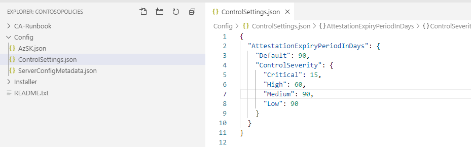

   v) Update org policy with the help of Update-AzSKOrganizationPolicy (UOP) cmdlet. (If you have created policy custom resources, mention resource names as parameter for UOP cmdlet)

   ```
      Update-AzSKOrganizationPolicy -SubscriptionId $SubId -OrgName "Contoso" -DepartmentName "IT" -PolicyFolderPath "D:\ContosoPolicies"
   ```

##### Testing:

1. Run clear session state command (Clear-AzSKSessionState).

2. You can attest one of the "High" severity controls or if you have control already attested, you can go to step 3

   Example: In this example, we will attest storage control with "WillNotFix" status

   ```
   Get-AzSKAzureServicesSecurityStatus -SubscriptionId $SubId `
                                    -ResourceNames azskpreviewcontosopr3sa `
                                    -ControlIds "Azure_Storage_AuthN_Dont_Allow_Anonymous" `
                                    -ControlsToAttest NotAttested 
   ```

   Output:
   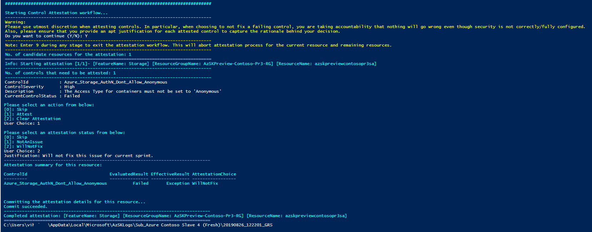
   
3. Run Get-AzSKInfo (GAI) cmdlet to get all attested controls in Sub with expiry details. 

   Note: Make sure cmdlet is running with org policy. If not you will need to run "IWR" generated at the time of IOP or UOP cmdlet.

   ```
   Get-AzSKInfo -InfoType AttestationInfo -SubscriptionId <SubscriptionId>
   ```

4. Open CSV or detailed log file generated at the end of command execution. It will show expiry period column for attested column.

   Detailed log:
   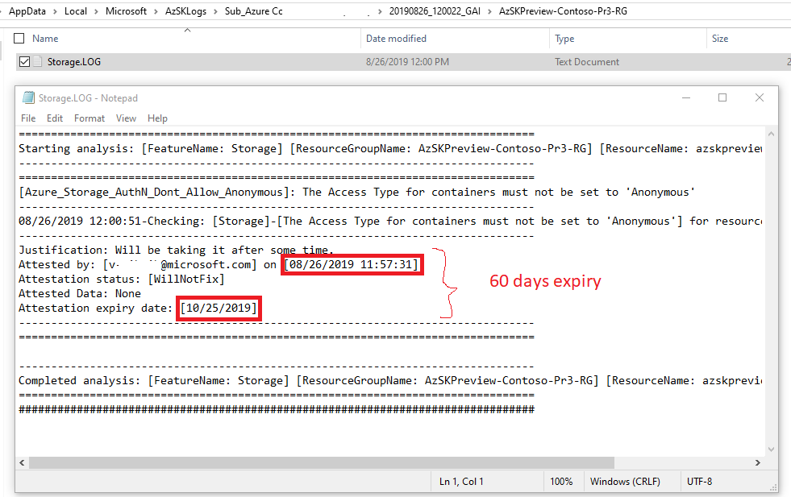
   
   CSV report:
   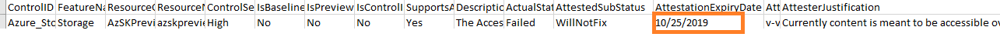


#### 2. Update attestation expiry period for particular control in SVT 
 

i) Copy the Storage.json from the AzSK module to your org-policy folder

   Source location: "%userprofile%\Documents\WindowsPowerShell\Modules\AzSK\<version>\Framework\Configurations\SVT\Services\Storage.json"

   Destination location: Policy config folder in local (D:\ContosoPolicies\Config)

ii) Remove everything except the ControlId, the Id and add property "AttestationExpiryPeriodInDays" as shown below. 

   ```
   {
    "Controls": [
     {
        "ControlId": "Azure_Storage_AuthN_Dont_Allow_Anonymous",
        "Id": "AzureStorage110",
        "AttestationExpiryPeriodInDays": 45
     }
    ]
   }
   ```

iii) Update org policy with the help of UOP cmdlet with required parameters. 

   ```
      Update-AzSKOrganizationPolicy -SubscriptionId $SubId -OrgName "Contoso" -DepartmentName "IT" -PolicyFolderPath "D:\ContosoPolicies"
   ```

##### Testing:

   For testing follow same steps mentioned above for [scenario 1](./#testing-7)

### How to configure non-AAD identity providers for AppService?
   You will be able to configure non-AAD identity providers and external redirect URLs using below settings:

i)Copy the ControlSettings.json from the AzSK installation to your org-policy folder.

ii)Update required values in below tags under AppService:
```JSON
"AllowedAuthenticationProviders": [
  ],
"AllowedExternalRedirectURLs": [
   ]
```

iii)Make sure identity providers from AllowedAuthenticationProviders are removed from NonAADAuthProperties.
```JSON
"NonAADAuthProperties": [
	   "googleClientId",
      "facebookAppId"
      "twitterConsumerKey",
      "microsoftAccountClientId"
    ]
```

iv) Save the file.

v) Override ControlSettings.json in ServerConfigMetaData.json as shown below:

```JSON
   {
    "OnlinePolicyList" : [
        {
            "Name" : "AzSK.json"
        }, 
        {
            "Name" : "ControlSettings.json",
			   "OverrideOffline" :true
        }, 
        {
            "Name" : "ServerConfigMetadata.json",
			   "OverrideOffline" : true
        }
    ]
}
```

vi) Rerun the policy update or setup command (the same command you ran for the first-time setup).

### How can we treat each public IP address as an individual resource?
   Org policy admins can enable public IP address as an individual resource by making following org policy settings:

i) Copy the ControlSettings.json from the AzSK installation to your org-policy folder.

ii) Update the value to true in below tag under PublicIpAddress:
```JSON
"PublicIpAddress": {
    "EnablePublicIpResource": false
   },
```

iii) Save the file.

iv)  Edit the ServerConfigMetadata.json file in your local org-policy folder and create an entry for "ControlSettings.json" as below:

```JSON
   {
    "OnlinePolicyList" : [
        {
            "Name" : "AzSK.json"
        }, 
        {
            "Name" : "ControlSettings.json",
        }, 
    ]
}
```

v) Rerun the policy update or setup command (the same command you ran for the first-time setup).

vi) Command that will be helpful in scanning a public IP address resource:

```PowerShell
 $subscriptionId = <Your SubscriptionId>
$resourceGroupName = <ResourceGroup Name>
$resourceName = <ResourceName>
$ControlId = 'Azure_PublicIpAddress_Justify_PublicIp'
Get-AzSKAzureServicesSecurityStatus -SubscriptionId $subscriptionId `
                -ResourceGroupNames $resourceGroupName `
                -ResourceName $resourceName `
                -ControlId $ControlId
   ```


