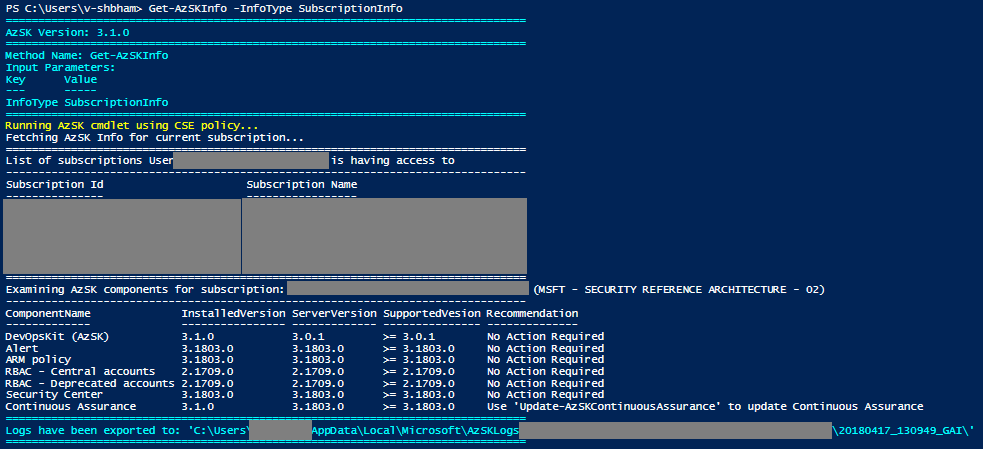
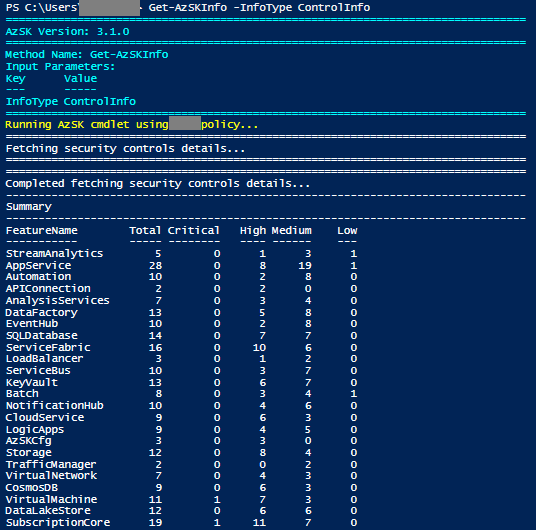
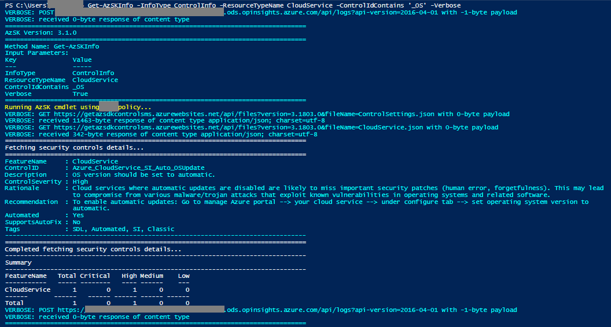
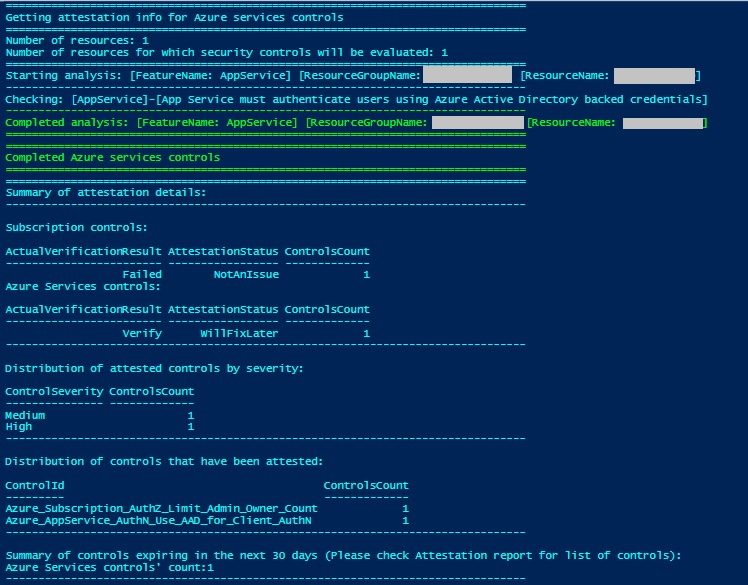
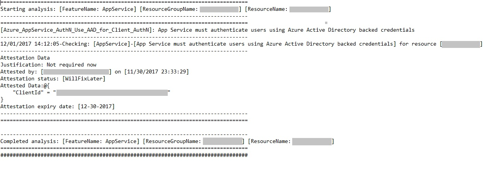
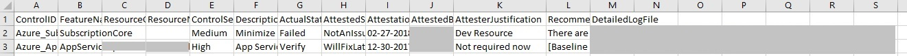
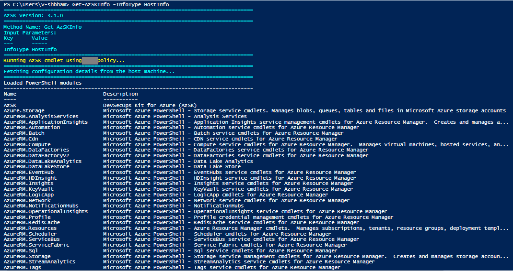

# Advanced features
### Contents
### [Fetch information about various AzSK components](Readme.md#fetch-information-about-various-azsk-components)

- [Overview](Readme.md#overview)
- [Subscription information](Readme.md#subscription-information)
- [Control information](Readme.md#control-information)
- [Attestation information](Readme.md#attestation-information)
- [Host information](Readme.md#host-information)

### Overview

This command provides overall information about the AzSK which includes subscription information (alert/policies/ASC/CA version etc.), security controls information (severity, description, rationale etc.), attestation information (statistics, attestation justification, expiry etc.), host information (AzSK settings/configuration, AzureRM Context etc.). 'Get-AzSKInfo' command can be used with 'InfoType' parameter to fetch information.

### Subscription information

Run below command to get information about,
- Subscriptions user is having access to
- Version of currently installed AzSK module 
- Latest available configuration for AzSK Component (DevOpsKit, ARM Policies, Alerts, ASC, Access control, CA) 
- Baseline configuration setup in user's subscription 
- Baseline configuration supported versions and recommendation for AzSK Component

```PowerShell
	Get-AzSKInfo -InfoType 'SubscriptionInfo' [-SubscriptionId <SubscriptionId>]
```
Below is the sample output: 

  

[Back to top…](Readme.md#contents)
### Control information 

Run below command to get information about Azure services security control(s). Control summary will be displayed on PS console by default. To get control information on PS console use -Verbose argument. Following information 
- Feature Name
- ControlID
- Description
- ControlSeverity
- Rationale
- Recommendation
- Automated
- SupportsAutoFix
- Tags

```PowerShell
	Get-AzSKInfo -InfoType 'ControlInfo' `
                [-ResourceTypeName <ResourceTypeName>] `
                [-ControlIds <ControlIds>] `
                [-UseBaselineControls] `
                [-FilterTags <FilterTags>] `
		[-ControlSeverity <ControlSeverity>] `
		[-ControlIdContains <ControlIdContains>] `
		[-Verbose]
```

|Param Name|Purpose|Required?|Default value|
|----|----|----|----|
|ResourceTypeName|Friendly name of resource type. Run command 'Get-AzSKSupportedResourceTypes' to get the list of supported values. E.g. AppService, KeyVault|TRUE|All|
|ControlIds|Comma-separated list of Control Ids|FALSE|None|
|UseBaselineControls|The flag used to get details of controls defined in baseline|FALSE|None|
|FilterTags|Comma-seperated tags to filter the security controls. E.g., RBAC, AuthN, etc.|FALSE|None|
|ControlSeverity|Filter by severity of control E.g., Critical, High, Medium, Low|FALSE|None|
|ControlIdContains|Filter by ControlId(s) contains keyword|FALSE|None|
|Verbose|Get information on PS console|FALSE|None|


Below is the sample output:

Output of control details summary
  

Output of control details verbose
  
[Back to top…](Readme.md#contents)

### Attestation information

Run below command to get information about attested security control(s) in user's subscription i.e. Attestation status, attested by, attestation date, attestation expiry date, justification, attested data. It also provides different attestation statistics which includes distribution of attested controls by actual scan result (Failed/Verify), ControlId, Control severity, Expiry date (next 30 days).

```PowerShell
	Get-AzSKInfo -InfoType 'AttestationInfo' `
		-SubscriptionId <SubscriptionId> `
                [-ResourceTypeName <ResourceTypeName>] `
		[-ResourceGroupNames <ResourceGroupNames>] `
		[-ResourceNames <ResourceNames>] `
                [-ControlIds <ControlIds>] `
		[-UseBaselineControls] 
```

|Param Name|Purpose|Required?|Default value|
|----|----|----|----|
|SubscriptionId|Subscription ID is the identifier of your Azure subscription|TRUE|   |  
|ResourceTypeName|Friendly name of resource type. Run command 'Get-AzSKSupportedResourceTypes' to get the list of supported values. E.g. AppService, KeyVault|FALSE|All|   
|ResourceGroupNames|Comma-separated list of resource groups that hold related resources for an Azure subscription|FALSE|   |  
|ResourceNames|Comma-separated list of the name of the resources|FALSE|   |
|ControlIds|Comma-separated list of Control Ids|FALSE|None|
|UseBaselineControls|The flag used to get attestation details of controls defined in baseline|FALSE|None|

Below is the sample output:

* PowerShell console output

 

* Detailed log

 

* CSV report

  
[Back to top…](Readme.md#contents)

### Host information  

Run below command to get information about,
* Loaded PS modules in PS session
* Logged in user's details
* AzSK settings
* AzSK configurations
* AzureRM context

```PowerShell
	Get-AzSKInfo -InfoType 'HostInfo'
```

Below is the sample output:

 
