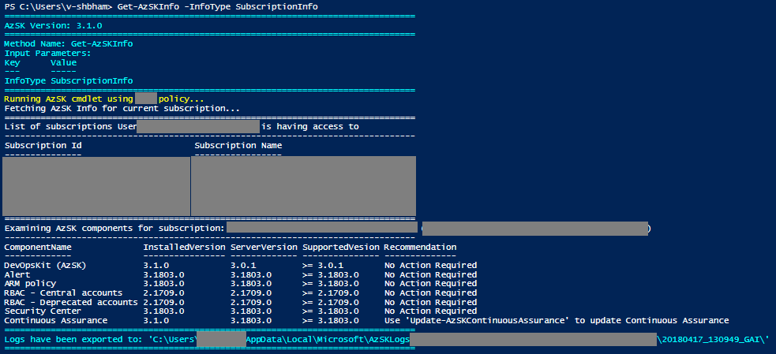
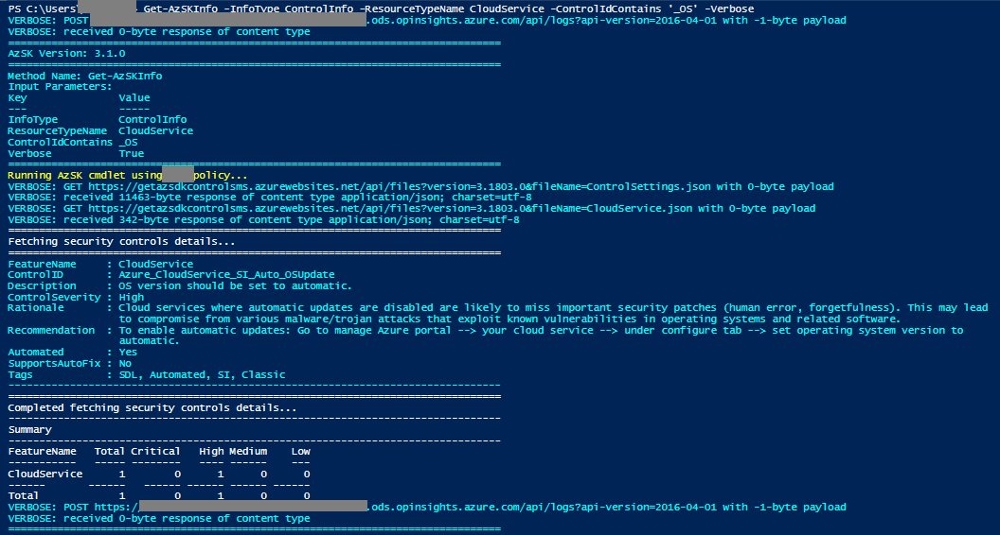

## IMPORTANT: DevOps Kit (AzSK) is being sunset by end of FY21. More details [here](../ReleaseNotes/AzSKSunsetNotice.md)
----------------------------------------------

> The Secure DevOps Kit for Azure (AzSK) was created by the Core Services Engineering & Operations (CSEO) division at Microsoft, to help accelerate Microsoft IT's adoption of Azure. We have shared AzSK and its documentation with the community to provide guidance for rapidly scanning, deploying and operationalizing cloud resources, across the different stages of DevOps, while maintaining controls on security and governance.
<br>AzSK is not an official Microsoft product – rather an attempt to share Microsoft CSEO's best practices with the community..
# Miscellaneous features
### Contents
### [Fetch information about various AzSK components](Readme.md#fetch-information-about-various-azsk-components)

- [Overview](Readme.md#overview)
- [Subscription information](Readme.md#subscription-information)
- [Control information](Readme.md#control-information)
- [Compliance information](Readme.md#compliance-information)
- [Attestation information](Readme.md#attestation-information)
- [Host information](Readme.md#host-information)
- [User comments](Readme.md#user-comments)

### [Try AzSK on Power Shell Core](Readme.md#try-azsk-on-powershell-core)

### Overview

This command provides overall information about the AzSK which includes subscription information (alert/policies/ASC/CA version etc.), security controls information (severity, description, rationale etc.), attestation information (statistics, attestation justification, expiry etc.), host information (AzSK settings/configuration, Az Context etc.). 'Get-AzSKInfo' command can be used with 'InfoType' parameter to fetch information.

### Subscription information

Run below command to get information about,
- Subscriptions user is having access to
- Version of currently installed AzSK module 
- Latest available configuration for AzSK Component (DevOpsKit, ARM Policies, Alerts, ASC, Access control, CA) 
- Baseline configuration setup in user's subscription 
- Baseline configuration supported versions and recommendation for AzSK Component

```PowerShell
	Get-AzSKInfo -InfoType 'SubscriptionInfo' [-SubscriptionId <SubscriptionId>]
```
Below is the sample output: 

  

[Back to top…](Readme.md#contents)
### Control information 

Run below command to get information about Azure services security control(s). Control summary will be displayed on PS console by default. To get control information on PS console use -Verbose argument. Following information 
- Feature Name
- ControlID
- Description
- ControlSeverity
- Rationale
- Recommendation
- Automated
- SupportsAutoFix
- Tags

```PowerShell
	Get-AzSKInfo -InfoType 'ControlInfo' `
                [-ResourceTypeName <ResourceTypeName>] `
                [-ControlIds <ControlIds>] `
                [-UseBaselineControls] `
				[-UsePreviewBaselineControls] `
                [-FilterTags <FilterTags>] `
		[-ControlSeverity <ControlSeverity>] `
		[-ControlIdContains <ControlIdContains>] `
		[-Verbose]
```

|Param Name|Purpose|Required?|Default value|
|----|----|----|----|
|ResourceTypeName|Friendly name of resource type. Run command 'Get-AzSKSupportedResourceTypes' to get the list of supported values. E.g. AppService, KeyVault|TRUE|All|
|ControlIds|Comma-separated list of Control Ids|FALSE|None|
|UseBaselineControls|The flag used to get details of controls defined in baseline|FALSE|None|
|UsePreviewBaselineControls|The flag used to get details of controls defined in preview baseline|FALSE|None|
|FilterTags|Comma-separated tags to filter the security controls. E.g., RBAC, AuthN, etc.|FALSE|None|
|ControlSeverity|Filter by severity of control E.g., Critical, High, Medium, Low|FALSE|None|
|ControlIdContains|Filter by ControlId(s) contains keyword|FALSE|None|
|Verbose|Get information on PS console|FALSE|None|


Below is the sample output:

Output of control details summary

  

Output of control details verbose
  
[Back to top…](Readme.md#contents)

### Compliance information 

If this feature is enabled then last scan results will be stored in user’s subscription after every successful scan by CA/CICD/Ad-hoc scan. This cmdlet will fetch the stored scan results and calculate compliance of the subscription. CSV file is also generated by this cmdlet which contains control level information of each resource in your subscription. This lets subscription owners get the current (latest) view of all controls from a compliance standpoint.  

To get compliance info run below command.

```PowerShell
	Get-AzSKInfo -SubscriptionId <SubscriptionId> -InfoType 'ComplianceInfo' 
```
> Note: It's recommended to scan the complete subscription (commands: Get-AzSKSubscriptionSecurityStatus & Get-AzSKAzureServicesSecurityStatus) with co-administrator/owner access atleast once before running above command. This onetime activity is required to ensure all controls are scanned and results are stored in subscription first time. Afterwords stored scan results will get updated with every CA/CICD/Ad-hoc scan and you can get accurate compliance information.         

Below is the sample output

* PowerShell console output

  

* CSV report

  


[Back to top…](Readme.md#contents)


### Attestation information

Run below command to get information about attested security control(s) in user's subscription i.e. Attestation status, attested by, attestation date, attestation expiry date, justification, attested data. It also provides different attestation statistics which includes distribution of attested controls by actual scan result (Failed/Verify), ControlId, Control severity, Expiry date (next 30 days).

```PowerShell
	Get-AzSKInfo -InfoType 'AttestationInfo' `
		-SubscriptionId <SubscriptionId> `
                [-ResourceTypeName <ResourceTypeName>] `
		[-ResourceGroupNames <ResourceGroupNames>] `
		[-ResourceNames <ResourceNames>] `
                [-ControlIds <ControlIds>] `
		[-UseBaselineControls] `
		[-UsePreviewBaselineControls] 
```

|Param Name|Purpose|Required?|Default value|
|----|----|----|----|
|SubscriptionId|Subscription ID is the identifier of your Azure subscription|TRUE|   |  
|ResourceTypeName|Friendly name of resource type. Run command 'Get-AzSKSupportedResourceTypes' to get the list of supported values. E.g. AppService, KeyVault|FALSE|All|   
|ResourceGroupNames|Comma-separated list of resource groups that hold related resources for an Azure subscription|FALSE|   |  
|ResourceNames|Comma-separated list of the name of the resources|FALSE|   |
|ControlIds|Comma-separated list of Control Ids|FALSE|None|
|UseBaselineControls|The flag used to get attestation details of controls defined in baseline|FALSE|None|
|UsePreviewBaselineControls|The flag used to get attestation details of controls defined in baseline|FALSE|None|

Below is the sample output:

* PowerShell console output

 

* Detailed log

 

* CSV report

  
[Back to top…](Readme.md#contents)

### Host information  

Run below command to get information about,
* Loaded PS modules in PS session
* Logged in user's details
* AzSK settings
* AzSK configurations
* Az context

```PowerShell
	Get-AzSKInfo -InfoType 'HostInfo'
```

Below is the sample output:

 
[Back to top…](Readme.md#contents)

### User comments

To track compliance progress on your subscription you can place 'custom tags/comments' on controls, these comments will be persisted inside your subscription's AzSK storage account. Anyone across your subscription can read the comments later by running GSS/GRS/GCS command with switch "-IncludeUserComments". 

	
#### How to add/update user comments?

Please follow the following steps to update user comments:

Step 1: Run GRS/GSS/GCS cmd with “-IncludeUserComments” switch. For e.g.
```PowerShell
      Get-AzSKAzureServicesSecurityStatus -SubscriptionId <Your SubscriptionId> -IncludeUserComments
```

In the .CSV file that is generated, there will be an extra column “UserComments” which will contain custom comments provided by users.

Step 2: Edit/Update “UserComments” column and save file.	

Step 3: Upload edited .CSV file using below cmdlt,
```PowerShell
      Update-AzSKPersistedState -SubscriptionId  <Your SubscriptionId> -FilePath <Path for updated CSV file> -StateType "UserComments"
```    
#### How to read user comments?

To read user comments on any controls you just need to run GCS/GSS/GRS cmd  with an extra switch "-IncludeUserComments". Once a scan completes the .CSV file will contain "UserComments" column which will show comments/custom tags.

  
[Back to top…](Readme.md#contents)

### Try AzSK on PowerShell Core

Follow these steps to try out AzSK in Power Shell Core

1. Install PowerShell core in your machine using the this [link](https://docs.microsoft.com/en-us/powershell/scripting/install/installing-powershell?view=powershell-6).
2. Open PowerShell console (e.g. In Linux, run pwsh to open).
3. Install AzSK module using the below command 
```PowerShell
	Install-Module AzSK
```
Note: This will download all the dependencies of AzSK along with the    AzSK module.  However, we will overwrite with the PSCore-ready AzSK module in the next step.

4. Import the module to your power shell session by running: 
```PowerShell
	Import-Module AzSK
```
5. Once the module is imported you can list the commands by running the following:
```PowerShell
	Get-Command -Module AzSK
```
