> Security Scanner for Azure DevOps (ADO) was created by the Core Services Engineering & Operations (CSEO) division at Microsoft. We have shared the scanner and its documentation with the community to provide guidance for rapidly scanning, deploying and operationalizing ADO resources, across the different stages of DevOps, while maintaining controls on security and governance.
<br>This is not an official Microsoft product – rather an attempt to share Microsoft CSEO's best practices with the community..
# Azure DevOps (ADO) Security Scanner -Preview

### Contents

### [Overview](Readme.md#Overview)

### [Continuous Assurance](Readme.md#continuous-assurance-1)
  - [Setting up Continuous Assurance - Step by Step](Readme.md#setting-up-continuous-assurance---step-by-step)
  - [Visualize security scan results](Readme.md#visualize-security-scan-results)

 ### [AzSK.AzureDevOps PowerShell module](Readme.md#azskazuredevops-powershell-module-1)
  -  [Installation Guide](Readme.md#installation-guide)
  -  [Scan your Azure DevOps resources](Readme.md#scan-your-azure-devops-resources)
 

### [Control Attestation](Readme.md#control-attestation-1)
- [Overview](Readme.md#Overview-1)
- [Starting attestation](Readme.md#starting-attestation)  
- [How scanner determines the effective control result](Readme.md#how-scanner-determines-the-effective-control-result)  
- [Permissions required for attesting controls](Readme.md#permissions-required-for-attesting-controls) 
- [Attestation expiry](Readme.md#attestation-expiry)  

### [Customizing AzSK.AzureDevOps for your project](Readme.md#customizing-azskazuredevops-for-your-project-1)
- [Overview](Readme.md#Overview-2)
- [Setting up org policy](Readme.md#setting-up-org-policy)  
- [Consuming custom org policy](Readme.md#consuming-custom-org-policy)  
- [Modifying and customizing org policy](Readme.md#modifying-and-customizing-org-policy)  
- [Advanced usage of org policy (extending AzSK.AzureDevOps)](Readme.md#advanced-usage-of-org-policy-extending-azskazuredevops) 
- [Frequently Asked Questions](Readme.md#frequently-asked-questions)  

Security Scanner for Azure DevOps (ADO) helps you keep your ADO artifacts such as various org/project settings, build/release configurations, service connections, agent pools, etc. configured securely. You can run the ADO Security Scanner standalone in a PowerShell console or in an ADO pipeline via a marketplace extension.

Security Scanner for Azure DevOps (ADO) performs security scanning for core areas of Azure DevOps like Organization, Projects, Users, Pipelines (Build & Release), Connections and Agent Pools. 


## Continuous Assurance

Security Scanner for ADO is also available as a native ADO extension that can be set up to scan your ADO artifacts periodically so as to achieve “continuous assurance”. The extension also comes packaged with widgets that you can use to visualize scan results by relevance to stakeholder groups (such as org admin, project owners, build/release owners etc.) in dashboards.

The basic idea behind Continuous Assurance (CA) is to setup periodic security scan and if new, more secure options become available for a feature, it should be possible to detect so that an application or solution can benefit from them and notify/alert the owners concerned.

Scan is performed via security scanner task in the pipeline and results can be visualized via dashboard by adding ADO security scanner widgets into the Azure DevOps project’s dashboard. Pipeline can be setup with the trigger to run periodically and provide continuous assurance.

### Setting up Continuous Assurance - Step by Step

In this section, we will walk through the steps of setting up an Azure DevOps pipeline for ADO Continuous Assurance coverage.
To get started, we need the following 

__Prerequisite:__

- ADO organization and project 
- "Project Collection Administrator" or "Owner" permission to perform below task:

    •	Install "ADO Security Scanner" extension

    •	Setup pipeline with scanner task.
    
    •	Create dashboard to visualize scan results


#### Install “ADO Security Scanner” extension for your Azure DevOps Organization


Extension has been published to the Visual Studio marketplace gallery under “Azure DevOps > Azure Pipeline” category. You can now install this extension from the Marketplace directly (https://marketplace.visualstudio.com/items?itemName=azsdktm.ADOSecurityScanner).

Refer doc [here](https://docs.microsoft.com/en-us/azure/devops/marketplace/install-extension?view=azure-devops&tabs=browser) for more about installing extensions for org

  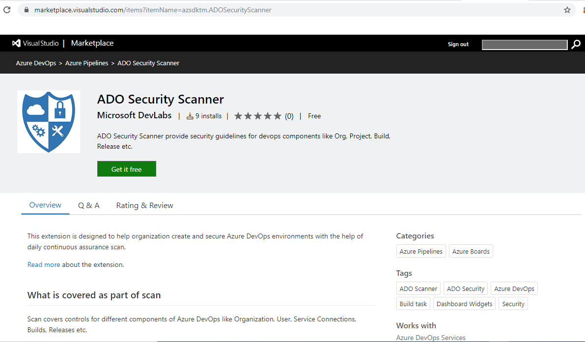 


#### Adding ADO Security Scanner in the pipeline

This part assumes that you are familiar with Azure DevOps build tasks and pipelines at a basic level. Our goal is to show how ADO Security Scanner can be added into the build/release workflow.

__Step-1__: Create a build pipeline or open an existing one.

__Step-2__: Add “ADO Security Scanner” task to the pipeline

Click on "Add Tasks" and select "Azure DevOps (ADO) Security Verification".


__Step-3__: Specify the input parameters for the task.
The "ADO Security Scanner" task starts showing in the "Run on Agent" list and displays some configuration inputs that are required for the task to run. These are none other than the familiar options we have been specifying while running the ADO scan manually - you can choose to specify the target org, projects, builds and releases based on how your org resources are organized.

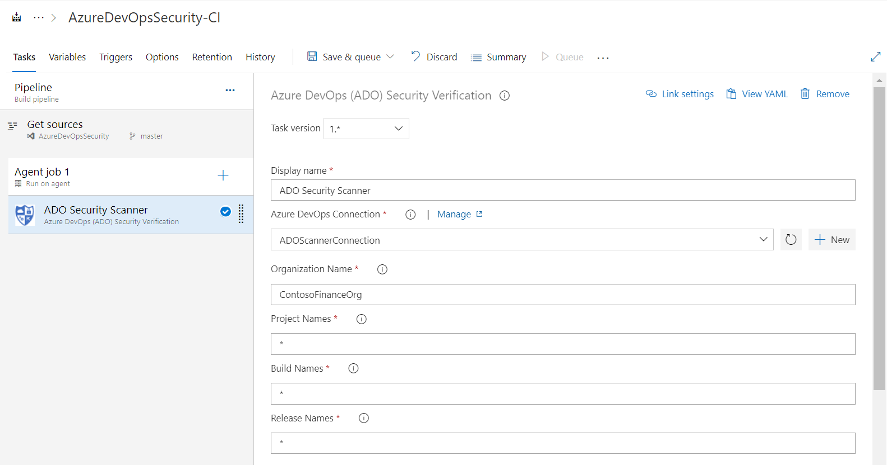

> **Note:** This task also requires Azure DevOps connection containing org details and PAT to scan the required resources. Refer doc [here](https://docs.microsoft.com/en-us/azure/devops/organizations/accounts/use-personal-access-tokens-to-authenticate?view=azure-devops&tabs=preview-page) to create token and provide it as part of connection


<html>
<head>

</head><body>
<H2> Customizing your PAT with minimum required privileges for Azure DevOps Connection</H2><table><tr><th>Scope</th><th>Privilege</th></tr>

Here is a scope-wise list of minimum privileges that needs to be assigned to your PAT to ensure a smooth experience of the security scan.
<tr><td>
Agent Pools
</td><td>Read</tr>

<tr><td>
Auditing
</td><td>Read Audit Log</tr>

<tr><td>
Build
</td><td>Read</tr>

<tr><td>
Entitlements
</td><td>Read</tr>

<tr><td>
Extensions
</td><td>Read</tr>

<tr><td>
Extension Data
</td><td>Read & write</tr>

<tr><td>
Graph
</td><td>Read</tr>

<tr><td>
Identity
</td><td>Read</tr>


<tr><td>
Member Entitlement Management
</td><td>Read</tr>

<tr><td>
Project and Team
</td><td>Read</tr>

<tr><td>
Release
</td><td>Read</tr>

<tr><td>
Secure Files
</td><td>Read</tr>

<tr><td>
Service Connections
</td><td>Read</tr>

<tr><td>
Tokens
</td><td>Read & manage</tr>

<tr><td>
User Profile
</td><td>Read</tr>

<tr><td>
Variable Groups
</td><td>Read</tr>

</table>
<table>
</table>
</body></html>


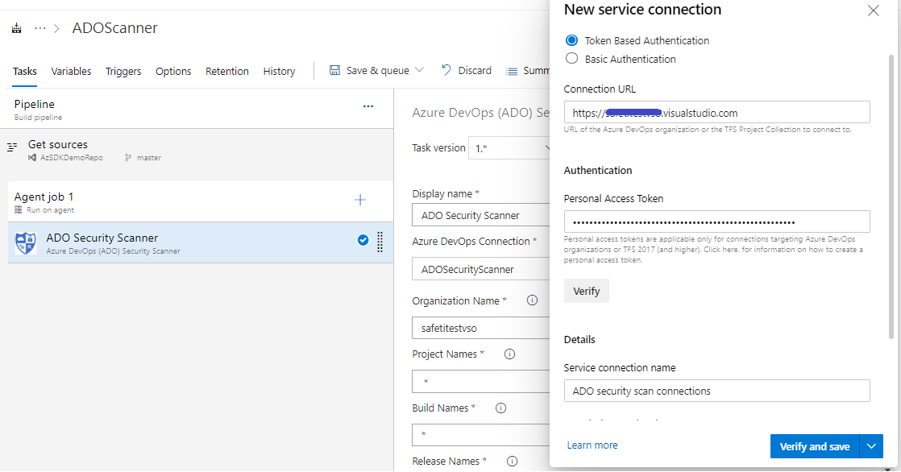


__! Important__ : Make sure you **DO NOT** select  checkbox for "Grant access permission to all pipelines" before saving service connection. 

> **Note**: ADO Security Scanner extension enables you to leverage some of the advanced capabilities of scanner while running in adhoc mode. You could scan for only preview baseline controls in your build pipeline, or you could just scan for controls with specific severity etc. These advanced features are available to customers through ADO variables. For example, use *ExtendedCommand* variable in the pipeline with its value as *-Severity 'High'* to scan controls with high severity.


__Step-4__: Click “Save & queue”

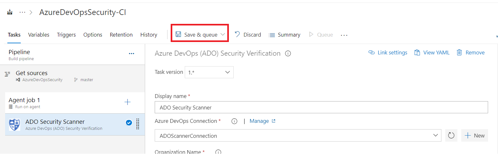

Task will install latest AzureDevOps scanner module and start scanning based on input parameters. 

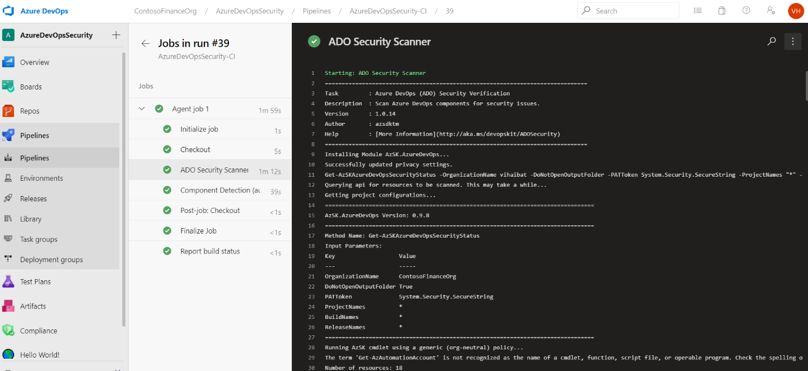

At the end, it will show the summary of scan and store the result in extension storage.

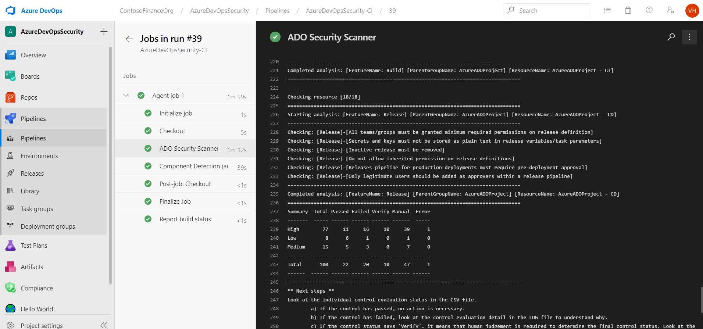

__Step-4__: Setup scheduled trigger for pipeline

Once you are able to successfully run the ADO scan using ADO pipeline, you can configure scheduled trigger to get latest visibility of security on resources

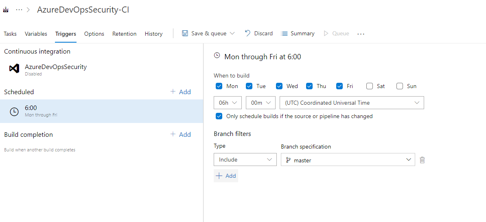


### Visualize security scan results 

Once scan is completed as part of pipeline, results can be visualized with the help of project dashboard.

Extension mainly provides two widgets that can be added as part of dashboard

__•	Org Level Security Scan Summary__: Displays org level security control evaluation summary. This dashboard helps org owners to take action based on control failures.

__•	Project Component Security Scan Summary__: Displays project components (Build/Release/Connections) security control evaluation summary.

__Steps__:

1. Go to project dashboard under your organization and create new dashboard for org level summary

    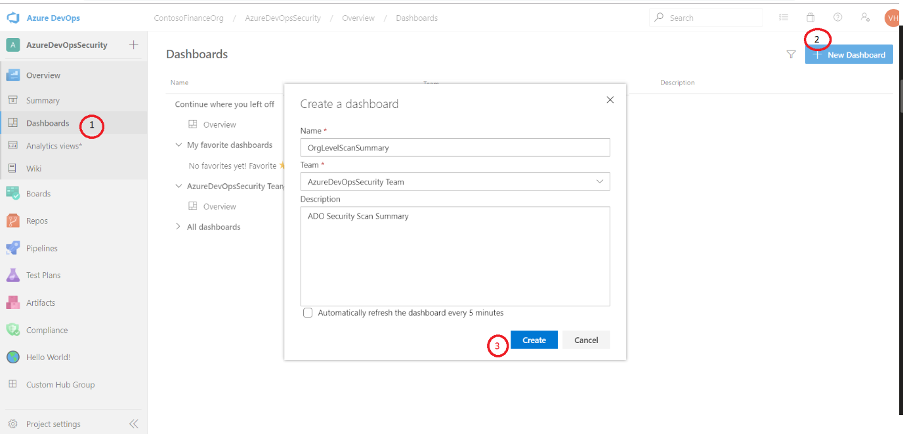

2. Click edit or add widget > Search for “__Org Level Security Scan Summary__” > Click ‘Add’ followed by “Done Editing”

    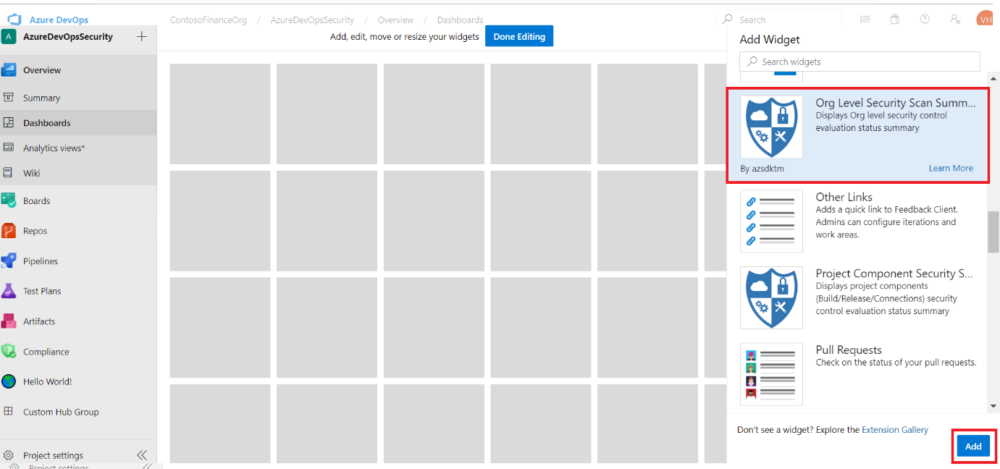

3. Dashboard will start displaying scanned results 

    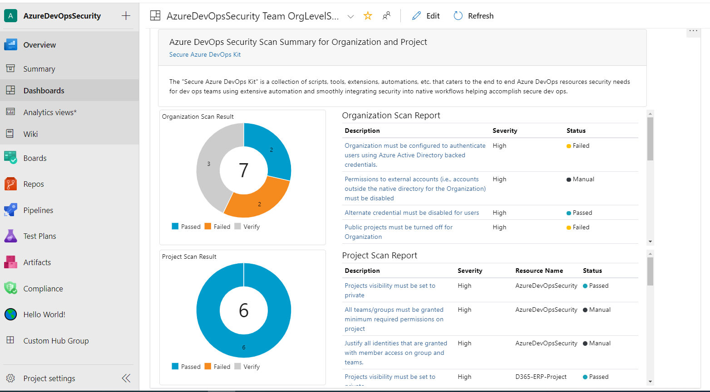

Step 1,2 & 3 needs to be repeated to add “__Project Component Security Scan Summary__”

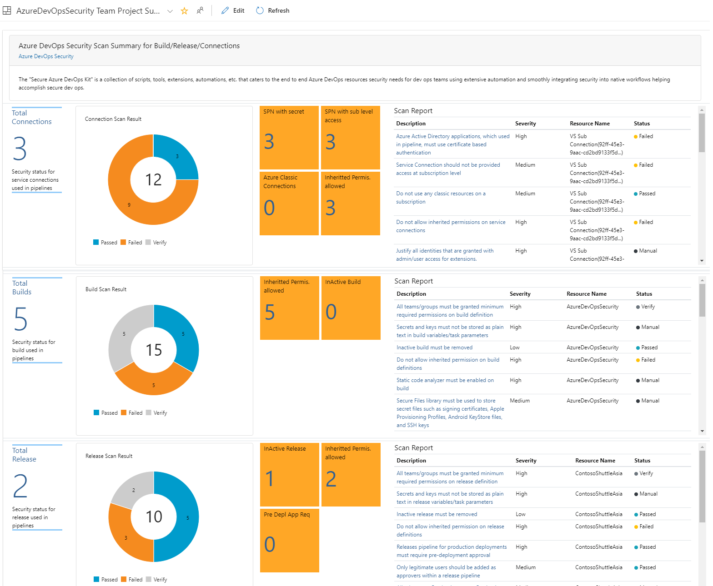


> **Note:**  Dashboard created will be visible to all users which are part of project.

> **Note:**  Dashboard reflects updates only upon pipeline execution. Local scan results don't reflect automatically. If you have remediated a control, make sure you run the pipeline to reflect the updated control results on dashboard.

# AzSK.AzureDevOps PowerShell module

At its core, the Security Scanner for ADO is a PowerShell module. This can be run locally from the PS console after installation. This is as simple as running PS in non-Admin mode and running the cmds as shown below:

## Installation Guide

>**Pre-requisites**:
> - PowerShell 5.0 or higher. 

1. First verify that prerequisites are already installed:  
    Ensure that you have PowerShell version 5.0 or higher by typing **$PSVersionTable** in the PowerShell ISE console window and looking at the PSVersion in the output as shown below.) 
 If the PSVersion is older than 5.0, update PowerShell from [here](https://www.microsoft.com/en-us/download/details.aspx?id=54616).  
      

2. Install the Security Scanner for Azure DevOps (AzSK.AzureDevOps) PS module:  
	  
```PowerShell
  Install-Module AzSK.AzureDevOps -Scope CurrentUser -AllowClobber -Force
```

## Scan your Azure DevOps resources

Run the command below after replacing `<OrganizationName>` with your Azure DevOps org Name 
and `<PRJ1, PRJ2, ..`> with a comma-separated list of project names where your Azure DevOps resources are hosted.
You will get Organization name from your ADO organization url e.g. http://sampleadoorg.visualstudio.com. In this 'sampleadoorg' is org name.

```PowerShell
Get-AzSKAzureDevOpsSecurityStatus -OrganizationName "<OrganizationName>" -ProjectNames "<PRJ1, PRJ2,...etc.>"
```

Command also supports other parameters of filtering resources.
For instance, you can also make use of the 'BuildNames','ReleaseNames' to filter specific resource

```PowerShell

#Scan organization
Get-AzSKAzureDevOpsSecurityStatus -OrganizationName "<OrganizationName>"

#Scan organization and Project
Get-AzSKAzureDevOpsSecurityStatus -OrganizationName "<OrganizationName>" -ProjectNames "<PRJ1,PRJ2,etc>" 

#Scan organization, project and builds
Get-AzSKAzureDevOpsSecurityStatus -OrganizationName "<OrganizationName>" -ProjectNames "PRJ1" -BuildNames "<BLD1, BLD2,...etc.>" 

#Scan organization, project and releases
Get-AzSKAzureDevOpsSecurityStatus -OrganizationName "<OrganizationName>" -ProjectNames "PRJ1" -ReleaseNames "<RLS1, RLS2,...etc.>" 

#Scan organization, project, all builds and releases
Get-AzSKAzureDevOpsSecurityStatus -OrganizationName "<OrganizationName>" -ProjectNames "PRJ1" -BuildNames "*" -ReleaseNames "*" 

#Scan organization, project and service connections
Get-AzSKAzureDevOpsSecurityStatus -OrganizationName "<OrganizationName>" -ProjectNames "PRJ1" -ServiceConnectionNames "<SER1, SER2,...ect.>"

#Scan organization, project and agent pools
Get-AzSKAzureDevOpsSecurityStatus -OrganizationName "<OrganizationName>" -ProjectNames "PRJ1" -AgentPoolNames "<AGP1, AGP2,...etc.>"

#Scan organization, project, all builds, releases, service connectiopns and agent pools
Get-AzSKAzureDevOpsSecurityStatus -OrganizationName "<OrganizationName>" -ProjectNames "PRJ1" -BuildNames "*" -ReleaseNames "*" -ServiceConnectionNames "*" -AgentPoolNames "*"

#Scan all supported artifacts
Get-AzSKAzureDevOpsSecurityStatus -OrganizationName "<OrganizationName>" -ScanAllArtifacts

#Scan projects 
Get-AzSKAzureDevOpsSecurityStatus -OrganizationName "<OrganizationName>" -ProjectNames "<PRJ1,PRJ2,etc>" -ResourceTypeName Project

#Scan builds 
Get-AzSKAzureDevOpsSecurityStatus -OrganizationName "<OrganizationName>" -ProjectNames "PRJ1" -BuildNames "*" -ResourceTypeName Build

#Scan releases 
Get-AzSKAzureDevOpsSecurityStatus -OrganizationName "<OrganizationName>" -ProjectNames "PRJ1" -ReleaseNames "*" -ResourceTypeName Release

#Scan service connections 
Get-AzSKAzureDevOpsSecurityStatus -OrganizationName "<OrganizationName>" -ProjectNames "PRJ1" -ServiceConnectionNames "*" -ResourceTypeName ServiceConnection

#Scan agent pools 
Get-AzSKAzureDevOpsSecurityStatus -OrganizationName "<OrganizationName>" -ProjectNames "PRJ1" -AgentPoolNames "*" -ResourceTypeName AgentPool

#Scan resources for baseline controls only
Get-AzSKAzureDevOpsSecurityStatus -OrganizationName "<OrganizationName>" -ProjectNames "<PRJ1,PRJ2,etc>" -ubc

#Scan resources with severity
Get-AzSKAzureDevOpsSecurityStatus -OrganizationName "<OrganizationName>" -ProjectNames "<PRJ1,PRJ2,etc>" -Severity "High/Medium/Low"
```
AzSK.AzureDevOps also supports individual scan cmdlets for organization, project, build and release.

```PowerShell

#Scan organization
Get-AzSKAzureDevOpsOrgSecurityStatus -OrganizationName "<OrganizationName>"

#Scan projects
Get-AzSKAzureDevOpsProjectSecurityStatus -OrganizationName "<OrganizationName>" -ProjectNames "<PRJ1,PRJ2,etc>"

#Scan builds
Get-AzSKAzureDevOpsBuildSecurityStatus -OrganizationName "<OrganizationName>" -ProjectNames "<PRJ1,PRJ2,etc>" -BuildNames "*"

#Scan releases
Get-AzSKAzureDevOpsReleaseSecurityStatus -OrganizationName "<OrganizationName>" -ProjectNames "<PRJ1,PRJ2,etc>" -ReleaseNames "*"
```

Similar to Azure AzSK SVT scan, outcome of the analysis is printed on the console during SVT execution and a CSV and LOG files are 
also generated for subsequent use.

The CSV file and LOG file are generated under a org-specific sub-folder in the folder  
*%LOCALAPPDATA%\Microsoft\AzSK.AzureDevOpsLogs\Org_[yourOrganizationName]*  
E.g.  
C:\Users\UserName\AppData\Local\Microsoft\Azure.DevOpsLogs\Org_[yourOrganizationName]\20181218_103136_GADS

Refer [doc](../02-Secure-Development#understand-the-scan-reports) for understanding the scan report and [link](./ControlCoverage) for current control coverage for Azure DevOps


# Control Attestation

> **Note**: Please use utmost discretion when attesting controls. In particular, when choosing to not fix a failing control, you are taking accountability that nothing will go wrong even though security is not correctly/fully configured. 
> </br>Also, please ensure that you provide an apt justification for each attested control to capture the rationale behind your decision.  


### Overview

The attestation feature empowers users to support scenarios where human input is required to augment or override the default control 
evaluation status from AzSK.AzureDevOps. These may be situations such as:

- The scanner has generated the list of 'Administrators' for a project but someone needs to have a look at the list and ratify that 
these are indeed the correct people, or
- The scanner has marked a control as failed. However, given the additional contextual knowledge, the application owner wants to ignore the control failure.

In all such situations, there is usually a control result that is based on the technical evaluation (e.g., Verify, Failed, etc.) that has to 
be combined with the user's input in order to determine the overall or effective control result. The user is said to have 'attested' such controls 
and, after the process is performed once, AzSK.AzureDevOps remembers it and generates an effective control result for subsequent control scans _until_ there 
is a state change.

The attestation feature is implemented via a new switch called *ControlsToAttest* which can be specified in any of the standard security scan cmdlets
of AzSK.AzureDevOps. When this switch is specified, the scanner first performs a scan of the target resource(s) like it is business as usual and, once
the scan is complete, it enters a special interactive 'attest mode' where it walks through each resource and relevant attestable controls
and captures inputs from the user and records them (along with details about the person who attested, the time, etc.). 
After this, for all future scans on the resource(s), AzSK.AzureDevOps will show the effective control evaluation results. Various options are provided to support
different attestation scenarios (e.g., expiry of attestations, edit/change/delete previous attestations, attest only a subset of controls, etc.). 
These are described below. Also, for 'stateful' controls (e.g., "are these the right service accounts with access to project collection?"), the attestation
state is auto-reset if there is any change in 'state' (e.g., someone adds a new service account to the list).

Lastly, due to the governance implications, the ability to attest controls is available to a subset of users. This is described in
the permissions required section below.  


[Back to top...](Readme.md#contents)
### Starting attestation
      
The AzSK.AzureDevOps scan cmdlets now support a new switch called *ControlsToAttest*. When this switch is specified, 
AzSK.AzureDevOps enters the attestation workflow immediately after a scan is completed. This ensures that attestation is done on the basis of the most current
control status.

All controls that have a technical evaluation status of anything other than 'Passed' (i.e., 'Verify' or 'Failed' or 'Manual' or 'Error') are considered 
valid targets for attestation.

> **Note**: Some controls are very crucial from security stand point and hence AzSK.AzureDevOps does not support attesting them.

To manage attestation flow effectively, 4 options are provided for the *ControlsToAttest* switch to specify which subset of controls to target for attestation. These are described below:

|Attestation Option|Description|
|------------------|-----------|
|NotAttested|Attest only those controls which have not been attested yet.|
|AlreadyAttested|Attest those controls which have past attestations. To re-attest or clear attestation.|
|All|Attest all controls which can be attested (including those that have past attestations).|
|None|N/A.|

### How is the control attestation information stored and managed?

AzSK.AzureDevOps internally stores attestation details in a project repository named 'ADOScanner_Attestation' which needs to be configured typically by the project admin. 

Attestation details for project and its components (build/release/service connection/agent pool) are recorded only when this repository is present inside the project.

> **Note:** Control attestation details for project and its components are stored inside the attestation repo present in the project.

> *Project Collection Administrator* needs to assign a project in the organization to host attestation details for organization-specific controls. See the next section for more details.   

### How to setup attestation repository in a project?

In order to setup attestation repository inside a project, follow the below steps:

1. Navigate to *Repos* section of the project.
2. Create a new Git repository with the name 'ADOScanner_Attestation'. Skip this step if this repository already exists.

### How to setup host project to store attestation details for organization-specific controls?

1. Host project to store attetstation details for organization-specific controls can be set using a scan parameter named 'AttestationHostProjectName'. Before setting up the host project, ensure this project has 'ADOScanner_Attestation' repository setup.
2.  **Attestation host project can be set only once and can't be updated later**.

For e.g., to attest organization controls, run the command below:
```PowerShell  
#Set attestation host project and attest organization controls:
$orgName = '<Organization name>'
$hostProjectName = '<Name of the host project to store attestation details of org-specific controls>'
  	
Get-AzSKAzureDevOpsSecurityStatus -OrganizationName $orgName -AttestationHostProjectName $hostProjectName -ControlsToAttest NotAttested -ResourceTypeName Organization  
```

See the examples below to attest organization, project, build, release, service connection and agent pool controls.
```PowerShell  

#Attest organization controls:
$orgName = '<Organization name>'

Get-AzSKAzureDevOpsSecurityStatus -OrganizationName $orgName -ControlsToAttest NotAttested -ResourceTypeName Organization  

#Attest project controls:
$orgName = '<Organization name>'
$prjName = '<Project name>'

Get-AzSKAzureDevOpsSecurityStatus -OrganizationName $orgName -ProjectNames $prjName -ControlsToAttest NotAttested -ResourceTypeName Project  

#Attest build controls:
$orgName = '<Organization name>'
$prjName = '<Project name>'
$buildName = '<Build name>'

Get-AzSKAzureDevOpsSecurityStatus -OrganizationName $orgName -ProjectNames $prjName -BuildNames $buildName -ControlsToAttest NotAttested -ResourceTypeName Build  

#Attest release controls:
$orgName = '<Organization name>'
$prjName = '<Project name>'
$releaseName = '<Release name>'

Get-AzSKAzureDevOpsSecurityStatus -OrganizationName $orgName -ProjectNames $prjName -ReleaseNames $releaseName -ControlsToAttest NotAttested -ResourceTypeName Release  

#Attest service connection controls:  
$orgName = '<Organization name>'
$prjName = '<Project name>'
$serviceConnectionName = '<Service Connection name>'

Get-AzSKAzureDevOpsSecurityStatus -OrganizationName $orgName -ProjectNames $prjName -ServiceConnectionNames $serviceConnectionName -ControlsToAttest NotAttested -ResourceTypeName ServiceConnection  

#Attest agent pool controls:
$orgName = '<Organization name>'
$prjName = '<Project name>'
$agentPoolName = '<Agent pool name>'

Get-AzSKAzureDevOpsSecurityStatus -OrganizationName $orgName -ProjectNames $prjName -AgentPoolNames $agentPoolName -ControlsToAttest NotAttested -ResourceTypeName AgentPool  

#Organization, project, build, release, service connection and agent pool controls can be attested in same command too.  
$orgName = '<Organization name>'
$prjName = '<Project name>'
$buildName = '<Build name>'
$releaseName = '<Release name>'
$serviceConnectionName = '<Service Connection name>'
$agentPoolName = '<Agent pool name>'

Get-AzSKAzureDevOpsSecurityStatus -OrganizationName $orgName -ProjectNames $prjName -BuildNames $buildName -ReleaseNames $releaseName -ServiceConnectionNames $serviceConnectionName  -AgentPoolNames $agentPoolName -ControlsToAttest NotAttested  
```

As shown in the images, the command enters 'attest' mode after completing a scan and does the following:

1. For each resource that was scanned, if a control is a target for attestation, control details (such as description, severity, etc.) and the current evaluation result are displayed (to help the user)
2. The user gets to choose whether they want to attest the control
3. If the user chooses to attest, attestation details (attest status, justification, etc.) are captured
4. This is repeated for all attestable controls and each resource.

 Sample attestation workflow in progress:
 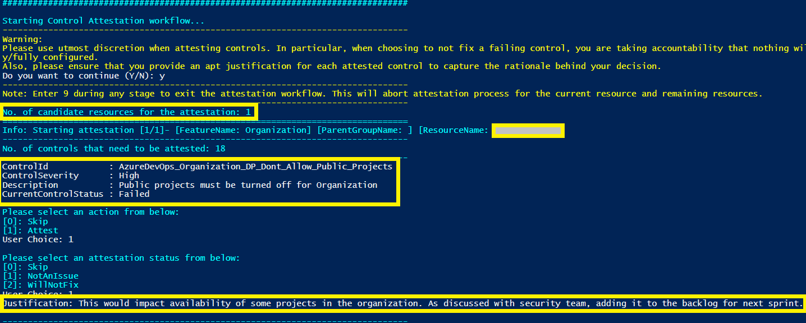 
 
 Sample summary of attestation after workflow is completed:
 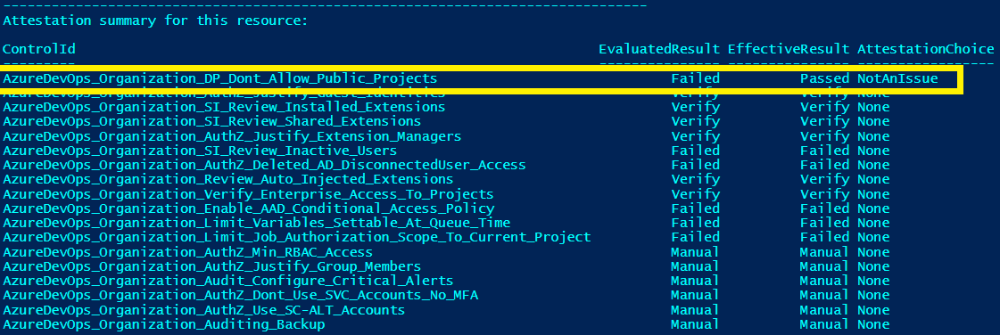 

Attestation details corresponding to each control (e.g., justification, user name, etc.) are also captured in the CSV file as shown below:
 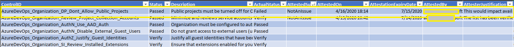 

If you wish to revisit previous attestations, it can be done by using 'AlreadyAttested' flag in the command above.  

[Back to top...](Readme.md#contents)
### How scanner determines the effective control result

During the attestation workflow, the user gets to provide attestation status for each control attested. This basically represents the user's attestation preference w.r.t.
a specific control (i.e., whether the user wants to override/augment the scanner status and treat the control as passed or whether the user agrees with the scanner status but wants to defer fixing the issue for the time being):

|Attestation Status | Description|
|---|---|
|None | There is no attestation done for a given control. User can select this option during the workflow to skip the attestation|
|NotAnIssue | User has verified the control data and attesting it as not an issue with proper justification to represent situations where the control is implemented in another way, so the finding does not apply. |
|WillNotFix | User has verified the control data and attesting it as not fixed with proper justification|

The following table shows the complete 'state machine' that is used by AzSK.AzureDevOps to support control attestation. 
The columns are described as under:
- 'Control Scan Result' represents the technical evaluation result 
- 'Attestation Status' represents the user choice from an attestation standpoint
- 'Effective Status' reflects the effective control status (combination of technical status and user input)
- 'Requires Justification' indicates whether the corresponding row requires a justification comment
- 'Comments' outlines an example scenario that would map to the row

|Control Scan Result  |Attestation Status |Effective Status|Requires Justification | ExpiryInDays| Comments |
|---|---|---|---|---|---|
|Passed |None |Passed |No | -NA- |No need for attestation. Control has passed outright!|
|Verify |None |Verify |No | -NA- |User has to ratify based on manual examination of AzSK.AzureDevOps evaluation log. E.g., Project Collection Service Account list.|
|Verify |NotAnIssue |Passed |Yes | 90 |User has to ratify based manual examination that finding does not apply as the control has been implemented in another way.|
|Verify |WillNotFix |Exception |Yes | Based on the control severity table below|Valid security issue but a fix cannot be implemented immediately.|
|Failed |None |Failed |No | -NA- | Control has failed but has not been attested. Perhaps a fix is in the works...|	 
|Failed |NotAnIssue |Passed |Yes | 90 |Control has failed. However, the finding does not apply as the control has been implemented in another way.|
|Failed |WillNotFix |Exception |Yes | Based on the control severity table below| Control has failed. The issue is not benign, but the user has some other constraint and cannot fix it.|
|Error |None |Error |No | -NA- | There was an error during evaluation. Manual verification is needed and is still pending.|
|Error |NotAnIssue |Passed |Yes | 90| There was an error during evaluation. Manual verification by user indicates that the finding does not apply as the control has been implemented in another way.|
|Error |WillNotFix |Exception |Yes | Based on the control severity table below| There was an error during evaluation. Manually verification by the user indicates a valid security issue.|
|Manual |None |Manual |No | -NA-| The control is not automated and has to be manually verified. Verification is still pending.| 
|Manual |NotAnIssue |Passed |Yes | 90| The control is not automated and has to be manually verified. User has reviewed the security concern and implemented the fix in another way.|
|Manual |WillNotFix |Exception |Yes | Based on the control severity table below| The control is not automated and has to be manually verified. User has reviewed and found a security issue to be fixed.|

-NA- => Not Applicable

Control Severity Table:

|ControlSeverity| ExpiryInDays|
|----|---|
|Critical| 7|
|High   | 30|
|Medium| 60|
|Low| 90|
 
  
<br>
The following table describes the possible effective control evaluation results (taking attestation into consideration).

|Control Scan Result| Description|
|---|---|
|Passed |Fully automated control. Azure DevOps artifact configuration meeting the control requirement|
|Verify |Semi-automated control. It would emit the required data in the log files which can be validated by the user/auditor.|
|Failed |Fully automated control. Azure DevOps artifact configuration not meeting the control requirement|
|Error |Automated control. Currently failing due to some exception. User needs to validate manually|
|Manual |No automation as of now. User needs to validate manually|
|Exception |Risk acknowledged. The 'WillNotFix' option was chosen as attestation choice/status. |

[Back to top...](Readme.md#contents)
### Permissions required for attesting controls:
Attestation is supported for organization and project controls only with admin privileges on organization and project, respectively. 

In order to attest build, release, service connection and agent pool controls, user needs to have atleast contributor access on the 'ADOScanner_Attestation' repository of project these resources belong to.

Note: The attestation data stored in the 'ADOScanner_Atestation' repository is opaque from an end user standpoint. Any attempts to access/change it may impact correctness of security evaluation results.

Currently, attestation can be performed only via PowerShell session in local machine, but the scan results will be honored in both local as well as extension scan.

> **Note**:   
>* In order to attest organization control, user needs to be a member of the group 'Project Collection Administrators'.
>* In order to attest project control, user needs to be a member of the group 'Project Administrators' of that particular project.
[Back to top...](Readme.md#contents)

### Attestation expiry:
All the control attestations done through AzSK.AzureDevOps is set with a default expiry. This would force teams to revisit the control attestation at regular intervals. 
Expiry of an attestation is determined through different parameters like control severity, attestation status etc. 
There are two simple rules for determining the attestation expiry. Those are:

Any control with evaluation result as not passed and, 
 1. attested as 'NotAnIssue', such controls would expire in 90 days.
 2. attested as 'WillFixLater', such controls would expire based on the control severity table below.

|ControlSeverity| ExpiryInDays|
|----|---|
|Critical| 7|
|High   | 30|
|Medium| 60|
|Low| 90|

> **Note**:
>* Attestation may also expire before actual expiry in cases when the attested state for the control doesn't match with current control state.
[Back to top...](Readme.md#contents)

# Customizing AzSK.AzureDevOps for your project

## Overview

#### When and why should I setup org policy

When you run any scan command from AzSK.AzureDevOps, it relies on JSON-based policy files to determine various parameters that effect the behavior of the command it is about to run. These policy files are downloaded 'on the fly' from a policy server. When you run the public version of the scanner, the offline policy files present in the module are accessed. Thus, whenever you run a scan from a vanilla installation, AzSK.AzureDevOps accesses the offline file present in the module to get the policy configuration and runs the scan using it. 

The JSON inside the policy files dictate the behavior of the security scan. 
This includes things such as:
 - Which set of controls to evaluate?
 - What control set to use as a baseline?
 - What settings/values to use for individual controls? 
 - What messages to display for recommendations? Etc.


Note that the policy files needed for security scans are downloaded into each PS session for **all** AzSK.AzureDevOps scenarios. That is, apart from manually-run scans from your desktop, this same behavior happens if you include the 'ADO Security Scanner' extension task in your CICD pipeline. 

 While the out-of-box files in the module may be good for limited use, in many contexts you may want to "customize" the behavior of the security scans for your environment. You may want to do things such as: (a) enable/disable 
some controls, (b) change control settings to better match specific security policies within your org, (c) change various messages, (d) add additional filter criteria for certain regulatory requirements that teams in your org can leverage, etc. When faced with such a need, you need a way to create and manage 
a dedicated policy endpoint customized to the needs of your environment. The organization policy setup feature helps you do that in an automated fashion. 

In this document, we will look at how to setup an organization-specific policy endpoint, how to make changes to and manage the policy files and how to accomplish various common org-specific policy/behavior customizations 
for the scanner.

#### How does AzSK.AzureDevOps use online policy?

Let us look at how policy files are leveraged in a little more detail. 

When you install AzSK.AzureDevOps, it downloads the latest AzSK.AzureDevOps module from the PS Gallery. Along with this module there is an *offline* set of policy files that go in a sub-folder under the %userprofile%\documents\WindowsPowerShell\Modules\AzSK.AzureDevOps\<version> folder. It also places (or updates) an AzSKSettings.JSON file in your %LocalAppData%\Microsoft\AzSK.AzureDevOps folder that contains the policy endpoint (or policy server) URL that is used by all local commands. 

Whenever any command is run, AzSK.AzureDevOps uses the policy server URL to access the policy endpoint. It first downloads a 'metadata' file that contains information about what other files are available on the policy server. After 
that, whenever AzSK.AzureDevOps needs a specific policy file to actually perform a scan, it loads the local copy of the policy file into memory and 'overlays' any settings *if* the corresponding file was also found on the 
server-side. 

It then accesses the policy to download a 'metadata' file that helps it determine the actual policy files list that is present on the server. Thereafter, the scan runs by overlaying the settings obtained from the server with 
the ones that are available in the local installation module folder. This means that if there hasn't been anything overridden for a specific feature (e.g., Project), then it won't find a policy file for that listed in the server
 metadata file and the local policy file for that feature will get used. 

## Setting up org policy

#### What happens during org policy setup?

At a high level, the org policy setup support for AzSK.AzureDevOps does the following:
 - Sets up a repository to hold various policy artifacts in the project you want to use for hosting your policy endpoint. (This should be a secure, limited-access repo to be used only for managing your project's AzSK.AzureDevOps policy.)
 - Uploads the minimum set of policy files required to bootstrap your policy server.

#### Steps to setup org policy setup 

1. Create a Git repository in your project by importing this [repo](https://github.com/azsk/ADOScanner_Policy.git). [Project -> Repos -> Import repository -> Select 'Git' as repository type -> Enter 'https://github.com/azsk/ADOScanner_Policy.git' as clone URL -> Enter 'ADOScanner_Policy_\<ProjectName>' as name].

It will import a very basic 'customized' policy involving below files uploaded to the policy repository.

##### Basic files setup during policy setup 
 
| File | Description  
| ---- | ---- | 
| AzSK.Pre.json | This file contains a setting that controls/defines the AzSK.AzureDevOps version that is 'in effect' in a project. A project can use this file to specify the specific version of AzSK.AzureDevOps that will get used in SDL/CICD scenarios at the project level.<br/> <br/>  **Note:** Whenever a new AzSK.AzureDevOps version is released, the org policy owner should update the AzSK.AzureDevOps version in this file with the latest released version after performing any compatibility tests in a test setup.<br/> You can get notified of new releases by following the AzSK.AzureDevOps module in PowerShell Gallery or release notes section [here](https://azsk.azurewebsites.net/ReleaseNotes/LatestReleaseNotes.html).   
| AzSK.json | Includes org-specific message, installation command etc.
| ServerConfigMetadata.json | Index file with list of policy files.  

## Consuming custom org policy

Running scan with custom org policy is supported from both avenues of AzSK.AzureDevOps viz. local scan (SDL) and ADO security scanner extension task (CICD). Follow the steps below for the same:

### 1. Running scan in local machine with custom org policy

 To run scan with custom org policy from any machine, run the below command

```PowerShell
#Run scan cmdlet and validate if it is running with org policy
Get-AzSKAzureDevOpsSecurityStatus -OrganizationName "<Organization name>" -ProjectNames "<Project name where the org policy is configured>"
```

### 2. Using ADO security scanner extension with custom org policy

To set up CICD when using custom org policy, add 'ADO Security Scanner' extension in ADO build pipeline by following the steps [here](Readme.md#setting-up-continuous-assurance---step-by-step).

## Modifying and customizing org policy 

#### Getting Started

The typical workflow for all policy changes will remain same and will involve the following basic steps:

 1) Make modifications to the existing files (or add additional policy files as required)
 2) Update *ServerConfigMetadata.json* to include files to be overlayed while running scan commands.
 3) Test in a fresh PS console that the policy change is in effect. (Policy changes do not require re-installation of AzSK.AzureDevOps)


Because policy on the server works using the 'overlay' approach, **the corresponding file on the server needs to have only those specific changes that are required (plus some identifying elements in some cases).**

Lastly, note that while making modifications, you should **never** edit the files that came with the AzSK.AzureDevOps installation folder %userprofile%\documents\WindowsPowerShell\Modules\AzSK.AzureDevOps). 
You should create copies of the files you wish to edit, place them in our org-policy repo and make requisite modifications there.
	
### Basic scenarios for org policy customization


In this section let us look at typical scenarios in which you would want to customize the org policy and ways to accomplish them. 

> Note: To edit policy JSON files, use a friendly JSON editor such as Visual Studio Code. It will save you lot of
> debugging time by telling you when objects are not well-formed (extra commas, missing curly-braces, etc.)! This
> is key because in a lot of policy customization tasks, you will be taking existing JSON objects and removing
> large parts of them (to only keep the things you want to modify).


##### a) Changing the default `'Running AzSK.AzureDevOps cmdlet...'` message
Whenever any user in your project runs scan command targetting resources within the project (project/build/release/service connection/agent pool), 
they should see such a message

    Running AzSK.AzureDevOps cmdlet...

This message resides in the AzSK.json policy file on the server and AzSK.AzureDevOps *always* displays the text from the server version of this file.

You may want to change this message to something more detailed. (Or even use this as a mechanism to notify all users
within the project about something related to AzSK.AzureDevOps that they need to attend to immediately.) 
In this example let us just make a change to this message. We will add the project name in the message.

###### Steps:

 i) Open the AzSK.json in the *master* branch of your org-policy repo.
     
 ii) Edit the value for "Policy Message" field by adding the project name as under:
   ```
   "PolicyMessage" : "Running AzSK.AzureDevOps cmdlet using <Project name> policy"
   ```
 iii) Commit the file to the *master* branch of the repo. 
 
 > **Note:** 1. Unless explicitly mentioned, we will be referring to the *master* branch of the org-policy repo.  
 > 2. It is recommended to commit updates using a pull request workflow. 

###### Testing:

The updated policy is now on the policy server. You can ask another person to test this by running the below scan cmdlet in a **fresh** PS console.

```PowerShell
#Run scan cmdlet and validate if it is running with org policy
Get-AzSKAzureDevOpsSecurityStatus -OrganizationName "<Organization name>" -ProjectNames "<Project name where the org policy is configured>"
```
 When the command starts, it will show an updated message as in the 
image below:

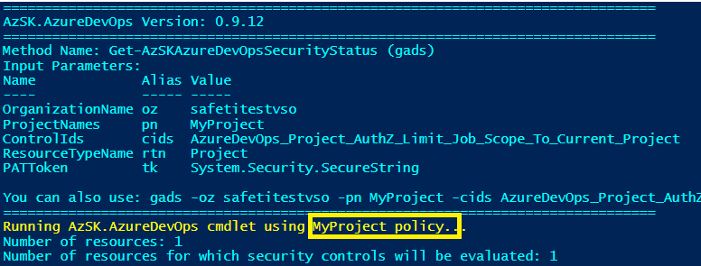 

This change will be effective across your project immediately. Anyone running AzSK.AzureDevOps commands (in fresh PS sessions) should see the new message. 

##### b) Changing a control setting for specific controls 
Let us now change some numeric setting for a control. A typical setting you may want to tweak is the maximum number of
days when a build pipeline was last queued before it is marked inactive.  It is verified in one of the build security controls. (The default value is 180 days.)

This setting resides in a file called ControlSettings.json. Because the first-time org policy setup does not customize anything from this, we will first need to copy this file from the local AzSK.AzureDevOps installation.

The local version of this file should be in the following folder:
```PowerShell
    %userprofile%\Documents\WindowsPowerShell\Modules\AzSK.AzureDevOps\<version>\Framework\Configurations\SVT
```

   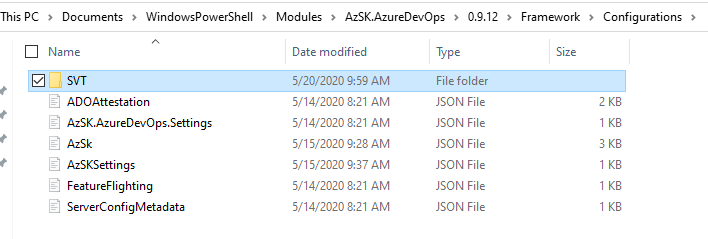 
 
Note that the 'Configurations' folder in the above picture holds all policy files (for all features) of AzSK.AzureDevOps. We 
will make copies of files we need to change from here and place the changed versions in the org-policy repo. 
Again, you should **never** edit any file directly in the local installation policy folder of AzSK.AzureDevOps. 
Rather, **always** copy the file and edit it.

###### Steps:

 i) Copy the ControlSettings.json from the AzSK.AzureDevOps installation to your org-policy repo.
 
 ii) Remove everything except the "BuildHistoryPeriodInDays" line while keeping the JSON object hierarchy/structure intact.

  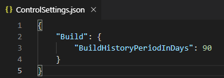 

 iii) Commit the file.

 iv) Add an entry for *ControlSettings.json* in *ServerConfigMetadata.json* (in the repo) as shown below.

  
 
###### Testing: 

Anyone in your project can now start a fresh PS console and the result of the evaluation whether a build pipeline is inactive in 
the build security scan (Get-AzSKAzureDevOpsBuildSecurityStatus) should reflect that the new setting is in 
effect. (E.g., if you change the period to 90 days and if the pipeline was inactive from past 120 days, then the result for control (AzureDevOps_Build_SI_Review_Inactive_Build) will change from 'Passed' to 'Failed'.)

##### c) Customizing specific controls for a service 

In this example, we will make a slightly more involved change in the context of a specific SVT (Project). 

Imagine that you want to turn off the evaluation of some control altogether (regardless of whether people use the `-UseBaselineControls` parameter or not).
Also, for another control, you want people to use a recommendation which leverages an internal tool the security team
in your org has developed. Let us do this for the AzureDevOps.Project.json file. Specifically, we will:
1. Turn off the evaluation of `AzureDevOps_Project_AuthZ_Min_RBAC_Access` altogether.
2. Modify severity of `AzureDevOps_Project_AuthZ_Set_Visibility_Private` to `Critical` for our project (it is `High` by default).
3. Change the recommendation for people in our project to follow if they need to address an issue with the `AzureDevOps_Project_AuthZ_Review_Group_Members` control.
4. Disable capability to attest the control `AzureDevOps_Project_AuthZ_Limit_Job_Scope_To_Current_Project` by adding 'ValidAttestationStates' object.

###### Steps: 
 
 i) Copy the AzureDevOps.Project.json from the AzSK,.AzureDevOps installation to your org-policy repo

 ii) Remove everything except the ControlID, Id and specific property we want to modify as mentioned above. 

 iii) Make changes to the properties of the respective controls so that the final JSON looks like the below. 

```JSON
{
  "Controls": [
   {
      "ControlID": "AzureDevOps_Project_AuthZ_Set_Visibility_Private",
      "Id": "Project110",
      "ControlSeverity": "Critical"
   },
   {
      "ControlID": "AzureDevOps_Project_AuthZ_Min_RBAC_Access",
      "Id": "Project120",
      "Enabled": false
   },
   {
      "ControlID": "AzureDevOps_Project_AuthZ_Review_Group_Members",
      "Id": "Project130",
      "Recommendation": "**Note**: Use our Contoso-MyProject-ReviewGroups.ps1 tool for this!"
   },
   {
      "ControlID": "AzureDevOps_Project_AuthZ_Limit_Job_Scope_To_Current_Project",
      "Id": "Project160",
      "ValidAttestationStates" : ["None"]
   }
  ]
}
```
> **Note:** The 'Id' field is used for identifying the control for policy merging. We are keeping the 'ControlId'
> field only because of the readability.

 iii) Commit the file

 iv) Add an entry for *AzureDevOps.Project.json* in *ServerConfigMetadata.json* (in the repo) as shown below.

  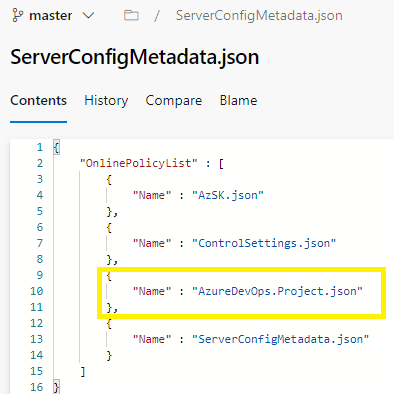 
 
 
###### Testing: 
Someone in your project can test this change using the `Get-AzSKAzureDevOpsProjectSecurityStatus` command on the project for which we have configured the org policy. If run with the `-UseBaselineControls` switch, you will see that
the control *AzureDevOps_Project_AuthZ_Set_Visibility_Private* shows as `Critical` in the output CSV and the recommendation for control *AzureDevOps_Project_AuthZ_Review_Group_Members* has changed to
the custom (internal tool) recommendation you wanted people in your project to follow. 

Likewise, even after you run the scan without the `-UseBaselineControls` parameter, you will see that the control *AzureDevOps_Project_AuthZ_Min_RBAC_Access* is not evaluated and does not
appear in the resulting CSV file. 


##### d) Customizing Severity labels 
Ability to customize naming of severity levels of controls (e.g., instead of High/Medium, etc. one can now have Important/Moderate, etc.) with the changes reflecting in all avenues (manual scan results/CSV, dashboards, etc.)

###### Steps: 

 i) Edit the ControlSettings.json file to add a 'ControlSeverity' object as per below:
 
```JSON
{
   "ControlSeverity": {
    "Critical": "Critical",
    "High": "Important",
    "Medium": "Moderate",
    "Low": "Low"
  }
}
```
 ii) Commit the file.
 
 iii) Confirm that an entry for ControlSettings.json is already there in the ServerConfigMetadata.json file. (Else see step-iv in (b) above.)


 ###### Testing: 

Someone in your project can test this change using the `Get-AzSKAzureDevOpsSecurityStatus`. You will see that
the controls severity shows as `Important` instead of `High` and `Moderate` instead of `Medium` in the output CSV.

##### e) Modifying a custom control 'baseline' for your project
A powerful capability of AzSK.AzureDevOps is the ability for a project to define a baseline control set on the policy server
that can be leveraged by all individuals in the project in both local scan and CICD scenarios via the *-UseBaselineControls* parameter
during scan commands. 

By default, when someone runs the scan with *-UseBaselineControls* parameter, it leverages the set of
controls listed as baseline in the ControlSettings.json file present in the default offline file of module. 

To modify baseline controls for your project, you will need to update the ControlSettings.json
file as per the steps below-
 
(We assume that you have tried the inactive build period steps in (b) above and edited the ControlSettings.json 
file is already present in your org policy repo.)

 i) Edit the ControlSettings.json file to add a 'BaselineControls' object as per below:
 
```JSON
{
    "Build": {
        "BuildHistoryPeriodInDays": 90
    },
    "BaselineControls": {
        "ResourceTypeControlIdMappingList": [
            {
                "ResourceType": "Project",
                "ControlIds": [
                    "AzureDevOps_Project_AuthZ_Set_Visibility_Private",
                    "AzureDevOps_Project_SI_Limit_Variables_Settable_At_Queue_Time"
                ]
            },
            {
                "ResourceType": "Build",
                "ControlIds": [
                    "AzureDevOps_Build_SI_Review_Inactive_Build"
                ]
            }
        ]
    }
}
```

> Notice how, apart from the couple of extra elements at the end, the baseline set is pretty much a list of 'ResourceType'
and 'ControlIds' for that resource...making it fairly easy to customize/tweak your own project baseline. 
> Here the name and casing of the resource type name must match that of the policy JSON file for the corresponding resource's JSON file in the SVT folder and the control ids must match those included in the JSON file. 

> Note: Here we have used a very simple baseline with just a couple of resource types and a very small control set.

 ii) Commit the ControlSettings.json file.
 
 iii) Confirm that an entry for ControlSettings.json is already there in the ServerConfigMetadata.json file. (Else see step-iv in (b) above.)

> Note: This will include new controls that you added in the baseline set on the server side plus the original baseline set (present in the offline file in module). This happens as *ControlSetting.json* file has been **overlayed** on the server side. In order to not include the original baseline in the scan, you need to **override** the file on server side. Refer the below steps to override baseline set on server side.

**Steps:**

i) Copy local version of ControlSettings.json file to org policy repo.

Source location: "%userprofile%\Documents\WindowsPowerShell\Modules\AzSK.AzureDevOps\<version>\Framework\Configurations\SVT"

ii) Update all the required configurations (baseline set, preview baseline set, build configurations, etc.) in ControlSettings.json

iii) Commit the file.

iv) Add entry for configuration in index file(ServerConfigMetadata.json) with OverrideOffline property as shown here 

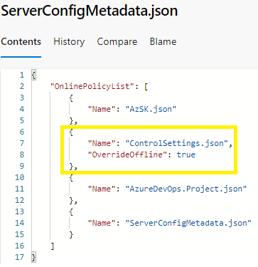


###### Testing:

To test that the baseline controls set is in effect, anyone in your project can start a fresh PS console and run the project and build security scan cmdlets with the `-UseBaselineControls` parameter.

> **Note:** Similar to baseline control, you can also define preview baseline set with the help of similar property "PreviewBaselineControls" in ControlSettings.json. This preview set gets scanned using parameter `-UsePreviewBaselineControls` with scan commands.
	
#### Troubleshooting common issues 
Here are a few common things that may cause glitches and you should be careful about:

- Make sure you use exact case for file names for various policy files (and the names must match case-and-all
with the entries in the ServerConfigMetadata.json file)
- Make sure that no special/BOM characters get introduced into the policy file text. 

## Advanced usage of org policy (extending AzSK.AzureDevOps)

### Customizing the SVTs

It is powerful capability of AzSK.AzureDevOps to enable a project to customize the Security Verification Tests (SVT) behaviour. You will be able to achieve the following scenarios.

   - Update/extend existing control by augmenting logic
   - Add new control for existing feature SVT.

   ### Know more about SVTs:


All our SVTs inherit from a base class called SVTBase which will take care of all the required plumbing from the control evaluation code. Every SVT will have a corresponding feature json file under the configurations folder. For example, AzureDevOps.Project.ps1 (in the core folder) has a corresponding AzureDevOps.Project.json file under configurations folder. These SVTs json have a bunch of configuration parameters, that can be controlled by a policy owner, for instance, you can change the recommendation, modify the description of the control suiting your project, change the severity, etc.

Below is the typical schema for each control inside the feature json
  ```
{
    "ControlID": "AzureDevOps_Project_AuthZ_Limit_Job_Scope_To_Current_Project",   //Human friendly control Id. The format used is AzureDevOps_<FeatureName>_<Category>_<ControlName>
    "Description": "Scope of access of all pipelines should be restricted to current project.",  //Description for the control, which is rendered in all the reports it generates (CSV, AI telemetry, emails etc.).
    "Id": "Project160",   //This is internal ID and should be unique. Since the ControlID can be modified, this internal ID ensures that we have a unique link to all the control results evaluation.
    "ControlSeverity": "Medium", //Represents the severity of the Control. 
    "Automated": "Yes",   //Indicates whether the given control is Manual/Automated.
    "MethodName": "CheckJobAuthnScope",  // Represents the Control method that is responsible to evaluate this control. It should be present inside the feature SVT associated with this control.
    "Recommendation": "Go to Project Settings --> Pipelines --> Settings --> Enable 'Limit job authorization scope to current project.'.",	  //Recommendation typically provides the precise instructions on how to fix this control.
    "Tags": [
        "SDL",
        "TCP",
        "Automated",
        "AuthZ"
    ], // You can decorate your control with different set of tags, that can be used as filters in scan commands.
    "Enabled": true ,  //Defines whether the control is enabled or not.
    "Rationale": "This ensures pipeline execution happens using a token scoped to the current project abiding with principle of least privilege." //Provides the intent of this control.
}
 ```  
    
After schema of the control json, let us look at the corresponding feature SVT PS1.

```PowerShell
Set-StrictMode -Version Latest
class SubscriptionCore: SVTBase
{
	[PSObject] $PipelineSettingsObj = $null

    Project([string] $subscriptionId, [SVTResource] $svtResource): Base($subscriptionId,$svtResource) 
    {
        $this.GetPipelineSettingsObj()
    }
	.
	.
	.
	hidden [ControlResult] CheckJobAuthnScope([ControlResult] $controlResult)
	{

		#Step 1: This is where the code logic is placed
		#Step 2: ControlResult input to this function, which needs to be updated with the verification Result (Passed/Failed/Verify/Manual/Error) based on the control logic
		Messages that you add to ControlResult variable will be displayed in the detailed log automatically.
		#Step 3: You can directly access the properties from ControlSettings.json. Any property that you add to controlsettings.json will be accessible from your SVT
		
		if($this.PipelineSettingsObj)
       {
            
            if($this.PipelineSettingsObj.enforceJobAuthScope.enabled -eq $true )
            {
                $controlResult.AddMessage([VerificationResult]::Passed, "Scope of access of all pipelines is restricted to current project. It is set as '$($this.PipelineSettingsObj.enforceJobAuthScope.orgEnabled)' at organization scope.");
            }
            else{
                $controlResult.AddMessage([VerificationResult]::Failed, "Scope of access of all pipelines is set to project collection. It is set as '$($this.PipelineSettingsObj.enforceJobAuthScope.orgEnabled)' at organization scope.");
            }       
       }
       else{
            $controlResult.AddMessage([VerificationResult]::Manual, "Pipeline settings object could not be fetched due to insufficient permissions at project scope.");
        }       
        return $controlResult
	}
	.
	.
	.
}
```
	
### Steps to extend the control SVT:
##### A. Extending a GSS SVT
1. 	 Copy the SVT ps1 script that you want to extend and rename the file by replacing "AzureDevOps_<Feature>.ps1" with "<Feature>.ext.ps1".
	For example, if you want to extend AzureDevOps.Project.ps1, copy the file and rename it to Project.ext.ps1.
  
2. 	 You need to rename the class, inherit from the core feature class, and then update the constructor to reflect the new name as shown below:
    
   > e.g. class Project: ADOSVTBase => ProjectExt : Project
	
   ```PowerShell
	Set-StrictMode -Version Latest
	class ProjectExt : Project
	{
	  ProjectExt([string] $subscriptionId, [SVTResource] $svtResource): Base($subscriptionId, $svtResource) 
	  {       
	    
	  }
	}
   ```
   All the other functions from the class file should be removed.
  
3. 	 If you are modifying the logic for a specific control, then retain the required function; or if you are adding a new control, copy any control function from the base class to the extension class reference.
	> Note: For a given control in json, the corresponding PowerShell function is provided as value under MethodName property. You can search for that method under the PS script. For eg. In the below case let us assume you want to add a new control that fails if project visibility is set to private. 
  
  ```PowerShell
	Set-StrictMode -Version Latest
	class ProjectExt: Project
	{
		ProjectExt([string] $subscriptionId, [SVTResource] $svtResource): Base($subscriptionId, $svtResource) 
    {

    }
		hidden [ControlResult] CheckPrivateProjects([ControlResult] $controlResult)
		{
			#This is internal
			$apiURL = $this.ResourceContext.ResourceId;
      $responseObj = [WebRequestHelper]::InvokeGetWebRequest($apiURL);
			
			if([Helpers]::CheckMember($responseObj,"visibility"))
        {
          #Project is visibility is set to private.
            if($responseObj.visibility -eq "Private")
            {
                $controlResult.AddMessage([VerificationResult]::Failed,
                                                "Project visibility is set to $($responseObj.visibility)."); 

            }
            else {
                $controlResult.AddMessage([VerificationResult]::Passed,
                                                "Project visibility is set to $($responseObj.visibility).");
            }
        }
        $controlResult.SetStateData("Project visibility is set to ", $responseObj.visibility);
        return $controlResult;
		}
	}
  ```  
  
  4. 	Now you need to prepare the json for the above new control. You can get started by copying the default base json, rename it to AzureDevops_<Feature>.ext.json. In this case you need to rename it as AzureDevOps_Project.ext.json. Remove all the other controls except for one and update it with new control details. See additional instructions as '//comments' on each line in the example JSON below. Note: Remove the comments from JSON if you happen to use the below as-is.
	
  > IMPT: Do *not* tag 'Ext' to the 'FeatureName' here. Make sure you have updated the MethodName to the new method name. 
  > Note: Remove the comments in the below JSON before saving the file
  
``` 
	{
    "FeatureName":  "Project",
    "Reference":  "aka.ms/azsktcp/project",
    "IsMaintenanceMode":  false,
	   "Controls": [
            {
                "ControlID": "AzureDevOps_Project_AuthZ_Dont_Set_Visibility_Private",  //define the new control id
                "Description": "Ensure that project visibility is not set to private", //Description for your control
                "Id": "Project180", //Ensure that all the internal ids are appended with 4 digit integer code
                "ControlSeverity": "Medium", //Control the severity
                "Automated": "Yes",  // Control the automation status
                "MethodName": "CheckPrivateProjects", //Update the method name with the new one provided above
                "Recommendation": "Refer: https://docs.microsoft.com/en-us/azure/devops/organizations/public/make-project-public?view=vsts&tabs=new-nav",
                "Tags": [
                      "SDL",
                      "TCP",
                      "Automated",
                      "AuthZ"
                ],
                "Enabled": true,
                "Rationale": "Data/content in projects that have public visibility can be downloaded by anyone on the internet without authentication. This can lead to a compromise of corporate data."
            }
	   ]
	}
```
5. 	 Now upload these files to your org policy repo and add an entry to ServerConfigMetadata.json as shown below:
``` 
    {
      "Name":  "AzureDevOps.Project.ext.json"
    },
    {
      "Name":  "Project.ext.ps1"
    }
```  
  
6. 	 That's it!! You can now scan the new extended control like any other control.
  
```PowerShell
	Get-AzSKAzureDevOpsSecurityStatus -OrganizationName "org_name" -ProjectNames "<Org_Policy_Project_Name>" -ControlIds 'Azure_Subscription_AuthZ_Limit_Admin_Count_Ext'
```

### Steps to override the logic of existing SVT:

1. Add new Feature.ext.ps1/Project.ext.ps1 file with the new function that needs to be executed as per the above documentation.
2. Customize AzureDevOps.Feature.json/AzureDevOps.Project.json file as per by overriding "MethodName" property value with the new function name that needs to be executed.
3. That's it!! You can now scan the older control with overridden functionality. 

### Steps to add extended control in baseline control list:

1. Add new control to AzureDevOps.Feature.json/AzureDevOps.Project.json file as per the above documentation.
2. Add the new ControlId in baseline control list.
3. That's it!! The newly added control will be scanned while passing "-UseBaselineControls" switch to GSS/GRS cmdlets.


## Frequently Asked Questions

#### Can I completely override policy. I do not want policy to be run in Overlay method?

Yes. You can completely override policy configuration with the help of index file. 

**Steps:**

i) Copy local version of configuration file to org policy repo. Here we will copy complete ControlSettings.json. 

Source location: "%userprofile%\Documents\WindowsPowerShell\Modules\AzSK.AzureDevOps\<version>\Framework\Configurations\SVT"

ii) Update all the required configurations (baseline set, preview baseline set, build configurations, etc.) in ControlSettings.json

iii) Commit the file.

iv) Add entry for configuration in index file(ServerConfigMetadata.json) with OverrideOffline property as shown here 


### Control is getting scanned even though it has been removed from my custom org-policy.

If you want only the controls which are present on your custom org-policy to be scanned, set the  OverrideOffline flag to true in the ServerConfigMetadata.json file.