## IMPORTANT: DevOps Kit (AzSK) is being sunset by end of FY21. More details [here](/ReleaseNotes/AzSKSunsetNotice.md)
----------------------------------------------

# AzSK Continuous Assurance for Cluster Installation Steps

### Contents

- [Prerequisites](Readme.md#prerequisites)
- [Setting up HDInsight](Readme.md#Setting-up-HDInsight)
- [Setting up Azure Databricks](Readme.md#Setting-up-Azure-Databricks)
- [Setting up AKS](Readme.md#Setting-up-AKS)
-----------------------------------------------------------------

## Prerequisites
1.	For every cluster type, we assume the required cluster is already created in your subscription. 
2.	You may need to pass additional details like cluster location (for Databricks) so note it down while creating the resource to keep it handy. 
3.	All scripts use Azure Powershell. If you don’t have it installed please visit: https://docs.microsoft.com/en-us/cli/azure/install-azure-cli-windows?view=azure-cli-latest  
4.	For Kubernetes, additionally you will need to install `kubectl`. Run the following command after installing Azure PowerShell
    ```PowerShell
    az aks install-cli
    ```

## Setting up HDInsight

1. Install Continuous Assurance for HDInsight cluster using the command:                

    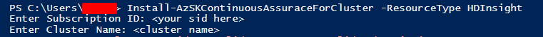

2.	On successful installation you will see the following results. You may pass the *-Force* parameter to reinstall `AzSKPy` to force reinstallation to a new version. 

    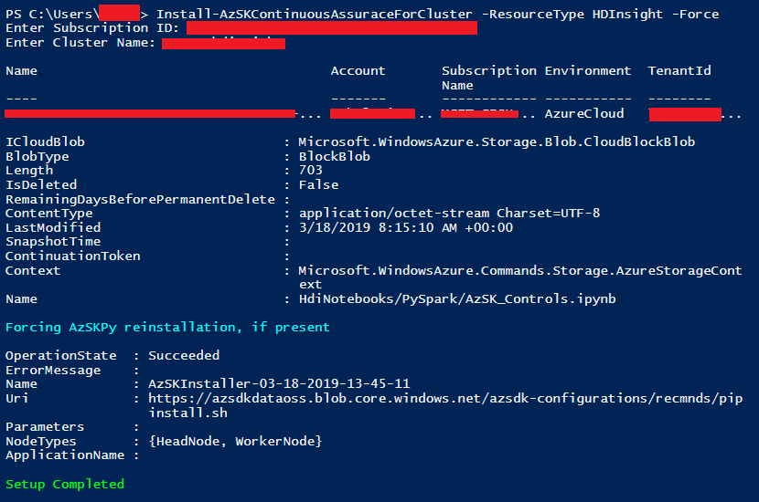

3.	This will add a new notebook to your `PySpark` folder in the HDI Cluster.

    

4.	Open the notebook.

5.	Hit *Shift+Enter* or select *Cell -> Run* all to run all the cells and see the output.

    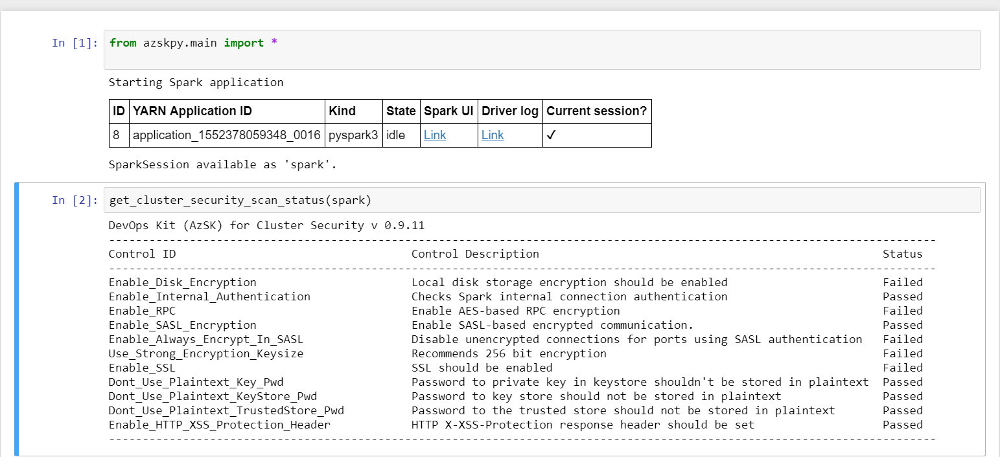

6.	The next cell will display recommendations.

    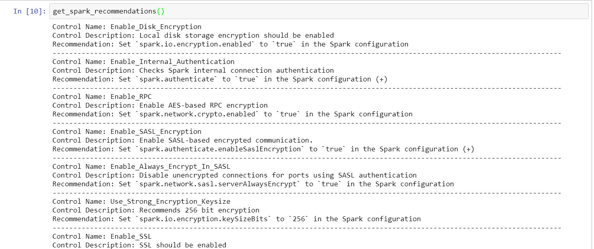

## Get Status for HDInsight

1. You can check the health of the CA using the following command:
   ```
   Get-AzSKContinuousAssuranceForCluster -ResourceType HDInsight
   ```

2. This command will give you the information about on CA health like last scan run, and other metadata. 

## Update CA for HDInsight

1. Updating CA for HDInsight will update the content for notebook. You can also update the Application Insights key using the command. 
   ```
   Update-AzSKContinuousAssuranceForCluster -ResourceType HDInsight
   ```
## Removing CA for HDInsight

1. To uninstall CA, use the following command. This will *preserve* the scan logs of previous scans. You can access them by going into the /AzSK_Logs/ directory on the storage account. 
   ```
   Remove-AzSKContinuousAssuranceForCluster -ResourceType HDInsight
   ```

## Setting up Azure Databricks

1.	Use the following command to setup AzSK job for Databricks and input the cluster location and PAT.

    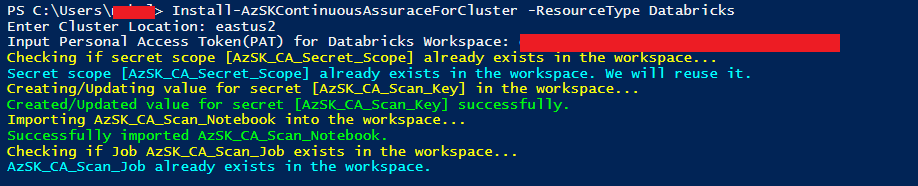

2.  Go to your cluster settings in workspace and make sure it's running. In the Libraries tab, select intsall new. Then select library source as "PyPi". Leave the Repository blank and enter "azskpy" in the Package text field and click install. This will install the AzSKPy library in the cluster. 

3.	Head on to your Databricks Workspace to open up the notebook.

    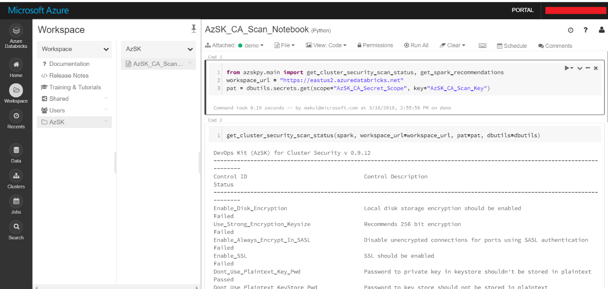

4.	Similarly, press *Shift+Enter* to run the cells, or *Run All* to show the output.

    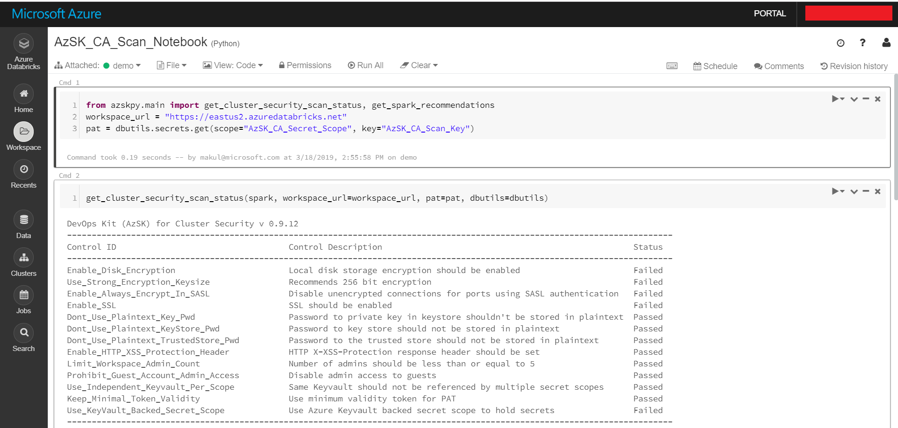

5. The next cell will show the recommendations to fix the controls.

    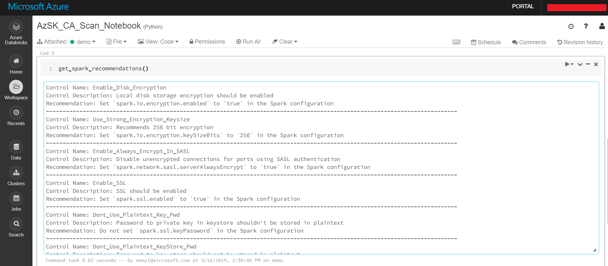

## Get Status for Databricks

1. You can check the health of the CA for Databricks using the following command:
   ```
   Get-AzSKContinuousAssuranceForCluster -ResourceType Databricks
   ```

2. This command will give you the information about on CA health like whether all the required scan permission are present. 

## Update CA for Databricks

1. Updating CA for Databricks will update the content for notebook. You can also update other data like PAT, Application Insights key using the command. 
   ```
   Update-AzSKContinuousAssuranceForCluster -ResourceType Databricks
   ```
## Removing CA for Databricks

1. To uninstall CA, use the following command. This will *preserve* the scan logs of previous scans. You can access them by going into the /AzSK_Logs/ directory in the workspace storage. 
   ```
   Remove-AzSKContinuousAssuranceForCluster -ResourceType Databricks
   ```
   
## Setting up AKS

1. To install AzSK CA on Kubernetes cluster run the below command 

    ```PowerShell
    Install-AzSKContinuousAssuranceForCluster -SubscriptionId <SubscriptionId> -ResourceGroupName <ResourceGroupName> -ResourceName <ResourceName> -ResourceType Kubernetes [ -LAWorkspaceId <ID of Log Analytics workspace> -LASharedSecret <Shared key of Log Analytics workspace> ]
    ```

   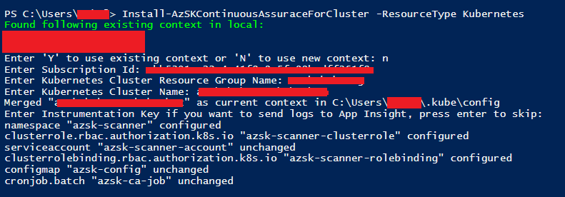

   During insatallation you can also provide workspace ID and shared key of Log Analytics workspace, If you want to send security scan results to Log Analytics for monitoring.

2.	To view the logs of the last CA job, run the below command

    ```PowerShell
    $lastJobPod = kubectl get pods --namespace azsk-scanner -o jsonpath='{.items[-1:].metadata.name}' 
    Kubectl logs $lastJobPod --namespace azsk-scanner
    ```
    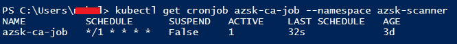

3.	To view details like CA job schedule, last schedule run the below command


    ```PowerShell
    kubectl get cronjob azsk-ca-job --namespace azsk-scanner
    ```
    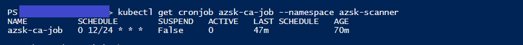

4. To view logs of any specific job

    a. List all the pods created by AzSK CA job using below command

    ```PowerShell
     kubectl get pods  --namespace azsk-scanner
     ```

    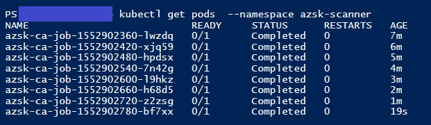

    b. Pick up the pod name for which you want to see the logs, and run the below after replacing the podname

    ```PowerShell
        Kubectl logs <podname> --namespace azsk-scanner
     ```

    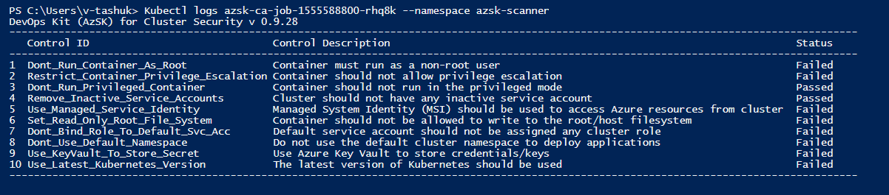

## Get Status for AKS

1. You can check the health of the CA for Kubernetes using the following command:

```PowerShell
  Get-AzSKContinuousAssuranceForCluster -SubscriptionId <SubscriptionId> -ResourceGroupName <ResourceGroupName> -ResourceName <ResourceName> -ResourceType Kubernetes 
```

2. This command will give you the information about on CA health like whether all the required scan permission are present. 

## Update CA for AKS

1. Updating CA for Kubernetes will update the image used for scanning cluster. You can also update other configuration like scan interval, Application Insights key or can fix runtime account permissions key using the command. 
```PowerShell
    Update-AzSKContinuousAssuranceForCluster -SubscriptionId <SubscriptionId> -ResourceGroupName <ResourceGroupName> -ResourceName <ResourceName> -ResourceType Kubernetes  [ -NewAppInsightKey <Application Insight Key>]   [ -NewLAWorkspaceId <ID of Log Analytics workspace>]  [ -NewLASharedSecret <Shared key of Log Analytics workspace>] [ -FixRuntimeAccount ] [ -LogRetentionInDays <JobLogsRetentionInDays>] [ -SpecificImageVersion <DockerHubImageTag> ] [-ScanIntervalInHours <ScanIntervalInHours> ]
```
## Removing CA for AKS

1. To uninstall CA, use the following command. This will download the scan logs of previous scans to your local machine. You can also choose not to download previous scan logs.

```PowerShell
  Remove-AzSKContinuousAssuranceForCluster SubscriptionId <SubscriptionId> -ResourceGroupName <ResourceGroupName> -ResourceName <ResourceName> -ResourceType Kubernetes [-DownloadJobLogs <Yes/No>]
```
