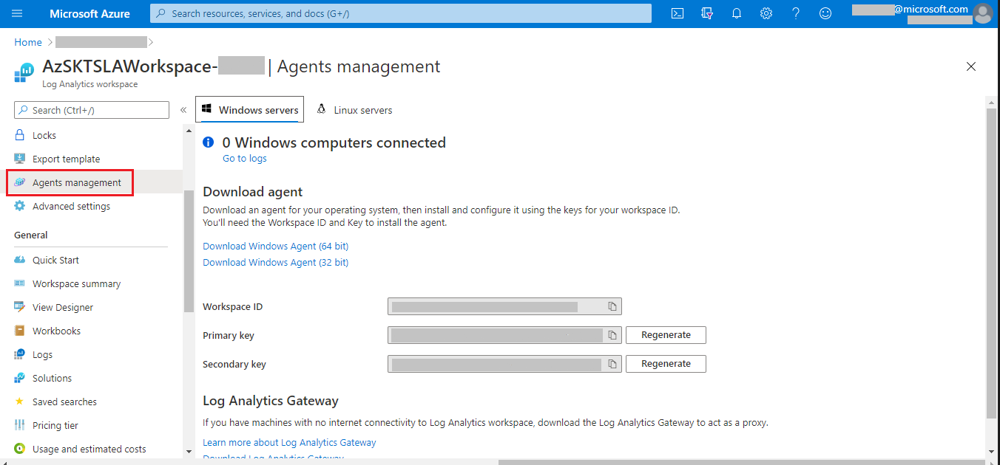

# Tenant Security Solution (TSS)

## Tenant Security
### Contents
- [Overview](Readme.md#overview)
- [Why Tenant Security Solution](Readme.md#setting-up-continuous-assurance---step-by-step)
- [Setting up Tenant Security Solution - Step by Step](Readme.md#setting-up-continuous-assurance---step-by-step)
- [Why Tenant Security Solution](Readme.md#setting-up-continuous-assurance---step-by-step)
- [Tenant Security Solution - how it works (under the covers)](Readme.md#continuous-assurance---how-it-works-under-the-covers)
- [Create compliance and monitoring solutions](Readme.md#continuous-assurance---how-it-works-under-the-covers)
- [Feedback](Readme.md#faq)

-----------------------------------------------------------------
## Overview 
The basic idea behind Tenant Security Solution (TSS) is to provide security for all the resources of any subscription. 

>## How it is different from DevOpsKit ?
TODO

## Setting up Tenant Security Solution - Step by Step
In this section, we will walk through the steps of setting up Tenant Security Solution 

To get started, we need the following:
The user setting up Tenant Security Solution needs to have 'Owner' access on the subscription.

**Prerequisite:**

**1.** We currently support following OS options: 	
- Windows 10
- Windows Server 2016

**Step-1: Setup** 

1. Open the PowerShell ISE and login to your Azure account (using **Connect-AzAccount**).  
2. Run the '**Install-TenantSecuritySolution**' command with required parameters given in below table. 

```PowerShell
	
```     Install-TenantSecuritySolution 
                -SubscriptionId <SubscriptionId> `
                -ScanHostRGName <ResourceGroupName> `
                -ScanIdentityId <ManagedIdentityResourceId> `
                -Location <ResourceLocation> `
                -Verbose ` 
                -EnableScaleOutRule

Here is one basic example of Tenant Security Solution setup command:

```PowerShell
	Install-TenantSecuritySolution -SubscriptionId <SubscriptionId> `
	        -ResourceGroupName ‘rgName1’ ` 
	        -MIResourceId  ‘MIRG1’ `
            -Location "EASTUS2" `
            -Verbose `
            -EnableScaleOutRule
```

>**Note:** Completion of this one-time setup activity can take up to 5 minutes.


**Step-2: Verifying that Tenant Security Solution installation is complete**  

**1:** In the Azure portal, Go to Azure Resource Groups and select the resource group that you have created, you can see multiple resources that has been created.

 

**2:** In the storage resource azsktsstoragexxxxx, Go to queue, a subscription job queue has been created for scheduling the subscriptions. 
	
 

 **3:** In the resource AzSKTSWorkItemProcessor-xxxxx, Go to webjobs, there are two webjobs created for Inventory and ProcessSubscriptions. 
	
 

 **4:** In the resource AzSKTSWorkItemScheduler-xxxxx, Go to webjobs, there is one webjob created for JobProcessor. 
	
 


[Back to top…](Readme.md#contents)
## Tenant Security Solution - how it works (under the covers)
The Tenant Security Solution feature is about #TODO

The TSS installation script that sets up Resource Group and the following resources on your subscription:

- Resource group:- 
To scan all the resources from the group

- Storage account  (Name : AzSKTSStorage-xxxxx) :- To store the daily results of resource scans. The storage account is named with few characters from the resource group name with prefix (e.g. AzSKStorage-ocomu)

- Azure App Service :- Creates two App Services to schedule the subscriptions and #TBD Named as AzSKTSWorkItemSchedular-xxxxx and AzSKTSWorkItemHandler-xxxxx

- Azure App Service Plan :- Creates App Service Hosting Plan to #TBD, Named as AzSKTSHostingPlan-xxxxx

- Managed Identity :- Creates App Service Hosting Plan to #TBD, Named as AzSKTSProcessorMI-xxxxx

- LA Workspace :- Log Analytics Workspace to generate logs after scanning resources Named as AzSKTSLAWorkspace-xxxxx

# Create security compliance monitoring solutions
Once you have an org policy setup running smoothly with multiple subscriptions across your org, you will need a solution that provides visibility of security compliance for all the subscriptions across your org. This will help you drive compliance/risk governance initiatives for your organization. 

When you setup your org policy endpoint (i.e. policy server), one of the things that happens is creation of an Log Analytics workspace for your setup. After that, whenever someone performs an TSS scan for a subscription that is configured to use your org policy, the scan results are sent (as 'security' telemetry) to your org's Log Analytics workspace. Because this workspace receives scan events from all such subscriptions, it can be leveraged to generate aggregate security compliance views for your cloud-based environments. 

## Create cloud security compliance report for your org using PowerBI
We will look at how a PowerBI-based compliance dashboard can be created and deployed in a matter of minutes starting with a template dashboard that ships with the TSS. All you need apart from the Log Analytics workspace instance is a CSV file that provides a mapping of your organization hierarchy to subscription ids (so that we know which team/service group owns each subscription).

> Note: This is a one-time activity with tremendous leverage as you can use the resulting dashboard (example below) towards driving security governance activities over an extended period at your organization. 

#### Step 0: Pre-requisites
To create, edit and publish your compliance dashboard, you will need to install the latest version of PowerBI desktop on your local machine. Download it from [here](https://powerbi.microsoft.com/en-us/desktop/).


#### Step 1: Prepare your org-subscription mapping
In this step you will prepare the data file which will be fed to the PowerBI dashboard creation process as the mapping from subscription ids to the org hierarchy within your environment. The file is in a simple CSV form and should appear like the one below. 

> Note: You may want to create a small CSV file with just a few subscriptions for a trial pass and then update it with the full subscription list for your org after getting everything working end-to-end.

A sample template for the CSV file is [here](./TemplateFiles/OrgMapping.csv):

 

The table below describes the different columns in the CSV file and their intent.

| ColumnName  | Description | Required? | Comments |
| ---- | ---- | ---- |---- |
| BGName | Name of business group (e.g., Finance, HR, Marketing, etc.) within your enterprise | Yes |  This you can consider as level 1 hierarchy for your enterprise | 
| ServiceGroupName | Name of Service Line/ Business Unit within an organization | Yes |  This you can consider as level 2 hierarchy for your enterprise | 
| SubscriptionId | Subscription Id belonging to a org/servicegroup | Yes |   | 
| SubscriptionName | Subscription Name | Yes | This should match the actual subscription name. If it does not, then the actual name will be used.  | 
| IsActive | Use "Y" for Active Subscription and "N" for Inactive Subscription  | Yes | This will be used to filter active and inactive subscriptions .| 
| OwnerDetails | List of subscription owners separated by semi-colons (;)  | Yes | These are people accountable for security of the subscription.  | 

> **Note**: Ensure you follow the correct casing for all column names as shown in the table above. The 'out-of-box' PowerBI template is bound to these columns. If you need additional columns to represent your org hierarchy then you may need to modify the template/report as well.


#### Step 2: Upload your mapping to the Log Analytics workspace

In this step you will import the data above into the LA workspace created during org policy setup. 

 **(a)** Locate the LA resource that was created during org policy setup in your central subscription. This should be present under org policy resource group. After selecting the LA resource, copy the Workspace ID.
 
 **(b)** To push org Mapping details, copy and execute the script available [here](./Scripts/OrgPolicyPushOrgMappingEvents.txt).

 > **Note**: Due to limitation of Log Analytics workspace, you will need to repeat this step every 90 days interval. 

#### Step 3: Create a PowerBI report file
In this section we shall create a PowerBI report locally within PowerBI Desktop using the LA workspace from org policy subscription as the datasource. We will start with a default (out-of-box) PowerBI template and configure it with settings specific to your environment. 

> Note: This step assumes you have completed Step-0 above!

**(a)** Get the Workspace ID for your LA workspace from the portal as shown below:



**(b)** Download and copy the PowerBI template file from [here](https://github.com/azsk/DevOpsKit-docs/blob/master/07-Customizing-AzSK-for-your-Org/TemplateFiles/AzSKComplianceReport.pbit) to your local machine.

**(c)** Open the template (.pbit) file using PowerBI Desktop, provide the LA Workspace ID and click on 'Load' as shown below:


**(d)** PowerBI will prompt you to login to the org policy subscription at this stage. Authenticate using your user account. (This step basically allows PowerBI to import the data from AI into the PowerBI Desktop workspace.)


Once you have successfully logged in, you will see the AI data in the PowerBI report along with org mapping as shown below: 


The report contains 2 tabs. There is an overall/summary view of compliance and a detailed view which can be used to see control 'pass/fail' details for individual subscriptions. An example of the second view is shown below:


> TBD: Need to add steps to control access to the detailed view by business group. (Dashboard RBAC.) 

#### Step 4: Publish the PowerBI report to your enterprise PowerBI workspace

**(a)** Before publishing to the enterprise PowerBI instance, we need to update LA connection string across data tables in the PowerBI report. The steps to do this are as below:

[a1] Click on "Edit Queries" menu option.


[a2] Copy the value of "AzSKAIConnectionString"


[a3] Replace the value of "AzSKAIConnectionString" with the actual connection string (e.g., AzSKAIConnectionString => "https://api.applicationinsights.io/v1/apps/[AIAppID]/query"). You should retain the "" quotes in the connection string.


[a4] Repeat this operation for ControlResults_AI, Subscriptions_AI, and ResourceInventory_AI data tables.

[a5] Click on "Close and Apply".

**(b)** You can now publish your PBIX report to your workspace. The PBIX file gets created locally when you click "Publish".

Click on Publish


Select destination workspace


Click on "Open [Report Name] in Power BI" 


**(c)** Now report got published successfully. You can schedule refresh for report with below steps

Go to Workspace --> Datasets --> Click on "..." --> Click on "Schedule Refresh"


Click on "Edit credentials"


Sign in with account with which policy is created


Add refresh scheduling timings and click on "Apply"

> **Note:** You may not see "Schedule refresh" option if step [a3] and [a4] is not completed successfully.


## AzSK org health monitoring dashboard

Monitoring dashboard gets created along with policy setup and it lets you monitor the operations for various DevOps Kit workflows at your org.(e.g. CA issues, anomalous control drifts, evaluation errors, etc.). 

You will be able to see the dashboard at the home page of Azure Portal. If not, you can navigate to the following path to see the dashboard

Go to Azure Portal --> Select "Browse all dashboards" in dashboard dropdown -->  Select type "Shared Dashboard" --> Select subscription where policy is setup -->Select "DevOps Kit Monitoring Dashboard [OrgName]"

Below is snapshot of the dashboard


## Detail resource inventory dashboard

With the help of telemetry events you will be able to monitor resources inventory in the Org. This will give the visibility over all resources along with control failures over all subscriptions. The PowerBI based template will be shared soon


>### Feedback
