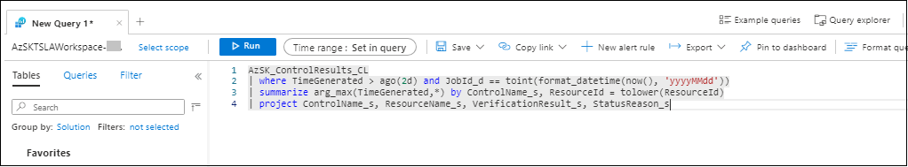

Here is a summary of the data that is captured within each table

| Log Type | Description |
|----|----|
| AzSK_SubInventory_CL | This table contains list of subscription scanned by the Tenant Security Solution |
| AzSK_BaselineControlsInv_CL | This lists the controls supported by Tenant Security solution |
| AzSK_ControlResults_CL	| This table contains control scan results for all the subscriptions scanned by the Tenant Security Solution|
| AzSK_PerformanceMetrics_CL | This table contains performance metrics such as total time taken to scan each subscription, the time taken by individual components etc., |
| AzSK_ProcessedSubscriptions_CL | This contains the events sent by the work item processor job to mark subscription scan progress |
| AzSK_RBAC_CL	| This table contains RBAC role membership details including classic, permanent and PIM assignments |
| AzSK_ResourceInvInfo_CL	| This table captures the list of resources in a subscription |
| AzSK_RTExceptions_CL	| This table contains errors/exceptions generated during the Tenant Security scan | 
| AzSK_SSAssessmentInv_CL	| This table contains Azure Security Centre assessment status |


Log Analytics opens with a new query tab in the Query editor where you can run the following query as shown below:

``` KQL

AzSK_ControlResults_CL
| where TimeGenerated > ago(2d) and JobId_d == toint(format_datetime(now(), 'yyyyMMdd'))
| summarize arg_max(TimeGenerated,*) by ControlName_s, ResourceId = tolower(ResourceId)
| project ControlName_s, ResourceName_s, VerificationResult_s, StatusReason_s

```



The query computes control scan result of the control scanned by the toolkit. There is a filter in the top right, which gives the easy option to select time ranges. This can be done via code as well.


##### List of unhealthy Security Assessment recommendation in a subscription
```KQL
AzSK_SSAssessmentInv_CL
| where TimeGenerated > ago(1d)
| where JobId_d ==  toint(format_datetime(now(), 'yyyyMMdd'))
| summarize arg_max(TimeGenerated, *) by AssessmentId_s
| project SubscriptionId, RecommendationDisplayName_s, AzureResourceId_s, StatusCode_s, StatusMessage_s
| where StatusCode_s =~ "Unhealthy"
```


##### List of Owner/Co-admin in a subscription

```KQL
// Get list of active subscriptions
AzSK_SubInventory_CL
| where TimeGenerated > ago(1d) and JobId_d ==  toint(format_datetime(now(), 'yyyyMMdd'))
| where State_s != 'Disabled'
| summarize arg_max(TimeGenerated, *) by SubscriptionId
| distinct SubscriptionId, Name_s
| join kind=leftouter (
    // Get list of Owners in a subscription
    AzSK_RBAC_CL
    | where TimeGenerated > ago(2d) and JobId_d == toint(format_datetime(now(), 'yyyyMMdd')) 
    | where RBACSource_s =~ "Subscription" 
    | where RoleName_s in ("ServiceAdministrator", "CoAdministrator", "ServiceAdministrator;AccountAdministrator")
    or RoleDefinitionId_s contains "8e3af657-a8ff-443c-a75c-2fe8c4bcb635"
    | summarize OwnerCount = count(),
                PermanentOwnerCount = countif(IsPIMEligible_b == false),
                ObjectIds = make_set(UserName_g) by SubscriptionId = NameId_g
) on SubscriptionId
| extend ObjectIds = iff(SubscriptionId1 == dynamic(null), "RBACNOTFOUND", ObjectIds)
| project SubscriptionId, OwnerCount, PermanentOwnerCount, ObjectIds
```


##### View subscription scan status

``` KQL
// Filter list of active subscriptions
AzSK_SubInventory_CL
| where TimeGenerated > ago(1d)
| where JobId_d ==  toint(format_datetime(now(), 'yyyyMMdd'))
| where State_s != 'Disabled'
| summarize arg_max(TimeGenerated, *) by SubscriptionId
| project SubscriptionId
| join kind= leftouter
(
   // List of subscriptions where processing has completed
    AzSK_ProcessedSubscriptions_CL
    | where TimeGenerated > ago(1d)
    | where JobId_d ==  toint(format_datetime(now(), 'yyyyMMdd'))
    | where EventType_s == 'Completed'
    | summarize arg_max(TimeGenerated, *) by SubscriptionId
)
on SubscriptionId
| extend Type = iff(SubscriptionId1 !=dynamic(null),"Completed", "NotCompleted")
| summarize count() by Type
```


#### D. Tenant Security scan metrics

##### REST API call metrics: Number of API calls made in last 1 day

``` KQL
AzSK_APIMetrics_CL
| where TimeGenerated > ago(1d)
| extend Key_s = iff(Key_s contains "https://", strcat("***#API#***", parse_url(Key_s).Host), Key_s) 
| summarize APICount= sum(Value_d) by Key_s
| order by APICount desc
```

##### Performance metrics: Get the average time buckets and subs count in each bucket

```KQL
let JobId = toint(format_datetime(now(), 'yyyyMMdd'));
// Get count of control scanned for each subscription
AzSK_ControlResults_CL
| where TimeGenerated > ago(2d)
| where JobId_d == JobId
| summarize arg_max(TimeGenerated, *) by ResourceId,ControlName_s
| summarize ControlsCount = count() by SubscriptionId
| join kind= inner (
    // Check performance metrics for total time taken by each subscription
    AzSK_PerformanceMetrics_CL
    | where TimeGenerated > ago(2d)
    | where JobId_d == JobId
    | summarize arg_max(TimeGenerated, *) by SubscriptionId
    | where SubscriptionId != dynamic(null) 
    | extend SubProcessingTime = iff(totimespan(TotalTimeTaken_s) > totimespan("00:02:00"),">2Min",iff(totimespan(TotalTimeTaken_s) > totimespan("00:01:00"),">1Min","<1Min"))
) on SubscriptionId 
| summarize SubscriptionCount = count(), avg(totimespan(TotalTimeTaken_s)) , avg(ControlsCount), max(ControlsCount), min(ControlsCount) by SubProcessingTime 
```

##### List of resources in a subscription

``` KQL
AzSK_ResourceInvInfo_CL
| where TimeGenerated > ago(1d)
| where JobId_d ==  toint(format_datetime(now(), 'yyyyMMdd'))
| summarize arg_max(TimeGenerated, *) by ResourceId
| project OrgTenantId_g, SubscriptionId, ResourceType, Location_s, ResourceId
```