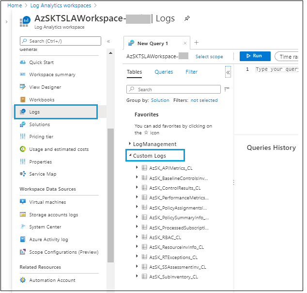

# Tenant Security Solution (TSS) [In Preview]

## Tenant Security
### Contents
- [Overview](Readme.md#overview)
- [Why Tenant Security Solution?](Readme.md#why-tenant-security-solution)
- [Setting up Tenant Security Solution - Step by Step](Readme.md#setting-up-tenant-security-solution---step-by-step)
- [Tenant Security Solution - under the covers (how it works)](Readme.md#tenant-security-solution---under-the-covers-how-it-works)
- [Create compliance and monitoring solutions](Readme.md#create-security-compliance-monitoring-solutions)
- [Feedback](Readme.md#feedback)

-----------------------------------------------------------------
## Overview 
The Tenant Security Solution (TSS) from the AzSK team can be used to obtain visibility to cloud subscriptions and resource configuration across multiple subscriptions in an enterprise environment. The AzSK TSS is a logical progression of DevOps Kit which helps us move closer to an implementation of cloud security compliance solution using native security capabilities in Azure platform that are available today. Functionally, it is similar to running AzSK Continuous Assurance (CA) in central-scan mode.

## Why Tenant Security Solution?
The Tenant Security Solution was created with the following explicit objectives (some of which were harder to accomplish using the existing Automation-based Continuous Assurance approach):
 * Ability to scan large number of subscriptions in a central scan model in a cost-effective and time-efficient manner
 * Being able to scale scanning capability up or down without externally imposed constraints (e.g., runbook memory, runtime limits)
 * Speeding up our effort to transition to native features (being able to respond to changes in Azure more rapidly and deploy modifications to controls)
 * Enable incremental transition of our controls from custom code to Azure/ASC policy-based approach (using ASC/policy-based controls where available today and continue to migrate as more controls become available)

## Setting up Tenant Security Solution - Step by Step
In this section, we will walk through the steps of setting up Tenant Security Solution 

To get started, we need the following prerequisites:


**Prerequisite:**

**1.** Installation steps are supported using following OS options: 	

- Windows 10
- Windows Server 2016

**2.** PowerShell 5.0 or higher

 Ensure that you are using Windows OS and have PowerShell version 5.0 or higher by typing **$PSVersionTable** in the PowerShell ISE console window and looking at the PSVersion in the output as shown below.) 
 If the PSVersion is older than 5.0, update PowerShell from [here](https://www.microsoft.com/en-us/download/details.aspx?id=54616).  

      

**3.** Install Az and Managed Service Identity Powershell Module using below command. For more details of Az installation refer [link](https://docs.microsoft.com/en-us/powershell/azure/install-az-ps)

``` Powershell
# Install Az Modules
Install-Module -Name Az -AllowClobber -Scope CurrentUser -repository PSGallery

#Install managed identity service module
Install-Module -Name Az.ManagedServiceIdentity -AllowClobber -Scope CurrentUser -repository PSGallery
```

**4.**  Create central scanning user identity and provide reader access to subscriptions on which scan needs to be performed.

i) You can create user identity with below PowerShell command or Portal steps [here](https://docs.microsoft.com/en-us/azure/active-directory/managed-identities-azure-resources/how-to-manage-ua-identity-portal)

ii) Assign reader access on subscriptions to be scanned. If subscriptions are organized under [Management Groups](https://docs.microsoft.com/en-us/azure/governance/management-groups/overview) (MG), you can assign reader role for user identity using MG role assignment.

``` Powershell

# Step 1: Set context to subscription where central scan identity needs to be created
Set-AzContext -SubscriptionId <MIHostingSubId>

# Step 2: Create User Identity 
$UserAssignedIdentity = New-AzUserAssignedIdentity -ResourceGroupName <MIHostingRG> -Name <USER ASSIGNED IDENTITY NAME>

# Step 3: Keep resource id generated for user identity using below command. This will be used in installation parameter

$UserAssignedIdentity.Id

# Step 4: Assign user identity with reader role on all the subscriptions which needs to be scanned. 
# Below command help to assign access to single subscription. 
# You need to repeat below step for all subscription

New-AzRoleAssignment -ApplicationId $UserAssignedIdentity.ClientId -Scope <SubscriptionScope or ManagedGroupScope> -RoleDefinitionName "Reader"


```

**5.** Owner access on hosting subscription

The user setting up Tenant Security Solution needs to have 'Owner' access to the subscription.  

**6.** Download and extract deployment zip content from [here](./TemplateFiles/Deploy.zip) to your local machine.  You may have to unblock the content. Below command will help to unblock files. 

``` PowerShell
Get-ChildItem -Path "<Extracted folder path>" -Recurse |  Unblock-File 
```

[Back to top…](Readme.md#contents)

**Step-1: Setup** 

1. Open the PowerShell ISE and login to your Azure account (using **Connect-AzAccount**) and Set the context to subscription where solution needs to be installed.

``` PowerShell
# Login to Azure 
Connect-AzAccount 

# Set the context to hosting subscription
Set-AzContext -SubscriptionId <SubscriptionId>
```

2. Run installation command with required parameters given. 

``` PowerShell

# Step 1: Point current path to extracted folder location and load setup script from deploy folder 

CD "<LocalExtractedFolderPath>\Deploy"

. ".\AzSKTSSetup.ps1"

# Note: Make sure you copy  '.' present at the start of line.

# Step 2: Run installation command. 

Install-AzSKTenantSecuritySolution `
                -SubscriptionId <SubscriptionId> `
                -ScanHostRGName <ResourceGroupName> `
                -ScanIdentityId <ManagedIdentityResourceId> `
                -Location <ResourceLocation> `
                -Verbose

# For ScanIdentityId parameter, use value created for "$UserAssignedIdentity.Id" from prerequisite section step 4.

# Example:

Install-AzSKTenantSecuritySolution `
                -SubscriptionId bbbe2e73-fc26-492b-9ef4-adec8560c4fe `
                -ScanHostRGName TSSolutionRG `
                -ScanIdentityId '/subscriptions/bbbe2e73-fc26-492b-9ef4-adec8560c4fe/resourceGroups/TenantReaderRG/providers/Microsoft.ManagedIdentity/userAssignedIdentities/TenantReaderUserIdentity' `
                -Location EastUS2 `
                -Verbose
```

**Parameter details:**

|Param Name|Description|Required?
|----|----|----|
|SubscriptionId|Hosting subscription id where Tenant solution will be deployed |TRUE|
|ScanHostRGName| Name of ResourceGroup where setup resources will be created |TRUE|
|ScanIdentityId| Resource id of user managed identity used to scan subscriptions  |TRUE|
|Location|Location where all resources will get created |TRUE|
|Verbose| Switch used to output detailed log |FALSE|
|EnableScaleOutRule| Switch used to deploy auto scaling rule for scanning evironment |FALSE|


>**Note:** Completion of this one-time setup activity can take up to 5 minutes and it will look like below.

  


**Step-2: Verifying that Tenant Security Solution installation is complete**  

**1:** In the Azure portal, Go to Azure Resource Groups and select the resource group ('TSSolutionRG') that has been created during the setup.

**2:** Verify below resources got created. 

	

**Resources details:**

|Resource Name|Resource Type|Description|
|----|----|----|
|AzSKTSWorkItemProcessor-xxxxx|App Service| Contains inventory and subscription work item processor job. More details [below] |
|AzSKTSWorkItemScheduler-xxxxx|App Service | Contains work item (subscription) scheduler job. More details [below] |
|AzSKTSLAWorkspace-xxxxx|Log Analytics workspace| Used to store scan events, inventory, subscription scan progress details|
|AzSKTSProcessorMI-xxxxx|Managed Identity | Internal MI identity used to access LA workspace and storage for sending scan results|
|AzSKTSServicePlan| App Service Plan| App service plan used for jobs|
|azsktsstoragexxxxx|Storage Account| Used to store the daily results of subscriptions scan|


 **3:** Verify below three jobs got created

 **i) Inventory Job:** 

  Responsible to fetch details about all the subscriptions that has been granted access as Reader using central MI. All these subscriptions will be fetched by the job and persisted into LA. These subscriptions are scanned automatically by the consecutive jobs.

  
  To see the job, you can go to resource 'AzSKTSWorkItemProcessor-xxxxx' --> 'Webjobs' Properties --> Verify '0.1.Inventory' <br />By Default this job is scheduled to run once every day.
    
  

 **ii) Work Item Scheduler Job:** 
 
 Responsible to queue up subscriptions as workitems for scanning. It also reconciles the errored subscriptions through retries in the end. By default it would retry to scan for 5 times for each error subscription. IF there is nothing to process for the day, it would simply ignore the run.


 Go to resource 'AzSKTSWorkItemScheduler-xxxxx' --> 'Webjobs' Properties -->Verify '0.2.JobProcessor'. 
 <br/> By default this job is scheduled to run every 30 minutes through out the day.
	


 **iii) Work Item Processor Job:** 
 
 Read subscription list from queue and scan for Azure control plane security controls. 
 
 Go to resource 'AzSKTSWorkItemProcessor-xxxxx' --> 'Webjobs' Properties --> Verify '0.3.WorkItemProcessorJob'
 <br /> By default this job is scheduled to run for two hours to scan subscriptions. (Refer screenshot from Job01)


> **Note:** Jobs are scheduled to run from UTC 00:00 time. You can also run the jobs manually by trigger jobs 01, 02 and 03 in sequence with an interval 10 mins in between. After Job 3 completes processing the messages in the queue, you will start seeing scan results in storage account and LA workspace.  

**Log Analytics Visualization**

For understanding the collected data, use the querying and visualization capabilities provided by Log Analytics. To start, in your **Log Analytics workspace** left navigation, select **Logs**. The data collected can be viewed under **Custom Logs**.




Log Analytics opens with a new query tab in the Query editor where you can run the following query as shown below:

``` KQL

AzSK_ControlResults_CL
| where TimeGenerated > ago(2d) and JobId_d == toint(format_datetime(now(), 'yyyyMMdd'))
| summarize arg_max(TimeGenerated,*) by ControlName_s, ResourceId = tolower(ResourceId)
| project ControlName_s, ResourceName_s, VerificationResult_s, StatusReason_s

```


The query computes control scan result of the control scanned by the toolkit. There is a filter in the top right, which gives the easy option to select time ranges. This can be done via code as well.

Here is a summary of the data that is captured within each table

| Log Type | Description |
|----|----|
| AzSK_APIMetrics_CL | This table contains the metrics for the number of API calls made during the scan |
| AzSK_BaselineControlsInv_CL | This lists the controls supported by Tenant Security solution |
| AzSK_ControlResults_CL	| This table contains control scan results for all the subscriptions scanned by the Tenant Security Solution|
| AzSK_PerformanceMetrics_CL | This table contains performance metrics such as total time taken to scan each subscription, the time taken by individual components etc., |
| AzSK_PolicyAssignmentsInv_CL | This table contains the list of Azure Policy assignments for all the subscriptions scanned  |
| AzSK_PolicySummaryInfo_CL	| This table contains the summary of Azure Policy assignment |
| AzSK_ProcessedSubscriptions_CL | This contains the events sent by the work item processor job to mark subscription scan progress |
| AzSK_RBAC_CL	| This table contains RBAC role membership details including classic, permanent and PIM assignments |
| AzSK_ResourceInvInfo_CL	| This table captures the list of resources in a subscription |
| AzSK_RTExceptions_CL	| This table contains errors/exceptions generated during the Tenant Security scan | 
| AzSK_SSAssessmentInv_CL	| This table contains Azure Security Centre assessment status |
| AzSK_SubInventory_CL | This table contains list of subscription scanned by the Tenant Security Solution |


Few more simple queries to try

#### A. Inventory summary

##### Subscription that are scanned by Tenant Security Solution (TSS)

``` KQL

AzSK_SubInventory_CL
| where TimeGenerated > ago(1d)
| where JobId_d ==  toint(format_datetime(now(), 'yyyyMMdd'))
| where State_s != 'Disabled'
| summarize arg_max(TimeGenerated, *) by SubscriptionId
| distinct SubscriptionId, Name_s

```
##### List of resources in a subscription

``` KQL
AzSK_ResourceInvInfo_CL
| where TimeGenerated > ago(1d)
| where JobId_d ==  toint(format_datetime(now(), 'yyyyMMdd'))
| summarize arg_max(TimeGenerated, *) by ResourceId
| project OrgTenantId_g, SubscriptionId, ResourceType, Location_s, ResourceId
```

##### List of unhealthy Security Assessment recommendation in a subscription
```KQL
AzSK_SSAssessmentInv_CL
| where TimeGenerated > ago(1d)
| where JobId_d ==  toint(format_datetime(now(), 'yyyyMMdd'))
| summarize arg_max(TimeGenerated, *) by AssessmentId_s
| project SubscriptionId, RecommendationDisplayName_s, AzureResourceId_s, StatusCode_s, StatusMessage_s
| where StatusCode_s =~ "Unhealthy"
```

##### List of controls supported in Tenant Security Solution

``` KQL
AzSK_BaselineControlsInv_CL
| where TimeGenerated > ago(1d)
| summarize arg_max(TimeGenerated, *) by ControlId_s
| project ControlId_s, ResourceType, Description_s, ControlSeverity_s, Tags_s
```

#### B. Role-based access control (RBAC) summary

##### Service Principal accounts with Owner permission on subscription

``` KQL
AzSK_RBAC_CL
| where TimeGenerated > ago(2d) and JobId_d == toint(format_datetime(now(), 'yyyyMMdd')) 
| summarize arg_max(TimeGenerated, *) by RoleId_g, RoleId_s
| where AccountType_s == "ServicePrincipal" and RoleDefinitionId_s contains "8e3af657-a8ff-443c-a75c-2fe8c4bcb635"
| project RoleDefinitionId_s, AccountType_s, IsPIMEligible_b, ObjectId = UserName_g, Scope_s
```

##### List of Owner/Co-admin in a subscription

```KQL
// Get list of active subscriptions
AzSK_SubInventory_CL
| where TimeGenerated > ago(1d) and JobId_d ==  toint(format_datetime(now(), 'yyyyMMdd'))
| where State_s != 'Disabled'
| summarize arg_max(TimeGenerated, *) by SubscriptionId
| distinct SubscriptionId, Name_s
| join kind=leftouter (
    // Get list of Owners in a subscription
    AzSK_RBAC_CL
    | where TimeGenerated > ago(2d) and JobId_d == toint(format_datetime(now(), 'yyyyMMdd')) 
    | where RBACSource_s =~ "Subscription" 
    | where RoleName_s in ("ServiceAdministrator", "CoAdministrator", "ServiceAdministrator;AccountAdministrator")
    or RoleDefinitionId_s contains "8e3af657-a8ff-443c-a75c-2fe8c4bcb635"
    | summarize OwnerCount = count(),
                PermanentOwnerCount = countif(IsPIMEligible_b == false),
                ObjectIds = make_set(UserName_g) by SubscriptionId = NameId_g
) on SubscriptionId
| extend ObjectIds = iff(SubscriptionId1 == dynamic(null), "RBACNOTFOUND", ObjectIds)
| project SubscriptionId, OwnerCount, PermanentOwnerCount, ObjectIds
```

#### C. Control Scan Summary

##### View subscription scan status

``` KQL
// Filter list of active subscriptions
AzSK_SubInventory_CL
| where TimeGenerated > ago(1d)
| where JobId_d ==  toint(format_datetime(now(), 'yyyyMMdd'))
| where State_s != 'Disabled'
| summarize arg_max(TimeGenerated, *) by SubscriptionId
| project SubscriptionId
| join kind= leftouter
(
   // List of subscriptions where processing has completed
    AzSK_ProcessedSubscriptions_CL
    | where TimeGenerated > ago(1d)
    | where JobId_d ==  toint(format_datetime(now(), 'yyyyMMdd'))
    | where EventType_s == 'Completed'
    | summarize arg_max(TimeGenerated, *) by SubscriptionId
)
on SubscriptionId
| extend Type = iff(SubscriptionId1 !=dynamic(null),"Completed", "NotCompleted")
| summarize count() by Type
```

##### Top 20 failing controls

``` KQL

AzSK_ControlResults_CL
| where TimeGenerated > ago(2d) 
| where JobId_d == toint(format_datetime(now(), 'yyyyMMdd'))
| summarize arg_max(TimeGenerated, *) by SubId = tolower(SubscriptionId), RId= tolower(ResourceId), ControlName_s
| summarize TotalControls = count(), FailedControl = countif(VerificationResult_s =~ "Failed") by ControlName_s
| order by FailedControl desc 
| take 20

```

##### Top 10 subscription with most failing controls

``` KQL
AzSK_ControlResults_CL
| where TimeGenerated > ago(1d)
| where JobId_d == toint(format_datetime(now(), 'yyyyMMdd'))
| summarize arg_max(TimeGenerated, *) by SubscriptionId = tolower(SubscriptionId), ResourceId= tolower(ResourceId), ControlName_s
| where VerificationResult_s =~ "Failed"
| summarize FailedCount = count() by SubscriptionId
| order by FailedCount desc 
| take 10
```

#### D. Tenant Security scan metrics

##### REST API call metrics: Number of API calls made in last 1 day

``` KQL
AzSK_APIMetrics_CL
| where TimeGenerated > ago(1d)
| extend Key_s = iff(Key_s contains "https://", strcat("***#API#***", parse_url(Key_s).Host), Key_s) 
| summarize APICount= sum(Value_d) by Key_s
| order by APICount desc
```

##### Performance metrics: Get the average time buckets and subs count in each bucket

```KQL
let JobId = toint(format_datetime(now(), 'yyyyMMdd'));
// Get count of control scanned for each subscription
AzSK_ControlResults_CL
| where TimeGenerated > ago(2d)
| where JobId_d == JobId
| summarize arg_max(TimeGenerated, *) by ResourceId,ControlName_s
| summarize ControlsCount = count() by SubscriptionId
| join kind= inner (
    // Check performance metrics for total time taken by each subscription
    AzSK_PerformanceMetrics_CL
    | where TimeGenerated > ago(2d)
    | where JobId_d == JobId
    | summarize arg_max(TimeGenerated, *) by SubscriptionId
    | where SubscriptionId != dynamic(null) 
    | extend SubProcessingTime = iff(totimespan(TotalTimeTaken_s) > totimespan("00:02:00"),">2Min",iff(totimespan(TotalTimeTaken_s) > totimespan("00:01:00"),">1Min","<1Min"))
) on SubscriptionId 
| summarize SubscriptionCount = count(), avg(totimespan(TotalTimeTaken_s)) , avg(ControlsCount), max(ControlsCount), min(ControlsCount) by SubProcessingTime 
```


[Back to top…](Readme.md#contents)
## Tenant Security Solution - under the covers (how it works)
 Tenant Security Solution is built by extending what the DevOps Kit has been doing and leveraging the best of Azure native features. It is a hybrid model, which leverages the native Azure security capabilities like Azure Security Center (ASC), Azure Policies, etc., to evaluate the security controls and continue to leverage DevOps Kit scanning capabilities in the form of custom code controls to address any coverage gaps.  

It has been desinged to handle huge scales in highly performant and cost efficient manner.

As a central team, you can run the scan at regular intervals and also empower your DevOps engineers to run the module independently to address control failures. 

The diagram below depicts a high level overview of the hybrid solution:


[Back to top…](Readme.md#contents)

# Create security compliance monitoring solutions
Once you have an Tenant Security setup running smoothly with multiple subscriptions across your org, you will need a solution that provides visibility of security compliance for all the subscriptions across your org. This will help you drive compliance/risk governance initiatives for your organization. 

When you setup your Tenant Security endpoint (i.e. policy server), one of the things that happens is creation of an Log Analytics workspace for your setup. After that, whenever someone performs an TSS scan for a subscription that is configured to use your Tenant Security, the scan results are sent (as 'security' telemetry) to your org's Log Analytics workspace. Because this workspace receives scan events from all such subscriptions, it can be leveraged to generate aggregate security compliance views for your cloud-based environments. 

## Create cloud security compliance report for your org using PowerBI
We will look at how a PowerBI-based compliance dashboard can be created and deployed in a matter of minutes starting with a template dashboard that ships with the Tenant Security Solution (TSS). All you need apart from the Log Analytics workspace instance is a CSV file that provides a mapping of your organization hierarchy to subscription ids (so that we know which team/service group owns each subscription).

> Note: This is a one-time activity with tremendous leverage as you can use the resulting dashboard (example below) towards driving security governance activities over an extended period at your organization. 

#### Step 0: Pre-requisites
To create, edit and publish your compliance dashboard, you will need to install the latest version of PowerBI desktop on your local machine. Download it from [here](https://powerbi.microsoft.com/en-us/desktop/).


#### Step 1: Prepare your org-subscription mapping
In this step you will prepare the data file which will be fed to the PowerBI dashboard creation process as the mapping from subscription ids to the org hierarchy within your environment. The file is in a simple CSV form and should appear like the one below. 

> Note: You may want to create a small CSV file with just a few subscriptions for a trial pass and then update it with the full subscription list for your org after getting everything working end-to-end.

A sample template for the CSV file is [here](./TemplateFiles/OrgMapping.csv):

 

The table below describes the different columns in the CSV file and their intent.

| ColumnName  | Description | Required? | Comments |
| ---- | ---- | ---- |---- |
| BGName | Name of business group (e.g., Finance, HR, Marketing, etc.) within your enterprise | Yes |  This you can consider as level 1 hierarchy for your enterprise | 
| ServiceGroupName | Name of Service Line/ Business Unit within an organization | Yes |  This you can consider as level 2 hierarchy for your enterprise | 
| SubscriptionId | Subscription Id belonging to a org/servicegroup | Yes |   | 
| SubscriptionName | Subscription Name | Yes | This should match the actual subscription name. If it does not, then the actual name will be used  | 
| IsActive | Use "Y" for Active Subscription and "N" for Inactive Subscription  | Yes | This will be used to filter active and inactive subscriptions | 
| OwnerDetails | List of subscription owners separated by semi-colons (;)  | Yes | These are people accountable for security of the subscription  | 

> **Note**: Ensure you follow the correct casing for all column names as shown in the table above. The 'out-of-box' PowerBI template is bound to these columns. If you need additional columns to represent your org hierarchy then you may need to modify the template/report as well.


#### Step 2: Upload your mapping to the Log Analytics (LA) workspace

In this step you will import the data above into the LA workspace created during Tenant Security setup. 

 **(a)** Locate the LA resource that was created during Tenant Security setup in your subscription. This should be present under Tenant Security resource group. After selecting the LA resource, copy the Workspace ID from the portal as shown below:

 
 
 **(b)** To push org Mapping details, copy and execute the script available [here](./Scripts/TSSPushOrgMappingEvents.txt) in Powershell.

 > **Note**: Due to limitation of Log Analytics workspace, you will need to repeat this step every 90 days interval. 

#### Step 3: Create a PowerBI report file
In this section we shall create a PowerBI report locally within PowerBI Desktop using the LA workspace from Tenant Security subscription as the datasource. We will start with a default (out-of-box) PowerBI template and configure it with settings specific to your environment.

**(a)** Get the Workspace ID for your LA workspace from the portal as shown below:


**(b)** Download and copy the PowerBI template file from [here](https://github.com/azsk/DevOpsKit-docs/blob/users/TenantSecurityDocument/12-Tenant%20Security%20Solution/TemplateFiles/TenantSecurityReport.pbit) to your local machine.

**(c)** Open the template (.pbit) file using PowerBI Desktop, provide the LA Workspace ID and click on 'Load' as shown below:


**(d)** PowerBI will prompt you to login to the Tenant Security subscription at this stage. Authenticate using your user account. (This step basically allows PowerBI to import the data from LA into the PowerBI Desktop workspace.)


Once you have successfully logged in, you will see the Log Analytics data in the PowerBI report along with org mapping as shown below: 


The report contains 3 tabs. There is an overall/summary view of compliance, a detailed view which can be used to see control 'pass/fail' details for individual subscriptions and inventory view which shows distribution of resource types and RBAC role memberships across all Azure subscriptions in the organization. An example of the detailed view and inventory view is shown below:

###### Detailed view:

 

###### Inventory view:


> Note: You can consider controlling access to the detailed view by business group.

#### Step 4: Publish the PowerBI report to your enterprise PowerBI workspace

**(a)** Before publishing to the enterprise PowerBI instance, we need to update LA connection string across data tables in the PowerBI report. The steps to do this are as below:

[a1] Click on "Edit Queries" menu option.


[a2] Copy the value of "LogAnalyticsConnectionString"


[a3] Replace the value of "LogAnalyticsConnectionString" with the actual connection string (e.g., LogAnalyticsConnectionString => "https://api.loganalytics.io/v1/workspaces/[LogAnalyticsWorkspaceID]]/query"). You should retain the "" quotes in the connection string.


[a4] Repeat this operation for SubscriptionInvLA, SubscriptionComplianceLast7daysLA, BaselineControlsInvLA, ControlResultsLA, ResourceInvInfoLA, and RBACSummaryLA data tables.

[a5] Click on "Close and Apply".

**(b)** You can now publish your PBIX report to your workspace. The PBIX file gets created locally when you click "Publish".

[b1] Click on Publish


[b2] Select destination workspace


[b3] Click on "Open [Report Name] in Power BI" 


**(c)** Now report got published successfully. You can schedule refresh for report with below steps

[c1] Go to Workspace --> Datasets --> Click on "Schedule Refresh" icon.


[c2] Click on "Edit credentials".


[c3] Sign in with account which has access to the Log Analytics workspace.


[c4] Add refresh scheduling timings and click on "Apply".

> **Note:** You may not see "Schedule refresh" option if step [a3] and [a4] is not completed successfully.


[Back to top…](Readme.md#contents)

## Feedback

For any feedback contact us at: azsksupext@microsoft.com 
