# Azure Tenant Security Solution (AzTS) [In Preview]

## Azure Tenant Security
### Contents
- [Overview](Readme.md#overview)
- [Why Azure Tenant Security Solution?](Readme.md#why-tenant-security-solution)
- [Setting up Azure Tenant Security Solution - Step by Step](Readme.md#setting-up-tenant-security-solution---step-by-step)
- [Tenant Security Solution - under the covers (how it works)](Readme.md#tenant-security-solution---under-the-covers-how-it-works)
- [Create compliance and monitoring solutions](Readme.md#create-security-compliance-monitoring-solutions)
- [Feedback](Readme.md#feedback)

-----------------------------------------------------------------
## Overview 
The Azure Tenant Security Solution (AzTS) from the AzSK team can be used to obtain visibility to cloud subscriptions and resource configuration across multiple subscriptions in an enterprise environment. The AzTS is a logical progression of DevOps Kit which helps us move closer to an implementation of cloud security compliance solution using native security capabilities in Azure platform that are available today. Functionally, it is similar to running AzSK Continuous Assurance (CA) in central-scan mode.

## Why Azure Tenant Security Solution?
The AzTS Solution was created with the following explicit objectives (some of which were harder to accomplish using the existing Automation-based Continuous Assurance approach):
 * Ability to scan large number of subscriptions in a central scan model in a cost-effective and time-efficient manner
 * Being able to scale scanning capability up or down without externally imposed constraints (e.g., runbook memory, runtime limits)
 * Speeding up our effort to transition to native features (being able to respond to changes in Azure more rapidly and deploy modifications to controls)
 * Enable incremental transition of our controls from custom code to Azure/ASC policy-based approach (using ASC/policy-based controls where available today and continue to migrate as more controls become available)

## Setting up Azure Tenant Security Solution - Step by Step
In this section, we will walk through the steps of setting up AzTS Solution.


**Note:** You can download execution script present [here](https://github.com/azsk/DevOpsKit-docs/raw/users/TenantSecurity/13-Tenant%20Security%20Solution%20Setup/Scripts/ExecutionScript.ps1) which has all commands mentioned in below steps


Setup is divided into five steps:

**1. Validate prerequisites on machine**  

  i) Installation steps are supported using following OS options: 	

  - Windows 10
  - Windows Server 2019

  ii) PowerShell 5.0 or higher

  All setup steps will be performed with the help of PowerShell ISE console. If you are unaware of PowerShell ISE, refer [link](http://aka.ms/devOpsKit/PStips) to get basic understanding.
  Ensure that you are using Windows OS and have PowerShell version 5.0 or higher by typing **$PSVersionTable** in the PowerShell ISE console window and looking at the PSVersion in the output as shown below.) 
  If the PSVersion is older than 5.0, update PowerShell from [here](https://www.microsoft.com/en-us/download/details.aspx?id=54616).  

  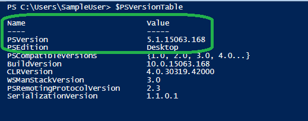   


**2. Installing Az Modules:**

Az modules contains cmdlet to deploy Azure resources. These cmdlets is used to create AzTS scan solution resources with the help of ARM template.
Install Az Powershell Modules using below command. 
For more details of Az Modules refer [link](https://docs.microsoft.com/en-us/powershell/azure/install-az-ps)

``` Powershell
# Install Az Modules
Install-Module -Name Az.Accounts -AllowClobber -Scope CurrentUser -repository PSGallery
Install-Module -Name Az.Resources -AllowClobber -Scope CurrentUser -repository PSGallery
Install-Module -Name Az.Storage -AllowClobber -Scope CurrentUser -repository PSGallery
Install-Module -Name Az.ManagedServiceIdentity -AllowClobber -Scope CurrentUser -repository PSGallery
```

``` Powershell
# Install AzureAd 
Install-Module -Name AzureAD -AllowClobber -Scope CurrentUser -repository PSGallery
```

**3. Setting up scanning identity**  

The AzTS setup basically provisions your subscriptions with the ability to do daily scans for security controls.
To do the scanning, it requires a [User-assigned Managed Identity](https://docs.microsoft.com/en-us/azure/active-directory/managed-identities-azure-resources/overview) (central scanning identity owned by you) and 'Reader' access to target subscriptions on which scan needs to be performed. 

Before creating user-assigned managed identity, please connect to AzureAD and AzAccount with the tenant Id where you want to use AzTS solution.


``` Powershell
Connect-AzAccount -Tenant <TenantId>
Connect-AzureAD -TenantId <TenantId>
```

i) You can create user-assigned managed identity with below PowerShell command or Portal steps [here](https://docs.microsoft.com/en-us/azure/active-directory/managed-identities-azure-resources/how-to-manage-ua-identity-portal)

``` Powershell

# Step 1: Set context to subscription where user-assigned managed identity needs to be created
Set-AzContext -SubscriptionId <MIHostingSubId>

# Step 2: Create resource group where user-assigned MI resource will be created. 
New-AzResourceGroup -Name <MIHostingRGName> -Location <Location> 

# Step 3: Create user-assigned managed identity 
$UserAssignedIdentity = New-AzUserAssignedIdentity -ResourceGroupName <MIHostingRGName> -Name <USER ASSIGNED IDENTITY NAME>

# Step 4: Save resource id generated for user identity using below command. This will be used in AzTS Soln installation. 

$UserAssignedIdentity.Id

```

ii) Assign reader access to user-assigned managed identity on target subscriptions needs to be scanned. 


``` Powershell

# Add target subscriptionds in place of <SubIdx>
$TargetSubscriptionIds = @("<SubId1>","<SubId2>","<SubId3>")

$TargetSubscriptionIds | % {
New-AzRoleAssignment -ApplicationId $UserAssignedIdentity.ClientId -Scope "/subscriptions/$_" -RoleDefinitionName "Reader"
}

```

  **Note:** If subscriptions are organized under [Management Groups](https://docs.microsoft.com/en-us/azure/governance/management-groups/overview) (MG), you can assign reader role for user-assigned identity using MG role assignment. You need to be 'Owner' on target subscription to perform role assignment.  

**4. Download and extract deployment package**
 
 Deployment packages mainly contains 
 ARM template: Contains resource configuration details that needs to be created as part of setup
 Deployment setup script: Provides the cmdlet to run installation. 

i) Download deployment package zip from [here](https://github.com/azsk/DevOpsKit-docs/raw/users/TenantSecurity/13-Tenant%20Security%20Solution%20Setup/TemplateFiles/Deploy.zip) to your local machine.  

ii) Extract zip to local folder location

iii) Unblock the content. Below command will help to unblock files. 

``` PowerShell
Get-ChildItem -Path "<Extracted folder path>" -Recurse |  Unblock-File 
```

iv) Point current path to deployment folder and load AzTS setup script
``` PowerShell
# Point current path to extracted folder location and load setup script from deploy folder 

CD "<LocalExtractedFolderPath>\Deploy"

# Load AzTS Setup script in session
. ".\AzTSSetup.ps1"

# Note: Make sure you copy  '.' present at the start of line.

```

[Back to top…](Readme.md#contents)

**5. Run Setup Command** 

This is the last step. You need to run install command present as part setup scription with host subscription id (sub where scanning infra resources will get created). 
Setup will create infra resources and schedule daily security control scan on target subscriptions.

**Note:** Setup may take upto 5 minutes to complete.

  ``` PowerShell

  # Set the context to hosting subscription
  Set-AzContext -SubscriptionId <HostingSubId>


  2. Run installation command with required parameters given. 

  # Step 2: Run installation command. 

  Install-AzSKTenantSecuritySolution `
                  -SubscriptionId <HostingSubId> `
                  -ScanHostRGName <HostingResourceGroupName> `
                  -ScanIdentityId <ManagedIdentityResourceId> `
                  -Location <ResourceLocation> `
                  -Verbose

  # For ScanIdentityId parameter, use value created for "$UserAssignedIdentity.Id" from prerequisite section step 3 or you can get this resources id by going into Azure Portal --> Subscription where user-assigned MI resource created --> MIHostingRG --> Click on MI resource --> Properties --> Copy ResourceId. 

  # Example:

  Install-AzSKTenantSecuritySolution `
                  -SubscriptionId bbbe2e73-fc26-492b-9ef4-adec8560c4fe `
                  -ScanHostRGName AzSK-AzTS-Solution-RG `
                  -ScanIdentityId '/subscriptions/bbbe2e73-fc26-492b-9ef4-adec8560c4fe/resourceGroups/TenantReaderRG/providers/Microsoft.ManagedIdentity/userAssignedIdentities/TenantReaderUserIdentity' `
                  -Location EastUS2 `
                  -Verbose
  ```
  Output looks like below

  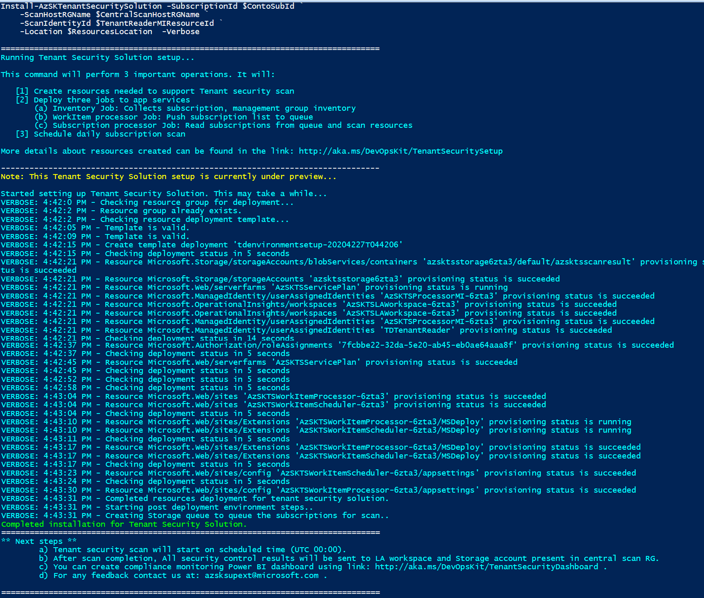


**Parameter details:**

|Param Name|Description|Required?
|----|----|----|
|SubscriptionId|Hosting subscription id where Azure Tenant solution will be deployed |TRUE|
|ScanHostRGName| Name of ResourceGroup where setup resources will be created |TRUE|
|ScanIdentityId| Resource id of user managed identity used to scan subscriptions  |TRUE|
|Location|Location where all resources will get created |TRUE|
|Verbose| Switch used to output detailed log |FALSE|


## Verifying that Tenant Security Solution installation is complete

Below steps will help you to verify and understand different resources and functions created as part of setup along with purpose. 

**1: Verify resources created as part of setup** 

i) In the Azure portal, Go to hosting subscription, select the scan host resource group that has been created during the setup.

**2:** Verify below resources got created. 

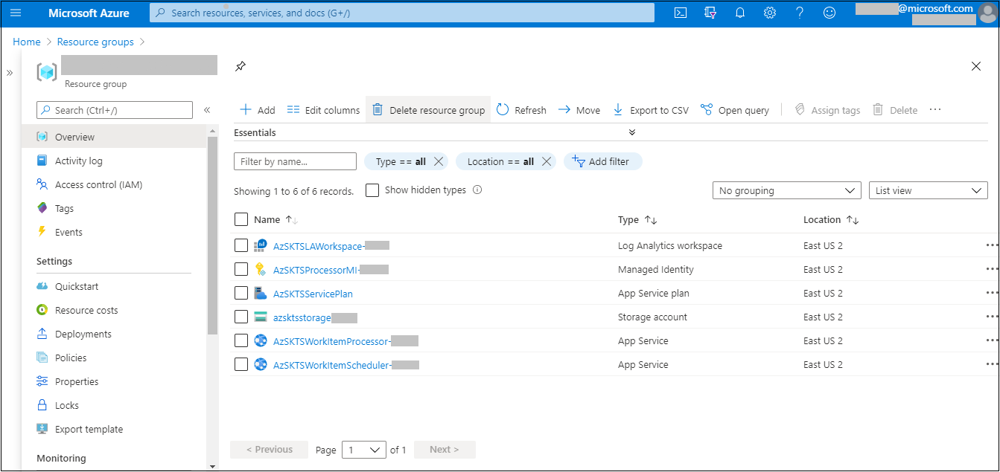	

**Resources details:**

|Resource Name|Resource Type|Description|
|----|----|----|
|AzSK-AzTS-MetadataAggregator-xxxxx|Function App| Contains functions to get inventory (subscription, baseline controls and RBAC) and queue subscription for scan |
|AzSK-AzTS-WorkItemProcessor-xxxxx|Function App | Contains function to scan subscription with baseline control |
|AzSK-AzTS-AutoUpdater-xxxxx|Function App | Contains function to scan automatically updater function apps and web service apps |
|AzSK-AzTS-LAWorkspace-xxxxx|Log Analytics workspace| Used to store scan events, inventory, subscription scan progress details|
|AzSK-AzTS-InternalMI|Managed Identity | Internal MI identity used to access LA workspace and storage for sending scan results|
|AzSK-AzTS-AppServicePlan | Function App Service Plan| Function app service plan|
|AzSK-AzTS-API-AppServicePlan | Web App Service Plan| Web app service plan|
|azsktsstoragexxxxx|Storage Account| Used to store the daily results of subscriptions scan|
|AzSK-AzTS-AppInsights |App Insight| Used to collect telemetry logs from functions |
|AzSK-AzTS-WebApp-xxxxx | Azure web app servicen| UI to easily monitor control compliance details and perform adhoc scan|
|AzSK-AzTS-WebApi-xxxxx | Azure web app service| Backend API to support UI|

 **3:** Verify below Functions got created

 **i) MetadataAggregator Functions:** 

Metadata aggregator function performs two tasks: 
1. Collects inventory required for scanning (Target subscription list to be scanned, baseline controls list and subscription RBAC details)
2. Queue subscriptions for scanning

Click on 'AzSK-AzTS-MetadataAggregator-xxxxx' function app present in scan hosting RG --> Click on 'Functions' tab in left menu

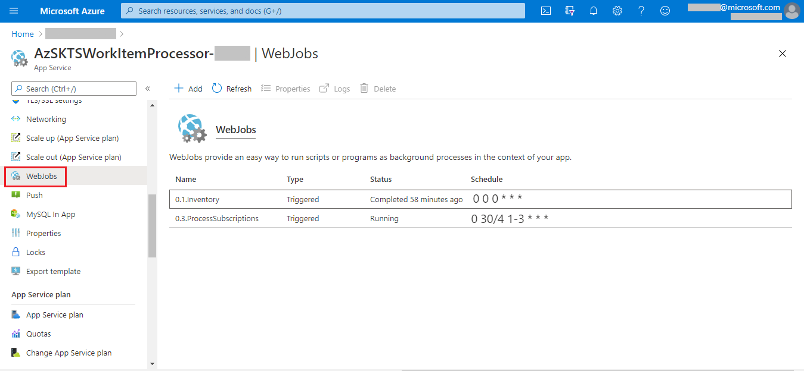

|Function Name|Description|
|----|----|
|ATS_1_SubscriptionInvProcessor| Responsible to fetch details about all the subscriptions that has been granted access as Reader using central MI. All these subscriptions will be fetched by the job and persisted into LA. These subscriptions are scanned automatically by the consecutive jobs.
|ATS_2_BaselineControlsInvProcessor| Responsible to push baseline controls metadata to LA and storage account
|ATS_3_SubscriptionRBACProcessor| Collects RBAC details of subscription to be scanned. RBAC collected used to scan the control like "Azure_Subscription_AuthZ_Dont_Use_NonAD_Identities" 
|ATS_4_WorkItemScheduler|  Responsible to queue up subscriptions as workitems for scanning. It also reconciles the errored subscriptions through retries in the end. By default it would retry to scan for 5 times for each error subscription. IF there is nothing to process for the day, it would simply ignore the run.

 **ii) WorkItemProcessor Functions:** 
 
 Read subscription list from queue and scan for baseline controls.

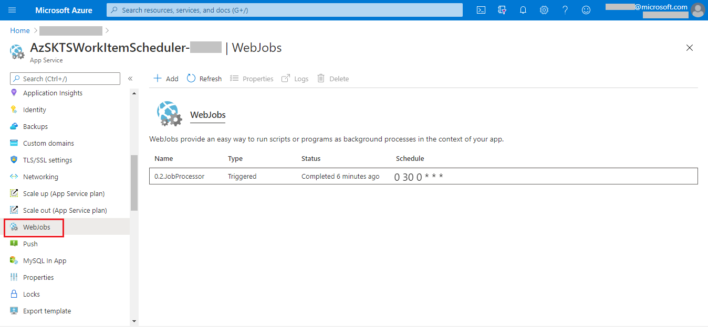


> **Note:** Functions are scheduled to run from UTC 00:00 time. You can also run the functions manually in sequence with an internval of 10 mins in each function trigger

Steps to trigger the functions

Click on 'AzSK-AzTS-MetadataAggregator-xxxxx' function app present in scan hosting RG --> Click on 'Functions' tab --> Select 'ATS_1_SubscriptionInvProcessor' --> Click on 'Code + Test' --> Click 'Test/Run' --> Click 'Run'

Similarly, you can trigger below functions with 10 mins internval.

 * ATS_2_BaselineControlsInvProcessor

 * ATS_3_SubscriptionRBACProcessor 
 
 * ATS_4_WorkItemScheduler 

After ATS_4_WorkItemScheduler completes pushing the messages in the queue, WorkItemProcessor will get autotrigged, start processing scan and push scan results in storage account and LA workspace. 


## Log Analytics Visualization

For understanding the collected data, use the querying and visualization capabilities provided by Log Analytics. 
To start, go to **Log Analytics workspace** created during setup --> Select **Logs**. 


Few more simple queries to try

#### A. Inventory summary

##### Subscription Inventory 

``` KQL

AzSK_SubInventory_CL
| where TimeGenerated > ago(1d)
| where JobId_d ==  toint(format_datetime(now(), 'yyyyMMdd'))
| where State_s != 'Disabled'
| summarize arg_max(TimeGenerated, *) by SubscriptionId
| distinct SubscriptionId, Name_s

```

##### Baseline control list supported by AzTS Scan

``` KQL
AzSK_BaselineControlsInv_CL
| where TimeGenerated > ago(1d)
| summarize arg_max(TimeGenerated, *) by ControlId_s
| project ControlId_s, ResourceType, Description_s, ControlSeverity_s, Tags_s
```

#### Role-based access control (RBAC) summary

``` KQL
AzSK_RBAC_CL
| where TimeGenerated > ago(1d) and JobId_d == toint(format_datetime(now(), 'yyyyMMdd')) 
| summarize arg_max(TimeGenerated, *) by RoleId_g, RoleId_s
| project ObjectId = UserName_g, AccountType_s,RoleName_s, IsPIMEligible_b, Scope_s
```

#### Subscription scanned today

``` KQL
AzSK_ProcessedSubscriptions_CL
|  where TimeGenerated > ago(1d) and JobId_d == toint(format_datetime(now(), 'yyyyMMdd')) and EventType_s =~"Completed"
| summarize arg_max(TimeGenerated,*) by SubscriptionId
| project ScanTimeInUTC = TimeGenerated, SubscriptionId 
```

#### B. Control Scan Summary


##### Top 20 failing controls

``` KQL

AzSK_ControlResults_CL
| where TimeGenerated > ago(2d) 
| where JobId_d == toint(format_datetime(now(), 'yyyyMMdd'))
| summarize arg_max(TimeGenerated, *) by SubId = tolower(SubscriptionId), RId= tolower(ResourceId), ControlName_s
| summarize TotalControls = count(), FailedControl = countif(VerificationResult_s =~ "Failed") by ControlName_s
| order by FailedControl desc 
| take 20

```

##### Top 10 subscription with most failing controls

``` KQL
AzSK_ControlResults_CL
| where TimeGenerated > ago(1d)
| where JobId_d == toint(format_datetime(now(), 'yyyyMMdd'))
| summarize arg_max(TimeGenerated, *) by SubscriptionId = tolower(SubscriptionId), ResourceId= tolower(ResourceId), ControlName_s
| where VerificationResult_s =~ "Failed"
| summarize FailedCount = count() by SubscriptionId
| order by FailedCount desc 
| take 10
```


[Back to top…](Readme.md#contents)
## Tenant Security Solution - under the covers (how it works)
 Tenant Security Solution is built by extending what the DevOps Kit has been doing and leveraging the best of Azure native features. It is a hybrid model, which leverages the native Azure security capabilities like Azure Security Center (ASC), Azure Policies, etc., to evaluate the security controls and continue to leverage DevOps Kit scanning capabilities in the form of custom code controls to address any coverage gaps.  

It has been desinged to handle huge scales in highly performant and cost efficient manner.

As a central team, you can run the scan at regular intervals and also empower your DevOps engineers to run the module independently to address control failures. 

The diagram below depicts a high level overview of the hybrid solution:

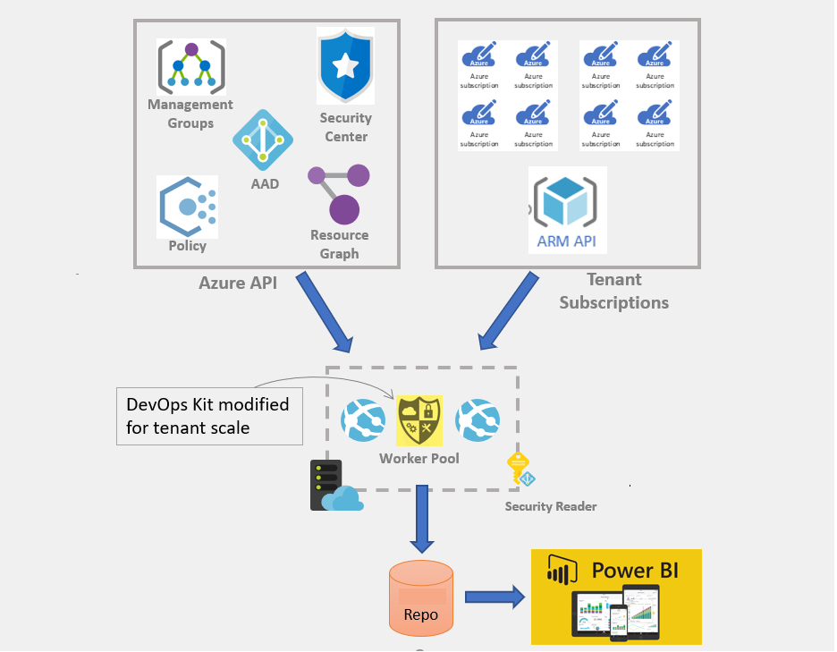

[Back to top…](Readme.md#contents)

# Create security compliance monitoring solutions
Once you have an Tenant Security setup running smoothly with multiple subscriptions across your org, you will need a solution that provides visibility of security compliance for all the subscriptions across your org. This will help you drive compliance/risk governance initiatives for your organization. 

When you setup your Tenant Security endpoint (i.e. policy server), one of the things that happens is creation of an Log Analytics workspace for your setup. After that, whenever someone performs an AzTS scan for a subscription that is configured to use your Tenant Security, the scan results are sent (as 'security' telemetry) to your org's Log Analytics workspace. Because this workspace receives scan events from all such subscriptions, it can be leveraged to generate aggregate security compliance views for your cloud-based environments. 

## Create cloud security compliance report for your org using PowerBI
We will look at how a PowerBI-based compliance dashboard can be created and deployed in a matter of minutes starting with a template dashboard that ships with the Tenant Security Solution (AzTS). All you need apart from the Log Analytics workspace instance is a CSV file that provides a mapping of your organization hierarchy to subscription ids (so that we know which team/service group owns each subscription).

> Note: This is a one-time activity with tremendous leverage as you can use the resulting dashboard (example below) towards driving security governance activities over an extended period at your organization. 

#### Step 0: Pre-requisites
To create, edit and publish your compliance dashboard, you will need to install the latest version of PowerBI desktop on your local machine. Download it from [here](https://powerbi.microsoft.com/en-us/desktop/).


#### Step 1: Prepare your org-subscription mapping
In this step you will prepare the data file which will be fed to the PowerBI dashboard creation process as the mapping from subscription ids to the org hierarchy within your environment. The file is in a simple CSV form and should appear like the one below. 

> Note: You may want to create a small CSV file with just a few subscriptions for a trial pass and then update it with the full subscription list for your org after getting everything working end-to-end.

A sample template for the CSV file is [here](https://raw.githubusercontent.com/azsk/DevOpsKit-docs/users/TenantSecurity/13-Tenant%20Security%20Solution%20Setup/TemplateFiles/OrgMapping.csv):

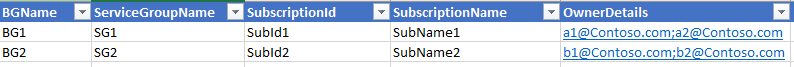 

The table below describes the different columns in the CSV file and their intent.

| ColumnName  | Description | Required? | Comments |
| ---- | ---- | ---- |---- |
| BGName | Name of business group (e.g., Finance, HR, Marketing, etc.) within your enterprise | Yes |  This you can consider as level 1 hierarchy for your enterprise | 
| ServiceGroupName | Name of Service Line/ Business Unit within an organization | Yes |  This you can consider as level 2 hierarchy for your enterprise | 
| SubscriptionId | Subscription Id belonging to a org/servicegroup | Yes |   | 
| SubscriptionName | Subscription Name | Yes | This should match the actual subscription name. If it does not, then the actual name will be used  | 
| IsActive | Use "Y" for Active Subscription and "N" for Inactive Subscription  | Yes | This will be used to filter active and inactive subscriptions | 
| OwnerDetails | List of subscription owners separated by semi-colons (;)  | Yes | These are people accountable for security of the subscription  | 

> **Note**: Ensure you follow the correct casing for all column names as shown in the table above. The 'out-of-box' PowerBI template is bound to these columns. If you need additional columns to represent your org hierarchy then you may need to modify the template/report as well.


#### Step 2: Upload your mapping to the Log Analytics (LA) workspace

In this step you will import the data above into the LA workspace created during Tenant Security setup. 

 **(a)** Locate the LA resource that was created during Tenant Security setup in your subscription. This should be present under Tenant Security resource group. After selecting the LA resource, copy the Workspace ID from the portal as shown below:

 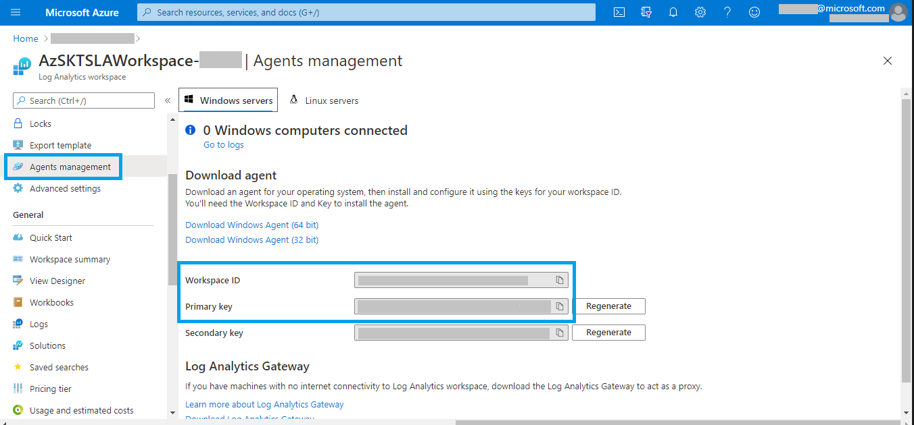
 
 **(b)** To push org Mapping details, copy and execute the script available [here](https://raw.githubusercontent.com/azsk/DevOpsKit-docs/users/TenantSecurity/13-Tenant%20Security%20Solution%20Setup/Scripts/AzTSPushOrgMappingEvents.ps1) in Powershell.

 > **Note**: Due to limitation of Log Analytics workspace, you will need to repeat this step every 90 days interval. 

#### Step 3: Create a PowerBI report file
In this section we shall create a PowerBI report locally within PowerBI Desktop using the LA workspace from Tenant Security subscription as the datasource. We will start with a default (out-of-box) PowerBI template and configure it with settings specific to your environment.

**(a)** Get the Workspace ID for your LA workspace from the portal as shown below:


**(b)** Download and copy the PowerBI template file from [here](https://github.com/azsk/DevOpsKit-docs/raw/users/TenantSecurityDocument/12-Tenant%20Security%20Solution/TemplateFiles/TenantSecurityReport.pbit) to your local machine.

**(c)** Open the template (.pbit) file using PowerBI Desktop, provide the LA Workspace ID and click on 'Load' as shown below:

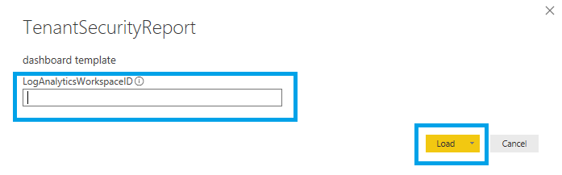

**(d)** PowerBI will prompt you to login to the Tenant Security subscription at this stage. Authenticate using your user account. (This step basically allows PowerBI to import the data from LA into the PowerBI Desktop workspace.)
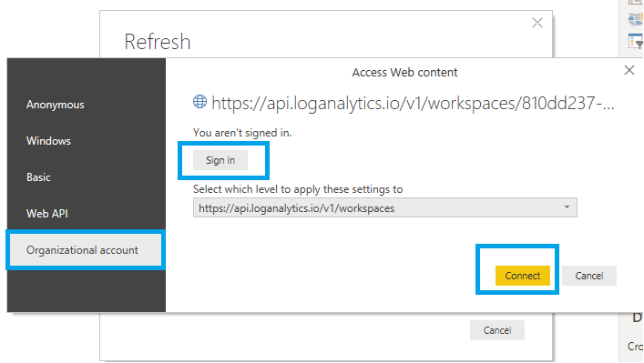

Once you have successfully logged in, you will see the Log Analytics data in the PowerBI report along with org mapping as shown below: 

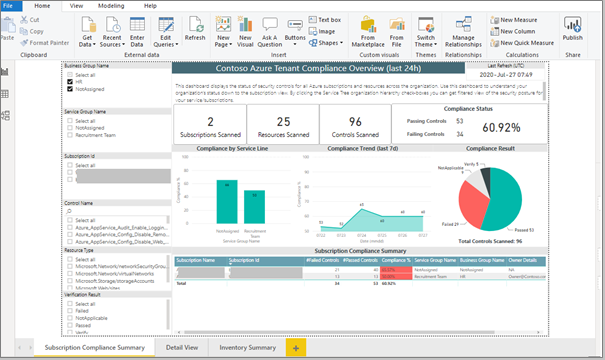

The report contains 3 tabs. There is an overall/summary view of compliance, a detailed view which can be used to see control 'pass/fail' details for individual subscriptions and inventory view which shows distribution of resource types and RBAC role memberships across all Azure subscriptions in the organization. An example of the detailed view and inventory view is shown below:

###### Detailed view:

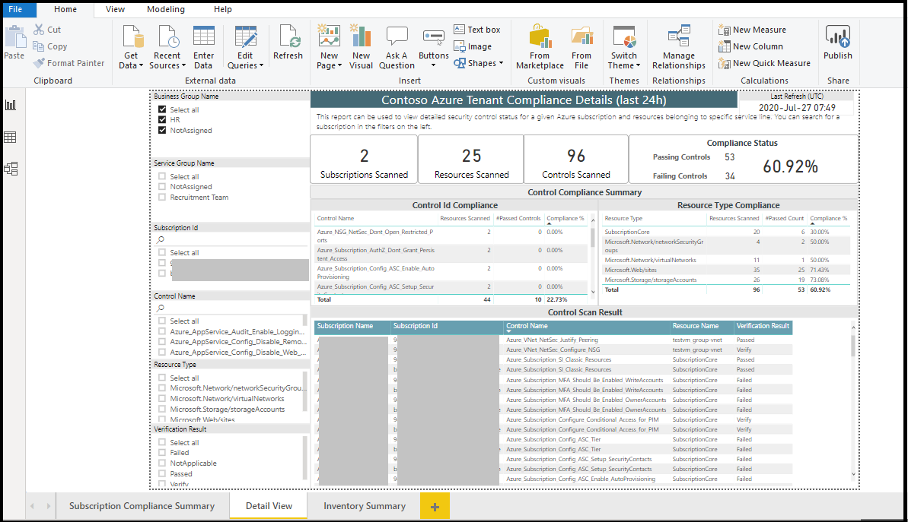 

###### Inventory view:

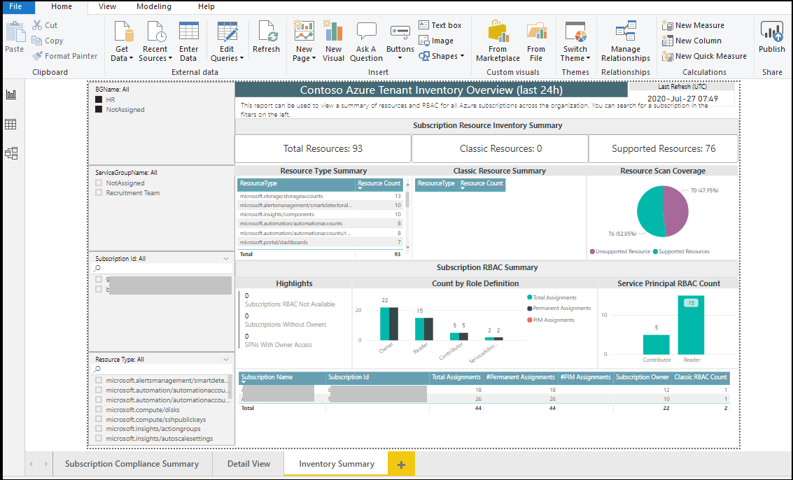

> Note: You can consider controlling access to the detailed view by business group.

#### Step 4: Publish the PowerBI report to your enterprise PowerBI workspace

**(a)** Before publishing to the enterprise PowerBI instance, we need to update LA connection string across data tables in the PowerBI report. The steps to do this are as below:

[a1] Click on "Edit Queries" menu option.

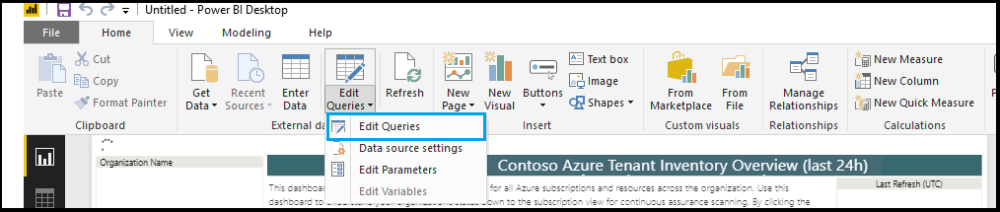

[a2] Copy the value of "LogAnalyticsConnectionString"

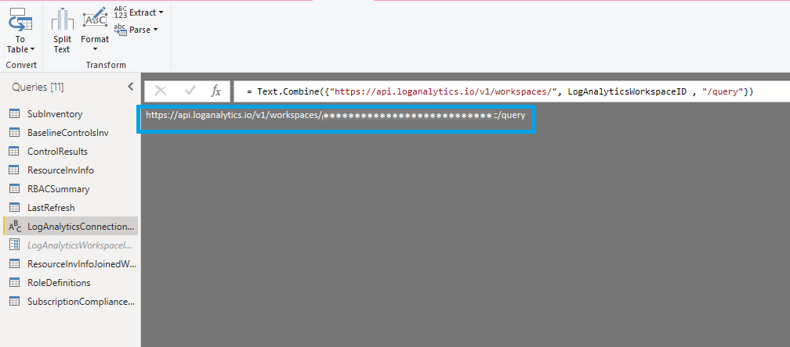

[a3] Replace the value of "LogAnalyticsConnectionString" with the actual connection string (e.g., LogAnalyticsConnectionString => "https://api.loganalytics.io/v1/workspaces/[LogAnalyticsWorkspaceID]]/query"). You should retain the "" quotes in the connection string.

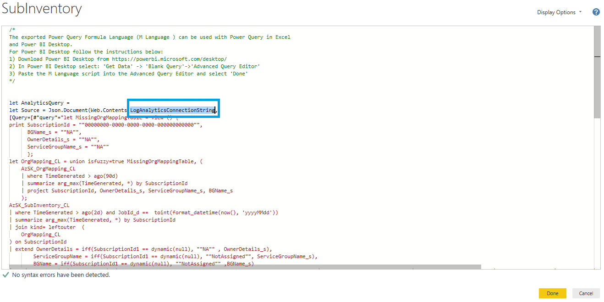

[a4] Repeat this operation for SubscriptionInvLA, SubscriptionComplianceLast7daysLA, BaselineControlsInvLA, ControlResultsLA, ResourceInvInfoLA, and RBACSummaryLA data tables.

[a5] Click on "Close and Apply".

**(b)** You can now publish your PBIX report to your workspace. The PBIX file gets created locally when you click "Publish".

[b1] Click on Publish

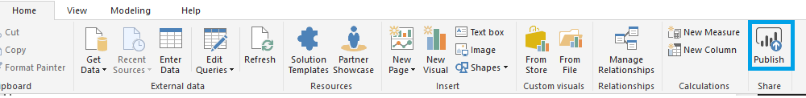

[b2] Select destination workspace

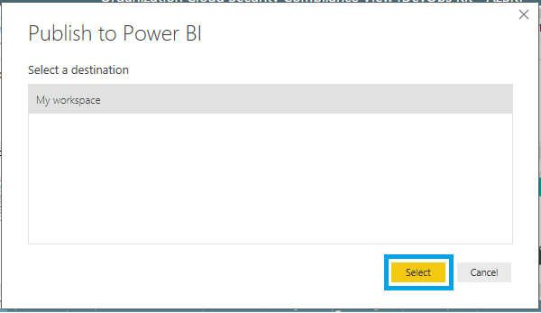

[b3] Click on "Open [Report Name] in Power BI" 

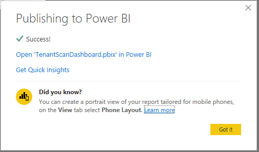

**(c)** Now report got published successfully. You can schedule refresh for report with below steps

[c1] Go to Workspace --> Datasets --> Click on "Schedule Refresh" icon.

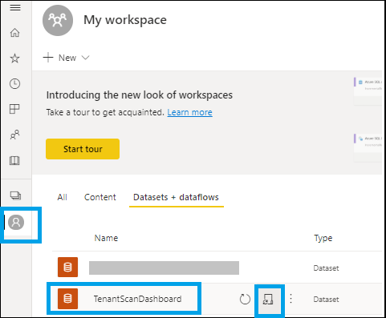

[c2] Click on "Edit credentials".

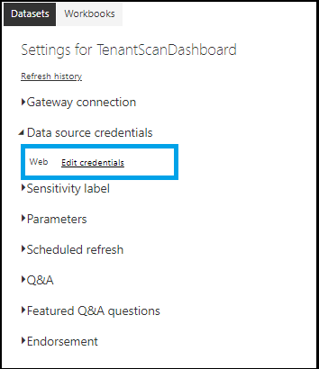

[c3] Sign in with account which has access to the Log Analytics workspace.

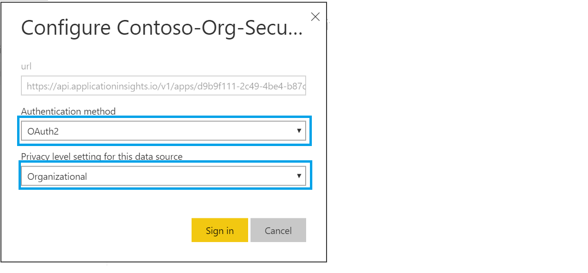

[c4] Add refresh scheduling timings and click on "Apply".

> **Note:** You may not see "Schedule refresh" option if step [a3] and [a4] is not completed successfully.

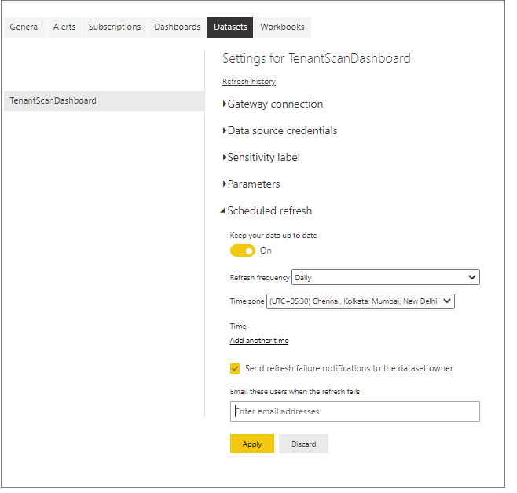

[Back to top…](Readme.md#contents)

## Feedback

For any feedback contact us at: azsksupext@microsoft.com 
