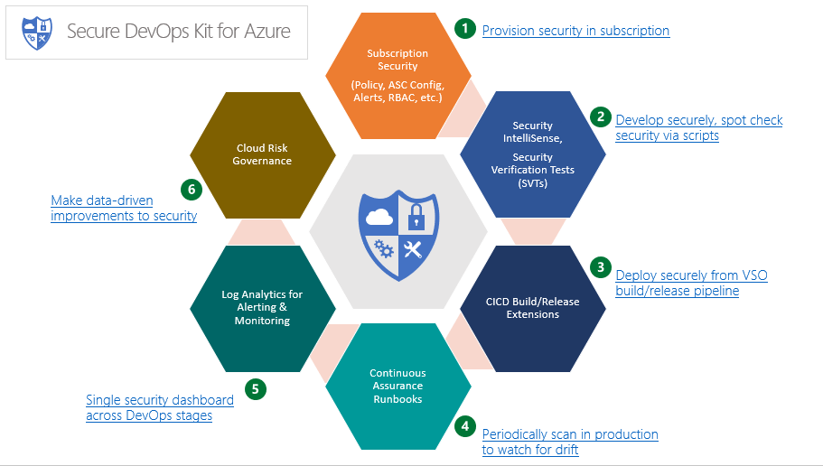

# Secure DevOps Kit for Azure (AzSK)

## Content
- [Overview](README.md#overview)  
- [Setting up `Secure DevOps Kit for Azure`](README.md#setting-up-secure-devops-kit-for-azure)
- [Getting started with `Secure DevOps Kit for Azure`](README.md#getting-started-with-secure-devops-kit-for-azure)
- [Complete feature set of `Secure DevOps Kit for Azure`](README.md#complete-feature-set-of-secure-devops-kit-for-azure)  
- [What do you want to use the secure devops kit for?](README.md#what-do-you-want-to-use-the-secure-devops-kit-for)  
- [References](README.md#references)  

----------------------------------------------
### Overview
The "Secure DevOps Kit for Azure" (will be referred to as 'AzSK' henceforth) is a collection of scripts, tools, extensions, automations, etc. that caters to the end to end Azure subscription and resource security needs for dev ops teams using extensive automation and smoothly integrating security into native dev ops workflows helping accomplish secure dev ops with these 6 focus areas:
1. **`Secure the subscription`:** A secure cloud subscription provides a core foundation upon which subsequent development and deployment activities can be conducted. An engineering team should have the capabilities to deploy and configure security in the subscription including elements such as alerts, ARM policies, RBAC, Security Center policies, JEA, Resource Locks, etc. Likewise, it should be possible to check that all settings are in conformance to a secure baseline.
2. **`Enable secure development`:** During the coding and early development stages, developers should have the ability to write secure code and to test the secure configuration of their cloud applications. Just like *build verification tests* (BVTs), we introduce the concept of *security verification tests* (SVTs) which can check for security of various resource types in Azure.
3. **`Integrate security into CICD`:** Test automation is a core tenet of devops. We emphasize this by providing the ability to run SVTs as part of the VSTS CICD pipeline. These SVTs can be used to ensure that the target subscription used to deploy a cloud application and the Azure resources the application is built upon are all setup in a secure manner. 
4. **`Continuous Assurance`:** In the constantly changing dev ops environment, it is important to move away from the mindset of security being a milestone. We have to treat security as a *continuously varying state* of a system. This is made possible through capabilities that enable *continuous assurance* using a combination of automation runbooks, schedules, etc.
5. **`Alerting & Monitoring`:** Visibility of security status is important for individual application teams and also for central enterprise teams. We provide solutions that cater to the needs of both. Moreover, the solution spans across all stages of dev ops in effect bridging the gap between the *dev* team and the *ops* team from a security standpoint through the single, integrated views it generates.
6. **`Cloud Risk Governance`:** Lastly, underlying all activities in the kit is a telemetry framework that generates events capturing usage, adoption, evaluation results, etc. This allows us to make measured improvements to security targeting areas of high risk and maximum usage before others.  

[Back to top...](README.md#content)  

### Setting up Secure DevOps Kit for Azure
1. You can follow the [installation guide](00a-Setup/Readme.md) and install the AzSK on your system.  
2. After the installation is complete, please make sure that you are logged into your Azure subscription in Powershell ISE.

> A quick note is due here about use of PowerShell (and PowerShell ISE). The AzSK heavily uses PowerShell-based functions and modules to accomplish security configuration, provisioning and for running security scans and test cases. Some of our first time users of the AzSK occasionally also get a first exposure to PowerShell/PowerShell ISE as part of the AzSK first use experience. Given how extensively PowerShell is used (and useful) across various activities in Azure, we highly encourage you to work past the initial challenges. Several people (including some members of our own team) were new to PowerShell just a few weeks ago. However, once they got past the initial bumps, it has been smooth sailing.  

If you have completed the above steps then you are all set to get started with the AzSK.  

[Back to top...](README.md#content)
### Getting started with Secure DevOps Kit for Azure  

For the first time users, we would encourage to go through this section to become more familiar with the toolkit. It wouldn't take more than 30 mins to go through the getting started guide. Thereafter, you can explore the individual features in-depth following section [*Complete feature set of Secure DevOps Kit for Azure*](README.md#complete-feature-set-of-secure-devops-kit-for-azure).  

#### The two basic use cases:  

Regardless of your specific functional role, it is likely that you are concerned about two things when it comes to security in Azure. Click on the links below to walk through these 2 'kick start' use cases of AzSK.
1. [Security of your subscription](00b-Getting-Started/GettingStarted_SubscriptionSecurity.md)
2. [Security of various azure service instances used by your solution or application](00b-Getting-Started/GettingStarted_AzureServiceSecurity.md)  

These use cases will tell you which commands you will need to run, what would happen in the background and what will be the output that you will get.  

By leveraging the extensive degree of automation that AzSK has to offer, ability to centrally deploy and manage policies/rules and the uniform behavior of scripts across the kit, you can save several hours of what would otherwise be manual security checks and examination.  

As you get familiar with and begin to use the 'downstream' capabilities (CICD, Continuous Compliance, OMS support, etc.), the power of security automation and the seamless end-to-end experience that the AzSK unleashes will become more evident.  

[Back to top...](README.md#content) 

### Complete feature set of Secure DevOps Kit for Azure

|Feature Area | Secure DevOps Kit Feature|
|-------------|--------------------------|
[Secure the subscription](01-Subscription-Security/Readme.md) | <ul><li>Subscription Health Check</li> <li>Subscription Provisioning<ul><li> Alerts Configuration</li><li>ARM Policy Configuration</li><li>Azure Security Center Configuration</li><li>Access control (IAM) Hygiene</li>  </ul> </li></ul>
[Enable secure development](02-Secure-Development/Readme.md) | <ul><li>Security Verification Tests (SVT) </li><li>Security IntelliSense- VS Extension </li></ul>
[Integrate security into CICD](03-Security-In-CICD/Readme.md) | <ul><li>AzSK VS Extension-executes SVTs in a CICD pipeline </li></ul>
[Continuous Assurance](04-Continous-Assurance/Readme.md) | <ul><li>Security scanning via Azure Automation Runbooks</li></ul>
[Alerting & Monitoring](05-Alerting-and-Monitoring/Readme.md) | <ul><li>OMS Solution for AzSK containing:<ul><li>Security dashboard views covering security state/actions</li><li>Alerts with pertinent search queries</li></ul></li></ul>
[Cloud Risk Governance](06-Security-Telemetry/Readme.md) | <ul><li>Control/usage telemetry through Insights</li></ul>

[Back to top...](README.md#content) 
### What do you want to use the secure devops kit for?
As you can see from the summary description above, the "Secure DevOps Kit for Azure" (we will call it AzSK to be brief hereafter), can be used by many different stakeholders. So depending on your role in the DevOps ecosystem, one or more of the below scenarios may apply to you. The skillset needed to use the capabilities of the kit and the prerequisites you need to have on your machine will vary based on your scenario. Here are a few sample stakeholders and some points about *how* they may try to use the AzSK:  

|Stakeholders / Persona   |Capabilties of the kit     |
| ---- | ---- |
|**Subscription Owners**| Check the overall security health of your Azure subscription.  Ensure that artifacts such as Alerts for important activities, ARM policy, resource locks, RBAC roles, etc. are properly provisioned. |
|**Development/Engineering**| Get inline support with security tips and corrections while writing code for Azure apps (and also standard web applications in general).   Test that Azure resources you are using for your application/solutions are configured and deployed securely.  Enable security in CICD by including various security tests in the build/release pipelines|
|**Deployment Team**| Ensure that a solution being deployed to a target Azure environment has an assured level of security by controlling deployment workflows according to outcomes of security checks.|
|**Operations Team**| Observe the security progress and state of the Azure subscription and the applications running in the subscription. Track security state in a 'continuous' manner and ensure that there is no downward 'drift' from a secure state. Get support for frequently missed operational security activities such as key rotation, access reviews, deprovisioning of privileged accounts, etc.|
|**Compliance Team**| Ensure that various, often challenging, compliance requirements (e.g., SOX) are met for Azure-based solutions.|
|**IT Security Teams**| Use all of the above depending on the InfoSec domain you are engaged in as a 'Security Analyst'.|

>  Note that, increasingly, in a DevOps culture, some of the roles listed in the left column above blend together. So, for instance, the same person who is writing code may also be involved in the CICD pipeline setup or the deployment stages of a solution. So please consider the roles above as functional responsibilities as opposed to hard segregations of stakeholders.

[Back to top...](README.md#content) 

### References
- AzSK Module <a href="https://www.powershellgallery.com/packages/AzSK/">@PSGallery</a>
- AzSDK Security Controls Portal @https://aka.ms/azskosstcp
- Security IntelliSense <a href="https://marketplace.visualstudio.com/items?itemName=AzSDKTeam.SecurityIntelliSense-Preview">@VisualStudio Marketplace</a>
- Visual Studio Online CICD Build/Release Extension <a href="https://marketplace.visualstudio.com/items?itemName=azsdktm.AzSDK-task">@VisualStudio Marketplace</a>
- For any other issues or feedback please drop a mail to <a href="mailto:azsdksupext@microsoft.com">AzSDK Support</a>
  
[Back to top...](README.md#content) 

